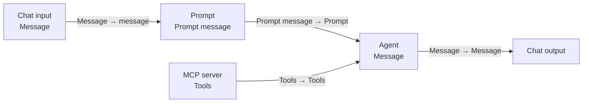

# Local deployment

End-to-end runbook for the Decisioning Engine PoC on rootless podman. The architecture that motivates this is in [`docs/DEPLOYMENT.md`](docs/DEPLOYMENT.md); this file is the click-by-click runbook.

You walk through five steps:

1. [Install prereqs and extract the PAF kit.](#1-install-prereqs-and-extract-the-paf-kit)
2. [Boot the stack (`local up`).](#2-boot-the-stack)
3. [Install PAF and register the LLM through its UI wizard.](#3-install-paf)
4. [Register the MCP servers and HTTP datasource in PAF.](#4-register-tools-and-datasources)
5. [Smoke-test with a `HELLO_AGENT` flow that uses OPA via the Agent node.](#5-smoke-test)

When you're done you have:

- Oracle Database Free 26ai on `localhost:1521` (service `FREEPDB1`), `max_string_size=EXTENDED`, schema users `APP` / `REPORTING` / `AGENT_TOOLS` / `AGENT_FACTORY`, full banking + decisioning schema, and `DBMS_CLOUD` + `DBMS_CLOUD_AI` installed.
- Private Agent Factory at `https://localhost:8080/`, installed against the local 26ai database under `AGENT_FACTORY`.
- An `opa` container (Open Policy Agent in server mode loading every `.rego` under `opa/packages/`) and a sibling `opa-mcp` container — a FastMCP wrapper exposing each Rego rule as a typed MCP tool at `http://opa-mcp:8500/mcp/`. PAF reaches it as an **MCP Server node** wired to `CHAT_AGENT` only.
- A stub `ocr-mcp` container — FastMCP wrapper with one `extract_document` tool at `http://ocr-mcp:8501/mcp/`. Returns canned classification + extraction results keyed on the document filename (placeholder for the real YOLO + PaddleOCR/Tesseract pipeline).
- A `registry-api` container — synthetic FastAPI Company Registry with a single `verify_employer(name)` route. OpenAPI 3.1 spec at `http://registry-api:8600/openapi.json`. Registered with PAF as an **HTTP datasource** wired to `CHAT_AGENT` only.
- A `caddy-ollama-tls` container terminating TLS in front of Ollama, plus an Oracle SSL wallet trusting Caddy's CA (registered via the `SSL_WALLET` database property — kept for future HTTPS-from-DB work).
- LLM Configuration in PAF registered against your Ollama host (laptop or LAN GPU).
- A `HELLO_AGENT` flow you can build in under a minute.

**Not wired locally**: Select AI profiles (`chat_profile` / `research_profile`). Oracle Database Free 26ai (23.26.x) rejects custom `provider_endpoint` values in `DBMS_CLOUD_AI` pre-flight (`ORA-20401`) — see [`docs/DEPLOYMENT.md §7`](docs/DEPLOYMENT.md). The `CHAT_AGENT` flow uses a SQL Query node + LLM locally; full Select AI Bridge is the ADB demo path.

The Spring Boot backend and the Angular UIs are not in the compose yet, and the OCR service is a stub (real YOLO/Tesseract pipeline is a separate workstream). The next-steps list in [`README.md`](README.md#current-state) shows the order they land in.

## Prereqs

Install these on the host once.

| Tool               | macOS                                                                | Oracle Linux 8                                     |
| ------------------ | -------------------------------------------------------------------- | -------------------------------------------------- |
| `podman`           | `brew install podman && podman machine init && podman machine start` | `dnf install -y podman`                            |
| `podman-compose`   | `brew install podman-compose`                                        | `pip install podman-compose`                       |
| `python` 3.11+     | `brew install python@3.12`                                           | `dnf install -y python3.12`                        |
| `ansible-playbook` | `brew install ansible`                                               | `dnf install -y ansible-core`                      |
| `liquibase`        | `brew install liquibase`                                             | Download from <https://www.liquibase.org/download> |

`manage.py setup local` checks for all of these and prints install hints if any are missing.

You also need network access to pull:

- `container-registry.oracle.com/database/free:latest` (Oracle Database Free 26ai image; ~9 GB).
- `docker.io/openpolicyagent/opa:latest`, `docker.io/caddy:2-alpine`, `docker.io/python:3.12-slim` (the slim base is built once each for `opa-mcp`, `ocr-mcp`, and `registry-api`).
- `ojdbc11` JDBC driver from Maven Central (the Ansible role caches it to `~/.cache/paf-poc/liquibase-libs/`).

## 1. Install prereqs and extract the PAF kit

```bash
python -m venv venv
source venv/bin/activate
pip install -r requirements.txt

python manage.py setup local
```

`setup local` checks the prereqs in the table above and writes a `.env` with your Oracle password and Ollama host/port choices.

Download the ARM64 PAF tarball from Oracle (e.g. `oracle_agent_factory_25.3.9_arm.tar.gz`, ~2.3 GB), then:

```bash
python manage.py paf prepare ~/Downloads/oracle_agent_factory_25.3.9_arm.tar.gz
```

This extracts the kit into `./paf-kit/` (gitignored, ~6 GB on disk), reads `app_version` from the kit's `version.json`, writes `PAF_APP_VERSION=…` into `.env`, and snapshots the kit's pristine bind-mount state so `local down --purge` can restore it. Required once, plus once per kit upgrade.

## 2. Boot the stack

```bash
python manage.py local up
```

What this does, in order:

- Starts the Oracle container, waits for `DATABASE IS READY TO USE!`, sets `max_string_size=EXTENDED`.
- Generates a self-signed Caddy CA + server cert, builds an Oracle SSL wallet that trusts the CA, and points the database at it via the `SSL_WALLET` property.
- Installs `DBMS_CLOUD` (if missing) via `catcon.pl`.
- Applies pre-Liquibase sysdba grants (TABLE RETENTION, required before the Blockchain `decision` table is created).
- Runs Liquibase against `database/liquibase/oracle/` (via Ansible).
- Applies post-Liquibase sysdba grants + network ACL for `caddy-ollama-tls:443`.
- Builds the `opa-mcp`, `ocr-mcp`, and `registry-api` images (first run only) and starts the `opa`, `opa-mcp`, `ocr-mcp`, `registry-api`, `caddy-ollama-tls`, and `paf` containers.
- Writes PAF's `.config_complete.marker` and `version.json` so the kit's startup script unblocks.

The command is idempotent — re-running it from any state is safe and converges to a healthy stack.

Confirm everything is up:

```bash
python manage.py info
```

Prints the JDBC URL, service users, PAF URL, OPA URL, OPA MCP URL, OCR MCP URL, and Registry API URL.

## 3. Install PAF

Open the installer in your browser:

```
https://localhost:8080/agentFactory/installation
```

PAF terminates TLS itself with a self-signed cert — your browser will warn; accept and continue. Plain `http://` returns HTTP 400.

`python manage.py paf bootstrap` prints the exact values to paste. It covers all four wizard steps:

- **Step 1 — admin user.** Pick a name and password; you'll sign in as this user.
- **Step 2 — database.** DB host: `oracle-free-26ai` (compose service name — **not** `localhost`, which would point at the PAF container itself). Port `1521`, service `FREEPDB1`, user `AGENT_FACTORY`, password = `DB_PASSWORD` from `.env`.
- **Step 3 — install.** Click Install. PAF creates its metadata tables under `AGENT_FACTORY` and a read-only worker user `AAI_RO_AGENT_FACTORY`.
- **Step 4 — LLM Management.** Register the generative model (`qwen2.5:7b-instruct` — small, fast, native tool-calling, fits on a laptop) and the embedding model (`bge-m3`) against your Ollama endpoint. `paf bootstrap` resolves `.local` mDNS names to an IPv4 address for you, since the PAF container can't do mDNS.

After install completes, sign in as the admin user.

## 4. Register tools and datasources

Three post-install registrations in the PAF admin area — two MCP servers and one HTTP datasource. All three target the `CHAT_AGENT` flow; the `RESEARCH_AGENT` flow has no external tools by design.

### 4a. MCP servers (opa-mcp + ocr-mcp)

Admin → **MCP Servers** → **Add MCP server**, twice. The form has three fields each time; use the same `Direct` authentication mode for both (no auth — the wrappers are internal to the compose network, not published to the host).

| Server name | Server URL                 | Tools                                                                                                              |
| ----------- | -------------------------- | ------------------------------------------------------------------------------------------------------------------ |
| `opa-mcp`   | `http://opa-mcp:8500/mcp/` | seven typed tools wrapping the Rego rules — see table below                                                        |
| `ocr-mcp`   | `http://ocr-mcp:8501/mcp/` | one stub tool `extract_document(storage_uri, requested_doc_type?)` returning canned classification + OCR responses |

**Do not use `localhost`** in either URL — PAF must reach the wrappers over the compose network, not the host.

After saving, each server should report a connected status. The discovered tools surface inside the **Agent node** in Agent Builder once you wire each MCP Server node to it (§5) — there isn't a separate global tool-list view.

`opa-mcp` exposes:

| Tool                          | Rego rule                        | What it does                                                     |
| ----------------------------- | -------------------------------- | ---------------------------------------------------------------- |
| `required_documents`          | `decisioning.required_documents` | Document set for `(product, employment, residency, amount_band)` |
| `evaluate_eligibility`        | `decisioning.eligibility`        | Age / DTI / PTI / score gates → `{allow, deny[], warn[]}`        |
| `evaluate_aml`                | `decisioning.aml`                | Sanctions / PEP / suspicious-pattern flags                       |
| `evaluate_kyc`                | `decisioning.kyc`                | ID validity, document expiry, OCR quality tier                   |
| `evaluate_fair_lending_flags` | `decisioning.fair_lending`       | Disparate-impact pre-flight against monitored patterns           |
| `lookup_pricing`              | `decisioning.pricing.quote`      | Risk-band → indicative rate from the configured rate card        |
| `list_policy_versions`        | `/v1/policies`                   | Audit: list loaded Rego modules                                  |

Each tool's input schema is auto-derived from the FastMCP type hints in `src/ai/opa-mcp/server.py`. Outputs mirror Rego's `{allow, deny[], warn[]}` signal model — the agent folds them into the recommendation packet as evidence, never as automatic gates.

`ocr-mcp` is a stub. Its single `extract_document` tool returns canned responses keyed on the filename in `storage_uri` so the test-bench scenarios from `010-seed-synthetic.yaml` resolve correctly (e.g. `henry-payslip.pdf` → `MARGINAL`, `iris-*.pdf` → `UNUSABLE`, anything else → a `USABLE` fallback). Source: `src/ai/ocr-mcp/server.py`. Real OCR (YOLO + PaddleOCR/Tesseract, async via `OCR_REQUEST` queue) is a separate workstream.

### 4b. HTTP datasource (Company Registry)

Admin → **Data Sources** → **Add HTTP data source**.

| Field                   | Value                                                                                                                            |
| ----------------------- | -------------------------------------------------------------------------------------------------------------------------------- |
| **Name**                | `registry-api`                                                                                                                   |
| **OpenAPI spec URL**    | `http://registry-api:8600/openapi.json` — compose service name + port; PAF reads the spec to expose `verify_employer` as a tool. |
| **Authentication mode** | `Direct` (the service is internal to the compose network and has no auth).                                                       |

The `registry-api` service ships eight synthetic company records that align with the employer names seeded by `010-seed-synthetic.yaml`, including `Phoenix Holdings Ltd` (`dormant`, scenario 28) and `Atlantis Innovations Ltd` (deliberately absent → `registered=false`, scenario 27). Source: `src/api/registry/`.

### If a server or datasource won't connect

Sanity-check the layers from the outside in.

```bash
# 1. OPA itself — does the policy load and a rule evaluate?
podman exec paf-oracle-free-26ai curl -s http://opa:8181/v1/data/decisioning/eligibility \
  -H 'content-type: application/json' \
  -d '{"input":{"applicant":{"age":34,"dti":0.41,"pti":0.18,"credit_score":642}}}'
# Expect: {"result":{"allow":false,"deny":[],"warn":["Credit score 642 in caution band (< 670)"]}}

# 2. MCP wrappers — do the FastMCP processes accept the streamable-http handshake?
podman exec paf-oracle-free-26ai curl -sf -o /dev/null -w "opa-mcp HTTP %{http_code}\n" \
  http://opa-mcp:8500/mcp/ -X POST -d '{}' -H 'content-type: application/json'
podman exec paf-oracle-free-26ai curl -sf -o /dev/null -w "ocr-mcp HTTP %{http_code}\n" \
  http://ocr-mcp:8501/mcp/ -X POST -d '{}' -H 'content-type: application/json'
# Expect: HTTP 307 (FastMCP's trailing-slash redirect) or HTTP 4xx with a JSON-RPC error.
#         Anything else (timeout, connection refused) = wrapper isn't healthy.

# 3. Registry API — does the FastAPI service answer and serve its OpenAPI spec?
podman exec paf-oracle-free-26ai curl -sf -o /dev/null -w "registry-api HTTP %{http_code}\n" \
  http://registry-api:8600/openapi.json
# Expect: HTTP 200. PAF reads the spec to expose verify_employer as a tool.

# 4. Logs
podman logs paf-opa-mcp           # FastMCP startup banner + per-request log
podman logs paf-ocr-mcp           # same
podman logs paf-registry-api      # uvicorn startup + per-request log
podman logs paf-opa               # OPA bundle load + per-request log
```

If OPA returns a 404 on `/v1/data/decisioning/...`, the `.rego` files didn't load — check `podman logs paf-opa` for a parse error and run `podman restart paf-opa` after fixing.

## 5. Smoke-test

Build one flow that exercises both the LLM and the OPA MCP server end-to-end.

Open Agent Builder → **New Flow** → name it `HELLO_AGENT`. Drop five nodes onto the canvas:

| Node            | Configuration                                                                                                                                                                                |
| --------------- | -------------------------------------------------------------------------------------------------------------------------------------------------------------------------------------------- |
| **Chat input**  | Default.                                                                                                                                                                                     |
| **Prompt**      | Template: `{{message}}` — saving the prompt exposes the `message` input port. The Prompt node carries only the user message; system guidance goes in the Agent node (below).                 |
| **MCP server**  | Pick `opa-mcp` from the dropdown. Default timeout (`45` s).                                                                                                                                  |
| **Agent**       | Select your saved generative LLM (e.g. `ollama-llm`). The Agent node — **not** the LLM node — is the one with a `Tools` input. Paste the system guidance below into **Custom instructions**. |
| **Chat output** | Default.                                                                                                                                                                                     |

Paste into the Agent node's **Custom instructions** field:

```
You are a loan assistant. When the user asks about required documents,
eligibility, AML, KYC, fair-lending, or pricing, ALWAYS call the
matching tool — never answer from memory.
```

Wire them as follows (each row is one edge, port names match what the UI labels):



Save the flow, click **Playground**, then ask:

```
What documents does a self-employed expat need for a $25,000 personal loan?
```

The agent should call `required_documents` and reply with the four required doc types (`ID`, `TAX_RETURN`, `STATEMENT`, `ADDRESS_PROOF`). The Playground's trace pane shows the tool invocation + raw JSON response — that's the signal the round-trip worked.

If the model answers from memory (e.g. lists generic docs without the trace pane showing a tool call), strengthen the prompt with an explicit "you must call a tool before answering" instruction, or lower the LLM temperature on the Agent node closer to 0.

To also exercise the OCR stub, add a second **MCP server** node pointing at `ocr-mcp` and wire its `Tools` output into the **same** Agent node (the Agent accepts tools from multiple MCP servers). Then ask:

```
Extract the document at oci://bucket/seed/henry-payslip.pdf
```

The agent should call `extract_document` and return a `PAYSLIP` classified as `MARGINAL` (the canned response from `src/ai/ocr-mcp/server.py`). Swap the path for `iris-id.pdf` to see an `UNUSABLE` response.

If anything hangs or errors, `python manage.py local logs paf` shows the backend trace.

## Day-2

| Command                                 | What it does                                                                                                                                                                                                                                                                                           |
| --------------------------------------- | ------------------------------------------------------------------------------------------------------------------------------------------------------------------------------------------------------------------------------------------------------------------------------------------------------ |
| `python manage.py local up`             | Idempotent: starts containers if down, runs Liquibase if any pending changesets.                                                                                                                                                                                                                       |
| `python manage.py local provision`      | Re-runs Liquibase + grants only (no podman restart). Use after editing the changelog.                                                                                                                                                                                                                  |
| `python manage.py local logs <service>` | Tails a service (`oracle-free-26ai`, `paf`, `opa`, `opa-mcp`, `ocr-mcp`, `registry-api`, `caddy-ollama-tls`).                                                                                                                                                                                          |
| `python manage.py local down`           | Stops and removes containers. State persists in the `paf-oradata` volume and PAF's bind-mounted `paf-kit/applied-ai/{volume,dev-shared}` directories.                                                                                                                                                  |
| `python manage.py local down --purge`   | Also removes the Oracle data volume **and** resets PAF's bind-mounted `applied-ai/{volume,dev-shared}` directories to the kit-shipped defaults (snapshotted at `paf prepare` time). Next `local up` starts with a fresh DB and PAF presents the install wizard again. Does **not** re-extract the kit. |

Editing OPA policy: change a `.rego` file under `opa/packages/`, then `podman restart paf-opa`. The `opa-mcp` wrapper is stateless and picks up the new policy on the next call — no rebuild needed.

Rebuilding a wrapper image (after editing `src/ai/opa-mcp/`, `src/ai/ocr-mcp/`, or `src/api/registry/`) — replace `<service>` with `opa-mcp`, `ocr-mcp`, or `registry-api`:

```bash
podman compose -f deploy/podman/compose.local.yml build <service>
podman compose -f deploy/podman/compose.local.yml up -d <service>
```

(No `-p <name>` flag — `manage.py local up` uses the default project name derived from the compose dir, so all containers share network `podman_default`. Passing `-p paf` here would put the rebuilt container on a separate `paf_default` network and break DNS to its siblings.)

## Optional: bigger model on a LAN GPU host (e.g. NVIDIA DGX Spark)

`qwen2.5:7b-instruct` (~5 GB resident with `bge-m3`) fits comfortably on a modern laptop. If you want to swap in a stronger model — e.g. `llama3.3:70b-instruct-q4_K_M` (~55–60 GB resident with `bge-m3`) for a closer-to-production demo — offload Ollama to a LAN-reachable GPU box and point `.env` at it. Steps below target a DGX Spark but apply to any NVIDIA host with a container runtime.

### On the GPU host

Prereqs:

- NVIDIA driver installed (`nvidia-smi` works).
- `podman` (or `docker`) with the NVIDIA Container Toolkit configured.

Start Ollama as a container, bound to all interfaces so the laptop can reach it:

```bash
podman run -d --name ollama \
  --device nvidia.com/gpu=all \
  -p 11434:11434 \
  -v ollama:/root/.ollama \
  --restart unless-stopped \
  docker.io/ollama/ollama:latest
```

(For `docker`, swap `--device nvidia.com/gpu=all` for `--gpus all`.)

Pull both models inside the running container:

```bash
podman exec -it ollama ollama pull qwen2.5:7b-instruct
podman exec -it ollama ollama pull bge-m3
```

Pull is ~4.7 GB (qwen2.5) + ~1.2 GB (bge-m3). Swap `qwen2.5:7b-instruct` for `llama3.3:70b-instruct-q4_K_M` if you want the bigger model (~40 GB pull).

Open port `11434` only to the laptop's IP — Ollama has no auth:

```bash
# Oracle Linux 8 example
firewall-cmd --add-rich-rule="rule family=ipv4 source address=<LAPTOP_IP> port port=11434 protocol=tcp accept" --permanent
firewall-cmd --reload
```

### From the laptop

Verify reachability:

```bash
curl http://<GPU_HOST>:11434/api/tags
```

Should list both `qwen2.5:7b-instruct` (or whichever model you pulled) and `bge-m3`.

Re-run setup and pick the LAN host when prompted:

```bash
python manage.py setup local
# Ollama host: <GPU_HOST>
# Ollama port: 11434
```

Or edit `.env` directly:

```
OLLAMA_HOST=<GPU_HOST>
OLLAMA_PORT=11434
```

Then `python manage.py local up` as usual — PAF and Select AI will resolve `OLLAMA_HOST` to the GPU box.

If `OLLAMA_HOST` is a Bonjour/mDNS name (e.g. ends in `.local`), `manage.py local up` resolves it on the host (which can do mDNS) and injects a static `hostname → ip` mapping into the PAF container's `/etc/hosts` via compose's `extra_hosts`. You can then paste the friendly hostname into PAF's LLM Configuration form instead of the raw IP. The mapping is refreshed on every `local up`, so a DHCP change is fixed by `python manage.py local up`.

## Verifying

Connect with `sqlcl` (or any JDBC client):

```bash
sql SYSTEM/<password>@localhost:1521/FREEPDB1
```

Inside SQLcl:

```sql
SELECT username
  FROM dba_users
 WHERE username IN ('APP', 'REPORTING', 'AGENT_TOOLS', 'AGENT_FACTORY')
 ORDER BY username;
```

Expected: four rows.

## Troubleshooting

**Podman: "no space left on device" during image pull.**
Re-point `TMPDIR` to a partition with at least 15 GB free, then `podman system reset` and retry:

```bash
export TMPDIR=/var/tmp
mkdir -p "$TMPDIR"
```

**Oracle container never becomes healthy.**
The Oracle Database Free image initialises on first boot and can take 3–5 minutes. Tail the logs:

```bash
python manage.py local logs oracle-free-26ai
```

Look for `DATABASE IS READY TO USE!`.

**`liquibase: command not found` when running `local up`.**
Re-run `python manage.py setup local` to surface the prereq check, then install Liquibase per the table above.

**Liquibase update fails with `ORA-01017: invalid username/password`.**
Your `.env`'s `DB_PASSWORD` no longer matches the password baked into the running container. Either edit `.env` to match the running container, or `local down --purge` and re-`local up` to start fresh.

**Port 1521 already in use.**
Stop any existing Oracle client on the host, or edit `deploy/podman/compose.local.yml` to remap the port (e.g. `15210:1521`) and update `DB_PORT` in `.env`.

**`local up` errors with `image not known: localhost/applied-ai-label:…`.**
`PAF_APP_VERSION` is set in `.env` but the image hasn't been built (or you cleared podman storage). Run `python manage.py paf build`, or just re-run `local up` — it builds on demand.

**PAF UI installer can't reach the database.**
The installer must use the service name `oracle-free-26ai` as the host, not `localhost` — `localhost` inside the PAF container points at the PAF container itself. Both containers share the project network so Oracle resolves by service name.

**PAF installer says `AGENT_FACTORY` is missing privileges, or "Test connection" returns 400 with `Unable to determine database compatibility level`.**
Make sure Liquibase ran (`python manage.py local provision`). The Liquibase grants live in `database/liquibase/oracle/001-users-and-grants.yaml` (PAF kit README); the one extra grant on `SYS.V_$PARAMETER` is applied by `manage.py local provision` as sysdba (SYSTEM cannot grant it, hence Liquibase can't).

**PAF logs loop forever on `Waiting for correct permissions to be set to mounted volume...` then exit.**
The kit's startup script polls for `/mount/.config_complete.marker` (a host-side handshake the kit's own `deploy.sh` would otherwise create with `podman exec ... touch`). `local up` writes it automatically; if you brought PAF up manually, create it yourself:

```bash
touch paf-kit/applied-ai/volume/.config_complete.marker
```

**PAF MCP discovery for `opa-mcp` or `ocr-mcp` returns 0 tools, or "connection refused".**
Most common cause is using `localhost` instead of `opa-mcp` / `ocr-mcp` in the URL — PAF must reach the wrapper over the compose network, not the host. Confirm with `podman exec paf-agent-factory getent hosts opa-mcp` (should print the container IP); same for `ocr-mcp`. If the address resolves but tool discovery still fails, run the sanity-check curls in [§4 — If a server or datasource won't connect](#if-a-server-or-datasource-wont-connect). The second most common cause is a network mismatch from rebuilding the container with `-p paf` — see the rebuild snippet in the Day-2 section.

**OPA returns `404` on `/v1/data/decisioning/...` rules.**
A `.rego` file failed to load. Check `podman logs paf-opa` for a parse error (line number + message), fix the file under `opa/packages/`, and `podman restart paf-opa`. The wrapper does not need a restart.
