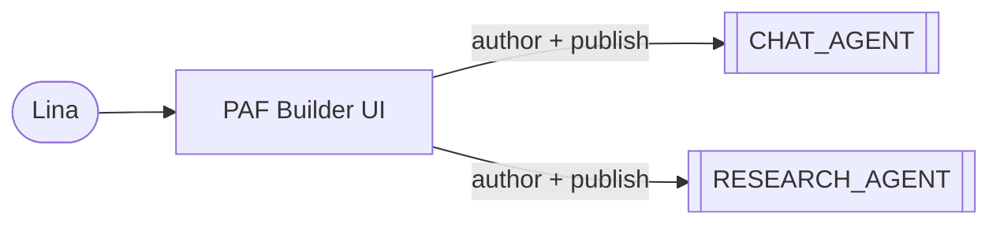
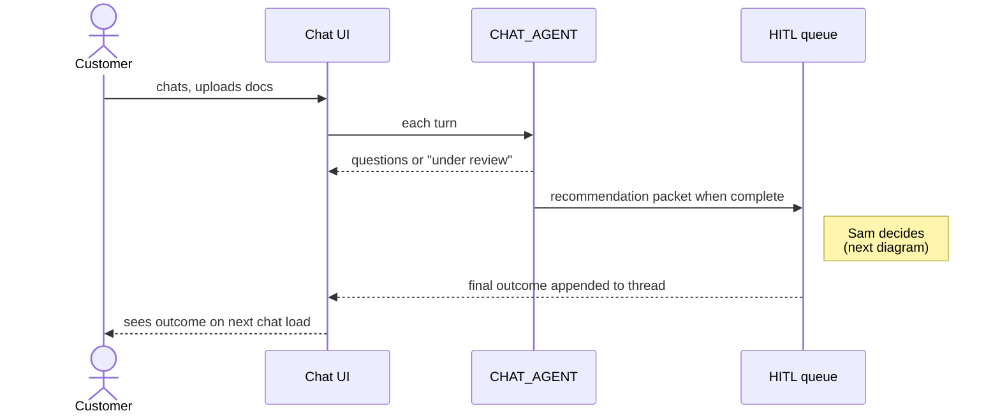
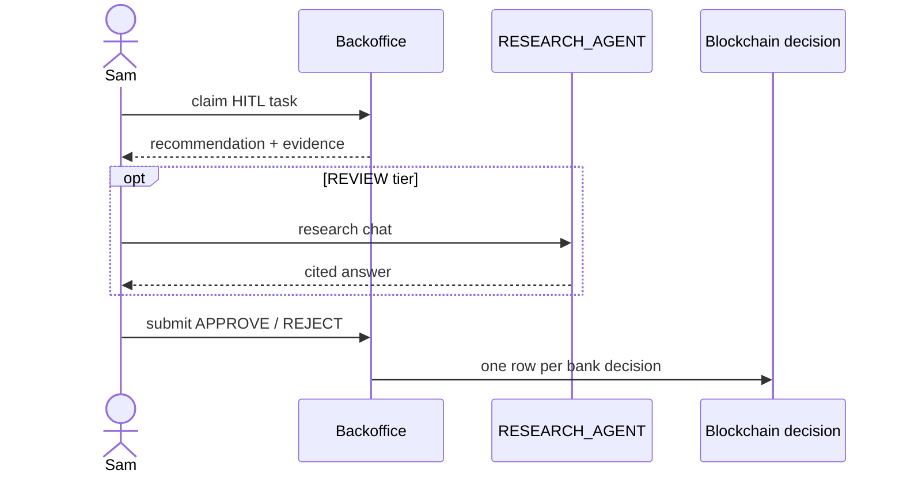

# Oracle Database Private Agent Factory — Banking Decisioning Engine PoC

A banking proof of concept showing **Oracle AI Database 26ai + Private Agent Factory** running an end-to-end retail loan decisioning flow with full observability (per-tool audit, Blockchain Tables, parameter history).

## Why this PoC exists — the story

**Lina, a credit risk analyst,** keeps hearing the same complaint from origination: loan officers and underwriters want a fast, governed first look at every incoming personal-loan application, with reasoning they can defend in front of an auditor. Today that work is ad-hoc, undocumented, and impossible to replay.

In **Private Agent Factory**, Lina builds the **Personal-Loan Chat Agent**. It talks to the customer, asks for the right documents per `(employment_type, residency_status, amount_band)`, waits for **OCR** (optical character recognition) on each upload, pulls customer / bureau / facilities via Select AI over read-only views, cites lending policy via **RAG** (retrieval-augmented generation), runs **OPA** (Open Policy Agent) for eligibility / **AML** (anti-money laundering) / **KYC** (Know Your Customer) / fair-lending, and writes a **recommendation packet** to the **HITL** (human-in-the-loop) queue — with one of three tiers (**APPROVE**, **REVIEW**, **DECLINE**) plus the reasoning that justifies it. **Every** application creates a HITL task: mandatory human review is the compliance posture by design, so the business stays in control of every credit decision the bank stands behind.

This is the **factory moment**. One chat agent today; tomorrow Lina clones the pattern for credit cards, secured loans, SMB lending, mortgage triage, KYC refresh — same **MCP** (Model Context Protocol) toolkit, same Oracle AI Database, different prompt and product config.

**The customer** chats, uploads documents, and gets the agent's responses back through the same chat — follow-up questions while documents are being collected, status updates while the reviewer is working (_"we're reviewing your application"_), and the final outcome once the human has decided. The conversation is persisted server-side, threaded by `roomId`, so the customer can close the browser tab, come back hours later, and pick up where they left off — no surprise machine-rejection, no opaque approval.

**Diego, an enterprise application developer,** productises the platform: the **OCR** pipeline (YOLO + PaddleOCR) as an MCP server, an **OPA** wrapper as an MCP server, in-DB writers in the `AGENT_TOOLS` package, **TxEventQ** (Transactional Event Queue) queues for async OCR and HITL claim, the customer chat UI, the backoffice queue, and the production APIs. He also ships a **second, backoffice-only agent** — the **Case Research Agent** — that lives behind the HITL detail screen and has access to broader data than the customer-safe chat agent: full transaction history, `decision_audit`, `policy_parameter_history`, deeper similarity over `case_history`. It cannot decide; it can read, analyse, and explain.

**Sam, a HITL reviewer,** opens the queue. He sees a **REVIEW** recommendation: _"$25,000 personal loan, self-employed expat, **DTI** (debt-to-income) of 0.41, payslip OCR marginal on net-pay field"_. The reasoning enumerates exactly which signals tipped it — `dti_in_soft_band`, `ocr_marginal_on_payslip`, `expat_self_employed_doc_set_complete` — plus a short list of **explore-hints** the agent suggests Sam look at. Sam asks the **Case Research Agent**: _"show me how we decided similar cases in the last 12 months"_. It answers from `case_history` with three anchor cases and citations into `decision_audit`. Sam decides REJECT and types his note. The decision lands in the **Blockchain Table** — one row per bank decision — carrying the human's call, the agent's original recommendation, the override reason, and the full evidence packet, retained seven years and tamper-evident.

**The point of the PoC:** Private Agent Factory lets a domain expert wire a governed chat agent over Oracle AI Database — one for personal loans today, dozens for adjacent products tomorrow. The single, immutable record of the bank's decision is the **human's call**, not the AI's. Oracle AI Database 26ai carries the data, the rule-engine inputs, the vector retrieval, the queues, and the tamper-proof audit — all in one engine.

## Interactions at a glance

The narrative above tells the story; the diagrams below are abstract visual anchors — one per actor.

### Lina — authors the agents in PAF



### The customer — applies through chat



### Diego — builds the platform


### Sam — reviews and decides



## Deployment

Two deployment options, same source tree:

- **Local** — rootless podman on a laptop or LAN. See [`LOCAL.md`](LOCAL.md).
- **Cloud** — Oracle Cloud Infrastructure (OCI) Terraform + Ansible (5 computes + **ADB** (Autonomous Database) + **LB** (load balancer)). See [`CLOUD.md`](CLOUD.md) _(not yet implemented)_.

## Documentation

- [`docs/DESIGN.md`](docs/DESIGN.md) — architecture, components, PAF Hybrid runtime mapping, source layout, locked decisions.
- [`docs/DEPLOYMENT.md`](docs/DEPLOYMENT.md) — deployment plan, `manage.py` command surface, Liquibase strategy, current scope.
- [`docs/PAF.md`](docs/PAF.md) — Oracle PAF practical study guide (in-repo reference).
- [`docs/DECISIONING-ENGINE-USE-CASE.md`](docs/DECISIONING-ENGINE-USE-CASE.md) — the credit-decisioning use case the PoC implements.
- [`docs/GLOSSARY.md`](docs/GLOSSARY.md) — plain-English glossary of the banking and compliance terms used across the docs (DTI, PTI, KYC, AML, fair lending, etc.).

## Quickstart (local)

```bash
python -m venv venv
source venv/bin/activate
pip install -r requirements.txt

python manage.py setup local
python manage.py paf prepare ~/Downloads/oracle_agent_factory_<version>.tar.gz
python manage.py local up
python manage.py paf bootstrap   # prints UI installer + LLM cheatsheet
python manage.py info
```

Detailed prerequisites, day-2 commands, and troubleshooting in [`LOCAL.md`](LOCAL.md).

## Current state

What works today on the local stack:

- Oracle Database Free 26ai with `max_string_size=EXTENDED`, four schema users (`APP`, `REPORTING`, `AGENT_TOOLS`, `AGENT_FACTORY`), and PAF-specific grants on `AGENT_FACTORY`.
- Liquibase changelog `001-010`: users + grants, banking core (incl. employment / transactions / bureau / facilities), decisioning + HITL + chat persistence, `system_config` + parameter history, REPORTING view sets, `AGENT_TOOLS` PL/SQL package (`create_hitl_task`), vector RAG tables (`policy_corpus`, `case_history`), TxEventQ queues (`HITL_REQUEST`, `OCR_REQUEST`, `OCR_EXCEPTION_Q`), and scenario seed customers + `case_history` rows for the test bench.
- `create_hitl_task` in `AGENT_TOOLS` verified end-to-end on Free 26ai: writes the recommendation packet to `APP.hitl_task` and enqueues `HITL_REQUEST` (JSON payload) in the same transaction.
- `DBMS_CLOUD` + `DBMS_CLOUD_AI` installed via `manage.py`. Caddy TLS proxy + Oracle SSL wallet make HTTPS-from-DB calls work end-to-end (validated by `UTL_HTTP`).
- Private Agent Factory container built from the vendor kit, installed under `AGENT_FACTORY` and reachable at `https://localhost:8080/`.
- **LLM** (large language model) Configuration in PAF registered against an Ollama endpoint (laptop or LAN GPU host; mDNS hostnames auto-resolved into the container via `extra_hosts`).
- OPA + OPA MCP wrapper: `opa` container loads every `.rego` under `opa/packages/`; `opa-mcp` exposes seven typed tools at `http://opa-mcp:8500/mcp/` (`required_documents`, `evaluate_eligibility`, `evaluate_aml`, `evaluate_kyc`, `evaluate_fair_lending_flags`, `lookup_pricing`, `list_policy_versions`).
- Stub `ocr-mcp` at `http://ocr-mcp:8501/mcp/` — one `extract_document` tool returning canned classification + OCR responses keyed on filename (placeholder for the YOLO + PaddleOCR/Tesseract pipeline).
- `hitl-mcp` at `http://hitl-mcp:8502/mcp/` — thin Python wrapper over `oracledb.callfunc` that exposes the in-DB `AGENT_TOOLS.PKG_AGENT_TOOLS.create_hitl_task` PL/SQL function as an MCP tool (PAF's only path to in-DB side-effects locally; in cloud the same function is exposed as a Select AI Tool — see [`docs/DESIGN.md §11`](docs/DESIGN.md)).
- `registry-api` at `http://registry-api:8600/` — synthetic Company Registry FastAPI with one `verify_employer(name)` route. OpenAPI 3.1 spec, registered with PAF as an HTTP datasource. Records align with the 010 seed employers (e.g. `Phoenix Holdings Ltd` → dormant, `Atlantis Innovations Ltd` → not registered).
- `HELLO_AGENT` flow in PAF Playground exercises three of four CHAT_AGENT tool channels end-to-end against qwen2.5:7b: OPA (`required_documents`), OCR (`extract_document` for MARGINAL/UNUSABLE scenarios), and Company Registry (`verify_employer` for active/dormant/unknown). The fourth channel — `hitl-mcp.create_hitl_task` — is verified via direct Python end-to-end against the DB; agent-level wiring waits for the Application Service to thread session context.

What's next, in order:

1. **`CHAT_AGENT` flow** in PAF — customer-facing, combines OPA MCP + OCR MCP + Company Registry datasource + HITL MCP. Replaces `HELLO_AGENT` with a flow that gets `customer_id` / `application_id` from session context instead of the user typing it.
2. **`RESEARCH_AGENT` flow** — backoffice-only, broader read-only scope (full transactions, `decision_audit`, `policy_parameter_history`, RAG over `policy_corpus`). No side-effect tools.
3. **Spring Boot Application Service** — threads `customer_id` into PAF invocations, handles document uploads (enqueues `OCR_REQUEST`), writes the Blockchain `decision` row at HITL close. Plus the two Angular UIs (customer chat, backoffice with Case Research Agent panel).
4. **Cloud deployment** (OCI Terraform + Ansible, ADB + LB).

Schema-side follow-ups deferred until a consumer needs them: vector index on `policy_corpus` / `case_history` (waits for the embedding pipeline that populates the `VECTOR(1024, FLOAT32)` columns via bge-m3), `OCR_REQUEST` / `OCR_EXCEPTION_Q` per-schema enqueue/dequeue grants (land with the OCR worker), and the `policy_corpus` / sanctions seed data.

Two known constraints not in the "next" list because they're decided:

- **Select AI profiles are ADB-only.** Oracle Free 26ai (23.26.x) rejects custom `provider_endpoint` values in `DBMS_CLOUD_AI` pre-flight. The local `CHAT_AGENT` flow uses a SQL Query node + LLM; full Select AI Bridge is the cloud path. See [`docs/DEPLOYMENT.md §7`](docs/DEPLOYMENT.md).
- **Auth is out of scope.** Both UIs use a mock login (customer dropdown / role dropdown). The audience system is assumed to provide SSO in production.
