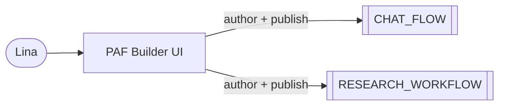
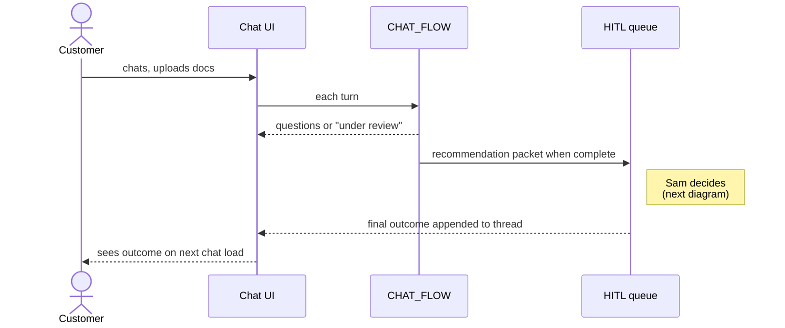
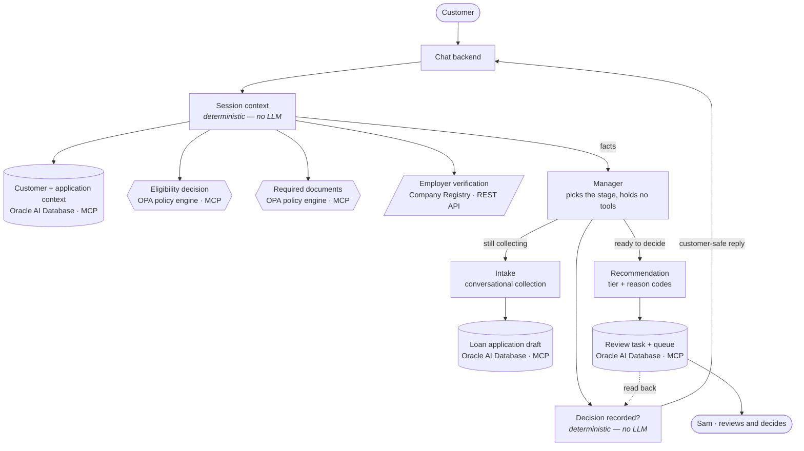
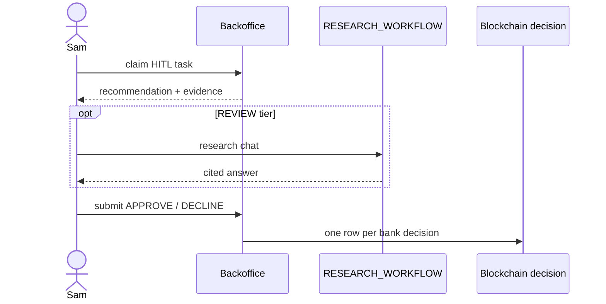

# Oracle Database Private Agent Factory — Banking Decisioning Engine PoC

A banking proof of concept showing **Oracle AI Database 26ai + Private Agent Factory** running an end-to-end retail loan decisioning flow with full observability (per-tool audit, Blockchain Tables, parameter history).

## Why this PoC exists — the story

**Lina, a credit risk analyst,** keeps hearing the same complaint from origination: loan officers and underwriters want a fast, governed first look at every incoming personal-loan application, with reasoning they can defend in front of an auditor. Today that work is ad-hoc, undocumented, and impossible to replay.

In **Private Agent Factory**, Lina builds the **Personal-Loan Chat Agent**. It talks to the customer, asks for the right documents per `(employment_type, residency_status, amount_band)`, pulls customer / bureau / facilities via Select AI over read-only views, cites lending policy via **RAG** (retrieval-augmented generation), runs **OPA** (Open Policy Agent) for eligibility / **AML** (anti-money laundering) / **KYC** (Know Your Customer) / fair-lending, and writes a **recommendation packet** to the **HITL** (human-in-the-loop) queue — with one of three tiers (**APPROVE**, **REVIEW**, **DECLINE**) plus the reasoning that justifies it. **Every** application creates a HITL task: mandatory human review is the compliance posture by design, so the business stays in control of every credit decision the bank stands behind.

This is the **factory moment**. One chat agent today; tomorrow Lina clones the pattern for credit cards, secured loans, SMB lending, mortgage triage, KYC refresh — same **MCP** (Model Context Protocol) toolkit, same Oracle AI Database, different prompt and product config.

**The customer** chats, uploads documents, and gets the agent's responses back through the same chat — follow-up questions while documents are being collected, status updates while the reviewer is working (_"we're reviewing your application"_), and the final outcome once the human has decided. The conversation is persisted server-side, threaded by `roomId`, so the customer can close the browser tab, come back hours later, and pick up where they left off — no surprise machine-rejection, no opaque approval.

**Diego, an enterprise application developer,** productises the platform: an **OPA** wrapper as an MCP server, in-DB writers in the `AGENT_TOOLS` package, a **TxEventQ** (Transactional Event Queue) queue for HITL claim, the customer chat UI, the backoffice queue, and the production APIs. He also ships a **second, backoffice-only agent** — the **Case Research Agent** — that lives behind the HITL detail screen and has access to broader data than the customer-safe chat agent: full transaction history, `decision_audit`, `policy_parameter_history`, deeper similarity over `case_history`. It cannot decide; it can read, analyse, and explain.

**Sam, a HITL reviewer,** opens the queue. He sees a **REVIEW** recommendation: _"$25,000 personal loan, self-employed expat, **DTI** (debt-to-income) of 0.41, employer registered but dormant"_. The reasoning enumerates exactly which signals tipped it — `dti_in_soft_band`, `employer_dormant`, `expat_self_employed_doc_set_complete` — plus a short list of **explore-hints** the agent suggests Sam look at. Sam asks the **Case Research Agent**: _"show me how we decided similar cases in the last 12 months"_. It answers from `case_history` with three anchor cases and citations into `decision_audit`. Sam decides DECLINE and types his note. The decision lands in the **Blockchain Table** — one row per bank decision — carrying the human's call, the agent's original recommendation, the override reason, and the full evidence packet, retained seven years and tamper-evident.

**The point of the PoC:** Private Agent Factory lets a domain expert wire a governed chat agent over Oracle AI Database — one for personal loans today, dozens for adjacent products tomorrow. The single, immutable record of the bank's decision is the **human's call**, not the AI's. Oracle AI Database 26ai carries the data, the rule-engine inputs, the vector retrieval, the queues, and the tamper-proof audit — all in one engine.

## What it looks like


The two ends of the same case. **Left:** the customer's chat — pick a customer, then apply and follow up in natural language. **Right:** the reviewer's portal — the agent's tier and reason codes, the evidence the agents gathered (employer verification, required documents), the per-tool audit trail with timings, and the Approve / Decline action with a mandatory comment.

## Interactions at a glance

The narrative above tells the story; the diagrams below are abstract visual anchors — one per actor, plus the chat flow's agents and data sources.

### Lina — authors the agents in PAF



### The customer — applies through chat



### The chat flow — agents and their data

Same flow, one level deeper: agent by agent, and what each one reads or writes.



The manager gets every fact as **data** from the deterministic nodes — no agent resolves an identity, evaluates a policy, or verifies an employer itself. Only two edges write: `Intake`'s draft application and `Recommendation`'s review task, and the reply reaches the customer only once the database confirms the turn is consistent.

### Diego — builds the platform


### Sam — reviews and decides



## Deployment

Two deployment options, same source tree:

- **Local** — rootless podman on a laptop or LAN. See [`LOCAL.md`](LOCAL.md).
- **Cloud** — Oracle Cloud Infrastructure (OCI) Terraform + Ansible: four computes, an **ADB** (Autonomous Database), a public **LB** (load balancer) serving HTTPS and a private one fronting the MCP wrappers, with models from the OCI Generative AI service. See [`CLOUD.md`](CLOUD.md).

Both run the same source tree, the same Liquibase changelog (Liquibase contexts select the handful of changesets that differ) and the same `CHAT_FLOW`.

## Documentation — start here

New to the project? Read in this order:

1. **This README** — the story, the current state, the quickstart.
2. [`docs/GLOSSARY.md`](docs/GLOSSARY.md) — plain-English banking terms (DTI, PTI, KYC, AML, fair lending), if they're new to you.
3. [`docs/DECISIONING-ENGINE-USE-CASE.md`](docs/DECISIONING-ENGINE-USE-CASE.md) — the credit-decisioning use case: what the system does and why.
4. [`docs/DESIGN.md`](docs/DESIGN.md) — the architecture, PAF Hybrid runtime mapping, source layout, and locked decisions.
5. [`paf/flows/CHAT_FLOW.md`](paf/flows/CHAT_FLOW.md) — the customer-facing agent flow, in build detail.
6. [`LOCAL.md`](LOCAL.md) — stand the stack up on a laptop and test it.
7. [`CLOUD.md`](CLOUD.md) — stand it up on OCI and test it.

Reference as needed: [`docs/PAF.md`](docs/PAF.md) (generic PAF product guide) · [`docs/DEPLOYMENT.md`](docs/DEPLOYMENT.md) (deploy strategy + `manage.py`) · [`docs/TROUBLESHOOT.md`](docs/TROUBLESHOOT.md) (workarounds) · [`BACKLOG.md`](BACKLOG.md) (cloud follow-ups, XGBoost scoring, product-rec, TOON) · [`presentation/deck.md`](presentation/deck.md) (conference talk deck).

## Quickstart (local)

```bash
python -m venv venv
source venv/bin/activate
pip install -r requirements.txt
python manage.py setup local
python manage.py paf prepare ~/Downloads/oracle_agent_factory_<version>.tar.gz
python manage.py local up
python manage.py paf bootstrap
python manage.py info
```

Detailed prerequisites, day-2 commands, and troubleshooting in [`LOCAL.md`](LOCAL.md).

## Quickstart (cloud)

```bash
source venv/bin/activate
python manage.py setup cloud
python manage.py build
python manage.py tf
python manage.py cloud iam
python manage.py cloud up
python manage.py paf bootstrap
```

Prerequisites, the install-wizard walkthrough, the end-to-end test and teardown are in [`CLOUD.md`](CLOUD.md).

## Current state

What works today on the local stack:

- Oracle Database Free 26ai with `max_string_size=EXTENDED`, four schema users (`APP`, `REPORTING`, `AGENT_TOOLS`, `AGENT_FACTORY`), and PAF-specific grants on `AGENT_FACTORY`.
- Liquibase changelog `001-012`: users + grants, banking core (incl. employment / transactions / bureau / facilities), decisioning + HITL + chat persistence, `system_config` + parameter history, REPORTING view sets, `AGENT_TOOLS` PL/SQL package (`create_hitl_task`, `upsert_draft_application`), vector RAG tables (`policy_corpus`, `case_history`), the `HITL_REQUEST` TxEventQ queue, and scenario seed customers + `case_history` rows for the test bench. Changeset 011 adds the opaque-session table + seed tokens; 012 makes draft fields nullable and seeds a no-application customer for intake.
- `create_hitl_task` in `AGENT_TOOLS` verified end-to-end on Free 26ai: writes the recommendation packet to `APP.hitl_task` and enqueues `HITL_REQUEST` (JSON payload) in the same transaction.
- `DBMS_CLOUD` + `DBMS_CLOUD_AI` installed via `manage.py`. Select AI is **not** wired locally (`ORA-20401` on custom endpoints — cloud/ADB only), so the earlier Caddy TLS proxy + Oracle SSL wallet have been removed; PAF reaches the LLM directly. See [`LOCAL.md`](LOCAL.md) and [`docs/DEPLOYMENT.md §7`](docs/DEPLOYMENT.md).
- Private Agent Factory container built from the vendor kit, installed under `AGENT_FACTORY` and reachable at `https://localhost:8080/`.
- **LLM** (large language model) Configuration in PAF registered against the **vLLM** endpoint on the GPU host (generation on `:8000`, embeddings on `:8001`; both expose OpenAI-compatible APIs). `.local` mDNS hostnames are resolved on the laptop and injected into the PAF container via `extra_hosts`. Setup details: [`LOCAL.md §Setting up vLLM on a GPU host`](LOCAL.md#setting-up-vllm-on-a-gpu-host-eg-nvidia-dgx-spark).
- OPA + OPA MCP wrapper: `opa` container loads every `.rego` under `opa/packages/`; `opa-mcp` exposes seven typed tools at `http://opa-mcp:8500/mcp/` (`required_documents`, `evaluate_eligibility`, `evaluate_aml`, `evaluate_kyc`, `evaluate_fair_lending_flags`, `lookup_pricing`, `list_policy_versions`).
- `hitl-mcp` at `http://hitl-mcp:8502/mcp/` — thin Python wrapper over `oracledb.callfunc` that exposes the in-DB `AGENT_TOOLS.PKG_AGENT_TOOLS.create_hitl_task` PL/SQL function as an MCP tool (PAF's only path to in-DB side-effects locally; in cloud the same function is exposed as a Select AI Tool — see [`docs/DESIGN.md §11`](docs/DESIGN.md)).
- `registry-api` at `http://registry-api:8600/` — synthetic Company Registry FastAPI with one `verify_employer(name)` route. OpenAPI 3.1 spec, registered with PAF as an HTTP datasource. Records align with the 010 seed employers (e.g. `Phoenix Holdings Ltd` → dormant, `Atlantis Innovations Ltd` → not registered).
- Spring Boot Application Service on `localhost:8090` (mints the opaque session token at login, lists customers, brokers each chat turn, serves the HITL queue + task detail, and writes the Blockchain `decision` row when a reviewer closes a task) plus the two React/Vite SPAs — customer chat and reviewer portal — behind the Caddy proxy on `localhost:5173`.
- `CHAT_FLOW` is **one manager agent with two sub-agent workers**, fed by **five deterministic `banking-mcp` nodes**, on a self-hosted vLLM endpoint (validated on `Qwen/Qwen2.5-72B-Instruct-AWQ`; see [`LOCAL.md`](LOCAL.md) for recommended models). Four deterministic nodes run before the manager off one wired token chain — `get_context`, `evaluate_eligibility_for_session` (OPA on the DB-derived DTI/PTI), `required_documents_for_session` and `verify_employer_for_session` (Company Registry) — so every fact the decision rests on is computed server-side, with no LLM in the loop. The manager holds no tools: it reads those facts and delegates to `Intake` (conversational collection of `amount` / `term_months` / `purpose`, writing the `DRAFT` via `application-mcp.upsert_application`) or to `Recommendation`, whose single tool `hitl-mcp.create_hitl_task` takes only the session token: `banking-mcp` computes the tier (`APPROVE` / `REVIEW` / `DECLINE`), its reason codes and the evidence packet server-side and records them, so no model chooses an outcome or re-words a policy message — the worker reads the tier back and speaks the matching compliance-safe sentence. A fifth deterministic node, `hitl_status_for_session`, then reads the database and the final gate passes any reply on a valid session, rejecting only an invalid one. Load it by importing [`paf/flows/CHAT_FLOW.paf`](paf/flows/CHAT_FLOW.paf) (password `WelcomeAmigo123!`) or by building it from the blueprint, which carries every custom-instructions block verbatim: [`paf/flows/CHAT_FLOW.md`](paf/flows/CHAT_FLOW.md). Either way see [`LOCAL.md §5`](LOCAL.md#5-load-chat_flow).

  The deterministic entry in PAF Agent Builder — the session token is wired into the `banking-mcp` nodes and never transcribed by an LLM on any read path:

  

What's next, in order — the detail lives in [`BACKLOG.md`](BACKLOG.md):

1. **Finish the cloud deployment.** The stack stands up on OCI and serves the UIs, the API and PAF over HTTPS; the four MCP wrappers run on the `backend` tier behind a private load balancer. What remains is the first clean end-to-end pass of `manage.py cloud test` against a Cohere generation model. See [`CLOUD.md`](CLOUD.md) and [`BACKLOG.md §1`](BACKLOG.md).
2. **Verify PAF's certificate at the load balancer.** The public listener serves HTTPS, but the hop from the load balancer to PAF is encrypted and unverified — PAF issues its certificate during its own install, so it cannot be trusted in the same apply. [`BACKLOG.md §2`](BACKLOG.md).
3. **`RESEARCH_WORKFLOW` flow** — backoffice-only, broader read-only scope (full transactions, `decision_audit`, `policy_parameter_history`, RAG over `policy_corpus`). No side-effect tools. Reuses the pattern proven by `CHAT_FLOW`.
4. **Document uploads + Case Research panel** — a chat upload endpoint that stores the file against the application, and the research panel in the reviewer portal once item 3 exists.
5. **XGBoost credit-scoring tool** — trains in-database with OML4SQL on `REPORTING.cust_360` and exposes `predict_credit_score` to the agent. ADB-only: Oracle Database Free rejects `ALGO_XGBOOST` with `ORA-40216`. [`BACKLOG.md §4`](BACKLOG.md).
6. **Product-recommendation workflow** — second flow over the same view set, consuming the credit-score tool as one of its signals. [`BACKLOG.md §5`](BACKLOG.md).
7. **TOON feasibility spike** — independent, can happen in parallel. [`BACKLOG.md §6`](BACKLOG.md).

Schema-side follow-ups deferred until a consumer needs them: vector index on `policy_corpus` / `case_history` (waits for the embedding pipeline that populates the `VECTOR(1024, FLOAT32)` columns via bge-m3) and the `policy_corpus` / sanctions seed data.

Two known constraints not in the "next" list because they're decided:

- **Select AI is parked.** Oracle Free 26ai rejects custom `provider_endpoint` values in `DBMS_CLOUD_AI` pre-flight, so it was always the cloud path — but `CHAT_FLOW` reads through `banking-mcp` on both targets, so the cloud deployment runs the same MCP wrappers rather than a different tool transport. Adopting Select AI is a flow redesign, tracked in [`BACKLOG.md §3`](BACKLOG.md).
- **Auth is out of scope.** Both UIs use a mock login (customer dropdown / role dropdown). The audience system is assumed to provide SSO in production.
