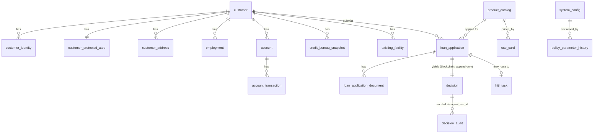

# Decisioning Engine PoC — Oracle AI Database Private Agent Factory + OPA + RAG

**Audience:** any retail bank evaluating Oracle AI Database 26ai + Private Agent Factory as the agentic platform for credit-application decisioning.
**Demo bank:** generic, region-agnostic. No country, currency, regulator, or bureau is hard-coded.
**New to the banking terms?** [`GLOSSARY.md`](GLOSSARY.md) has plain-English definitions for DTI, PTI, KYC, AML, fair lending, and the rest.

---

## Core Message

A small, opinionated PoC showing that Oracle AI Database 26ai + Private Agent Factory can run end-to-end credit decisioning with:

- **Observability over determinism** — every decision is reproducible, auditable, replayable. OPA + business logic are kept as deterministic as possible, but the headline is "we can always explain why" not "we are always right".
- **Human-in-the-loop by default** — in any doubt, a human owns the decision. A backoffice **Mandatory-HITL** flag can force 100% of decisions through human review at any time.
- **Configurability over hard-coding** — every threshold, weight, scale, and policy parameter is editable in the backoffice. The same code base supports any country/region by tuning configuration.
- **Tiny tweak → real product** — the PoC is built to demonstrate the path, not the production system. A bank can adopt the pattern and replace components incrementally.

---

## Design Decisions (Consolidated)

| #   | Decision                                                                                                | Why                                                                                                                                                                     |
| --- | ------------------------------------------------------------------------------------------------------- | ----------------------------------------------------------------------------------------------------------------------------------------------------------------------- |
| 1   | Bank-agnostic — no country / region / bureau / regulator hard-coded                                     | Demo must be reusable across institutions in different jurisdictions                                                                                                    |
| 2   | Credit score, DTI/PTI caps, weights, currencies are runtime **configuration**, not literals in code     | Same demo, different parameters per audience                                                                                                                            |
| 3   | Generic data-protection framework (rights + restrictions common to most regimes)                        | Avoids country-specific compliance claims; signals "we know there are obligations"                                                                                      |
| 4   | OPA chosen — used in banking, open-source, gives full control of policy code                            | No comparison to commercial BRMS; scope is intentionally limited                                                                                                        |
| 5   | No auto-approve as a default headline                                                                   | When in doubt → human. Toggleable hard requirement via backoffice flag                                                                                                  |
| 6   | Mandatory-HITL flag — global override forces all decisions to HITL queue                                | Audit periods, warm-up, sensitive products, drift suspicion                                                                                                             |
| 7   | Observability over determinism                                                                          | Deterministic systems can still be wrong; the recoverable failure mode is a complete trail                                                                              |
| 8   | Append-only decision history on **Oracle Database Blockchain Table**                                    | Immutable, queryable, retention-friendly, no extra infra                                                                                                                |
| 9   | Region-agnostic deployment — any OCI region, also portable to ExaCC / on-prem 26ai                      | No tenant / region constraint baked in                                                                                                                                  |
| 10  | Open-source OCR (PaddleOCR / Tesseract) + YOLO for ID-card field detection                              | Lightweight, no external SaaS, demonstrable on a laptop                                                                                                                 |
| 11  | OCR tiers: usable → HITL with full context; marginal → HITL; unusable → auto-decline                    | Don't reject under the radar; don't saturate humans with garbage                                                                                                        |
| 12  | Fair Lending Review = generalized non-discrimination backoffice process                                 | Periodic disparate-impact sampling across configured protected attributes                                                                                               |
| 13  | Simplest possible pricing engine — rate card + risk-band adjustment                                     | Approval without a rate is not a decision; keep it minimal                                                                                                              |
| 14  | Affordability stress = backoffice Risk Management Dashboard                                             | Portfolio-level shock view, not per-application gating; consistent across banks                                                                                         |
| 15  | No counter-offer logic                                                                                  | Out of scope                                                                                                                                                            |
| 16  | No effort budget / timeline in this doc                                                                 | Not relevant; PoC is delivered when the demo is convincing                                                                                                              |
| 17  | Standalone stack — does not depend on, or align with, any concurrent engagement                         | Clean architectural story; one stack, one demo                                                                                                                          |
| 18  | Customer UI = chat + document upload. Backoffice UI = traditional CRUD + queue + reports                | Two distinct surfaces, two distinct audiences                                                                                                                           |
| 19  | Test bench is for **functionality + observability**, not performance                                    | Cover all decision paths and prove every step is observable                                                                                                             |
| 20  | **Oracle Database TxEventQ** for HITL claim and async/offline operations (OCR, retries, future fan-out) | Stays in-DB (same engine as Blockchain Tables + Vector); transactional dequeue prevents double-claim; built-in retries + exception queues; no Kafka/RabbitMQ to operate |

---

## Goals

- Show Oracle AI Database 26ai as **the agentic platform** for credit decisioning: SQL + Vector + Rule engine + LLM + audit, in one place.
- Prove **end-to-end observability** of every decision — replayable from inputs to rationale.
- Demonstrate a **human-first** decisioning posture with a hard regulator-friendly override.
- Map every decision feature, function, dataset, and integration into a single coherent surface a bank can recognize and adopt.

---

## Demo Scenario — Personal Loan Origination

Generic retail bank. Customer applies for a personal loan via a chat UI, uploads supporting documents, receives one of:

- **REJECT** (with documented reason codes, surfaced through the customer channel).
- **REFER TO HUMAN** (most cases when any uncertainty exists; default behavior on doubt).
- **APPROVE** (with a priced offer — rate, term, amount).

A **Mandatory-HITL** toggle in the backoffice routes 100% of cases to human review regardless of OPA result. Off by default; can be flipped at any time.

---

## Architecture

### Flow

The customer chat is driven by the agent: it asks for what _this_ applicant needs (different for salaried vs. self-employed, resident vs. expat, small vs. large loan) and only proceeds to the decision once everything is in place.

1. Customer opens chat UI, says what they want (product, amount, purpose, term). Agent asks structured follow-ups (employment type, residency status, salary band, existing facilities) to build a partial applicant profile.
2. **Agent calls OPA `required_documents(applicant_so_far, product)`** → returns the required doc set keyed by `(product_type, employment_type, residency_status, amount_band)`. The matrix lives in `system_config.document_requirements_matrix`; Select AI RAG can retrieve policy snippets to explain _why_ each document is needed.
3. Agent presents the list in chat and requests uploads. Each upload → Application Service writes a `loan_application_document` row, uploads the file to Object Storage, enqueues `OCR_REQUEST` (TxEventQ).
4. **OCR + Document Detection** worker dequeues from `OCR_REQUEST` (open-source: YOLO + PaddleOCR/Tesseract), **classifies** the document (`doc_type` ∈ `ID` / `PAYSLIP` / `STATEMENT` / `TAX_RETURN` / `ADDRESS_PROOF` / `OTHER`), extracts per-field values, and writes back `doc_type`, `ocr_payload`, `ocr_confidence`, `quality_tier`. Failures retry up to `max_retries`; poison messages land in `OCR_EXCEPTION_Q` for triage.
5. Agent verifies completeness via `check_document_completeness`: every required `doc_type` has at least one USABLE document with required fields extracted. Missing / MARGINAL / UNUSABLE / mismatched (statement uploaded when ID requested → classifier catches it) → agent re-asks. Only when complete does the conversation move on.
6. Application Service runs **cheap OPA pre-checks** over REST (sanctions, age, doc presence) — short-circuits obvious denies.
7. **Decisioning Agent** completes its turn by orchestrating the remaining tools:
   - SQL (Select AI) → customer profile, transactions, credit bureau, existing facilities.
   - OPA MCP tools → eligibility, AML, KYC, escalation, fair-lending hooks.
   - Vector Search → policy citations, similar cases.
   - Pricing tool → rate card lookup + risk-band adjustment.
8. Composite **confidence score** computed from configurable weights (OCR quality + data completeness + policy proximity).
9. Outcome decided by OPA + confidence + Mandatory-HITL flag.
10. **Decision** persisted to a Blockchain Table (append-only). Full audit trail (per tool call) persisted in `decision_audit`.
11. If REFER_HUMAN, the agent (via `create_hitl_task`) writes a row to `hitl_task` and enqueues `HITL_REQUEST` (TxEventQ) in the same transaction. Backoffice reviewers `deqone` to atomically claim a task (queue dequeue + `hitl_task` state transition OPEN → IN_REVIEW commit together); the bell on the backoffice UI shows the role-filtered pending count.
12. Customer status surfaces back through the chat UI with reason codes (no decision detail leak).

### Component Map

| Component           | Tech                                                                             | Role                                                                     |
| ------------------- | -------------------------------------------------------------------------------- | ------------------------------------------------------------------------ |
| Customer Chat UI    | Web app (React / Next / similar)                                                 | Chat-style request flow + document upload                                |
| Backoffice UI       | Web app (React / Next / similar)                                                 | CRUD, HITL queue, rule editor, reports, dashboards, parameter management |
| Application Service | Spring Boot (Java) stub                                                          | App CRUD, document upload, pre-checks, agent invocation                  |
| Object Storage      | OCI Object Storage                                                               | Uploaded document PDFs / images                                          |
| OCR + Detection     | YOLO (field detection) + PaddleOCR/Tesseract                                     | Open-source extraction; composite confidence tiering                     |
| Decisioning Agent   | Oracle Private Agent Factory (Select AI Agent) in ADB                            | Tool-calling agent                                                       |
| Data plane          | Oracle AI Database 26ai                                                          | All banking data; RLS/VPD enforced at the DB layer                       |
| Vector store        | Oracle AI Vector Search (same 26ai)                                              | `policy_corpus` + `case_history` embeddings                              |
| LLM + embeddings    | OCI Generative AI (model-agnostic — pick what's sanctioned in the target region) | Reasoning + rationale + embeddings                                       |
| Rule engine         | OPA + OPA MCP server (Python FastMCP wrapper)                                    | Eligibility, AML, KYC, escalation, fair-lending rules in Rego            |
| Decision history    | Oracle Database Blockchain Table                                                 | Append-only credit-decision audit; retention-friendly                    |
| Async messaging     | Oracle Database **TxEventQ** (in-DB AQ; JSON payload)                            | HITL claim, OCR async pipeline, future fan-out — all in the same engine  |
| HITL surface        | Backoffice UI (queue + decision form + notification bell)                        | Bank employee picks up, reviews evidence, decides                        |

---

## Data Model — Synthetic but Realistic

The synthetic dataset is generated to **trigger every decision path** rather than to validate a model. It is intentionally constructed so test-bench scenarios exercise the system end-to-end.

### Entities

| Table                       | Purpose                                                                                                       |
| --------------------------- | ------------------------------------------------------------------------------------------------------------- |
| `customer`                  | Customer master                                                                                               |
| `customer_address`          | Current + historical addresses                                                                                |
| `customer_identity`         | ID / passport docs with expiry                                                                                |
| `customer_protected_attrs`  | Protected attributes for fair-lending review (configurable per region)                                        |
| `employment`                | Employers, salary, tenure                                                                                     |
| `account`                   | Customer accounts (current, savings)                                                                          |
| `account_transaction`       | Transaction history (12 months) — cashflow source                                                             |
| `credit_bureau_snapshot`    | Periodic external score + bureau facilities; **scale parameterized**                                          |
| `existing_facility`         | Loans/cards held elsewhere                                                                                    |
| `product_catalog`           | Loan/card/mortgage products + amount/term ranges                                                              |
| `rate_card`                 | Pricing per product + risk band                                                                               |
| `loan_application`          | The application being decisioned                                                                              |
| `loan_application_document` | Uploaded docs + classifier `doc_type` + OCR-extracted JSON + quality tier                                     |
| `decision` _(blockchain)_   | Append-only decision history                                                                                  |
| `decision_audit`            | Step-by-step tool-call trail (inputs, outputs, durations)                                                     |
| `hitl_task`                 | HITL queue entry, state, assignment                                                                           |
| `policy_corpus`             | Policy chunks + embeddings (for RAG)                                                                          |
| `case_history`              | Past anonymized decisions for similarity retrieval                                                            |
| `sanctions_list`            | Synthetic sanctions / PEP list                                                                                |
| `system_config`             | Tunable parameters (caps, thresholds, weights, Mandatory-HITL flag, **`document_requirements_matrix`**, etc.) |
| `policy_parameter_history`  | Versioned changes to `system_config` (who changed what, when, why)                                            |
| `fair_lending_review`       | Periodic disparate-impact sampling + bank reviewer notes                                                      |

### Schema sketch (key tables)

```sql
CREATE TABLE customer (
  customer_id     NUMBER PRIMARY KEY,
  full_name       VARCHAR2(200),
  date_of_birth   DATE,
  residency       VARCHAR2(64),
  email           VARCHAR2(200),
  phone           VARCHAR2(40),
  kyc_status      VARCHAR2(20) CHECK (kyc_status IN ('PENDING','PASSED','FAILED')),
  kyc_updated_at  TIMESTAMP,
  created_at      TIMESTAMP
);

CREATE TABLE customer_protected_attrs (
  customer_id  NUMBER PRIMARY KEY REFERENCES customer,
  attrs        JSON   -- configurable per region: {"age_band":"30-39","gender":"F",...}
);

CREATE TABLE credit_bureau_snapshot (
  snapshot_id            NUMBER PRIMARY KEY,
  customer_id            NUMBER REFERENCES customer,
  snapshot_date          DATE,
  score                  NUMBER,
  score_scale_min        NUMBER,        -- parameterized
  score_scale_max        NUMBER,        -- parameterized
  bureau_name            VARCHAR2(80),  -- free text, no hard-coded bureau
  total_debt             NUMBER(14,2),
  num_open_facilities    NUMBER,
  num_late_payments_12m  NUMBER
);

CREATE TABLE product_catalog (
  product_id        NUMBER PRIMARY KEY,
  name              VARCHAR2(200),
  product_type      VARCHAR2(20),
  pricing_model     VARCHAR2(20),       -- INTEREST / FEE / PROFIT_SHARE (generic)
  min_amount        NUMBER(14,2),
  max_amount        NUMBER(14,2),
  min_term_months   NUMBER,
  max_term_months   NUMBER,
  currency          VARCHAR2(3)         -- generic ISO code; not hard-coded
);

CREATE TABLE rate_card (
  rate_card_id     NUMBER PRIMARY KEY,
  product_id       NUMBER REFERENCES product_catalog,
  risk_band        VARCHAR2(20),        -- LOW / MID / HIGH (configurable bands)
  rate_value       NUMBER(7,4),         -- meaning interpreted by pricing_model
  effective_from   DATE,
  effective_to     DATE
);

CREATE TABLE loan_application (
  application_id    NUMBER PRIMARY KEY,
  customer_id       NUMBER REFERENCES customer,
  product_id        NUMBER REFERENCES product_catalog,
  amount_requested  NUMBER(14,2),
  term_months       NUMBER,
  purpose           VARCHAR2(200),
  channel           VARCHAR2(20),
  status            VARCHAR2(20),
  submitted_at      TIMESTAMP,
  decided_at        TIMESTAMP
);

CREATE TABLE loan_application_document (
  doc_id          NUMBER PRIMARY KEY,
  application_id  NUMBER REFERENCES loan_application,
  doc_type        VARCHAR2(40),       -- ID / PAYSLIP / STATEMENT / TAX_RETURN / ADDRESS_PROOF / OTHER (set by the OCR classifier, not by the customer)
  requested_type  VARCHAR2(40),       -- what the agent asked the customer to upload (so mismatches are auditable)
  storage_uri     VARCHAR2(500),
  uploaded_at     TIMESTAMP,
  ocr_status      VARCHAR2(20),
  ocr_payload     JSON,
  ocr_confidence  NUMBER(5,4),
  quality_tier    VARCHAR2(20)        -- USABLE / MARGINAL / UNUSABLE
);

-- Append-only decision history (Oracle Blockchain Table)
CREATE BLOCKCHAIN TABLE decision (
  decision_id        NUMBER,
  application_id     NUMBER,
  outcome            VARCHAR2(20),    -- APPROVE / REJECT / REFER_HUMAN
  confidence         NUMBER(5,4),
  rationale          CLOB,
  opa_result         JSON,
  rag_citations      JSON,
  pricing_offer      JSON,            -- {rate, term, amount, expiry}
  reason_codes       JSON,            -- enumerated codes for customer disclosure
  computed_dti       NUMBER(5,2),
  computed_pti       NUMBER(5,2),
  mandatory_hitl     CHAR(1),         -- Y/N (was flag on at decision time?)
  decided_at         TIMESTAMP,
  agent_run_id       VARCHAR2(60)
) NO DROP UNTIL 7 YEARS IDLE
  NO DELETE LOCKED
  HASHING USING "SHA2_512" VERSION "v1";

CREATE TABLE decision_audit (
  audit_id      NUMBER PRIMARY KEY,
  agent_run_id  VARCHAR2(60),
  step_no       NUMBER,
  tool_name     VARCHAR2(80),
  tool_input    JSON,
  tool_output   JSON,
  started_at    TIMESTAMP,
  ended_at      TIMESTAMP,
  duration_ms   NUMBER,
  status        VARCHAR2(20)
);

CREATE TABLE hitl_task (
  task_id         NUMBER PRIMARY KEY,
  application_id  NUMBER REFERENCES loan_application,
  assigned_to     VARCHAR2(120),
  state           VARCHAR2(20),       -- OPEN / IN_REVIEW / APPROVED / REJECTED / EXPIRED
  reason_for_hitl VARCHAR2(200),      -- mandatory_flag / opa_warn / low_confidence / oc r_marginal / amount_over_threshold / fair_lending_flag
  decision_note   CLOB,
  created_at      TIMESTAMP,
  closed_at       TIMESTAMP
);

CREATE TABLE policy_corpus (
  chunk_id     NUMBER PRIMARY KEY,
  source_doc   VARCHAR2(300),
  section_ref  VARCHAR2(60),
  text         CLOB,
  embedding    VECTOR(1024, FLOAT32)
);

CREATE TABLE case_history (
  case_id         NUMBER PRIMARY KEY,
  amount          NUMBER(14,2),
  term_months     NUMBER,
  dti             NUMBER(5,2),
  pti             NUMBER(5,2),
  credit_score    NUMBER,
  outcome         VARCHAR2(20),
  outcome_reason  CLOB,
  case_embedding  VECTOR(1024, FLOAT32)
);

CREATE TABLE system_config (
  config_key    VARCHAR2(80) PRIMARY KEY,
  config_value  VARCHAR2(400),
  value_type    VARCHAR2(20),       -- NUMBER / STRING / BOOLEAN / JSON
  description   VARCHAR2(400),
  updated_at    TIMESTAMP,
  updated_by    VARCHAR2(120)
);

CREATE TABLE policy_parameter_history (
  hist_id       NUMBER PRIMARY KEY,
  config_key    VARCHAR2(80),
  old_value     VARCHAR2(400),
  new_value     VARCHAR2(400),
  changed_at    TIMESTAMP,
  changed_by    VARCHAR2(120),
  change_reason VARCHAR2(400)
);

CREATE TABLE fair_lending_review (
  review_id           NUMBER PRIMARY KEY,
  period_from         DATE,
  period_to           DATE,
  bucketing           JSON,            -- {"age_band":[...], "gender":[...],...}
  disparate_impact    JSON,            -- per-bucket approval rate vs reference
  flagged_decisions   JSON,            -- decision_ids over threshold
  reviewer            VARCHAR2(120),
  conclusion          CLOB,
  reviewed_at         TIMESTAMP
);
```

### Relationships (cardinality)



### Synthetic dataset — built to exercise paths, not to mimic a real bank

Volumes calibrated to the test bench, not statistical realism:

- ~2,000 customers spanning configurable risk bands.
- 1–3 accounts per customer; ~12 months of transaction history; salary credits + recurring outflows + variability.
- ~1,000 loan applications mapped 1:1 to test-bench scenarios (see below).
- ~50 ID/payslip/statement/address-proof PDF templates at three quality tiers (clean, marginal, unusable).
- ~150 policy chunks (generic lending policy, generic AML guidance, generic fair-lending guidance).
- ~500 case-history rows for similarity retrieval.
- ~50 synthetic sanctions / PEP entries.

**No circular logic** — risk-band labels are used to generate plausible features (income, score, NSF count, document quality), then _forgotten_. The agent operates only on observable features, not on the label. This way the demo path is engineered, but the agent does real work given the inputs.

---

## OPA — Rule Engine

### Why OPA (one paragraph, no comparison)

OPA is used in production banking, is open-source, and gives full control over policy code. Within the limited scope of this PoC, that is enough. Production institutions can re-evaluate against any BRMS later — OPA is exposed through MCP, so the agent contract doesn't change if the engine is swapped.

### Policy packages

```
packages/
├── eligibility.rego         # age, residency, income, DTI, PTI, score floor (all parameterized)
├── aml.rego                 # sanctions / PEP / suspicious pattern flags
├── kyc.rego                 # ID validity, doc expiry, quality-tier gates
├── required_documents.rego  # required doc set per (product_type, employment_type, residency, amount_band)
├── product.rego             # product-specific amount/term caps
├── escalation.rego          # routing rules: when to REFER_HUMAN
├── fair_lending.rego        # disparate-impact pre-flight on a single decision
└── pricing.rego             # risk-band mapping for rate-card lookup
```

### Example — `eligibility.rego` (parameterized)

```rego
package decisioning.eligibility

import future.keywords.in

# Parameters arrive as data.config — sourced from system_config + policy_parameter_history.

default allow := false

deny[msg] {
  input.applicant.age < data.config.min_age
  msg := sprintf("Applicant under minimum age (%v)", [data.config.min_age])
}

deny[msg] {
  input.applicant.dti > data.config.dti_hard_cap
  msg := sprintf("DTI %.2f exceeds cap %.2f", [input.applicant.dti, data.config.dti_hard_cap])
}

deny[msg] {
  input.applicant.pti > data.config.pti_hard_cap
  msg := sprintf("PTI %.2f exceeds cap %.2f", [input.applicant.pti, data.config.pti_hard_cap])
}

deny[msg] {
  input.applicant.credit_score < data.config.score_floor
  msg := sprintf("Credit score below configured floor (%v)", [data.config.score_floor])
}

warn[msg] {
  input.applicant.credit_score >= data.config.score_floor
  input.applicant.credit_score < data.config.score_caution_band_upper
  msg := "Credit score in caution band: manual review"
}

warn[msg] {
  input.application.amount > data.config.auto_approve_amount_cap
  msg := sprintf("Amount above auto-approve threshold (%v): manual review", [data.config.auto_approve_amount_cap])
}

allow {
  not deny[_]
  not warn[_]
}
```

`data.config` is loaded from `system_config` at OPA startup (or via OPA bundle refresh). Backoffice edits to `system_config` write a row to `policy_parameter_history` and trigger an OPA bundle reload.

### OPA via MCP

- **OPA MCP server** wraps OPA's `/v1/data/...` HTTP endpoints as typed MCP tools.
- Tools exposed to the agent:
  - `required_documents(applicant_so_far, product)` → `{ required: [doc_type, ...], rationale }` — looked up against `system_config.document_requirements_matrix` keyed by `(product_type, employment_type, residency_status, amount_band)`
  - `evaluate_eligibility(applicant, application, product)` → `{ allow, deny[], warn[] }`
  - `evaluate_aml(customer, application)` → `{ allow, deny[] }`
  - `evaluate_kyc(documents, quality_tiers)` → `{ allow, deny[] }`
  - `evaluate_escalation(decision_inputs)` → `{ refer_human, reason }`
  - `evaluate_fair_lending_flags(customer_attrs, decision_draft)` → `{ flag, reason }`
  - `lookup_pricing(applicant, application)` → `{ risk_band, rate_value, fee_schedule }`
  - `list_policy_versions()` → version metadata for audit

- **Application Service** also calls OPA over REST for cheap pre-checks (sanctions, age, doc presence) — never bothers the agent with hopeless cases.

---

## RAG

### Corpus

- **`policy_corpus`** — generic lending policy, generic AML guidance, generic fair-lending policy, product policy. Region-neutral phrasing.
- **`case_history`** — anonymized past decisions for similarity retrieval.

### Embedding model

OCI Generative AI embeddings — model chosen at deploy time based on what is sanctioned in the target region. No hard-coded vendor.

### Retrieval

- **Policy retrieval** — `search_policy(reasons)` → top-N policy chunks → cited in rationale.
- **Case retrieval** — `search_similar_cases(applicant features)` → top-N similar past cases → anchor in rationale.
- **Hybrid retrieval** — vector + SQL filter (e.g., `product_type = 'PERSONAL_LOAN'`) for precision.

### What RAG is NOT used for

Not for the decision itself — that's OPA. RAG grounds the rationale text and answers ad-hoc bank-agent questions in the backoffice UI ("what does the lending policy say about X?").

---

## OCR + Document Quality Tiering

### Pipeline

1. **Document classification** — a lightweight classifier head returns the actual `doc_type` (`ID` / `PAYSLIP` / `STATEMENT` / `TAX_RETURN` / `ADDRESS_PROOF` / `OTHER`) so the agent can detect mismatches (customer uploaded a statement when an ID was asked for).
2. **YOLO** — detects regions on the uploaded image / PDF specific to the classified `doc_type` (ID front / back / MRZ / photo area for IDs; payslip header + line items for payslips; statement table for statements; etc.). Open-source weights, fine-tuned on a small synthetic set of mock documents.
3. **OCR engine** — open-source (PaddleOCR or Tesseract — pick whichever localizes better for the demo). Extracts text from each detected region.
4. **Per-field confidence** — composite from classifier score + YOLO detection score + OCR per-character confidence + structural sanity checks (date parses, ID format matches the expected pattern, MRZ checksum where applicable).
5. **Document quality tier** — composite:
   - `USABLE` — every required field detected with per-field confidence ≥ configured threshold, and the classified `doc_type` matches what was requested.
   - `MARGINAL` — one or more fields below threshold but image is human-readable.
   - `UNUSABLE` — image too dark / blurred / cropped / not a recognisable document.

### Behavior by tier

| Tier       | System behavior                                                                                                                                                                                  |
| ---------- | ------------------------------------------------------------------------------------------------------------------------------------------------------------------------------------------------ |
| USABLE     | Counts toward completeness; the agent moves on once every required `doc_type` is covered.                                                                                                        |
| MARGINAL   | Agent asks the customer to re-upload (cite the field that failed). If the re-upload is still MARGINAL → REFER_HUMAN with the original + OCR output + confidence map. **Do not silently reject.** |
| UNUSABLE   | Agent asks the customer to re-upload with a clear reason ("please re-upload — image was not readable"). No human is bothered with garbage uploads.                                               |
| MISMATCHED | Classified `doc_type` differs from the requested one — agent re-asks for the correct document type.                                                                                              |

Thresholds (`USABLE_min_confidence`, `MARGINAL_floor`) are in `system_config` and editable from the backoffice.

---

## Decisioning Agent — Private Agent Factory

### Agent definition (pseudo-DDL)

```sql
BEGIN
  DBMS_CLOUD_AI.CREATE_AGENT(
    agent_name   => 'DECISIONING_AGENT',
    description  => 'Loan-application decisioning, region-agnostic',
    model        => '<sanctioned-model-in-target-region>',
    instructions => '... see prompt below ...',
    tools        => 'SQL_TOOL, VECTOR_SEARCH_TOOL, OPA_MCP_TOOL,
                     DOC_EXTRACT_TOOL, PRICING_TOOL, HITL_TOOL, AUDIT_TOOL'
  );
END;
```

### Tools

| Tool                          | Type                     | Bound to                                                  | Purpose                                                                                                      |
| ----------------------------- | ------------------------ | --------------------------------------------------------- | ------------------------------------------------------------------------------------------------------------ |
| `query_customer_profile`      | SQL (Select AI / NL2SQL) | View over `customer` + `employment` + `existing_facility` | Pull profile, compute DTI / PTI                                                                              |
| `query_transaction_summary`   | SQL (Select AI)          | View over `account_transaction`                           | Cashflow aggregates                                                                                          |
| `query_credit_bureau`         | SQL                      | `credit_bureau_snapshot`                                  | Latest snapshot per customer                                                                                 |
| `search_policy`               | Vector Search            | `policy_corpus`                                           | RAG over policy text                                                                                         |
| `search_similar_cases`        | Vector Search            | `case_history`                                            | Similarity over past decisions                                                                               |
| `required_documents`          | MCP                      | OPA MCP server (`required_documents.rego`)                | Returns required `doc_type` set for this applicant (keyed by product / employment / residency / amount band) |
| `check_document_completeness` | Function tool            | `loan_application_document` + required set                | Returns missing / MARGINAL / UNUSABLE / mismatched docs so the agent can re-ask the customer                 |
| `extract_document`            | Function tool            | OCR + YOLO pipeline (via `OCR_REQUEST` queue)             | Classify `doc_type` + extract fields + per-field confidence + quality tier                                   |
| `evaluate_eligibility`        | MCP                      | OPA MCP server                                            | Eligibility rules                                                                                            |
| `evaluate_aml`                | MCP                      | OPA MCP server                                            | AML rules                                                                                                    |
| `evaluate_kyc`                | MCP                      | OPA MCP server                                            | KYC + doc validity + quality gates                                                                           |
| `evaluate_fair_lending_flags` | MCP                      | OPA MCP server                                            | Pre-flight fairness flag on a single decision                                                                |
| `evaluate_escalation`         | MCP                      | OPA MCP server                                            | Routing rule (REFER_HUMAN)                                                                                   |
| `lookup_pricing`              | SQL + OPA                | `rate_card` + OPA pricing                                 | Map risk band → rate                                                                                         |
| `create_hitl_task`            | Function tool            | `hitl_task`                                               | Open backoffice review task                                                                                  |
| `record_decision`             | SQL                      | `decision` (blockchain) + `decision_audit`                | Persist outcome + per-tool audit trail                                                                       |

### Agent instructions (sketch)

```
You are the Decisioning Agent for retail loan applications. You drive the chat,
collect the documents this applicant actually needs, then evaluate the application
and produce one of three outcomes: APPROVE, REJECT, or REFER_HUMAN.

HARD RULES:
- You do not decide based on your own reasoning. Decisions are derived from OPA tool
  outputs and configured thresholds. Your text only composes the rationale and chooses
  which tools to call.
- Drive the conversation: ask the customer for product, amount, purpose, employment
  type, residency status, salary band, existing facilities. Then call required_documents
  and ask the customer for exactly those documents — do not ask for a fixed bundle.
- Do not proceed to decisioning until check_document_completeness returns "complete".
  Missing / MARGINAL / UNUSABLE / mismatched doc_type → re-ask the customer (cite the
  policy snippet from search_policy if it helps explain). Persistent MARGINAL after
  re-upload → REFER_HUMAN with the marginal artifacts in the HITL packet.
- Read system_config.mandatory_hitl. If true, outcome is always REFER_HUMAN — call OPA
  tools anyway (so the audit captures rule outputs) but produce REFER_HUMAN.
- Always call evaluate_kyc, evaluate_aml, evaluate_eligibility, evaluate_fair_lending_flags.
- If any OPA tool returns deny[], outcome = REJECT.
- If any tool returns warn[], or confidence < configured auto-approve threshold,
  or amount > configured auto-approve cap, or fair-lending flag is raised — outcome = REFER_HUMAN.
- Otherwise outcome = APPROVE; call lookup_pricing for the offer.
- Cite policy chunks via search_policy. Never invent citations.
- Persist via record_decision before returning. Audit must be complete.

WORKFLOW:
1. Greet, gather product + amount + purpose + employment type + residency + salary band.
2. Call required_documents(applicant_so_far, product). Present the list in chat.
3. As the customer uploads, wait for OCR (async via OCR_REQUEST queue) and call
   check_document_completeness. If incomplete → ask for what is missing/marginal/wrong;
   loop until complete.
4. Read system_config (mandatory_hitl, thresholds).
5. Pull customer profile, transactions, credit bureau via SQL tools.
6. Compute applicant payload (age, DTI, PTI, score, employment tenure).
7. Call OPA: evaluate_kyc → evaluate_aml → evaluate_eligibility → evaluate_fair_lending_flags.
8. Call evaluate_escalation with the combined inputs + confidence.
9. If outcome = APPROVE, call lookup_pricing.
10. Call search_policy on reasons; search_similar_cases on applicant features.
11. Compose rationale with citations and reason codes.
12. If REFER_HUMAN, call create_hitl_task with the full payload + reason_for_hitl.
13. Call record_decision.
```

### Per-decision tool-call sequence

```
-- Phase A: profile + document collection (multiple chat turns) --
1.  gather profile via chat (product, amount, purpose, employment_type, residency_status, ...)
2.  required_documents({ applicant_so_far, product })       -- OPA MCP
3.  present list, ask uploads → OCR_REQUEST enqueued per doc (async)
4.  check_document_completeness({ application_id })         -- loop until complete

-- Phase B: decisioning (single turn, once docs are complete) --
5.  read system_config.mandatory_hitl + thresholds
6.  query_customer_profile(customer_id)
7.  query_transaction_summary(customer_id, months=12)
8.  query_credit_bureau(customer_id)
9.  evaluate_kyc({ documents, quality_tiers })
10. evaluate_aml({ customer, application })
11. evaluate_eligibility({ applicant, application, product })
12. evaluate_fair_lending_flags({ protected_attrs, decision_draft })
13. evaluate_escalation({ ...all + confidence })
14. [if APPROVE candidate] lookup_pricing({ applicant, application })
15. search_policy(deny + warn reasons)
16. search_similar_cases(applicant features)
17. record_decision(...)                  -- writes to blockchain decision + decision_audit
18. [if REFER_HUMAN] create_hitl_task(payload, reason_for_hitl)
```

### Confidence score (configurable)

Composite of weighted components. **All weights live in `system_config`** and are editable from the backoffice:

```
confidence = w1 × min(per_doc_quality_score)
           + w2 × data_completeness_ratio
           + w3 × policy_proximity_score
```

Default weights set to reasonable values for the demo; backoffice operators tune for their context. Confidence is one signal; OPA `warn[]`, document tier, and mandatory-HITL flag all also gate the auto-approve path.

---

## Async messaging — TxEventQ queues

Async, retryable, and multi-consumer work runs through **Oracle Database TxEventQ** (Transactional Event Queues, the modern AQ surface in 26ai). All queues live in the `APP` schema with JSON payloads and idempotent setup; producers `enqone` and consumers `deqone` with a wait timeout. Dequeues commit in the same transaction as the row state transition they trigger, so the queue and the database stay consistent.

### Initial queue inventory (PoC scope)

| Queue             | Producer                                    | Consumer                                  | Payload (JSON)                                                                    | Notes                                                                                                                                                                           |
| ----------------- | ------------------------------------------- | ----------------------------------------- | --------------------------------------------------------------------------------- | ------------------------------------------------------------------------------------------------------------------------------------------------------------------------------- |
| `HITL_REQUEST`    | Agent (`create_hitl_task` in `AGENT_TOOLS`) | Backoffice reviewer claim worker per role | `{ application_id, task_id, reason_for_hitl, role_hint, priority, agent_run_id }` | Single-consumer. Dequeue commits OPEN → IN_REVIEW on `hitl_task` in the same tx. `role_hint` (correlation) lets a reviewer dequeue only tasks for their role.                   |
| `OCR_REQUEST`     | Application Service on document upload      | OCR MCP / worker                          | `{ application_id, doc_id, storage_uri, doc_type, attempt }`                      | Single-consumer. `max_retries=3`; poison messages move to `OCR_EXCEPTION_Q`. Worker writes back `ocr_payload`, `ocr_confidence`, `quality_tier` on `loan_application_document`. |
| `OCR_EXCEPTION_Q` | TxEventQ machinery (after `max_retries`)    | Operator (manual triage)                  | Original payload + AQ error metadata                                              | Visible in the Backoffice "Failed OCR" view; operator can re-enqueue after fixing the upload or extending the timeout.                                                          |

### Planned queues (future scope, same pattern)

- **`NOTIFICATION`** — multi-consumer fan-out with role-scoped subscribers (HITL reviewer / admin / fair-lending). Pushes alerts (overdue tasks, drift breaches, fair-lending flags) to the backoffice bell. PoC defers this in favour of polled counts over `hitl_task`.
- **`OPA_BUNDLE_RELOAD`** — parameter changes enqueue a reload event; OPA sidecar dequeues and calls OPA's REST `/v1/policies` reload. Replaces the "restart OPA to apply parameter changes" workaround.
- **`FAIR_LENDING_SAMPLING`** — `DBMS_SCHEDULER` job enqueues; worker dequeues and computes disparate-impact stats into `fair_lending_review`.
- **`ARCHIVE`** — moves older `decision_audit` rows to Object Storage (with the blockchain `decision` row retained as the system-of-record pointer).

### Setup pattern (latest 26ai best practice)

- Create with `dbms_aqadm.create_transactional_event_queue(queue_payload_type => 'JSON', multiple_consumers => FALSE)`; start with `dbms_aqadm.start_queue`. Wrap both calls in PL/SQL anonymous blocks that catch `ORA-24006` (queue exists) and `ORA-24010` (already started) so the changeset is idempotent.
- Grant `EXECUTE ON DBMS_AQ` to schemas that need it; use `dbms_aqadm.grant_queue_privilege` to scope `ENQUEUE` and `DEQUEUE` per producer/consumer schema. **Avoid `aq_administrator_role`** for application schemas — it grants more than the workload needs.
- Attach an exception queue with `dbms_aqadm.set_queue_max_retries` + `dbms_aqadm.alter_queue(retry_delay => N, max_retries => N, retention_time => N)` so poison messages have somewhere to land.
- Set `correlation` on `msgproperties` to the `role_hint` (HITL) or `application_id` (OCR) so consumers can filter and observers can trace messages to their originating record.
- Use `dbms_aq.register` only if we later need callback-style dequeue from PL/SQL; the PoC polls from Python/Java workers via the `python-oracledb` `connection.queue()` API.

### Where the consumers live

- **`HITL_REQUEST` consumer** — the **Backoffice UI's "Claim next" action** calls the Application Service, which issues a `DEQONE` with the reviewer's `role_hint` and updates `hitl_task` in the same transaction. No separate worker — claim is on-demand.
- **`OCR_REQUEST` consumer** — long-running Python worker inside the OCR MCP container (or a sidecar). Polls with a small `wait_timeout`; processes the document; writes results back; commits.
- **`OCR_EXCEPTION_Q` consumer** — backoffice "Failed OCR" view; operator re-enqueues after manual fix-up.

### Why TxEventQ rather than a table queue

- Transactional dequeue + row update in one commit → no double-claim race between concurrent backoffice reviewers.
- Built-in retry + exception queue → no custom retry table for OCR.
- Same engine as Blockchain Table + Vector Search → reinforces the "Oracle AI Database 26ai is the platform" narrative.
- A clear seam to add NOTIFICATION fan-out, OPA reload propagation, and other async work without bolting on Kafka / RabbitMQ later.

---

## Observability (the headline)

Every decision is reproducible from the audit trail alone. The four observability layers:

1. **Per-tool audit** — `decision_audit` captures every tool call (input, output, duration, status). Replayable.
2. **Append-only decision history** — `decision` is an **Oracle Database Blockchain Table** (`NO DROP UNTIL 7 YEARS IDLE`, `NO DELETE LOCKED`, `SHA2_512` hashing). No row can be modified or deleted; retention is enforced at the DB layer.
3. **Parameter history** — `policy_parameter_history` records every threshold/weight change with reason, timestamp, operator. A decision made yesterday is interpretable against yesterday's parameters, not today's.
4. **Tool-call replay view** — backoffice UI surfaces the full decision trail for any application in chronological order; bank agents can re-run the same agent against the same audit input to verify reproducibility.

> A deterministic system can still be wrong. The recoverable failure mode is a complete trail.

---

## Pricing Engine (simplest possible)

- `product_catalog` defines the product (amount range, term range, currency, pricing model).
- `rate_card` defines `rate_value` per `(product_id, risk_band)`.
- OPA `evaluate_eligibility` produces a `risk_band` (LOW / MID / HIGH, configurable buckets) based on score + DTI.
- Agent calls `lookup_pricing` → returns `{ rate_value, term, amount, expiry }` to the customer.

No rate optimization, no segmented yield models, no multi-product bundling. Approval without a rate isn't a decision; this is the minimal viable rate engine.

---

## Risk Management Dashboard (in Backoffice)

A backoffice dashboard, not a per-application gate. Built once, useful in any banking context:

- **Portfolio view** — sum of approved exposure by product, risk band, channel.
- **Stress scenarios** — recompute portfolio aggregates under configurable shocks:
  - Rate shock: +200 bps, +400 bps
  - Income shock: -10%, -20%
  - Combined
- **Pressure surfaces** — count of accounts whose post-stress DTI breaches the configured cap. Drill-down to specific applications.
- **Threshold suggestions** — what would the approval rate look like if `score_floor` rose by 20 points? If `dti_hard_cap` tightened by 5 points? Counterfactual view.
- **Decision drift** — approval rate, average rate, average DTI, average score, by week/month. Triggers a review if drift exceeds configured bounds.

Same dashboard works across regions because the data model is generic and the parameters are configurable.

---

## Fair-Lending Review (generalized non-discrimination process)

ECOA is US-specific. Most jurisdictions have an analogue (EU equal-treatment directives, UK Equality Act, etc.). The principle is universal: credit decisions should not produce disparate impact across protected attributes. Generalized as a **backoffice process**:

1. **Configure** which attributes are "protected" for this institution (stored on `customer_protected_attrs.attrs`). The PoC ships with `age_band`, `gender`, `nationality` — banks switch them on/off per their regime.
2. **Periodic sampling** — scheduled job buckets decisions by protected attributes, computes approval rate per bucket vs the overall rate, and writes `fair_lending_review` rows.
3. **Disparate-impact flags** — buckets whose approval rate falls below a configured ratio (default 0.80, the US "4/5 rule" as a reasonable default — adjustable) are flagged for review.
4. **Per-decision pre-flight** — `evaluate_fair_lending_flags` is called on every individual decision and surfaces a flag if the case fits a pattern the institution has chosen to monitor.
5. **Review queue** — flagged samples appear in the backoffice for a reviewer; review notes + conclusion persisted on `fair_lending_review`.

Nothing here claims compliance with any specific regulator. The point is the **operational pattern** is implemented and visible — every bank can map it to their own regulator.

---

## Data-Protection Framework (region-agnostic baseline)

A baseline most banks will recognize regardless of region:

| Concern              | Implementation                                                                                                                                                                                           |
| -------------------- | -------------------------------------------------------------------------------------------------------------------------------------------------------------------------------------------------------- |
| Purpose limitation   | All tables tagged with a `purpose` policy in `system_config`; the agent rejects tool calls outside the registered purposes.                                                                              |
| Data minimization    | Select AI tools target **views**, not raw tables. Views expose only fields needed for the decision.                                                                                                      |
| Access control       | Out of scope at the edge for the PoC (mock login picks the active user/role). Data-layer RLS/VPD on `customer_id` and role-scoped backoffice views are the production target once real auth is wired in. |
| Sensitive attributes | `customer_protected_attrs` separated from `customer`; access logged separately; never sent to the LLM unless explicitly needed.                                                                          |
| Retention            | `decision` is a Blockchain Table with `NO DROP UNTIL 7 YEARS IDLE` (configurable). Other tables follow policy-driven retention jobs.                                                                     |
| Right of explanation | Every decision has reason codes + replayable audit trail. The bank can produce a customer-facing explanation from the trail.                                                                             |
| Append-only audit    | Blockchain Tables for `decision`; standard tables for `decision_audit` (with archive-to-blockchain option configurable).                                                                                 |
| Data portability     | Customer record export job in backoffice — JSON dump per customer, signed.                                                                                                                               |
| Erasure              | Configurable in backoffice: which fields are eraseable on customer request and which are retained under legal-hold (e.g., the blockchain decision is not erased; supporting docs may be).                |
| Region-agnostic      | All of the above implemented as configuration. No region pinned in the code.                                                                                                                             |

---

## API Surface

### Customer-facing API (Application Service)

| Method | Path                              | Purpose                                                  |
| ------ | --------------------------------- | -------------------------------------------------------- |
| POST   | `/v1/applications`                | Create draft application                                 |
| POST   | `/v1/applications/{id}/documents` | Upload doc (multipart → Object Storage → queue OCR)      |
| POST   | `/v1/applications/{id}/submit`    | Submit; triggers Decisioning Agent                       |
| GET    | `/v1/applications/{id}`           | Status + sanitized decision view                         |
| POST   | `/v1/applications/{id}/chat`      | Conversational interface — clarifications, doc re-upload |

### Backoffice API

| Method | Path                                    | Purpose                                                                                                     |
| ------ | --------------------------------------- | ----------------------------------------------------------------------------------------------------------- |
| GET    | `/v1/hitl/tasks?assignee=me&state=open` | HITL queue                                                                                                  |
| GET    | `/v1/hitl/tasks/{id}`                   | Full application + audit + documents + agent rationale                                                      |
| POST   | `/v1/hitl/tasks/claim-next`             | Atomic claim: `DEQONE` from `HITL_REQUEST` filtered by role + transition `hitl_task` to IN_REVIEW in one tx |
| POST   | `/v1/hitl/tasks/{id}/decision`          | Submit human decision + note → closes task → updates decision                                               |
| GET    | `/v1/notifications/inbox`               | Pending count + recent items for the active role (drives the bell)                                          |
| GET    | `/v1/ops/queues`                        | Per-queue depth + age of oldest message (`HITL_REQUEST`, `OCR_REQUEST`, exception queue counts)             |
| POST   | `/v1/ops/ocr/exceptions/{msgid}/retry`  | Re-enqueue a message from `OCR_EXCEPTION_Q` back onto `OCR_REQUEST`                                         |
| GET    | `/v1/config`                            | Read all `system_config` entries                                                                            |
| PUT    | `/v1/config/{key}`                      | Update a parameter (writes `policy_parameter_history`)                                                      |
| GET    | `/v1/rules`                             | List OPA policy versions                                                                                    |
| GET    | `/v1/dashboard/risk`                    | Risk Management Dashboard data                                                                              |
| GET    | `/v1/dashboard/fair-lending`            | Fair-lending review data                                                                                    |
| POST   | `/v1/dashboard/fair-lending/review`     | Submit a fair-lending review                                                                                |
| GET    | `/v1/audit/{decision_id}`               | Full replayable decision audit                                                                              |
| POST   | `/v1/audit/{decision_id}/replay`        | Re-run agent against the stored audit input, compare output                                                 |

---

## UI Surfaces

### Customer UI — chat with document upload

- **Mock login** — dropdown of demo customer names; selecting one fixes the `customer_id` used for the session. Logout returns to the picker. No real auth (assumed to be provided by the host bank in production).
- Chat-style interface ("Hi, what loan are you looking for?"); agent asks structured follow-ups (product, amount, purpose, employment type, residency).
- **Agent-driven document collection** — the customer is not asked to upload a fixed bundle. After enough profile info is gathered, the agent calls `required_documents` and asks for _exactly_ the documents this applicant needs (e.g., salaried → ID + payslip + statement; self-employed → ID + tax return + statement; expat → adds address proof). The agent can paste a short policy snippet from RAG to explain _why_ each document is required.
- Document upload widget appears inline next to the requested doc-type; per-document status (queued → classifying → extracting → ok / marginal / unusable / mismatched).
- If marginal/unusable/mismatched, agent re-asks in chat with the specific reason ("the image was too dark — please retake"; "we asked for an ID, this looks like a bank statement"). Avoids silent rejection.
- Decision delivered conversationally only after the agent confirms all required documents are USABLE:
  - APPROVE → priced offer with accept/decline buttons.
  - REJECT → reason codes + plain-language explanation.
  - REFER_HUMAN → "your application is being reviewed; we'll get back within X" + status tracking.

### Backoffice UI — traditional CRUD + queue + dashboards

**Mock login** — dropdown of roles (HITL reviewer, admin, fair-lending reviewer, risk analyst — extend as needed). Selecting a role drives which sections are visible. Logout returns to the picker. No real auth (assumed to be provided by the host bank in production).

**Notification bell** — header-bar bell that polls `/v1/notifications/inbox` (every ~10 s) and shows the role-filtered pending HITL count. Clicking opens the HITL Queue pre-filtered to the active role. Future scope: server-pushed events via the `NOTIFICATION` TxEventQ (overdue tasks, drift alerts, fair-lending flags).

Sections:

- **HITL Queue** — open tasks; filters by reason (mandatory_flag / opa_warn / low_confidence / ocr_marginal / amount_over_threshold / fair_lending_flag); **Claim next** button does an atomic `DEQONE` from `HITL_REQUEST` (role-filtered) and transitions `hitl_task` to IN_REVIEW in the same transaction — two reviewers clicking simultaneously cannot grab the same task. Shows agent rationale + full audit + original documents.
- **Decisions** — search/browse all decisions; click into the audit trail; replay.
- **Rule Management** — list OPA policies, view current Rego, version metadata. (Editing in-place is out of scope for the PoC; surface read-only.)
- **Parameter Management** — edit `system_config` entries (thresholds, weights, the **Mandatory-HITL master switch**, OCR tier thresholds, fair-lending bucketing). Every change writes `policy_parameter_history`.
- **Risk Management Dashboard** — see Risk Management section above.
- **Fair-Lending Review** — periodic reviews, flagged samples, reviewer notes.
- **Reports** — approval rate, refer rate, reject rate by week/month, by product, by channel. Decision drift alerts.
- **Customer Search** — find a customer, see their applications, decisions, audit.
- **Failed OCR** — admin-only view of `OCR_EXCEPTION_Q` messages (payload + error metadata + retry count). Retry button re-enqueues onto `OCR_REQUEST` after the operator fixes the upload.

---

## Test Bench

The test bench is for **functionality and observability**, not performance. Each scenario asserts:

- (a) the correct outcome,
- (b) the correct reason codes,
- (c) every expected tool call appears in the audit,
- (d) the decision is replayable, and
- (e) the blockchain row is intact.

### Scenarios

| #   | Scenario                                                     | Expected outcome                                                                                   | Why this case matters                                                                                                                           |
| --- | ------------------------------------------------------------ | -------------------------------------------------------------------------------------------------- | ----------------------------------------------------------------------------------------------------------------------------------------------- |
| 1   | Clean profile, low DTI, high score, all docs USABLE          | APPROVE                                                                                            | Happy path — proves the auto-approve route is wired                                                                                             |
| 2   | DTI above hard cap                                           | REJECT                                                                                             | OPA hard deny path; rationale cites eligibility chunk                                                                                           |
| 3   | Score below configured floor                                 | REJECT                                                                                             | OPA hard deny path; parameterized floor                                                                                                         |
| 4   | Expired ID document                                          | REJECT                                                                                             | KYC deny; reason code surfaced to customer                                                                                                      |
| 5   | Sanctions hit on AML                                         | REJECT                                                                                             | AML deny; cheap pre-check short-circuit (agent not invoked)                                                                                     |
| 6   | Mid-band score                                               | REFER_HUMAN                                                                                        | OPA `warn[]`; HITL with full context                                                                                                            |
| 7   | Amount above auto-approve cap                                | REFER_HUMAN                                                                                        | OPA `warn[]`; HITL                                                                                                                              |
| 8   | One document MARGINAL quality                                | REFER_HUMAN                                                                                        | OCR tier → HITL with original doc + extraction map                                                                                              |
| 9   | All documents UNUSABLE                                       | REJECT (silent)                                                                                    | Auto-decline path with "please re-upload" customer message                                                                                      |
| 10  | Mandatory-HITL flag is ON                                    | REFER_HUMAN                                                                                        | Regardless of clean profile, mandatory flag routes to human; audit captures rule outputs anyway                                                 |
| 11  | Fair-lending pre-flight flag raised                          | REFER_HUMAN                                                                                        | Bank reviewer steps in before automated decision lands                                                                                          |
| 12  | Configuration changed mid-flight (DTI cap tightened)         | Outcome shifts on rerun                                                                            | Parameter history visible; both old and new audits readable                                                                                     |
| 13  | Audit replay matches original decision                       | Reproducible                                                                                       | Observability headline — same input, same audit, same outcome                                                                                   |
| 14  | Blockchain row tamper attempt rejected by DB                 | Tamper detected                                                                                    | Blockchain integrity demonstration                                                                                                              |
| 15  | Customer asks the agent "why was I declined?" in chat        | Agent answers from `decision.rationale` + policy chunks                                            | Right-of-explanation surface                                                                                                                    |
| 16  | Two backoffice reviewers click **Claim next** simultaneously | Exactly one reviewer gets the task; the other gets the next one (or empty)                         | `HITL_REQUEST` transactional dequeue prevents double-claim                                                                                      |
| 17  | OCR worker crashes mid-job                                   | Message is re-delivered after visibility timeout; succeeds on retry                                | TxEventQ at-least-once delivery + idempotent worker                                                                                             |
| 18  | OCR worker fails `max_retries` times on the same document    | Message lands in `OCR_EXCEPTION_Q`; surfaces in Backoffice "Failed OCR"                            | Poison-message containment without a custom retry table                                                                                         |
| 19  | New HITL task arrives while a reviewer has the queue open    | Notification bell increments; click navigates to the role-filtered queue                           | The bell is a real signal, not a static badge                                                                                                   |
| 20  | Salaried applicant vs. self-employed applicant               | Agent asks for ID + payslip + statement (salaried) vs. ID + tax return + statement (self-employed) | `required_documents` is driven by `(product_type, employment_type, residency_status, amount_band)` — bank-driven collection, not a fixed bundle |
| 21  | Customer uploads a statement when the agent asked for an ID  | Classifier returns `STATEMENT` ≠ requested `ID`; agent re-asks for the correct doc type            | OCR worker classifies before the agent acts; mismatches don't silently pass downstream                                                          |
| 22  | First-attempt MARGINAL doc                                   | Agent asks customer to re-upload citing the failing field; second attempt USABLE → flow continues  | Marginal docs get one explicit retry before any HITL escalation                                                                                 |
| 23  | Persistent MARGINAL doc (still MARGINAL after re-upload)     | REFER_HUMAN with the original + OCR output + confidence map; backoffice reviewer claims the task   | The system tries to self-heal first, then escalates with full context                                                                           |

---

## Feature → Function → Data → Integration Map

| Feature                 | Agent function / tool                              | Data                                                                       | Integration                      |
| ----------------------- | -------------------------------------------------- | -------------------------------------------------------------------------- | -------------------------------- |
| Submit application      | `record_decision`, orchestration                   | `loan_application`                                                         | API → App Service → Agent        |
| Required documents      | `required_documents` (MCP)                         | `system_config.document_requirements_matrix`                               | OPA MCP                          |
| Document completeness   | `check_document_completeness` (function tool)      | `loan_application_document` + required set                                 | Agent ↔ App Service ↔ DB         |
| Upload document         | `extract_document` (YOLO + classifier + OCR)       | `loan_application_document`, Object Storage, `OCR_REQUEST` (TxEventQ)      | OCR pipeline via TxEventQ        |
| Eligibility evaluation  | `evaluate_eligibility` (MCP)                       | view(applicant, application, product), `system_config`                     | OPA MCP                          |
| AML screening           | `evaluate_aml` (MCP)                               | `customer`, `sanctions_list`                                               | OPA MCP                          |
| KYC validation          | `evaluate_kyc` (MCP)                               | `loan_application_document.ocr_payload`, `customer_identity`, quality_tier | OPA MCP                          |
| DTI / PTI / cashflow    | `query_transaction_summary`, `query_credit_bureau` | `account_transaction`, `existing_facility`, `credit_bureau_snapshot`       | Select AI NL2SQL                 |
| Policy citations        | `search_policy`                                    | `policy_corpus` (vector)                                                   | Oracle AI Vector Search          |
| Similar past cases      | `search_similar_cases`                             | `case_history` (vector)                                                    | Oracle AI Vector Search          |
| Pricing                 | `lookup_pricing`                                   | `rate_card`, `product_catalog`                                             | SQL + OPA                        |
| Refer-to-human routing  | `evaluate_escalation` + `create_hitl_task`         | `hitl_task` + `HITL_REQUEST` (TxEventQ)                                    | OPA MCP + DB                     |
| HITL claim              | Backoffice "Claim next" → `DEQONE`                 | `HITL_REQUEST` (TxEventQ) + `hitl_task` (state transition)                 | Backoffice UI ↔ App Service ↔ DB |
| Notification bell       | poll `/v1/notifications/inbox`                     | `hitl_task` (role-filtered count)                                          | Backoffice UI                    |
| Mandatory-HITL override | agent reads `system_config.mandatory_hitl`         | `system_config`                                                            | DB                               |
| Fair-lending pre-flight | `evaluate_fair_lending_flags`                      | `customer_protected_attrs`                                                 | OPA MCP                          |
| Append-only decision    | `record_decision`                                  | `decision` (blockchain)                                                    | DB-internal                      |
| Per-tool audit          | DB triggers + tool wrappers                        | `decision_audit`                                                           | DB-internal                      |
| Customer chat           | Agent conversational tool                          | `decision`, `policy_corpus`                                                | Customer UI ↔ API ↔ Agent        |
| Backoffice HITL         | Backoffice API → close task → finalize             | `hitl_task`, `decision`                                                    | Backoffice UI                    |
| Parameter change        | Backoffice API → write `system_config`             | `system_config`, `policy_parameter_history`                                | Backoffice UI                    |
| Risk dashboard          | aggregation queries                                | `decision`, `loan_application`, `credit_bureau_snapshot`                   | Backoffice UI                    |
| Fair-lending review     | scheduled job + reviewer flow                      | `fair_lending_review`                                                      | Backoffice UI + DB job           |
| Audit replay            | replay endpoint                                    | `decision_audit`                                                           | Backoffice UI                    |

---

## Demo Script

1. **Setup walk-through** — show synthetic dataset stats, OPA Rego files + `opa test` green, the Backoffice config panel with thresholds and the **Mandatory-HITL switch**.
2. **Approve path (salaried)** — customer chats; agent asks employment type → "salaried" → agent requests ID + payslip + statement. Customer uploads clean docs → APPROVE with priced offer. Show audit trail + policy citations + blockchain row.
3. **Same product, different doc set (self-employed)** — repeat scenario 2 but with employment type "self-employed". The agent asks for ID + tax return + statement instead, citing the policy snippet for why. Same code path, different conversation — proves the bank-driven collection.
4. **Mismatched upload** — when the agent asks for an ID, deliberately upload a statement. Classifier flags it; agent says "we asked for an ID, this looks like a bank statement" and re-asks.
5. **Reject paths** — hard DTI cap; expired ID; sanctions hit. Show reason codes surfaced to the customer; show audit.
6. **HITL paths + concurrent reviewers** — mid-band score; amount above cap; MARGINAL OCR. Open the Backoffice in two browser tabs as different roles (e.g. HITL reviewer + admin) and hit **Claim next** at the same time — exactly one reviewer gets the task; the bell counter ticks down on both sides. Review the full picture, decide. Audit closed.
7. **Mandatory-HITL flag** — flip the switch in the backoffice; rerun the clean profile case; observe REFER_HUMAN, with OPA tool outputs still captured in the audit.
8. **Parameter hot-edit** — change `dti_hard_cap` in the backoffice; rerun a boundary case → different outcome. Show `policy_parameter_history` and the side-by-side audit comparison.
9. **Risk Management Dashboard** — apply a +200bps shock; show pressure surface and the suggested threshold-tightening counterfactual.
10. **Fair-Lending Review** — run the periodic sampler; flagged buckets; reviewer flow.
11. **Audit replay** — pick any decision; click "Replay" → identical outcome from stored audit input.
12. **Blockchain tamper demo** — attempt `UPDATE decision SET outcome = 'APPROVE' WHERE decision_id = …` → DB rejects.
13. **Customer chat — right of explanation** — customer asks the agent "why was I declined?" → agent answers from rationale + policy chunks.
14. **OCR retry demo** — upload a deliberately broken document; OCR worker fails `max_retries` times; the message lands in `OCR_EXCEPTION_Q` and surfaces in the Backoffice "Failed OCR" view. Click **Retry** → message re-enqueued onto `OCR_REQUEST` → success on the next pass.

---

## Out of Scope

- Counter-offer / structuring logic.
- Real bureau integration (everything synthetic).
- Production-grade Application Service (Spring Boot stub only).
- Core-banking write-back (mock the booking call).
- Channel UX polish beyond the two demo UIs.
- Region-specific compliance attestations (the PoC is region-agnostic by design).

---

## Risks & Open Questions

| Risk                                                               | Mitigation                                                                                                                                                                                                         |
| ------------------------------------------------------------------ | ------------------------------------------------------------------------------------------------------------------------------------------------------------------------------------------------------------------ |
| Demo dataset is engineered to exercise paths — not real evaluation | Explicit messaging: the PoC proves the **architecture pattern**, not credit model quality. With minor tweaks (real data, real bureau, calibrated thresholds), the same plumbing becomes a production-grade system. |
| Sanctioned LLM model varies by region                              | Configuration parameter; pick at deploy time. No code change.                                                                                                                                                      |
| Open-source OCR quality on real-world documents                    | Acceptable for the PoC. Production swap to a commercial ID-verification vendor is a parameter change in `extract_document`.                                                                                        |
| Observability volume                                               | `decision_audit` retention policy is configurable; older audits can be archived to Object Storage + the decision row remains on blockchain for traceability.                                                       |
| OPA bundle reload latency on parameter change                      | Acceptable for the PoC (seconds). Pin reload-on-write + show the timestamp in the backoffice.                                                                                                                      |
| Fair-lending review defaults                                       | Defaults to the 4/5 rule as a reasonable starting point. Every bank tunes.                                                                                                                                         |

---

## Next Steps

- Lock the data model and `system_config` parameter list.
- Generate the synthetic dataset and mock ID templates for the three quality tiers.
- Author the OPA policy packages with `opa test` coverage.
- Stand up the OPA MCP server and bind the tool set to the agent.
- Build the two UIs as thin shells over the API.
- Walk the test bench end-to-end; every scenario green with a complete audit trail.

---
