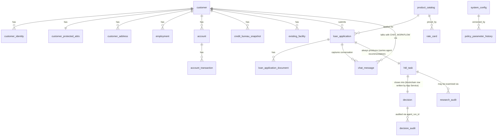

# Decisioning Engine PoC — Oracle AI Database Private Agent Factory + OPA + RAG

**Audience:** any retail bank evaluating Oracle AI Database 26ai + Private Agent Factory as the agentic platform for credit-application decisioning.
**Demo bank:** generic, region-agnostic. No country, currency, regulator, or bureau is hard-coded.
**New to the banking terms?** [`GLOSSARY.md`](GLOSSARY.md) has plain-English definitions for DTI, PTI, KYC, AML, fair lending, and the rest.

---

## Core Message

A small, opinionated **PoC** (proof of concept) showing that Oracle AI Database 26ai + **Private Agent Factory (PAF)** can run end-to-end credit decisioning with:

- **Observability over determinism** — every recommendation and every final decision is reproducible, auditable, replayable. **OPA** (Open Policy Agent) + business logic are kept as deterministic as possible, but the headline is "we can always explain why" not "we are always right".
- **Human-in-the-loop (HITL) on every application** — the AI never decides. Every application produces a HITL task; the human reviewer is always the decision-maker. Mandatory human review is the compliance posture by design, so the business stays in control of every credit decision the bank stands behind.
- **Three-tier recommendation with reasoning** — the agent's output is `APPROVE` / `REVIEW` / `DECLINE`, each carrying an **LLM** (large language model)-composed `reasoning` grounded in OPA outputs + cited policy chunks retrieved via **RAG** (retrieval-augmented generation). `REVIEW`-tier recommendations also carry `explore_hints` listing areas the reviewer should examine or follow-up data to request from the customer.
- **Two agents, one factory** — a customer-facing `CHAT_WORKFLOW` (narrow read scope, OCR + OPA + recommendation write) and a backoffice-only `RESEARCH_WORKFLOW` (broader read scope, read-only) demonstrate PAF's ability to host multiple agents with distinct tool scopes and security envelopes against the same Oracle AI Database.
- **Conversational continuity** — the customer chat is persisted server-side; every turn (customer message and agent reply) is stored, threaded by `roomId`, so the UI is stateless and the customer can refresh, switch devices, or come back hours later and pick up exactly where they left off. Status updates and the final outcome are delivered back through the same chat thread.
- **Configurability over hard-coding** — every threshold, weight, scale, and policy parameter is editable in the backoffice. The same code base supports any country/region by tuning configuration.
- **Tiny tweak → real product** — the PoC is built to demonstrate the path, not the production system. A bank can adopt the pattern and replace components incrementally.

---

## Design Decisions (Consolidated)

| #   | Decision                                                                                                                                                  | Why                                                                                                                                                                      |
| --- | --------------------------------------------------------------------------------------------------------------------------------------------------------- | ------------------------------------------------------------------------------------------------------------------------------------------------------------------------ |
| 1   | Bank-agnostic — no country / region / bureau / regulator hard-coded                                                                                       | Demo must be reusable across institutions in different jurisdictions                                                                                                     |
| 2   | Credit score, **DTI** (debt-to-income) / **PTI** (payment-to-income) caps, weights, currencies are runtime **configuration**, not literals in code        | Same demo, different parameters per audience                                                                                                                             |
| 3   | Generic data-protection framework (rights + restrictions common to most regimes)                                                                          | Avoids country-specific compliance claims; signals "we know there are obligations"                                                                                       |
| 4   | OPA chosen — used in banking, open-source, gives full control of policy code                                                                              | No comparison to commercial **BRMS** (Business Rule Management System); scope is intentionally limited                                                                   |
| 5   | **No auto-decision.** Every application produces a HITL task; the human is always the decision-maker.                                                     | Removes the failure mode where an AI quietly approves or declines without review.                                                                                        |
| 6   | **Three-tier recommendation** — `APPROVE` / `REVIEW` / `DECLINE`, with mandatory reasoning + (for `REVIEW`) explore-hints                                 | Gives the reviewer a starting position and an explanation, not a black-box verdict; routes attention to the cases that need it.                                          |
| 7   | Observability over determinism                                                                                                                            | Deterministic systems can still be wrong; the recoverable failure mode is a complete trail                                                                               |
| 8   | Append-only **bank decision** history on **Oracle Database Blockchain Table** — one row per decision, written by the App Service at HITL close            | Immutable, queryable, retention-friendly, no extra infra. The canonical record is the human's call, not the AI's recommendation.                                         |
| 9   | Region-agnostic deployment — any OCI region, also portable to ExaCC / on-prem 26ai                                                                        | No tenant / region constraint baked in                                                                                                                                   |
| 10  | Open-source **OCR** (optical character recognition: PaddleOCR / Tesseract) + **YOLO** (You-Only-Look-Once detector) for ID-card field detection           | Lightweight, no external SaaS, demonstrable on a laptop                                                                                                                  |
| 11  | OCR tiers feed the recommendation: USABLE → `APPROVE`-eligible signal; MARGINAL after re-upload → `REVIEW` signal; persistent UNUSABLE → `DECLINE` signal | Don't reject under the radar; don't saturate humans with garbage; OCR quality is one signal among many, never a unilateral verdict.                                      |
| 12  | Fair Lending Review = generalized non-discrimination backoffice process                                                                                   | Periodic disparate-impact sampling across configured protected attributes                                                                                                |
| 13  | Simplest possible pricing engine — rate card + risk-band adjustment, surfaced as **indicative pricing** inside the recommendation packet                  | A reviewer who is about to approve needs to see what rate will apply; an indicative band is enough at the PoC level.                                                     |
| 14  | Affordability stress = backoffice Risk Management Dashboard                                                                                               | Portfolio-level shock view, not per-application gating; consistent across banks                                                                                          |
| 15  | No counter-offer logic                                                                                                                                    | Out of scope                                                                                                                                                             |
| 16  | No effort budget / timeline in this doc                                                                                                                   | Not relevant; PoC is delivered when the demo is convincing                                                                                                               |
| 17  | Standalone stack — does not depend on, or align with, any concurrent engagement                                                                           | Clean architectural story; one stack, one demo                                                                                                                           |
| 18  | Customer UI = chat + document upload. Backoffice UI = traditional CRUD + queue + reports + **Case Research Agent** conversational panel                   | Two distinct surfaces, two distinct audiences; the backoffice gets an AI assistant that has broader read scope than the customer-facing agent                            |
| 19  | Test bench is for **functionality + observability**, not performance                                                                                      | Cover all recommendation tiers, all reviewer paths, and prove every step is observable                                                                                   |
| 20  | **Oracle Database TxEventQ** (Transactional Event Queue) for HITL claim and async/offline operations (OCR, retries, future fan-out)                       | Stays in-DB (same engine as Blockchain Tables + Vector); transactional dequeue prevents double-claim; built-in retries + exception queues; no Kafka/RabbitMQ to operate  |
| 21  | **Two agents in PAF** — `CHAT_WORKFLOW` (customer, narrow scope) and `RESEARCH_WORKFLOW` (backoffice-only, broader read scope, no side-effect tools)      | Demonstrates PAF's per-agent tool scoping and security envelope. The research agent reads more (audit trail, parameter history, deeper cases) but cannot write anything. |

---

## Goals

- Show Oracle AI Database 26ai as **the agentic platform** for credit decisioning: SQL + Vector + Rule engine + LLM + audit, in one place.
- Prove **end-to-end observability** of every decision — replayable from inputs to rationale.
- Demonstrate a **human-first** decisioning posture with a hard regulator-friendly override.
- Map every decision feature, function, dataset, and integration into a single coherent surface a bank can recognize and adopt.

---

## Demo Scenario — Personal Loan Origination

Generic retail bank. Customer applies for a personal loan via a chat UI, uploads supporting documents, and is told _"we're reviewing your application"_. Every application produces a HITL task in the backoffice carrying the agent's **recommendation** — one of:

- **APPROVE** — high confidence, no inconsistencies. Reviewer typically confirms; if so, the customer gets the priced offer.
- **REVIEW** — minor flags. Reviewer reads the evidence, optionally talks to the **Case Research Agent** for similar cases / parameter history, and may ask the customer for more information before deciding.
- **DECLINE** — inconsistencies, missing data, compliance hits. Reviewer typically confirms reject.

The agent's recommendation always carries `reasoning` grounded in OPA outputs + cited policy chunks; `REVIEW` recommendations additionally carry `explore_hints` — short suggestions on what the reviewer should examine or what to ask the customer. The **final decision** is always the reviewer's, written to the `decision` Blockchain Table when the HITL task closes — one row per bank decision.

---

## Architecture

### Flow

The customer chat is driven by `CHAT_WORKFLOW`: it asks for what _this_ applicant needs (different for salaried vs. self-employed, resident vs. expat, small vs. large loan) and only emits its recommendation once everything is in place. Every flow ends with a HITL task; the human is always the decision-maker.

1. Customer opens chat UI, says what they want (product, amount, purpose, term). `CHAT_WORKFLOW` asks structured follow-ups (employment type, residency status, salary band, existing facilities) to build a partial applicant profile.
2. **Agent calls OPA `required_documents(applicant_so_far, product)`** → returns the required doc set keyed by `(product_type, employment_type, residency_status, amount_band)`. The matrix lives in `system_config.document_requirements_matrix`; Select AI RAG can retrieve policy snippets to explain _why_ each document is needed.
3. Agent presents the list in chat and requests uploads. Each upload → Application Service writes a `loan_application_document` row, uploads the file to Object Storage, enqueues `OCR_REQUEST` (TxEventQ).
4. **OCR + Document Detection** worker dequeues from `OCR_REQUEST` (open-source: YOLO + PaddleOCR/Tesseract), **classifies** the document (`doc_type` ∈ `ID` / `PAYSLIP` / `STATEMENT` / `TAX_RETURN` / `ADDRESS_PROOF` / `OTHER`), extracts per-field values, and writes back `doc_type`, `ocr_payload`, `ocr_confidence`, `quality_tier`. Failures retry up to `max_retries`; poison messages land in `OCR_EXCEPTION_Q` for triage.
5. Agent verifies completeness via `check_document_completeness`: every required `doc_type` has at least one USABLE document with required fields extracted. Missing / MARGINAL / UNUSABLE / mismatched (statement uploaded when ID requested → classifier catches it) → agent re-asks. Persistent UNUSABLE feeds into the recommendation as a `DECLINE` signal; persistent MARGINAL feeds in as a `REVIEW` signal. The agent never silently terminates the application.
6. Agent completes its turn by orchestrating the remaining tools:
   - SQL (Select AI over `chat_profile`) → customer profile, transactions summary, credit bureau, existing facilities.
   - **Company Registry HTTP datasource** (`verify_employer`) — one call with the customer's declared employer name (or, for self-employed applicants, their own company). Returns `{registered, trading_status, sector, registered_address, last_filed_year}`. `not_registered` or `dormant` becomes a `REVIEW` signal with an explore-hint; an `active` confirmed employer contributes positively to the tiering score.
   - OPA **MCP** (Model Context Protocol) tools → eligibility, **AML** (anti-money laundering), **KYC** (Know Your Customer), fair-lending pre-flight. Each `allow` / `deny` / `warn` becomes evidence, not a gate.
   - Vector Search → policy citations, similar cases.
   - Pricing tool → rate card lookup + risk-band adjustment, surfaced as **indicative pricing** in the recommendation packet (used only if the reviewer ultimately approves).
7. Composite **recommendation tiering** computed from configurable weights (OCR quality + data completeness + employer-verification result + OPA outputs + policy proximity) → `APPROVE` / `REVIEW` / `DECLINE`.
8. Agent composes the **recommendation packet**: `tier`, `reasoning` (LLM-composed, grounded in OPA outputs and cited policy chunks), `explore_hints` (populated for `REVIEW` only), and `evidence` (RAG citations, OPA outputs, OCR summary, employer-verification response, computed DTI/PTI/score, indicative pricing).
9. In-DB tool `create_hitl_task` writes a `hitl_task` row carrying the recommendation packet and enqueues `HITL_REQUEST` (TxEventQ) in the same transaction. `decision_audit` captures every tool call from the agent's run.
10. The Application Service appends a status message _"we're reviewing your application"_ to the customer's `chat_message` thread (the same `roomId`). The customer never sees the recommendation tier. Every customer turn and agent reply throughout the conversation is persisted as a `chat_message` row keyed by `roomId` + `customer_id` + `application_id`, so the chat UI can refresh, the customer can switch devices, and the conversation is replayed exactly as left.
11. Backoffice reviewer `deqone`s to atomically claim a task (queue dequeue + `hitl_task` state transition OPEN → IN_REVIEW commit together); the bell on the backoffice UI shows the role-filtered pending count. Reviewer reads the recommendation + reasoning + evidence, may invoke `RESEARCH_WORKFLOW` from the task detail panel (broader read scope, read-only) to dig deeper.
12. Reviewer submits the final decision (`APPROVE` / `REJECT`) and a note. Application Service writes one row to `decision` (Blockchain Table) carrying both the human's outcome and the original agent recommendation packet, closes the `hitl_task`, and appends the customer-facing outcome (priced offer if approved, reason codes if rejected) to the customer's `chat_message` thread. The next time the customer opens the chat, the outcome is the latest message in the same conversation.

### Component Map

| Component           | Tech                                                                                   | Role                                                                                                                                |
| ------------------- | -------------------------------------------------------------------------------------- | ----------------------------------------------------------------------------------------------------------------------------------- |
| Customer Chat UI    | Angular                                                                                | Chat-style request flow + document upload                                                                                           |
| Backoffice UI       | Angular                                                                                | CRUD, HITL queue, rule view, reports, dashboards, parameter management, **Case Research Agent** conversational panel                |
| Application Service | Spring Boot (Java)                                                                     | App CRUD, document upload, agent invocation (both `CHAT_WORKFLOW` and `RESEARCH_WORKFLOW`), Blockchain write at HITL close          |
| Object Storage      | OCI Object Storage                                                                     | Uploaded document PDFs / images                                                                                                     |
| OCR + Detection     | YOLO (field detection) + PaddleOCR/Tesseract                                           | Open-source extraction; composite confidence tiering                                                                                |
| Company Registry    | FastAPI (Python) — OpenAPI 3.1                                                         | Synthetic employer / company registry; one lookup per application; PAF HTTP datasource for `CHAT_WORKFLOW`                          |
| `CHAT_WORKFLOW`     | Oracle Private Agent Factory — Agent Builder flow                                      | Customer-facing chat agent; tools = OPA MCP, OCR MCP, Select AI over customer-safe views, Company Registry HTTP, `create_hitl_task` |
| `RESEARCH_WORKFLOW` | Oracle Private Agent Factory — Agent Builder flow                                      | Backoffice-only research agent; tools = Select AI over the broader read-only view set, RAG; **no side-effect tools**                |
| Data plane          | Oracle AI Database 26ai                                                                | All banking data; per-agent NL2SQL view scopes enforced via Select AI profiles                                                      |
| Vector store        | Oracle AI Vector Search (same 26ai)                                                    | `policy_corpus` + `case_history` embeddings                                                                                         |
| LLM + embeddings    | Ollama (Llama 3.3 70B + bge-m3) — see [`DESIGN.md §11`](DESIGN.md#11-locked-decisions) | Reasoning + rationale + embeddings                                                                                                  |
| Rule engine         | OPA + OPA MCP server (Python FastMCP wrapper)                                          | Eligibility, AML, KYC, escalation, fair-lending — inputs to the recommendation, not the decision                                    |
| Decision history    | Oracle Database Blockchain Table                                                       | One row per bank decision, written by the App Service at HITL close                                                                 |
| Async messaging     | Oracle Database **TxEventQ** (in-DB AQ; JSON payload)                                  | HITL claim, OCR async pipeline, future fan-out — all in the same engine                                                             |
| HITL surface        | Backoffice UI (queue + decision form + notification bell + Case Research panel)        | Bank employee picks up, reviews evidence, chats with the research agent, decides                                                    |

---

## Data Model — Synthetic but Realistic

The synthetic dataset is generated to **trigger every decision path** rather than to validate a model. It is intentionally constructed so test-bench scenarios exercise the system end-to-end.

### Entities

| Table                       | Purpose                                                                                                                                                                                                                                                                                                                                 |
| --------------------------- | --------------------------------------------------------------------------------------------------------------------------------------------------------------------------------------------------------------------------------------------------------------------------------------------------------------------------------------- |
| `customer`                  | Customer master                                                                                                                                                                                                                                                                                                                         |
| `customer_address`          | Current + historical addresses                                                                                                                                                                                                                                                                                                          |
| `customer_identity`         | ID / passport docs with expiry                                                                                                                                                                                                                                                                                                          |
| `customer_protected_attrs`  | Protected attributes for fair-lending review (configurable per region)                                                                                                                                                                                                                                                                  |
| `employment`                | Employers, salary, tenure                                                                                                                                                                                                                                                                                                               |
| `account`                   | Customer accounts (current, savings)                                                                                                                                                                                                                                                                                                    |
| `account_transaction`       | Transaction history (12 months) — cashflow source                                                                                                                                                                                                                                                                                       |
| `credit_bureau_snapshot`    | Periodic external score + bureau facilities; **scale parameterized**                                                                                                                                                                                                                                                                    |
| `existing_facility`         | Loans/cards held elsewhere                                                                                                                                                                                                                                                                                                              |
| `product_catalog`           | Loan/card/mortgage products + amount/term ranges                                                                                                                                                                                                                                                                                        |
| `rate_card`                 | Pricing per product + risk band                                                                                                                                                                                                                                                                                                         |
| `loan_application`          | The application being decisioned                                                                                                                                                                                                                                                                                                        |
| `loan_application_document` | Uploaded docs + classifier `doc_type` + OCR-extracted JSON + quality tier                                                                                                                                                                                                                                                               |
| `decision` _(blockchain)_   | Append-only **bank-decision** history: one row per decision, written by the App Service on HITL close. Carries the human's outcome **and** the original agent recommendation packet.                                                                                                                                                    |
| `decision_audit`            | Step-by-step `CHAT_WORKFLOW` tool-call trail (inputs, outputs, durations)                                                                                                                                                                                                                                                               |
| `research_audit`            | Step-by-step `RESEARCH_WORKFLOW` tool-call trail (separate so research conversations don't pollute decisioning trail)                                                                                                                                                                                                                   |
| `hitl_task`                 | HITL queue entry, state, assignment, **and** the agent recommendation packet (tier, reasoning, explore hints, evidence)                                                                                                                                                                                                                 |
| `chat_message`              | Persisted customer ↔ `CHAT_WORKFLOW` conversation, keyed by `roomId` + `customer_id` + `application_id`; carries each turn (sender, body, timestamp) so the chat UI can refresh or switch devices and replay the conversation. Also receives status updates and the final outcome appended by the Application Service after HITL close. |
| `policy_corpus`             | Policy chunks + embeddings (for RAG)                                                                                                                                                                                                                                                                                                    |
| `case_history`              | Past anonymized decisions for similarity retrieval                                                                                                                                                                                                                                                                                      |
| `sanctions_list`            | Synthetic sanctions / **PEP** (Politically Exposed Person) list                                                                                                                                                                                                                                                                         |
| `system_config`             | Tunable parameters (caps, thresholds, **recommendation-tier weights**, **`document_requirements_matrix`**, etc.)                                                                                                                                                                                                                        |
| `policy_parameter_history`  | Versioned changes to `system_config` (who changed what, when, why)                                                                                                                                                                                                                                                                      |
| `fair_lending_review`       | Periodic disparate-impact sampling + bank reviewer notes                                                                                                                                                                                                                                                                                |

### Schema sketch (key tables)

```sql
CREATE TABLE customer (
  customer_id     NUMBER PRIMARY KEY,
  full_name       VARCHAR2(200),
  date_of_birth   DATE,
  residency       VARCHAR2(64),
  email           VARCHAR2(200),
  phone           VARCHAR2(40),
  kyc_status      VARCHAR2(20) CHECK (kyc_status IN ('PENDING','PASSED','FAILED')),
  kyc_updated_at  TIMESTAMP,
  created_at      TIMESTAMP
);

CREATE TABLE customer_protected_attrs (
  customer_id  NUMBER PRIMARY KEY REFERENCES customer,
  attrs        JSON   -- configurable per region: {"age_band":"30-39","gender":"F",...}
);

CREATE TABLE credit_bureau_snapshot (
  snapshot_id            NUMBER PRIMARY KEY,
  customer_id            NUMBER REFERENCES customer,
  snapshot_date          DATE,
  score                  NUMBER,
  score_scale_min        NUMBER,        -- parameterized
  score_scale_max        NUMBER,        -- parameterized
  bureau_name            VARCHAR2(80),  -- free text, no hard-coded bureau
  total_debt             NUMBER(14,2),
  num_open_facilities    NUMBER,
  num_late_payments_12m  NUMBER
);

CREATE TABLE product_catalog (
  product_id        NUMBER PRIMARY KEY,
  name              VARCHAR2(200),
  product_type      VARCHAR2(20),
  pricing_model     VARCHAR2(20),       -- INTEREST / FEE / PROFIT_SHARE (generic)
  min_amount        NUMBER(14,2),
  max_amount        NUMBER(14,2),
  min_term_months   NUMBER,
  max_term_months   NUMBER,
  currency          VARCHAR2(3)         -- generic ISO code; not hard-coded
);

CREATE TABLE rate_card (
  rate_card_id     NUMBER PRIMARY KEY,
  product_id       NUMBER REFERENCES product_catalog,
  risk_band        VARCHAR2(20),        -- LOW / MID / HIGH (configurable bands)
  rate_value       NUMBER(7,4),         -- meaning interpreted by pricing_model
  effective_from   DATE,
  effective_to     DATE
);

CREATE TABLE loan_application (
  application_id    NUMBER PRIMARY KEY,
  customer_id       NUMBER REFERENCES customer,
  product_id        NUMBER REFERENCES product_catalog,
  amount_requested  NUMBER(14,2),
  term_months       NUMBER,
  purpose           VARCHAR2(200),
  channel           VARCHAR2(20),
  status            VARCHAR2(20),
  submitted_at      TIMESTAMP,
  decided_at        TIMESTAMP
);

CREATE TABLE loan_application_document (
  doc_id          NUMBER PRIMARY KEY,
  application_id  NUMBER REFERENCES loan_application,
  doc_type        VARCHAR2(40),       -- ID / PAYSLIP / STATEMENT / TAX_RETURN / ADDRESS_PROOF / OTHER (set by the OCR classifier, not by the customer)
  requested_type  VARCHAR2(40),       -- what the agent asked the customer to upload (so mismatches are auditable)
  storage_uri     VARCHAR2(500),
  uploaded_at     TIMESTAMP,
  ocr_status      VARCHAR2(20),
  ocr_payload     JSON,
  ocr_confidence  NUMBER(5,4),
  quality_tier    VARCHAR2(20)        -- USABLE / MARGINAL / UNUSABLE
);

-- Persisted customer ↔ CHAT_WORKFLOW conversation. The chat UI is stateless: on refresh,
-- login, or device switch, it loads the message history from the Application Service
-- and replays the conversation as the customer left it. Status updates and the final
-- outcome are appended here by the Application Service after HITL close.
CREATE TABLE chat_message (
  message_id      NUMBER PRIMARY KEY,
  room_id         VARCHAR2(60),       -- threads a conversation across turns; aligns with PAF's roomId
  customer_id     NUMBER REFERENCES customer,
  application_id  NUMBER REFERENCES loan_application,
  sender          VARCHAR2(20),       -- CUSTOMER / AGENT / SYSTEM (status updates, final outcome)
  body            CLOB,
  attachments     JSON,               -- optional: { doc_ids: [...], doc_types: [...] }
  agent_run_id    VARCHAR2(60),       -- when sender = AGENT, links to decision_audit
  created_at      TIMESTAMP
);

-- Append-only bank-decision history (Oracle Blockchain Table).
-- One row per decision, written by the Application Service when the HITL task closes.
-- The agent never writes this table.
CREATE BLOCKCHAIN TABLE decision (
  decision_id            NUMBER,
  application_id         NUMBER,
  -- Human's final decision
  human_outcome          VARCHAR2(20),    -- APPROVE / REJECT
  human_user             VARCHAR2(120),
  human_note             CLOB,
  decided_at             TIMESTAMP,
  -- Agent's original recommendation packet (frozen at HITL-task creation, copied here on close)
  agent_recommendation   VARCHAR2(20),    -- APPROVE / REVIEW / DECLINE
  agent_reasoning        CLOB,            -- LLM-composed, grounded in OPA + cited policy
  agent_explore_hints    JSON,            -- non-null only if agent_recommendation = REVIEW
  agent_evidence         JSON,            -- OPA outputs, RAG citations, OCR summary, computed DTI/PTI/score, indicative pricing
  agent_run_id           VARCHAR2(60),
  -- Outcome economics
  pricing_offer          JSON,            -- {rate, term, amount, expiry} — populated when human_outcome = APPROVE
  reason_codes           JSON,            -- enumerated codes for customer disclosure
  computed_dti           NUMBER(5,2),
  computed_pti           NUMBER(5,2)
) NO DROP UNTIL 7 YEARS IDLE
  NO DELETE LOCKED
  HASHING USING "SHA2_512" VERSION "v1";

CREATE TABLE decision_audit (
  audit_id      NUMBER PRIMARY KEY,
  agent_run_id  VARCHAR2(60),    -- CHAT_WORKFLOW runs only
  step_no       NUMBER,
  tool_name     VARCHAR2(80),
  tool_input    JSON,
  tool_output   JSON,
  started_at    TIMESTAMP,
  ended_at      TIMESTAMP,
  duration_ms   NUMBER,
  status        VARCHAR2(20)
);

CREATE TABLE research_audit (
  audit_id      NUMBER PRIMARY KEY,
  research_run_id VARCHAR2(60),  -- RESEARCH_WORKFLOW runs only
  hitl_task_id  NUMBER,          -- task the reviewer was looking at (for traceability)
  reviewer      VARCHAR2(120),
  step_no       NUMBER,
  tool_name     VARCHAR2(80),
  tool_input    JSON,
  tool_output   JSON,
  started_at    TIMESTAMP,
  ended_at      TIMESTAMP,
  duration_ms   NUMBER,
  status        VARCHAR2(20)
);

CREATE TABLE hitl_task (
  task_id                  NUMBER PRIMARY KEY,
  application_id           NUMBER REFERENCES loan_application,
  assigned_to              VARCHAR2(120),
  state                    VARCHAR2(20),    -- OPEN / IN_REVIEW / CLOSED / EXPIRED
  -- Agent recommendation packet (written at create time by create_hitl_task)
  agent_recommendation     VARCHAR2(20),    -- APPROVE / REVIEW / DECLINE
  agent_reasoning          CLOB,
  agent_explore_hints      JSON,            -- non-null only when agent_recommendation = REVIEW
  agent_evidence           JSON,
  agent_run_id             VARCHAR2(60),    -- joins decision_audit
  -- Reviewer's close-out (populated on state = CLOSED)
  human_outcome            VARCHAR2(20),    -- APPROVE / REJECT
  human_note               CLOB,
  human_user               VARCHAR2(120),
  created_at               TIMESTAMP,
  closed_at                TIMESTAMP
);

CREATE TABLE policy_corpus (
  chunk_id     NUMBER PRIMARY KEY,
  source_doc   VARCHAR2(300),
  section_ref  VARCHAR2(60),
  text         CLOB,
  embedding    VECTOR(1024, FLOAT32)
);

CREATE TABLE case_history (
  case_id         NUMBER PRIMARY KEY,
  amount          NUMBER(14,2),
  term_months     NUMBER,
  dti             NUMBER(5,2),
  pti             NUMBER(5,2),
  credit_score    NUMBER,
  outcome         VARCHAR2(20),
  outcome_reason  CLOB,
  case_embedding  VECTOR(1024, FLOAT32)
);

CREATE TABLE system_config (
  config_key    VARCHAR2(80) PRIMARY KEY,
  config_value  VARCHAR2(400),
  value_type    VARCHAR2(20),       -- NUMBER / STRING / BOOLEAN / JSON
  description   VARCHAR2(400),
  updated_at    TIMESTAMP,
  updated_by    VARCHAR2(120)
);

CREATE TABLE policy_parameter_history (
  hist_id       NUMBER PRIMARY KEY,
  config_key    VARCHAR2(80),
  old_value     VARCHAR2(400),
  new_value     VARCHAR2(400),
  changed_at    TIMESTAMP,
  changed_by    VARCHAR2(120),
  change_reason VARCHAR2(400)
);

CREATE TABLE fair_lending_review (
  review_id           NUMBER PRIMARY KEY,
  period_from         DATE,
  period_to           DATE,
  bucketing           JSON,            -- {"age_band":[...], "gender":[...],...}
  disparate_impact    JSON,            -- per-bucket approval rate vs reference
  flagged_decisions   JSON,            -- decision_ids over threshold
  reviewer            VARCHAR2(120),
  conclusion          CLOB,
  reviewed_at         TIMESTAMP
);
```

### Relationships (cardinality)



### Synthetic dataset — built to exercise paths, not to mimic a real bank

Volumes calibrated to the test bench, not statistical realism:

- ~2,000 customers spanning configurable risk bands.
- 1–3 accounts per customer; ~12 months of transaction history; salary credits + recurring outflows + variability.
- ~1,000 loan applications mapped 1:1 to test-bench scenarios (see below).
- ~50 ID/payslip/statement/address-proof PDF templates at three quality tiers (clean, marginal, unusable).
- ~150 policy chunks (generic lending policy, generic AML guidance, generic fair-lending guidance).
- ~500 case-history rows for similarity retrieval.
- ~50 synthetic sanctions / PEP entries.

**No circular logic** — risk-band labels are used to generate plausible features (income, score, NSF count, document quality), then _forgotten_. The agent operates only on observable features, not on the label. This way the demo path is engineered, but the agent does real work given the inputs.

---

## OPA — Rule Engine

### Why OPA (one paragraph, no comparison)

OPA is used in production banking, is open-source, and gives full control over policy code. Within the limited scope of this PoC, that is enough. Production institutions can re-evaluate against any BRMS later — OPA is exposed through MCP, so the agent contract doesn't change if the engine is swapped.

### Policy packages

```
packages/
├── eligibility.rego         # age, residency, income, DTI, PTI, score floor (all parameterized) — produces deny/warn signals
├── aml.rego                 # sanctions / PEP / suspicious pattern flags
├── kyc.rego                 # ID validity, doc expiry, quality-tier gates
├── required_documents.rego  # required doc set per (product_type, employment_type, residency, amount_band)
├── product.rego             # product-specific amount/term caps
├── fair_lending.rego        # disparate-impact pre-flight on a single decision
└── pricing.rego             # risk-band mapping for rate-card lookup
```

OPA outputs are **inputs to the recommendation tier**. A `deny[]` from `eligibility.rego` is a strong signal toward `DECLINE` on the recommendation packet; the agent writes a HITL task and the reviewer makes the final call.

### Example — `eligibility.rego` (parameterized)

```rego
package decisioning.eligibility

import future.keywords.in

# Parameters arrive as data.config — sourced from system_config + policy_parameter_history.
# Outputs (allow / deny / warn / caution) feed CHAT_WORKFLOW's recommendation tier;
# they never directly approve or reject an application.

default allow := false

deny[msg] {
  input.applicant.age < data.config.min_age
  msg := sprintf("Applicant under minimum age (%v)", [data.config.min_age])
}

deny[msg] {
  input.applicant.dti > data.config.dti_hard_cap
  msg := sprintf("DTI %.2f exceeds cap %.2f", [input.applicant.dti, data.config.dti_hard_cap])
}

deny[msg] {
  input.applicant.pti > data.config.pti_hard_cap
  msg := sprintf("PTI %.2f exceeds cap %.2f", [input.applicant.pti, data.config.pti_hard_cap])
}

deny[msg] {
  input.applicant.credit_score < data.config.score_floor
  msg := sprintf("Credit score below configured floor (%v)", [data.config.score_floor])
}

warn[msg] {
  input.applicant.credit_score >= data.config.score_floor
  input.applicant.credit_score < data.config.score_caution_band_upper
  msg := "Credit score in caution band: reviewer attention recommended"
}

allow {
  not deny[_]
  not warn[_]
}
```

`data.config` is loaded from `system_config` at OPA startup (or via OPA bundle refresh). Backoffice edits to `system_config` write a row to `policy_parameter_history` and trigger an OPA bundle reload.

### OPA via MCP

- **OPA MCP server** wraps OPA's `/v1/data/...` HTTP endpoints as typed MCP tools, wired to `CHAT_WORKFLOW` only.
- Tools exposed to the agent:
  - `required_documents(applicant_so_far, product)` → `{ required: [doc_type, ...], rationale }` — looked up against `system_config.document_requirements_matrix` keyed by `(product_type, employment_type, residency_status, amount_band)`
  - `evaluate_eligibility(applicant, application, product)` → `{ allow, deny[], warn[] }`
  - `evaluate_aml(customer, application)` → `{ allow, deny[] }`
  - `evaluate_kyc(documents, quality_tiers)` → `{ allow, deny[] }`
  - `evaluate_fair_lending_flags(customer_attrs, decision_draft)` → `{ flag, reason }`
  - `lookup_pricing(applicant, application)` → `{ risk_band, rate_value, fee_schedule }` — indicative pricing for the recommendation packet
  - `list_policy_versions()` → version metadata for audit

All these tools return signals that the agent composes into the recommendation packet — none of them gate the application directly.

---

## RAG

### Corpus

- **`policy_corpus`** — generic lending policy, generic AML guidance, generic fair-lending policy, product policy. Region-neutral phrasing.
- **`case_history`** — anonymized past decisions for similarity retrieval.

### Embedding model

Ollama-served embeddings (`bge-m3` at 1024 dimensions) — locked at deploy time; see [`DESIGN.md §11`](DESIGN.md#11-locked-decisions). Any change requires re-ingestion of `policy_corpus` and `case_history`.

### Retrieval

- **Policy retrieval** — `search_policy(reasons)` → top-N policy chunks → cited in the recommendation reasoning. Available to both `CHAT_WORKFLOW` and `RESEARCH_WORKFLOW`.
- **Case retrieval** — `search_similar_cases(applicant_features)` → top-N similar past cases. `CHAT_WORKFLOW` uses this to anchor the reasoning; `RESEARCH_WORKFLOW` uses it at higher `k` and with deeper filters (date range, outcome, reviewer, similarity threshold) to support reviewer interrogation.
- **Hybrid retrieval** — vector + SQL filter (e.g., `product_type = 'PERSONAL_LOAN'`) for precision.

### What RAG is NOT used for

Not for the decision itself — that's the human reviewer's call, informed by OPA outputs + recommendation packet. RAG grounds the agent reasoning text and powers `RESEARCH_WORKFLOW`'s answers when a reviewer asks _"what does the lending policy say about X?"_ or _"show me how we decided similar cases last year"_.

---

## OCR + Document Quality Tiering

### Pipeline

1. **Document classification** — a lightweight classifier head returns the actual `doc_type` (`ID` / `PAYSLIP` / `STATEMENT` / `TAX_RETURN` / `ADDRESS_PROOF` / `OTHER`) so the agent can detect mismatches (customer uploaded a statement when an ID was asked for).
2. **YOLO** — detects regions on the uploaded image / PDF specific to the classified `doc_type` (ID front / back / MRZ / photo area for IDs; payslip header + line items for payslips; statement table for statements; etc.). Open-source weights, fine-tuned on a small synthetic set of mock documents.
3. **OCR engine** — open-source (PaddleOCR or Tesseract — pick whichever localizes better for the demo). Extracts text from each detected region.
4. **Per-field confidence** — composite from classifier score + YOLO detection score + OCR per-character confidence + structural sanity checks (date parses, ID format matches the expected pattern, MRZ checksum where applicable).
5. **Document quality tier** — composite:
   - `USABLE` — every required field detected with per-field confidence ≥ configured threshold, and the classified `doc_type` matches what was requested.
   - `MARGINAL` — one or more fields below threshold but image is human-readable.
   - `UNUSABLE` — image too dark / blurred / cropped / not a recognisable document.

### Behavior by tier

| Tier       | System behavior                                                                                                                                                                                                                  |
| ---------- | -------------------------------------------------------------------------------------------------------------------------------------------------------------------------------------------------------------------------------- |
| USABLE     | Counts toward completeness; the agent moves on once every required `doc_type` is covered.                                                                                                                                        |
| MARGINAL   | Agent asks the customer to re-upload (cite the field that failed). If the re-upload is still MARGINAL → feeds in as a `REVIEW` signal on the recommendation packet, with the original + OCR output + confidence map as evidence. |
| UNUSABLE   | Agent asks the customer to re-upload with a clear reason ("please re-upload — image was not readable"). Persistent UNUSABLE after a re-upload → strong `DECLINE` signal on the recommendation packet.                            |
| MISMATCHED | Classified `doc_type` differs from the requested one — agent re-asks for the correct document type; persistent mismatch behaves like persistent UNUSABLE.                                                                        |

Thresholds (`USABLE_min_confidence`, `MARGINAL_floor`) are in `system_config` and editable from the backoffice.

---

## `CHAT_WORKFLOW` — customer-facing Private Agent Factory flow

### Tools

| Tool                          | Type                      | Bound to                                                                | Purpose                                                                                                         |
| ----------------------------- | ------------------------- | ----------------------------------------------------------------------- | --------------------------------------------------------------------------------------------------------------- |
| `query_customer_profile`      | SQL (Select AI / NL2SQL)  | Customer-safe view over `customer` + `employment` + `existing_facility` | Pull profile, compute DTI / PTI                                                                                 |
| `query_transaction_summary`   | SQL (Select AI)           | Aggregated view over `account_transaction`                              | Cashflow aggregates (not row-level history)                                                                     |
| `query_credit_bureau`         | SQL                       | `credit_bureau_snapshot`                                                | Latest snapshot per customer                                                                                    |
| `search_policy`               | Vector Search             | `policy_corpus`                                                         | RAG over policy text                                                                                            |
| `search_similar_cases`        | Vector Search             | `case_history`                                                          | Similarity over past decisions (small `k`; deeper retrieval is `RESEARCH_WORKFLOW`'s job)                       |
| `required_documents`          | MCP                       | OPA MCP server (`required_documents.rego`)                              | Returns required `doc_type` set for this applicant                                                              |
| `check_document_completeness` | Function tool             | `loan_application_document` + required set                              | Returns missing / MARGINAL / UNUSABLE / mismatched docs so the agent can re-ask the customer                    |
| `extract_document`            | Function tool             | OCR + YOLO pipeline (via `OCR_REQUEST` queue)                           | Classify `doc_type` + extract fields + per-field confidence + quality tier                                      |
| `evaluate_eligibility`        | MCP                       | OPA MCP server                                                          | Eligibility signals (allow/deny/warn) for the recommendation                                                    |
| `evaluate_aml`                | MCP                       | OPA MCP server                                                          | AML signals                                                                                                     |
| `evaluate_kyc`                | MCP                       | OPA MCP server                                                          | KYC + doc validity + quality signals                                                                            |
| `evaluate_fair_lending_flags` | MCP                       | OPA MCP server                                                          | Pre-flight fairness flag                                                                                        |
| `lookup_pricing`              | SQL + OPA                 | `rate_card` + OPA pricing                                               | Indicative pricing for the recommendation packet                                                                |
| `verify_employer`             | HTTP datasource (OpenAPI) | Company Registry FastAPI service (`src/api/registry/`)                  | Lookup employer / company by name → `{registered, trading_status, sector, registered_address, last_filed_year}` |
| `create_hitl_task`            | In-DB SQL tool            | `hitl_task` + `HITL_REQUEST` (TxEventQ)                                 | Write the recommendation packet + enqueue HITL request (single transaction)                                     |

`CHAT_WORKFLOW` has **no** `record_decision` tool — only the Application Service writes to the `decision` Blockchain Table, on HITL close.

### `RESEARCH_WORKFLOW` — backoffice-only research flow

| Tool                        | Type                     | Bound to                                         | Purpose                                                                         |
| --------------------------- | ------------------------ | ------------------------------------------------ | ------------------------------------------------------------------------------- |
| `query_full_transactions`   | SQL (Select AI / NL2SQL) | Full `account_transaction` view (not aggregated) | Row-level transaction analysis (NSF patterns, salary stability, large outflows) |
| `query_decision_audit`      | SQL (Select AI)          | `decision_audit` + `research_audit`              | Show prior `CHAT_WORKFLOW` tool-call traces for similar applications            |
| `query_parameter_history`   | SQL                      | `policy_parameter_history`                       | "When did `dti_hard_cap` change and to what?"                                   |
| `query_decision_history`    | SQL (Select AI)          | `decision` view (Blockchain, read-only)          | Outcome distribution over time, by reviewer, by recommendation tier             |
| `search_policy`             | Vector Search            | `policy_corpus`                                  | Same RAG as `CHAT_WORKFLOW`                                                     |
| `search_similar_cases_deep` | Vector Search            | `case_history` + `decision`                      | Deeper similarity at higher `k`, with filters (date range, outcome, reviewer)   |

`RESEARCH_WORKFLOW` is read-only by design: it has no write or enqueue tools at all. Enforced by `AGENT_TOOLS` grants and by which MCP servers are wired to which flow.

### `CHAT_WORKFLOW` instructions (sketch)

```
You are CHAT_WORKFLOW for retail loan applications. You drive the chat, collect the
documents this applicant actually needs, gather evidence, and emit one recommendation
packet to the HITL queue. You DO NOT decide.

HARD RULES:
- You never approve or reject. Your only side-effect is create_hitl_task, which writes
  exactly one recommendation packet per application.
- Drive the conversation: ask the customer for product, amount, purpose, employment
  type, residency status, salary band, existing facilities. Then call required_documents
  and ask the customer for exactly those documents — do not ask for a fixed bundle.
- Do not proceed to recommendation until check_document_completeness is satisfied:
  Missing / MARGINAL / UNUSABLE / mismatched doc_type → re-ask the customer (cite the
  policy snippet from search_policy if it helps explain). Persistent UNUSABLE after
  re-upload feeds in as a DECLINE signal; persistent MARGINAL feeds in as a REVIEW
  signal. Never silently terminate the application — always emit a recommendation.
- Always call evaluate_kyc, evaluate_aml, evaluate_eligibility, evaluate_fair_lending_flags.
  Their allow/deny/warn outputs are EVIDENCE, not gates. Do not short-circuit on deny.
- Always call lookup_pricing for the indicative offer (used only if the human approves).
- Always call search_policy on the signals you observed; never invent citations.
- Compose the recommendation packet:
    tier            ∈ {APPROVE, REVIEW, DECLINE}
                       APPROVE  = high confidence, no inconsistencies
                       REVIEW   = minor flags, needs human attention
                       DECLINE  = inconsistencies, missing data, compliance hits
    reasoning       = LLM-composed text grounded in OPA outputs + cited policy chunks,
                      explaining with data WHY this tier was chosen
    explore_hints   = (REVIEW only) short list of areas the reviewer should examine or
                      follow-up data to request from the customer
    evidence        = OPA outputs, RAG citations, OCR summary, computed DTI/PTI/score,
                      indicative pricing
- Call create_hitl_task with the recommendation packet. This is the end of your turn.
- Surface to the customer only: "we're reviewing your application". Never reveal the
  tier.

WORKFLOW:
1. Greet, gather product + amount + purpose + employment type + residency + salary band.
2. Call required_documents(applicant_so_far, product). Present the list in chat.
3. As the customer uploads, wait for OCR (async via OCR_REQUEST queue) and call
   check_document_completeness. If incomplete → ask for what is missing/marginal/wrong;
   loop until complete OR a doc is persistently UNUSABLE/MARGINAL.
4. Read system_config thresholds + tier weights.
5. Pull customer profile, transactions summary, credit bureau via SQL tools.
6. Compute applicant payload (age, DTI, PTI, score, employment tenure).
7. Call OPA: evaluate_kyc → evaluate_aml → evaluate_eligibility → evaluate_fair_lending_flags.
8. Call lookup_pricing for the indicative offer.
9. Call search_policy on observed signals; search_similar_cases at small k.
10. Compute recommendation tier from the configured weights.
11. Compose reasoning + (if REVIEW) explore_hints.
12. Call create_hitl_task(packet).
```

### `RESEARCH_WORKFLOW` instructions (sketch)

```
You are the Case Research Agent. A backoffice reviewer is examining a HITL task.
Your job is to help them dig deeper. You DO NOT decide and you DO NOT write anything.

HARD RULES:
- You have NO side-effect tools. You cannot create HITL tasks, cannot write to
  decision, cannot enqueue anything. If asked to "approve" or "reject" anything,
  decline and remind the reviewer that they are the decision-maker.
- Cite the data you use: name the SQL view, the row count, the case_id, the
  policy chunk reference. Reviewers will fact-check your answers.
- Stay within the broader read-only scope: full transactions, decision_audit,
  policy_parameter_history, decision history (Blockchain, read), case_history,
  policy_corpus. Do not speculate beyond what these tools return.
- When asked open-ended questions ("show me similar cases", "what does our policy
  say about X"), use the appropriate retrieval tool and present results compactly.
```

### Per-application `CHAT_WORKFLOW` tool-call sequence

```
-- Phase A: profile + document collection (multiple chat turns) --
1.  gather profile via chat (product, amount, purpose, employment_type, residency_status, ...)
2.  required_documents({ applicant_so_far, product })       -- OPA MCP
3.  present list, ask uploads → OCR_REQUEST enqueued per doc (async)
4.  check_document_completeness({ application_id })         -- loop until complete (or persistent UNUSABLE/MARGINAL)

-- Phase B: recommendation (single turn, once docs are settled) --
5.  read system_config thresholds + tier weights
6.  query_customer_profile(customer_id)
7.  query_transaction_summary(customer_id, months=12)
8.  query_credit_bureau(customer_id)
9.  verify_employer({ employer_name })                       -- HTTP datasource (OpenAPI)
10. evaluate_kyc({ documents, quality_tiers })
11. evaluate_aml({ customer, application })
12. evaluate_eligibility({ applicant, application, product })
13. evaluate_fair_lending_flags({ protected_attrs, decision_draft })
14. lookup_pricing({ applicant, application })
15. search_policy(signals)
16. search_similar_cases(applicant features)
17. compute tier (APPROVE / REVIEW / DECLINE) from weighted signals
18. create_hitl_task({ tier, reasoning, explore_hints?, evidence })  -- always exactly one
```

### Recommendation tiering (configurable)

The tier is derived from a weighted composite of signals; **all weights live in `system_config`** and are editable from the backoffice:

```
score = w1 × min(per_doc_quality_score)
      + w2 × data_completeness_ratio
      + w3 × policy_proximity_score
      + w4 × opa_signal_score        -- positive contribution from `allow`, negative from `warn` / `deny`
      + w5 × ocr_tier_score          -- USABLE = +, MARGINAL = 0, UNUSABLE = −
      + w6 × employer_signal_score   -- active = +, dormant = −, not_registered = − −

tier =  APPROVE  if score ≥ approve_floor   AND no `deny[]` from OPA AND all docs USABLE AND employer = active
        DECLINE  if score ≤ decline_ceiling OR any `deny[]` from OPA OR any persistent UNUSABLE
        REVIEW   otherwise
```

Default weights and tier cutoffs ship with reasonable demo values; backoffice operators tune for their context. Note that the tier is the agent's _recommendation_, not the bank's decision — every application produces a HITL task regardless of tier.

---

## Async messaging — TxEventQ queues

Async, retryable, and multi-consumer work runs through **Oracle Database TxEventQ** (Transactional Event Queues, the modern AQ surface in 26ai). All queues live in the `APP` schema with JSON payloads and idempotent setup; producers `enqone` and consumers `deqone` with a wait timeout. Dequeues commit in the same transaction as the row state transition they trigger, so the queue and the database stay consistent.

### Initial queue inventory (PoC scope)

| Queue             | Producer                                              | Consumer                                  | Payload (JSON)                                                                         | Notes                                                                                                                                                                                                                                                                                                                                                        |
| ----------------- | ----------------------------------------------------- | ----------------------------------------- | -------------------------------------------------------------------------------------- | ------------------------------------------------------------------------------------------------------------------------------------------------------------------------------------------------------------------------------------------------------------------------------------------------------------------------------------------------------------ |
| `HITL_REQUEST`    | `CHAT_WORKFLOW` (`create_hitl_task` in `AGENT_TOOLS`) | Backoffice reviewer claim worker per role | `{ application_id, task_id, agent_recommendation, role_hint, priority, agent_run_id }` | Single-consumer. Dequeue commits OPEN → IN_REVIEW on `hitl_task` in the same tx. `role_hint` (correlation) lets a reviewer dequeue only tasks for their role; `agent_recommendation` lets the queue be filtered by tier. The recommendation packet itself (reasoning, explore_hints, evidence) lives on the `hitl_task` row to keep the queue payload small. |
| `OCR_REQUEST`     | Application Service on document upload                | OCR MCP / worker                          | `{ application_id, doc_id, storage_uri, doc_type, attempt }`                           | Single-consumer. `max_retries=3`; poison messages move to `OCR_EXCEPTION_Q`. Worker writes back `ocr_payload`, `ocr_confidence`, `quality_tier` on `loan_application_document`.                                                                                                                                                                              |
| `OCR_EXCEPTION_Q` | TxEventQ machinery (after `max_retries`)              | Operator (manual triage)                  | Original payload + AQ error metadata                                                   | Visible in the Backoffice "Failed OCR" view; operator can re-enqueue after fixing the upload or extending the timeout.                                                                                                                                                                                                                                       |

### Planned queues (future scope, same pattern)

- **`NOTIFICATION`** — multi-consumer fan-out with role-scoped subscribers (HITL reviewer / admin / fair-lending). Pushes alerts (overdue tasks, drift breaches, fair-lending flags) to the backoffice bell. PoC defers this in favour of polled counts over `hitl_task`.
- **`OPA_BUNDLE_RELOAD`** — parameter changes enqueue a reload event; OPA sidecar dequeues and calls OPA's REST `/v1/policies` reload. Replaces the "restart OPA to apply parameter changes" workaround.
- **`FAIR_LENDING_SAMPLING`** — `DBMS_SCHEDULER` job enqueues; worker dequeues and computes disparate-impact stats into `fair_lending_review`.
- **`ARCHIVE`** — moves older `decision_audit` rows to Object Storage (with the blockchain `decision` row retained as the system-of-record pointer).

### Setup pattern (latest 26ai best practice)

- Create with `dbms_aqadm.create_transactional_event_queue(queue_payload_type => 'JSON', multiple_consumers => FALSE)`; start with `dbms_aqadm.start_queue`. Wrap both calls in PL/SQL anonymous blocks that catch `ORA-24006` (queue exists) and `ORA-24010` (already started) so the changeset is idempotent.
- Grant `EXECUTE ON DBMS_AQ` to schemas that need it; use `dbms_aqadm.grant_queue_privilege` to scope `ENQUEUE` and `DEQUEUE` per producer/consumer schema. **Avoid `aq_administrator_role`** for application schemas — it grants more than the workload needs.
- Attach an exception queue with `dbms_aqadm.set_queue_max_retries` + `dbms_aqadm.alter_queue(retry_delay => N, max_retries => N, retention_time => N)` so poison messages have somewhere to land.
- Set `correlation` on `msgproperties` to the `role_hint` (HITL) or `application_id` (OCR) so consumers can filter and observers can trace messages to their originating record.
- Use `dbms_aq.register` only if we later need callback-style dequeue from PL/SQL; the PoC polls from Python/Java workers via the `python-oracledb` `connection.queue()` API.

### Where the consumers live

- **`HITL_REQUEST` consumer** — the **Backoffice UI's "Claim next" action** calls the Application Service, which issues a `DEQONE` with the reviewer's `role_hint` and updates `hitl_task` in the same transaction. No separate worker — claim is on-demand.
- **`OCR_REQUEST` consumer** — long-running Python worker inside the OCR MCP container (or a sidecar). Polls with a small `wait_timeout`; processes the document; writes results back; commits.
- **`OCR_EXCEPTION_Q` consumer** — backoffice "Failed OCR" view; operator re-enqueues after manual fix-up.

### Why TxEventQ rather than a table queue

- Transactional dequeue + row update in one commit → no double-claim race between concurrent backoffice reviewers.
- Built-in retry + exception queue → no custom retry table for OCR.
- Same engine as Blockchain Table + Vector Search → reinforces the "Oracle AI Database 26ai is the platform" narrative.
- A clear seam to add NOTIFICATION fan-out, OPA reload propagation, and other async work without bolting on Kafka / RabbitMQ later.

---

## Observability (the headline)

Every recommendation **and** every final decision is reproducible from the audit trail alone. The four observability layers:

1. **Per-tool audit** — `decision_audit` captures every `CHAT_WORKFLOW` tool call (input, output, duration, status). `research_audit` captures every `RESEARCH_WORKFLOW` interaction with the same shape, plus the `hitl_task_id` the reviewer was looking at and the reviewer's identity. Both are replayable.
2. **Append-only bank-decision history** — `decision` is an **Oracle Database Blockchain Table** (`NO DROP UNTIL 7 YEARS IDLE`, `NO DELETE LOCKED`, `SHA2_512` hashing). One row per bank decision, written by the Application Service when the reviewer closes the HITL task. Each row carries both the human's final outcome and the original agent recommendation packet, so a reviewer's deviation from the recommendation is itself part of the immutable record.
3. **Parameter history** — `policy_parameter_history` records every threshold/weight change with reason, timestamp, operator. A decision made yesterday is interpretable against yesterday's parameters, not today's.
4. **Replay** — backoffice UI surfaces the full agent trail for any application in chronological order; reviewers can re-run `CHAT_WORKFLOW` against the stored audit input to verify the recommendation is reproducible, and re-run `RESEARCH_WORKFLOW` against a point-in-time snapshot to verify a research answer.

> A deterministic system can still be wrong. The recoverable failure mode is a complete trail — including what the AI recommended and what the human chose.

---

## Pricing Engine (simplest possible)

- `product_catalog` defines the product (amount range, term range, currency, pricing model).
- `rate_card` defines `rate_value` per `(product_id, risk_band)`.
- OPA `evaluate_eligibility` produces a `risk_band` (LOW / MID / HIGH, configurable buckets) based on score + DTI.
- `CHAT_WORKFLOW` calls `lookup_pricing` → returns `{ rate_value, term, amount, expiry }` as **indicative pricing** inside the recommendation packet so the reviewer can see what the offer would look like if they approve.
- The Application Service finalises the offer and surfaces it to the customer **only after the reviewer's APPROVE close** of the HITL task.

No rate optimization, no segmented yield models, no multi-product bundling. Indicative-pricing-in-the-recommendation lets the reviewer judge whether the price the system would quote is sensible for the case in front of them.

---

## Risk Management Dashboard (in Backoffice)

A backoffice dashboard, not a per-application gate. Built once, useful in any banking context:

- **Portfolio view** — sum of approved exposure by product, risk band, channel.
- **Stress scenarios** — recompute portfolio aggregates under configurable shocks:
  - Rate shock: +200 bps, +400 bps
  - Income shock: -10%, -20%
  - Combined
- **Pressure surfaces** — count of accounts whose post-stress DTI breaches the configured cap. Drill-down to specific applications.
- **Threshold suggestions** — what would the approval rate look like if `score_floor` rose by 20 points? If `dti_hard_cap` tightened by 5 points? Counterfactual view.
- **Decision drift** — approval rate, average rate, average DTI, average score, by week/month. Triggers a review if drift exceeds configured bounds.

Same dashboard works across regions because the data model is generic and the parameters are configurable.

---

## Fair-Lending Review (generalized non-discrimination process)

ECOA is US-specific. Most jurisdictions have an analogue (EU equal-treatment directives, UK Equality Act, etc.). The principle is universal: credit decisions should not produce disparate impact across protected attributes. Generalized as a **backoffice process**:

1. **Configure** which attributes are "protected" for this institution (stored on `customer_protected_attrs.attrs`). The PoC ships with `age_band`, `gender`, `nationality` — banks switch them on/off per their regime.
2. **Periodic sampling** — scheduled job buckets decisions by protected attributes, computes approval rate per bucket vs the overall rate, and writes `fair_lending_review` rows.
3. **Disparate-impact flags** — buckets whose approval rate falls below a configured ratio (default 0.80, the US "4/5 rule" as a reasonable default — adjustable) are flagged for review.
4. **Per-decision pre-flight** — `evaluate_fair_lending_flags` is called on every individual decision and surfaces a flag if the case fits a pattern the institution has chosen to monitor.
5. **Review queue** — flagged samples appear in the backoffice for a reviewer; review notes + conclusion persisted on `fair_lending_review`.

Nothing here claims compliance with any specific regulator. The point is the **operational pattern** is implemented and visible — every bank can map it to their own regulator.

---

## Data-Protection Framework (region-agnostic baseline)

A baseline most banks will recognize regardless of region:

| Concern              | Implementation                                                                                                                                                                                                                                                   |
| -------------------- | ---------------------------------------------------------------------------------------------------------------------------------------------------------------------------------------------------------------------------------------------------------------- |
| Purpose limitation   | All tables tagged with a `purpose` policy in `system_config`; agents reject tool calls outside their registered purposes. `CHAT_WORKFLOW` and `RESEARCH_WORKFLOW` have distinct purpose sets.                                                                    |
| Data minimization    | Select AI tools target **views**, not raw tables. `CHAT_WORKFLOW` uses the narrower customer-safe view set; `RESEARCH_WORKFLOW` uses the broader backoffice view set. Neither agent ever sees base tables.                                                       |
| Access control       | Out of scope at the edge for the PoC (mock login picks the active user/role). Data-layer RLS/VPD on `customer_id` and role-scoped backoffice views are the production target once real auth is wired in. `RESEARCH_WORKFLOW` is gated by the backoffice surface. |
| Sensitive attributes | `customer_protected_attrs` separated from `customer`; access logged separately; never sent to the `CHAT_WORKFLOW` LLM. `RESEARCH_WORKFLOW` can access them only when the reviewer explicitly requests a fairness-related research query.                         |
| Retention            | `decision` is a Blockchain Table with `NO DROP UNTIL 7 YEARS IDLE` (configurable). Other tables follow policy-driven retention jobs.                                                                                                                             |
| Right of explanation | Every decision has reason codes + replayable audit trail. The bank can produce a customer-facing explanation from the trail. The reviewer's note + the agent's reasoning are both on the Blockchain row.                                                         |
| Append-only audit    | Blockchain Tables for `decision`; standard tables for `decision_audit` and `research_audit` (with archive-to-blockchain option configurable).                                                                                                                    |
| Data portability     | Customer record export job in backoffice — JSON dump per customer, signed.                                                                                                                                                                                       |
| Erasure              | Configurable in backoffice: which fields are eraseable on customer request and which are retained under legal-hold (e.g., the blockchain decision is not erased; supporting docs may be).                                                                        |
| Region-agnostic      | All of the above implemented as configuration. No region pinned in the code.                                                                                                                                                                                     |

---

## API Surface

### Customer-facing API (Application Service)

| Method | Path                                    | Purpose                                                                                                                                     |
| ------ | --------------------------------------- | ------------------------------------------------------------------------------------------------------------------------------------------- |
| POST   | `/v1/applications`                      | Create draft application                                                                                                                    |
| POST   | `/v1/applications/{id}/documents`       | Upload doc (multipart → Object Storage → queue OCR)                                                                                         |
| POST   | `/v1/applications/{id}/chat`            | Send a customer turn (proxies to `CHAT_WORKFLOW`) — persists the inbound message and the agent's reply into `chat_message` before returning |
| GET    | `/v1/applications/{id}/chat?since={id}` | Replay the conversation (or just the messages newer than `since`); the chat UI calls this on load, refresh, or device switch                |
| GET    | `/v1/applications/{id}`                 | Status (`UNDER_REVIEW` until the human closes the HITL task, then final outcome)                                                            |

The customer never sees the recommendation tier and never directly triggers a "submit" — the agent decides when it has enough to emit the recommendation packet. Chat history is server-side; the UI is stateless and replays from `GET /chat` on every load.

### Backoffice API

| Method | Path                                    | Purpose                                                                                                                              |
| ------ | --------------------------------------- | ------------------------------------------------------------------------------------------------------------------------------------ |
| GET    | `/v1/hitl/tasks?assignee=me&state=open` | HITL queue (filterable by `agent_recommendation` tier)                                                                               |
| GET    | `/v1/hitl/tasks/{id}`                   | Full application + agent recommendation packet + decision_audit trail + documents                                                    |
| POST   | `/v1/hitl/tasks/claim-next`             | Atomic claim: `DEQONE` from `HITL_REQUEST` filtered by role + transition `hitl_task` to IN_REVIEW in one tx                          |
| POST   | `/v1/hitl/tasks/{id}/close`             | Submit human outcome (`APPROVE` / `REJECT`) + note → writes one row to `decision` Blockchain Table → closes task → finalises offer   |
| POST   | `/v1/hitl/tasks/{id}/research`          | Send a message to `RESEARCH_WORKFLOW` in the context of this task (threaded by `roomId`); returns the agent's reply + cited evidence |
| GET    | `/v1/notifications/inbox`               | Pending count + recent items for the active role (drives the bell)                                                                   |
| GET    | `/v1/ops/queues`                        | Per-queue depth + age of oldest message (`HITL_REQUEST`, `OCR_REQUEST`, exception queue counts)                                      |
| POST   | `/v1/ops/ocr/exceptions/{msgid}/retry`  | Re-enqueue a message from `OCR_EXCEPTION_Q` back onto `OCR_REQUEST`                                                                  |
| GET    | `/v1/config`                            | Read all `system_config` entries                                                                                                     |
| PUT    | `/v1/config/{key}`                      | Update a parameter (writes `policy_parameter_history`)                                                                               |
| GET    | `/v1/rules`                             | List OPA policy versions                                                                                                             |
| GET    | `/v1/dashboard/risk`                    | Risk Management Dashboard data                                                                                                       |
| GET    | `/v1/dashboard/fair-lending`            | Fair-lending review data                                                                                                             |
| POST   | `/v1/dashboard/fair-lending/review`     | Submit a fair-lending review                                                                                                         |
| GET    | `/v1/audit/{decision_id}`               | Full replayable decision audit (per-tool trail + recommendation packet + human close-out)                                            |
| POST   | `/v1/audit/{decision_id}/replay-chat`   | Re-run `CHAT_WORKFLOW` against the stored audit input, diff the recommendation packets                                               |
| GET    | `/v1/research/conversations`            | Recent `RESEARCH_WORKFLOW` conversations by reviewer, for replay / audit                                                             |

---

## UI Surfaces

### Customer UI — chat with document upload

- **Mock login** — dropdown of demo customer names; selecting one fixes the `customer_id` used for the session. Logout returns to the picker. No real auth (assumed to be provided by the host bank in production).
- **Stateless chat UI** — on every load (initial open, browser refresh, device switch, return after hours away) the UI calls `GET /v1/applications/{id}/chat` and re-renders the conversation from `chat_message`. The customer always returns to the latest message in the same thread; nothing relies on client-side state to survive a refresh.
- Chat-style interface ("Hi, what loan are you looking for?"); `CHAT_WORKFLOW` asks structured follow-ups (product, amount, purpose, employment type, residency).
- **Agent-driven document collection** — the customer is not asked to upload a fixed bundle. After enough profile info is gathered, the agent calls `required_documents` and asks for _exactly_ the documents this applicant needs (e.g., salaried → ID + payslip + statement; self-employed → ID + tax return + statement; expat → adds address proof). The agent can paste a short policy snippet from RAG to explain _why_ each document is required.
- Document upload widget appears inline next to the requested doc-type; per-document status (queued → classifying → extracting → ok / marginal / unusable / mismatched).
- If marginal/unusable/mismatched, agent re-asks in chat with the specific reason ("the image was too dark — please retake"; "we asked for an ID, this looks like a bank statement"). The customer is never silently rejected.
- Once the recommendation packet is emitted, the Application Service appends a status message _"we're reviewing your application; we'll get back within X"_ to the same chat thread. The recommendation tier is internal to the backoffice; the customer never sees it. The final outcome — APPROVE with priced offer, or REJECT with plain-language reasons — arrives as the next message in the same conversation once the reviewer closes the HITL task, so the customer's next visit to the chat shows the result waiting at the top of the thread.

### Backoffice UI — CRUD + HITL queue + dashboards + Case Research Agent

**Mock login** — dropdown of roles (HITL reviewer, admin, fair-lending reviewer, risk analyst — extend as needed). Selecting a role drives which sections are visible. Logout returns to the picker. No real auth (assumed to be provided by the host bank in production).

**Notification bell** — header-bar bell that polls `/v1/notifications/inbox` (every ~10 s) and shows the role-filtered pending HITL count. Clicking opens the HITL Queue pre-filtered to the active role. Future scope: server-pushed events via the `NOTIFICATION` TxEventQ (overdue tasks, drift alerts, fair-lending flags).

Sections:

- **HITL Queue** — open tasks; filters by `agent_recommendation` (`APPROVE` / `REVIEW` / `DECLINE`) and by signal type (opa_warn / ocr_marginal / opa_deny / fair_lending_flag); **Claim next** button does an atomic `DEQONE` from `HITL_REQUEST` (role-filtered) and transitions `hitl_task` to IN_REVIEW in the same transaction — two reviewers clicking simultaneously cannot grab the same task.
- **HITL Task Detail** — for an open task, shows:
  - The agent recommendation tier (large badge), reasoning text, explore-hints list (when REVIEW), and the evidence packet (OPA outputs, RAG citations, OCR summary, computed DTI/PTI/score, indicative pricing).
  - The full `decision_audit` trail with each tool call expandable.
  - The original uploaded documents with OCR overlays.
  - A **Case Research Agent** chat panel — a conversational surface backed by `RESEARCH_WORKFLOW`, scoped to this task's context. The reviewer can ask things like _"show me similar cases in the last 12 months with DTI > 0.4 and self-employed"_, _"what does our policy say about expat residency proof"_, _"when did dti_hard_cap last change and what was the prior value"_. Every reply cites its sources.
  - A **Close** form: choose `APPROVE` / `REJECT`, type a note, submit → Application Service writes the Blockchain row and finalises the customer-facing outcome.
- **Decisions** — search/browse all bank decisions; click into the per-tool audit + research conversations + replay.
- **Rule Management** — list OPA policies, view current Rego, version metadata. (Editing in-place is out of scope for the PoC; surface read-only.)
- **Parameter Management** — edit `system_config` entries (thresholds, recommendation-tier weights, OCR tier thresholds, fair-lending bucketing). Every change writes `policy_parameter_history`.
- **Risk Management Dashboard** — see Risk Management section above.
- **Fair-Lending Review** — periodic reviews, flagged samples, reviewer notes.
- **Reports** — final-decision approval rate, reject rate (by reviewer, by product, by recommendation tier), **agent-vs-human agreement rate**, decision drift alerts.
- **Customer Search** — find a customer, see their applications, decisions, audit.
- **Failed OCR** — admin-only view of `OCR_EXCEPTION_Q` messages (payload + error metadata + retry count). Retry button re-enqueues onto `OCR_REQUEST` after the operator fixes the upload.

---

## Test Bench

The test bench is for **functionality and observability**, not performance. Each scenario asserts:

- (a) the correct agent recommendation tier and reasoning,
- (b) the agent always emits exactly one HITL task with the recommendation packet,
- (c) every expected `CHAT_WORKFLOW` tool call appears in `decision_audit`,
- (d) the reviewer flow produces exactly one row on the `decision` Blockchain Table at HITL close,
- (e) the recommendation is replayable, and
- (f) the blockchain row is tamper-proof.

### Scenarios

| #   | Scenario                                                              | Agent recommendation           | Typical human close-out | Why this case matters                                                                                                                                                  |
| --- | --------------------------------------------------------------------- | ------------------------------ | ----------------------- | ---------------------------------------------------------------------------------------------------------------------------------------------------------------------- |
| 1   | Clean profile, low DTI, high score, all docs USABLE                   | `APPROVE`                      | APPROVE                 | Happy path — proves the strong-confidence recommendation is wired and the human can confirm in one click                                                               |
| 2   | DTI above hard cap                                                    | `DECLINE`                      | REJECT                  | OPA `deny[]` feeds into a strong `DECLINE` recommendation; reasoning cites the eligibility chunk; human confirms                                                       |
| 3   | Score below configured floor                                          | `DECLINE`                      | REJECT                  | OPA `deny[]` on parameterised floor                                                                                                                                    |
| 4   | Expired ID document                                                   | `DECLINE`                      | REJECT                  | KYC `deny[]`; reasoning calls out the expired field; human confirms                                                                                                    |
| 5   | Sanctions hit on AML                                                  | `DECLINE`                      | REJECT                  | AML `deny[]` is a strong `DECLINE` signal; the recommendation packet carries the sanctioned-match evidence into the HITL queue                                         |
| 6   | Mid-band score                                                        | `REVIEW`                       | mixed                   | OPA `warn[]` triggers `REVIEW`; explore-hints suggest the reviewer look at cashflow stability; reviewer may APPROVE or REJECT                                          |
| 7   | Large amount with otherwise clean profile                             | `REVIEW`                       | mixed                   | Amount-relative-to-income signal weights toward `REVIEW`; explore-hints call out the reason                                                                            |
| 8   | One document MARGINAL after one re-upload                             | `REVIEW`                       | mixed                   | OCR tier feeds into `REVIEW`; HITL packet carries the original doc + extraction map                                                                                    |
| 9   | All documents persistently UNUSABLE                                   | `DECLINE`                      | REJECT                  | Persistent UNUSABLE is a strong `DECLINE` signal; the agent still emits a recommendation packet (with the upload attempts as evidence) — the reviewer formally rejects |
| 10  | Fair-lending pre-flight flag raised                                   | `REVIEW`                       | mixed                   | Fair-lending flag is always `REVIEW`-or-stricter; fair-lending reviewer role handles the queue                                                                         |
| 11  | Configuration changed mid-flight (DTI cap tightened)                  | Recommendation shifts on rerun | n/a                     | Parameter history visible; both old and new recommendation packets readable in audit                                                                                   |
| 12  | Recommendation replay matches original recommendation                 | Reproducible                   | n/a                     | Observability headline — same input, same audit, same recommendation                                                                                                   |
| 13  | Blockchain row tamper attempt rejected by DB                          | n/a                            | n/a                     | Blockchain integrity demonstration on the `decision` row                                                                                                               |
| 14  | Customer asks the agent "what's the status?" in chat                  | Status only                    | n/a                     | Customer sees only `UNDER_REVIEW`; the recommendation tier is never disclosed in the customer channel                                                                  |
| 15  | Two backoffice reviewers click **Claim next** simultaneously          | n/a                            | n/a                     | `HITL_REQUEST` transactional dequeue prevents double-claim                                                                                                             |
| 16  | OCR worker crashes mid-job                                            | n/a                            | n/a                     | TxEventQ at-least-once delivery + idempotent worker — message re-delivered after visibility timeout; succeeds on retry                                                 |
| 17  | OCR worker fails `max_retries` times on the same document             | n/a                            | n/a                     | Message lands in `OCR_EXCEPTION_Q`; surfaces in Backoffice "Failed OCR"                                                                                                |
| 18  | New HITL task arrives while a reviewer has the queue open             | n/a                            | n/a                     | Notification bell increments; click navigates to the role-filtered queue                                                                                               |
| 19  | Salaried applicant vs. self-employed applicant                        | varies by case                 | varies                  | `required_documents` is driven by `(product_type, employment_type, residency_status, amount_band)` — bank-driven collection, not a fixed bundle                        |
| 20  | Customer uploads a statement when the agent asked for an ID           | n/a                            | n/a                     | Classifier returns `STATEMENT` ≠ requested `ID`; agent re-asks for the correct doc type                                                                                |
| 21  | First-attempt MARGINAL doc                                            | n/a yet                        | n/a                     | Agent asks customer to re-upload citing the failing field; second attempt USABLE → flow continues to recommendation                                                    |
| 22  | Reviewer overrides an `APPROVE` recommendation with a REJECT          | `APPROVE`                      | REJECT                  | Blockchain row captures both; agreement-rate report counts an override; tests the "human is the decision-maker" invariant                                              |
| 23  | Reviewer asks Case Research Agent for similar cases                   | n/a                            | n/a                     | `RESEARCH_WORKFLOW` returns top-N from `case_history` filtered by features; reply cites case_id + outcome + reviewer; logged in `research_audit`                       |
| 24  | Reviewer asks Case Research Agent for parameter history               | n/a                            | n/a                     | `RESEARCH_WORKFLOW` reads `policy_parameter_history` and reports the change timeline for `dti_hard_cap` with timestamps + actors                                       |
| 25  | Reviewer attempts to ask Case Research Agent to "approve this for me" | n/a                            | n/a                     | Agent declines (no side-effect tools available); response reminds the reviewer that they are the decision-maker; logged in `research_audit`                            |
| 26  | Mobile customer attempts to invoke `RESEARCH_WORKFLOW` directly       | n/a                            | n/a                     | Application Service refuses (the customer chat path cannot route to the research endpoint); test asserts the gating                                                    |
| 27  | Employer name not found in Company Registry                           | `REVIEW`                       | mixed                   | `verify_employer` returns `not_registered`; reasoning calls out the employer mismatch; explore-hints suggest the reviewer ask the customer for proof of employment     |
| 28  | Employer found but `trading_status = dormant`                         | `REVIEW`                       | mixed                   | Employer signal contributes `−`; combined with otherwise-clean profile lands in `REVIEW` rather than `APPROVE`                                                         |
| 29  | Self-employed applicant: their own company verifies as `active`       | varies (no employer drag)      | varies                  | The same HTTP datasource works for self-employed by looking up the applicant's company; positive signal feeds tiering identically to salaried case                     |

---

## Feature → Function → Data → Integration Map

| Feature                       | Agent function / tool                                                  | Data                                                                       | Integration                               |
| ----------------------------- | ---------------------------------------------------------------------- | -------------------------------------------------------------------------- | ----------------------------------------- |
| Submit application            | App Service writes `loan_application`; `CHAT_WORKFLOW` drives the rest | `loan_application`                                                         | API → App Service → `CHAT_WORKFLOW`       |
| Required documents            | `required_documents` (MCP, `CHAT_WORKFLOW`)                            | `system_config.document_requirements_matrix`                               | OPA MCP                                   |
| Document completeness         | `check_document_completeness` (`CHAT_WORKFLOW`)                        | `loan_application_document` + required set                                 | `CHAT_WORKFLOW` ↔ App Service ↔ DB        |
| Upload document               | `extract_document` (YOLO + classifier + OCR)                           | `loan_application_document`, Object Storage, `OCR_REQUEST` (TxEventQ)      | OCR pipeline via TxEventQ                 |
| Eligibility evidence          | `evaluate_eligibility` (MCP, `CHAT_WORKFLOW`)                          | customer-safe view(applicant, application, product), `system_config`       | OPA MCP                                   |
| AML evidence                  | `evaluate_aml` (MCP, `CHAT_WORKFLOW`)                                  | `customer`, `sanctions_list`                                               | OPA MCP                                   |
| KYC evidence                  | `evaluate_kyc` (MCP, `CHAT_WORKFLOW`)                                  | `loan_application_document.ocr_payload`, `customer_identity`, quality_tier | OPA MCP                                   |
| DTI / PTI / cashflow          | `query_transaction_summary`, `query_credit_bureau` (`CHAT_WORKFLOW`)   | `account_transaction`, `existing_facility`, `credit_bureau_snapshot`       | Select AI NL2SQL                          |
| Policy citations              | `search_policy` (both agents)                                          | `policy_corpus` (vector)                                                   | Oracle AI Vector Search                   |
| Similar past cases (shallow)  | `search_similar_cases` (`CHAT_WORKFLOW`)                               | `case_history` (vector)                                                    | Oracle AI Vector Search                   |
| Similar past cases (deep)     | `search_similar_cases_deep` (`RESEARCH_WORKFLOW`)                      | `case_history`, `decision` (vector + filters)                              | Oracle AI Vector Search                   |
| Decision history queries      | `query_decision_history` (`RESEARCH_WORKFLOW`)                         | `decision` view (Blockchain, read-only)                                    | Select AI NL2SQL                          |
| Parameter history queries     | `query_parameter_history` (`RESEARCH_WORKFLOW`)                        | `policy_parameter_history`                                                 | Select AI NL2SQL                          |
| Indicative pricing            | `lookup_pricing` (`CHAT_WORKFLOW`)                                     | `rate_card`, `product_catalog`                                             | SQL + OPA                                 |
| Employer verification         | `verify_employer` (`CHAT_WORKFLOW`)                                    | Synthetic company registry (JSON-backed FastAPI)                           | PAF HTTP datasource (OpenAPI 3.1)         |
| Recommendation packet         | `create_hitl_task` (`CHAT_WORKFLOW`)                                   | `hitl_task` + `HITL_REQUEST` (TxEventQ)                                    | In-DB tool + DB                           |
| HITL claim                    | Backoffice "Claim next" → `DEQONE`                                     | `HITL_REQUEST` (TxEventQ) + `hitl_task` (state transition)                 | Backoffice UI ↔ App Service ↔ DB          |
| Notification bell             | poll `/v1/notifications/inbox`                                         | `hitl_task` (role-filtered count, optionally tier-filtered)                | Backoffice UI                             |
| Fair-lending pre-flight       | `evaluate_fair_lending_flags` (`CHAT_WORKFLOW`)                        | `customer_protected_attrs`                                                 | OPA MCP                                   |
| Append-only bank decision     | App Service writes `decision` row on HITL close                        | `decision` (Blockchain)                                                    | App Service                               |
| Per-tool audit (chat)         | tool wrappers inside `CHAT_WORKFLOW` flow                              | `decision_audit`                                                           | DB-internal                               |
| Per-tool audit (research)     | tool wrappers inside `RESEARCH_WORKFLOW` flow                          | `research_audit`                                                           | DB-internal                               |
| Customer chat                 | `CHAT_WORKFLOW` (Application Service bridges)                          | `loan_application_document`, customer-safe views, `policy_corpus`          | Customer UI ↔ API ↔ `CHAT_WORKFLOW`       |
| Case Research Agent panel     | `RESEARCH_WORKFLOW` (invoked from HITL task detail screen)             | broader REPORTING views, `decision_audit`, `case_history`, `policy_corpus` | Backoffice UI ↔ API ↔ `RESEARCH_WORKFLOW` |
| Backoffice HITL close         | Backoffice API → write Blockchain `decision` → close task              | `hitl_task`, `decision`                                                    | Backoffice UI                             |
| Parameter change              | Backoffice API → write `system_config`                                 | `system_config`, `policy_parameter_history`                                | Backoffice UI                             |
| Risk dashboard                | aggregation queries                                                    | `decision`, `loan_application`, `credit_bureau_snapshot`                   | Backoffice UI                             |
| Agent-vs-human agreement rate | aggregation queries                                                    | `decision.agent_recommendation` vs `decision.human_outcome`                | Backoffice UI                             |
| Fair-lending review           | scheduled job + reviewer flow                                          | `fair_lending_review`                                                      | Backoffice UI + DB job                    |
| Audit replay (chat)           | replay endpoint                                                        | `decision_audit`                                                           | Backoffice UI                             |
| Audit replay (research)       | replay endpoint                                                        | `research_audit`                                                           | Backoffice UI                             |

---

## Demo Script

1. **Setup walk-through** — show synthetic dataset stats, OPA Rego files + `opa test` green, the Backoffice config panel with thresholds and recommendation-tier weights. Highlight that every application produces a HITL task by design: the human is always the decision-maker.
2. **Lina builds `CHAT_WORKFLOW` in PAF UI** (live or pre-built walk-through) — show the LLM Management config, the customer-safe Select AI profile, the registered OPA/OCR MCP servers, the system prompt that enforces the 3-tier recommendation + reasoning + (REVIEW) explore-hints contract, and the wired-in `create_hitl_task` tool. This is the factory moment.
3. **APPROVE-recommendation path (salaried)** — customer chats; agent asks employment type → "salaried" → agent requests ID + payslip + statement. Customer uploads clean docs. Customer sees _"we're reviewing your application"_. Switch to the Backoffice: an `APPROVE` task appears in the queue. Reviewer claims, reads reasoning + evidence + indicative pricing, confirms APPROVE in one click. Show the Blockchain row carrying both `agent_recommendation = APPROVE` and `human_outcome = APPROVE`.
4. **Same product, different doc set (self-employed)** — repeat step 3 with employment type "self-employed". The agent asks for ID + tax return + statement instead, citing the policy snippet for why. Same code path, different conversation — proves the bank-driven collection.
5. **Mismatched upload** — when the agent asks for an ID, deliberately upload a statement. Classifier flags it; agent says "we asked for an ID, this looks like a bank statement" and re-asks.
6. **DECLINE-recommendation paths** — hard DTI cap; expired ID; sanctions hit; persistent UNUSABLE document. For each: show the customer sees only "under review"; the backoffice gets a `DECLINE` task with the reasoning calling out the failing signal; reviewer confirms REJECT in one click; Blockchain row records both.
7. **REVIEW-recommendation path + Case Research Agent** (headline) — mid-band score, large amount, payslip MARGINAL after re-upload. The HITL task arrives as `REVIEW` with explore-hints _"check NSF pattern over 12 months", "compare against similar self-employed expats"_. Reviewer opens the Case Research Agent panel and asks: _"show me similar self-employed expat cases in the last 12 months with PTI > 0.4"_ → research agent answers with three anchor case*ids, cited from `case_history` + `decision`. Reviewer also asks *"when did `dti_hard_cap` change last"\_ → agent reads `policy_parameter_history` and reports. Reviewer decides REJECT, types the note. Blockchain row records `agent_recommendation = REVIEW`, `human_outcome = REJECT`, plus the reviewer's note.
8. **Concurrent reviewers** — open the Backoffice in two browser tabs as different roles (e.g. HITL reviewer + fair-lending reviewer) and hit **Claim next** at the same time — exactly one reviewer gets the task; the bell counter ticks down on both sides.
9. **Reviewer overrides the agent** — pick an `APPROVE`-tier task and REJECT it (or vice-versa). Show the Blockchain row capturing the disagreement; show the "agent-vs-human agreement rate" report tick down.
10. **Parameter hot-edit** — change `dti_hard_cap` in the backoffice; rerun a boundary case → recommendation tier shifts. Show `policy_parameter_history` and the side-by-side recommendation-packet comparison.
11. **Risk Management Dashboard** — apply a +200bps shock; show pressure surface and the suggested threshold-tightening counterfactual.
12. **Fair-Lending Review** — run the periodic sampler; flagged buckets; reviewer flow.
13. **Recommendation replay** — pick any decision; click "Replay `CHAT_WORKFLOW`" → identical recommendation packet from stored audit input.
14. **Blockchain tamper demo** — attempt `UPDATE decision SET human_outcome = 'APPROVE' WHERE decision_id = …` → DB rejects.
15. **Research agent guardrails** — in the Case Research Agent panel, attempt _"approve this for me"_ → agent declines and reminds the reviewer they are the decision-maker; logged in `research_audit`.
16. **OCR retry demo** — upload a deliberately broken document; OCR worker fails `max_retries` times; the message lands in `OCR_EXCEPTION_Q` and surfaces in the Backoffice "Failed OCR" view. Click **Retry** → message re-enqueued onto `OCR_REQUEST` → success on the next pass.
17. **HTTP datasource demo (employer verification)** — open the FastAPI `/docs` (Swagger UI) and show `verify_employer`; run two cases: a clean profile whose employer returns `active` (small positive tier signal) and a clean profile whose employer returns `not_registered` (a `REVIEW` recommendation with an explicit explore-hint for Sam). Highlights PAF's third data-source type — same factory, OpenAPI-described external service alongside Database (Select AI) and File (RAG).
18. **Factory closer** — point at the `paf/flows/CHAT_WORKFLOW/` directory and the `system_config.document_requirements_matrix`: building a `CREDIT_CARD_CHAT_WORKFLOW` is a clone + prompt tweak + new product-config entries, not a new platform.

---

## Out of Scope

- Counter-offer / structuring logic.
- Real bureau integration (everything synthetic).
- Production-grade Application Service (Spring Boot stub only).
- Core-banking write-back (mock the booking call).
- Channel UX polish beyond the two demo UIs.
- Region-specific compliance attestations (the PoC is region-agnostic by design).

---

## Risks & Open Questions

| Risk                                                               | Mitigation                                                                                                                                                                                                                                                                                                                                                      |
| ------------------------------------------------------------------ | --------------------------------------------------------------------------------------------------------------------------------------------------------------------------------------------------------------------------------------------------------------------------------------------------------------------------------------------------------------- |
| Demo dataset is engineered to exercise paths — not real evaluation | Explicit messaging: the PoC proves the **architecture pattern**, not credit model quality. With minor tweaks (real data, real bureau, calibrated thresholds), the same plumbing becomes a production-grade system.                                                                                                                                              |
| Sanctioned LLM model varies by region                              | Configuration parameter; pick at deploy time. No code change.                                                                                                                                                                                                                                                                                                   |
| Open-source OCR quality on real-world documents                    | Acceptable for the PoC. Production swap to a commercial ID-verification vendor is a parameter change in `extract_document`.                                                                                                                                                                                                                                     |
| Observability volume                                               | `decision_audit` and `research_audit` retention policies are configurable; older audits can be archived to Object Storage + the `decision` row remains on Blockchain for traceability.                                                                                                                                                                          |
| OPA bundle reload latency on parameter change                      | Acceptable for the PoC (seconds). Pin reload-on-write + show the timestamp in the backoffice.                                                                                                                                                                                                                                                                   |
| Fair-lending review defaults                                       | Defaults to the 4/5 rule as a reasonable starting point. Every bank tunes.                                                                                                                                                                                                                                                                                      |
| Reviewer fatigue if every application is HITL                      | The 3-tier recommendation routes attention: `APPROVE` tasks are typically one-click confirms, `DECLINE` tasks are typically one-click rejects, `REVIEW` tasks get the deep attention (and the Case Research Agent). Track the agent-vs-human agreement rate; if `APPROVE` tasks are overwhelmingly confirmed, that proves the tiering is doing its routing job. |
| Reviewer trusts the Case Research Agent too much                   | The research agent always cites its sources (view, row count, case_id, policy chunk reference). The reviewer is expected to fact-check; every research conversation is in `research_audit` for after-the-fact review.                                                                                                                                           |

---

## Next Steps

- Generate the synthetic dataset and mock ID templates for the three quality tiers.
- Add `opa test` coverage for the existing policy packages under `opa/packages/` — each rule's signal weighting toward APPROVE / REVIEW / DECLINE encoded in `system_config`, not in Rego.
- Stand up the OCR MCP server; wire it to `CHAT_WORKFLOW` only.
- Stand up the Company Registry FastAPI service (`src/api/registry/`) with synthetic data, OpenAPI 3.1 spec at `/openapi.json`, and a `verify_employer` route; register with PAF as an HTTP datasource for `CHAT_WORKFLOW`.
- Build `CHAT_WORKFLOW` in PAF: customer-safe Select AI profile, OPA + OCR MCPs, Company Registry HTTP datasource, `create_hitl_task` in-DB tool.
- Build `RESEARCH_WORKFLOW` in PAF: broader read-only Select AI profile, deeper RAG, **no side-effect tools**.
- Build the two UIs as thin shells over the API; the backoffice's HITL task detail screen carries the Case Research Agent conversational panel.
- Walk the test bench end-to-end; every scenario green with complete `decision_audit` + `research_audit` + Blockchain `decision` row.
- **Later (once the end-to-end pipeline is stable): surface a plain-language rejection reason in the customer chat.** When the reviewer closes a HITL task with REJECT, the Application Service appends an outcome message containing the **dominant** signal translated into one actionable sentence — e.g., _"Declined because your debt-to-income is 0.55, above our cap of 0.45 — you may reapply once your DTI is below the cap."_ Sufficient for the customer to know what to address and retry; not the full evidence packet. The bank chooses which signals are customer-disclosable via `system_config` (some reasons — e.g., sanctions / AML — are never surfaced in detail).

---
