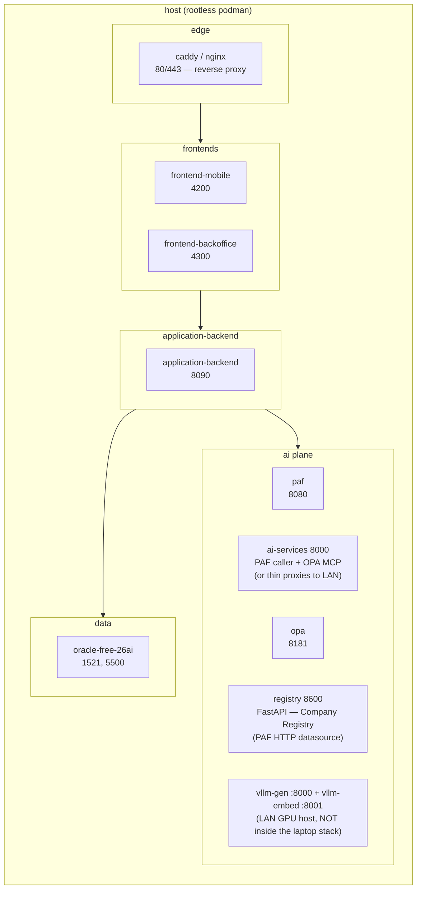
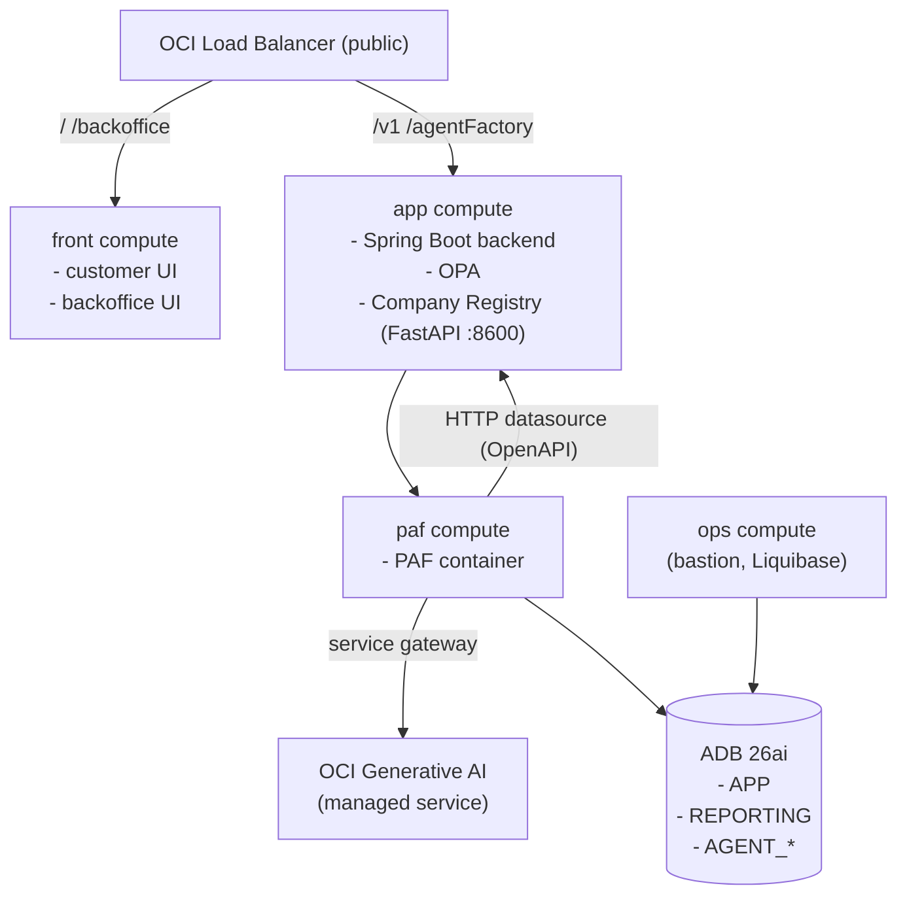

# Deployment Plan

This document is the **deployment plan** for the Decisioning Engine **PoC** (proof of concept). It explains the two supported deployment options (local podman, cloud **OCI** (Oracle Cloud Infrastructure)), the `manage.py` command surface that drives both, and the Liquibase strategy.

It is intentionally a _plan_, not a runbook. The user-facing playbooks live at the repository root:

- [`LOCAL.md`](../LOCAL.md) — step-by-step local deployment with podman.
- [`CLOUD.md`](../CLOUD.md) — step-by-step cloud deployment on OCI.

Component definitions and source layout are in [DESIGN.md](DESIGN.md). The PAF platform reference is [PAF.md](PAF.md).

---

## 1. Deployment options at a glance

| Property     | Local (podman)                                                     | Cloud (OCI)                                                      |
| ------------ | ------------------------------------------------------------------ | ---------------------------------------------------------------- |
| Audience     | Solo developer, laptop demo, on-prem evaluation                    | Demos to a bank, multi-user evaluation                           |
| Database     | Oracle Database Free 26ai container                                | Autonomous Database 26ai (ADB)                                   |
| PAF          | PAF container, locally installed                                   | PAF container on a near-DB compute                               |
| Models       | vLLM containers on a self-hosted GPU host (DGX Spark / NVIDIA box) | OCI Generative AI (managed service)                              |
| Provisioning | `manage.py setup local → local up` (podman)                        | `manage.py setup cloud → build → tf → terraform apply`           |
| Day-2        | `manage.py local <subcmd>`                                         | OCI Bastion + Ansible (`manage.py ansible` helpers)              |
| Lifetime     | Ephemeral; destroy by `manage.py local down`                       | Long-running; destroy by `terraform destroy` + `manage.py clean` |

Both options drive the same source tree, the same Liquibase changelogs (with separate `oracle/` and `adb/` directories), and the same Private Agent Factory artefacts.

## 2. `manage.py` command surface

Single Click-based CLI in `manage.py` at the repository root.

| Command                       | Purpose                                                                                                                                                                                                                                                                                                                                                                                                                                                                                                                                                                                                                                                                                                                                                                                                                                                                                                                                                                                                                                                                                                                          | Touches                                                 |
| ----------------------------- | -------------------------------------------------------------------------------------------------------------------------------------------------------------------------------------------------------------------------------------------------------------------------------------------------------------------------------------------------------------------------------------------------------------------------------------------------------------------------------------------------------------------------------------------------------------------------------------------------------------------------------------------------------------------------------------------------------------------------------------------------------------------------------------------------------------------------------------------------------------------------------------------------------------------------------------------------------------------------------------------------------------------------------------------------------------------------------------------------------------------------------- | ------------------------------------------------------- |
| `manage.py setup local`       | Checks host prereqs (`podman`, `ansible-playbook`, `liquibase`, `python>=3.11`), then prompts for vLLM host (no default — point at the GPU host running the two vLLM containers), vLLM generation port (default `8000`), vLLM embedding port (default `8001`), generative model (default `Qwen/Qwen2.5-72B-Instruct-AWQ`), embedding model (default `BAAI/bge-m3`, 1024 dims), local DB password. Writes `.env` with `DEPLOYMENT_TARGET=local`. Errors with install hints if any prereq is missing.                                                                                                                                                                                                                                                                                                                                                                                                                                                                                                                                                                                                                              | `.env`                                                  |
| `manage.py setup cloud`       | Checks host prereqs (`terraform`, `ansible-playbook`, `oci` CLI, `python>=3.11`), then lists the profiles in `~/.oci/config`, the subscribed regions, and the compartments, and probes every region for Generative AI so only regions that actually serve it can be chosen. Region and compartment pickers filter as you type — a tenancy can hold hundreds of compartments — and compartments are shown as `Parent/Child` paths, because leaf names repeat across branches. Lists the chat and embedding models that are `ACTIVE` and still served on demand, and refuses an embedding model whose output width does not match the `VECTOR` width in the changelog. Also prompts for the name prefix, compute shape, SSH key, bastion CIDR and ADB name, and generates Oracle-compliant ADB admin and wallet passwords when left blank. Writes `.env` with `DEPLOYMENT_TARGET=cloud`. Liquibase itself is **not** a host prereq for cloud — it is installed on the `ops` compute via cloud-init.                                                                                                                                                                                                                                                                                                                                                                                                                                                                                                                                                                                                                                                                                     | `.env`                                                  |
| `manage.py build`             | Compiles both UI bundles (`npm ci && npm run build`) and the Spring Boot jar (`./gradlew build -x test`), then stages each output plus the OPA bundle, the registry service and the `adb/` changelog into the Ansible role that installs it. Terraform zips those directories on the next apply. | `deploy/ansible/*/roles/*/files/` |
| `manage.py tf`                | Renders `terraform.tfvars` for both roots from `.env` via `string.Template`. The workload root gets the chosen region; the IAM root gets the tenancy home region, because identity resources exist only there. | `deploy/tf/*/terraform.tfvars` |
| `manage.py cloud iam`         | `terraform init` + `apply` on `deploy/tf/iam`. Needs tenancy-admin rights; run once per compartment. | OCI identity |
| `manage.py cloud plan/up/down` | `terraform plan` / `apply` / `destroy` on `deploy/tf/app`. Terraform is always invoked with `-chdir`, never by changing directory, so a root is never applied without its rendered tfvars. | OCI workload stack |
| `manage.py ansible`           | Renders Ansible vars files (`deploy/ansible/*/vars/main.yml`) from `.env` (DB connection, vLLM host + gen/embed ports, PAF URL, OPA URL, model handles, embedding dim).                                                                                                                                                                                                                                                                                                                                                                                                                                                                                                                                                                                                                                                                                                                                                                                                                                                                                                                                                          | `deploy/ansible/*/vars/main.yml`                        |
| `manage.py local provision`   | Runs the `database-setup` Ansible playbook against `localhost` with `--connection=local`: renders `database/liquibase/liquibase.properties`, applies the Liquibase changelog with `--contexts=local,seed`, and performs any post-Liquibase setup (grants, Select AI bootstrap when applicable). Same playbook runs on the cloud `ops` compute against ADB.                                                                                                                                                                                                                                                                                                                                                                                                                                                                                                                                                                                                                                                                                                                                                                                             | DB schema                                               |
| `manage.py paf prepare <tar>` | One-time per kit version: extracts the vendor PAF tarball into `./paf-kit/` (gitignored), reads `app_version` from the kit's `version.json`, and writes `PAF_APP_VERSION` into `.env`. Required before the first `local up`.                                                                                                                                                                                                                                                                                                                                                                                                                                                                                                                                                                                                                                                                                                                                                                                                                                                                                                     | `.env`, `paf-kit/`                                      |
| `manage.py paf build`         | Builds `localhost/applied-ai-label:$PAF_APP_VERSION` from the extracted kit (`build-image.sh aai`). Idempotent — exits early if the image already exists. `local up` runs this automatically when needed.                                                                                                                                                                                                                                                                                                                                                                                                                                                                                                                                                                                                                                                                                                                                                                                                                                                                                                                        | podman image storage                                    |
| `manage.py paf bootstrap`     | Prints the PAF UI installer URL + a step-by-step cheatsheet: admin-user creation, DB connection values (host `oracle-free-26ai`, port `1521`, service `FREEPDB1`, user `AGENT_FACTORY`, password from `.env`), Production mode, the LLM Configuration values (provider `vLLM`, separate Host + Port fields for the generation and embedding endpoints, model IDs as HuggingFace handles), the two Select AI profiles to register (`chat_profile` customer-safe + `research_profile` broader read-only), the OPA + HITL MCP server registrations (wired to `CHAT_FLOW` only), the **Company Registry HTTP datasource** registration (point PAF at `http://${REGISTRY_HOST}:${REGISTRY_PORT}/openapi.json`; wired to `CHAT_FLOW` only), and the two Agent Builder flows to import in order: `CHAT_FLOW` (a manager agent with two sub-agent workers — see [`paf/flows/CHAT_FLOW.md`](../paf/flows/CHAT_FLOW.md)) → `RESEARCH_WORKFLOW`. Captures each agent's published run URL into `PAF_CHAT_RUN_URL`, `PAF_RESEARCH_RUN_URL`. Auto-resolves a `.local` Bonjour `VLLM_HOST` to its current LAN IP. Read-only — no UI automation. | stdout                                                  |
| `manage.py local up`          | Brings the local podman stack up: Oracle Database Free 26ai, then PAF (when `paf-kit/` is present). Waits for DB health, runs `local provision` (Ansible → Liquibase + sysdba grants), runs the PAF post-start handshake (config marker + version.json seed). If the PAF image is missing it builds it first. Passes `--build` to compose so wrapper images (`hitl-mcp`, `opa-mcp`, `registry-api`) rebuild when their source changes (layer cache keeps unchanged ones near-instant). Re-resolves `VLLM_HOST` and injects an `extra_hosts` entry so the friendly hostname resolves inside the PAF container.                                                                                                                                                                                                                                                                                                                                                                                                                                                                                                                    | local containers                                        |
| `manage.py local down`        | Stops and removes the local stack. Optional `--purge` clears volumes.                                                                                                                                                                                                                                                                                                                                                                                                                                                                                                                                                                                                                                                                                                                                                                                                                                                                                                                                                                                                                                                            | local containers, volumes                               |
| `manage.py local logs <svc>`  | Streams logs for a chosen service.                                                                                                                                                                                                                                                                                                                                                                                                                                                                                                                                                                                                                                                                                                                                                                                                                                                                                                                                                                                                                                                                                               | —                                                       |
| `manage.py info`              | Prints LB IP / mobile-UI URL / backoffice-UI URL / chat agent run URL / research agent run URL / ops SSH command.                                                                                                                                                                                                                                                                                                                                                                                                                                                                                                                                                                                                                                                                                                                                                                                                                                                                                                                                                                                                                | —                                                       |
| `manage.py clean`             | Cloud teardown safeguard: refuses while Terraform state still holds resources; otherwise removes the rendered tfvars, the generated zips and every staged tier payload. | `deploy/tf/app/generated/`, `deploy/ansible/*/roles/*/files/` |

`build` and `info` are intentionally familiar verbs from common OCI deployment scripts. `setup` is **split into `setup local` and `setup cloud`** because the two flows ask non-overlapping questions and produce different `.env` shapes. `local provision` (and the cloud equivalent on the `ops` compute) is the single point that runs the schema-setup Ansible playbook against the active target — `manage.py` itself never invokes Liquibase or sqlcl directly; that lives in Ansible.

## 3. Local deployment (podman)

### 3.1 Topology

All services run as podman containers on the developer's machine, with one pointer (`VLLM_HOST`) that points at the LAN-reachable GPU host running the heavy inference workload. The PoC stack itself runs on the laptop; the LLM runs on the GPU box — true to the "private on-prem" posture.



Reasoning for podman + rootless: matches PAF's documented platform stance (see [PAF §5](PAF.md#5-installation-and-deployment-options) — Podman, rootless, `max_string_size=EXTENDED`, supported OSes Oracle Linux 8 and macOS).

### 3.2 First-run flow

1. `python -m venv venv && source venv/bin/activate && pip install -r requirements.txt`
2. `python manage.py setup local` — interactive; prompts for vLLM host (the GPU host's hostname or IPv4), gen + embed ports (defaults `8000` / `8001`), generative model (`Qwen/Qwen2.5-72B-Instruct-AWQ`), embedding model (`BAAI/bge-m3` @ 1024 dims), local DB password. Writes `.env` with `DEPLOYMENT_TARGET=local`.
3. `python manage.py paf prepare <path-to-kit-tarball>` — extracts the vendor kit into `paf-kit/` and records `PAF_APP_VERSION` in `.env`.
4. `python manage.py local up` — starts the database, runs `local provision` (Ansible → Liquibase + sysdba grants), builds the PAF image if missing, brings PAF up, and runs the post-start handshake (config marker + version.json seed).
5. `python manage.py paf bootstrap` — prints the PAF UI installer URL and the values to paste into the wizard (DB connection, LLM Configuration).
6. `python manage.py info` — prints the connection URLs.

### 3.3 Day-2

- `python manage.py local logs <service>` to inspect a service.
- `python manage.py local provision` to reapply pending changelogs + sysdba grants after editing the schema.
- `python manage.py paf build` to force-rebuild the PAF image (e.g. after a kit upgrade).
- `python manage.py local down` to stop the stack (data volumes preserved); `--purge` also drops them.

### 3.4 Local quirks

- The vLLM stack runs on a separate GPU host (not inside the laptop's podman) — `Qwen/Qwen2.5-72B-Instruct-AWQ` plus `BAAI/bge-m3` need ~42 GB of GPU memory between them, beyond what most laptops provide. `VLLM_HOST` points at that GPU box; mDNS `.local` hostnames are resolved on the laptop and injected into the PAF container's `/etc/hosts` via compose's `extra_hosts`. Setup of the vLLM containers themselves is documented in [LOCAL.md §Setting up vLLM on a GPU host](../LOCAL.md#setting-up-vllm-on-a-gpu-host-eg-nvidia-dgx-spark).
- `max_string_size=EXTENDED` is set on first boot by `deploy/podman/init-scripts/01-max-string-size.sh`, which the Oracle Free image runs as a startup hook. The script is idempotent and migrates CDB$ROOT, PDB$SEED, and FREEPDB1 in turn.
- The PAF kit's UI installer is invoked once after `local up`; the configuration it writes persists in the `paf-kit/applied-ai/volume/` bind mount, so subsequent restarts skip the wizard.
- Podman `TMPDIR` may need to be re-pointed to a partition with sufficient space; documented in `LOCAL.md`.
- Self-signed TLS: PAF terminates HTTPS on 8080 with its own self-signed cert (plain HTTP returns 400). Browsers must accept the warning; the future AI Services PAF caller will be configured to bypass verification only when targeting `localhost`/`127.0.0.1`.

## 4. Cloud deployment (Terraform + Ansible on OCI)

### 4.1 Topology

Four workload computes plus ADB (Autonomous Database) and LB (load balancer). Models come from the managed OCI Generative AI service, so no GPU compute is provisioned:



The compute shape is chosen at `manage.py setup cloud` time and applies to every workload instance. Generation and embedding both resolve to the OCI Generative AI endpoint in `var.genai_region`, which may differ from the workload region.

### 4.2 Terraform layout

`deploy/tf/app/` is the workload root module; `deploy/tf/iam/` is a second root holding the tenancy-level dynamic groups and Generative AI policy, applied once by an administrator because identity resources sit outside the workload compartment's permission scope and exist only in the tenancy home region. The four tiers differ only in shape and in the play they run, so they share one `deploy/tf/modules/tier/` module rather than a module each; `tier_name` is validated against the same four words used for the Ansible directories, artifact names and instance display names.

| File / module       | Provisions                                                                                                                                                         |
| ------------------- | ------------------------------------------------------------------------------------------------------------------------------------------------------------------ |
| `modules/tier`      | One instance: numbered Oracle Linux 9 image, flex `shape_config`, VNIC, and the self-retrying bootstrap handed over as `user_data`     |
| `network.tf`        | **VCN** (Virtual Cloud Network), public + private subnets, internet / NAT / service gateways, route tables, security lists            |
| `adb.tf`            | Autonomous Database 26ai on a private endpoint, its network security group, and the wallet as a local file plus a read-only PAR       |
| `storage.tf`        | Object Storage bucket and the fixed `time_static` deploy timestamp the PAR expiries are computed from                                 |
| `artifacts.tf`      | Per-tier `archive_file` → bucket object → **PAR** (Pre-Authenticated Request) pipeline, plus the PAF kit tarball uploaded as-is       |
| `locals.tf`         | Deploy id, the artifact map, and the VCN private-DNS names the tiers address each other by                                            |
| `main.tf`           | The `ops`, `frontend`, `backend` and `paf` tier module calls and the Ansible parameters each receives                                 |
| `lb.tf`             | Public flexible load balancer, one backend set per tier, the path route set, an HTTPS listener on 443 and a port-80 redirect to it     |
| `outputs.tf`        | LB address and per-path URLs, bastion IP, ADB OCID, wallet path, artifacts bucket, GenAI endpoint                                     |
| `certificate.tf`    | Self-signed certificate for the public listener, issued for the load balancer's own address                                          |

Cloud-init on each instance pulls its artefact zip through a PAR and runs Ansible **locally** — no SSH between instances. The bootstrap script copies itself to `/usr/local/sbin` and hands the retry loop to a systemd unit with `Restart=on-failure`, so a dependency that settles late (DNS, the NAT path to the yum mirrors, the dnf lock) costs one 60-second cycle instead of leaving the tier permanently half-built. It writes `/var/lib/<project>/bootstrap.ok` only after the playbook returns success, so that sentinel is a trustworthy signal; the playbook log lands at `/home/opc/ansible-playbook.log`.

Because `backend` and `paf` each need the other's address, tiers address each other by their VCN private-DNS names (`backend.private.<vcn>.oraclevcn.com`) rather than by module outputs, which would be a dependency cycle.

### 4.3 Ansible roles

Each tier directory under `deploy/ansible/` holds one entry playbook, always named `server.yaml`, applying one role to one host group. The bootstrap script hardcodes that filename, so renaming it breaks every tier's cloud-init with no error at plan or apply time.

| Tier / role             | Installs / configures                                                                                                                                |
| ----------------------- | ------------------------------------------------------------------------------------------------------------------------------------------------------ |
| `ops` / `opstools`      | JDK 21, Liquibase + the Oracle JDBC driver, the ADB wallet fetched through its PAR, then applies the changelog with `--contexts=adb,seed`             |
| `frontend` / `webstack` | nginx serving both UI bundles at `/` and `/backoffice`, proxying `/api` to the backend tier                                                     |
| `backend` / `appstack`  | JDK 21, Spring Boot service unit, OPA service unit + Rego bundle, Company Registry FastAPI service unit (port 8600, exposes `/openapi.json` for PAF) |
| `paf` / `pafstack`      | Podman, PAF kit tarball fetched through its own PAR, image build, and the PAF service unit pointed at the OCI Generative AI endpoint                  |

### 4.4 First-run flow

1. `python -m venv venv && source venv/bin/activate && pip install -r requirements.txt`
2. `python manage.py setup cloud` — picks the profile, workload region, Generative AI region and models, compartment, name prefix, compute shape, SSH key, bastion CIDR and ADB name. Writes `.env` with `DEPLOYMENT_TARGET=cloud`.
3. `python manage.py build` — compiles the UIs and the backend jar and stages every tier payload.
4. `python manage.py tf` — renders the tfvars for both Terraform roots.
5. `python manage.py cloud iam` — dynamic groups and the Generative AI policy, applied in the tenancy home region. Needs a tenancy-admin profile, and only ever runs once per compartment.
6. `python manage.py cloud up` — the workload stack.
7. Cloud-init on the `ops` compute installs Liquibase and the JDBC driver, fetches the ADB wallet through its PAR, and applies the changelog with `--contexts=adb,seed`. No action from the operator's machine.
8. `python manage.py paf bootstrap` — registers the instance-principal LLM and embedding connections, the tools, data sources and flows; captures the published run URLs.
9. `python manage.py info` — prints the load balancer address and the per-path URLs.

### 4.5 Cleanup

`python manage.py cloud down` then `python manage.py clean`. `clean` refuses if Terraform state still has resources.

## 5. Liquibase strategy

**One changelog, both targets.** All the SQL that differs between Oracle Database Free and Autonomous Database sits in `001-users-and-grants.yaml`; the other changesets — Blockchain tables, `VECTOR` columns, TxEventQ queues included — are portable as written. Two parallel trees would mean keeping sixteen near-identical files in sync by hand, so the divergence is expressed with Liquibase contexts instead.

```
database/liquibase/
├── liquibase.properties.j2
├── db.changelog-master.yaml
├── 001-users-and-grants.yaml             # the only file with per-target changesets
├── 002-banking-core.yaml                 # customer, account, product_catalog, loan_application, documents
├── 003-decisioning-audit-hitl.yaml       # decision (Blockchain), decision_audit, research_audit, hitl_task
├── 004-chat-persistence.yaml             # chat_message — replayable customer ↔ CHAT_FLOW conversation
├── 005-system-config.yaml                # system_config, policy_parameter_history, fair_lending_review
├── 006-reporting-views.yaml              # REPORTING.chat_v_* (customer-safe) + REPORTING.research_v_*
├── 007-agent-tools.yaml                  # AGENT_TOOLS.PKG_AGENT_TOOLS
├── 008-vector-rag.yaml                   # policy_corpus, case_history, vector indexes
├── 009-tx-event-queues.yaml              # TxEventQ queues + grants
├── 010-seed-synthetic.yaml               # synthetic dataset — context: seed
├── 011..017-*.yaml                       # session, intake, room id, audit key, cust_360, demo seed, HITL scope
└── 018-select-ai-grants.yaml             # Select AI enablement — context: adb
```

### How the contexts select a target

A changeset with **no context runs everywhere**; only tagged changesets are filtered. That keeps the mechanism to the handful of places that need it.

| Context | Applies to                                                                                      |
| ------- | ------------------------------------------------------------------------------------------------- |
| `local` | The four `CREATE USER … DEFAULT TABLESPACE USERS` changesets and the grant set including `CREATE DATABASE LINK` |
| `adb`   | Their `DEFAULT TABLESPACE DATA` counterparts and the Select AI package grants                     |
| `seed`  | The synthetic dataset — selected by both targets                                                 |

- Local: `--contexts=local,seed`
- Cloud: `--contexts=adb,seed`

Both targets seed. The PoC exists to demo Oracle Database, PAF and the models working on real-looking data, and an empty cloud schema would demo none of it. `seed` stays a separate context so an environment that wants a clean schema can drop it, not because either target does.

A context is a runtime filter and is **not** part of a changeset's checksum, so tagging an already-applied changeset does not invalidate it. Changesets are recorded under their bare filename, because Liquibase runs with the changelog directory as its working directory and `changeLogFile=db.changelog-master.yaml`.

### What actually differs

- **Tablespace.** Oracle Database Free puts application objects in `USERS`, Autonomous Database in `DATA`.
- **Database links.** ADB creates them through `DBMS_CLOUD_ADMIN.CREATE_DATABASE_LINK`, so `CREATE DATABASE LINK` is not granted there. The PoC does not use one.
- **Select AI.** `DBMS_CLOUD`, `DBMS_CLOUD_AI`, `DBMS_CLOUD_AI_AGENT` and `DBMS_CLOUD_PIPELINE` ship with ADB, and PAF checks for all four before it will treat the database as eligible. Oracle Database Free rejects a custom `provider_endpoint` pre-flight (`ORA-20401`), so this is ADB-only and the local flow reaches the same `AGENT_TOOLS` package through the MCP wrapper containers instead.

The changelog grants those packages but does **not** create the profiles or agent tools. `DBMS_CLOUD_AI.CREATE_PROFILE` and `DBMS_CLOUD_AI_AGENT.CREATE_TOOL` create objects owned by the invoking user, and Liquibase connects as `ADMIN`; anything it created would be invisible to PAF, which connects as `AGENT_FACTORY`. PAF creates both itself, and `manage.py paf bootstrap` lists them with their attributes.

`liquibase.properties.j2` is rendered by the Ansible role that runs the update — `database-setup` locally, `opstools` on the cloud `ops` compute.

Notes:

- Blockchain Table DDL (`CREATE BLOCKCHAIN TABLE ... NO DROP UNTIL 7 YEARS IDLE NO DELETE LOCKED HASHING USING "SHA2_512"`) lives in `003-decisioning-audit-hitl.yaml` and is supported on both Oracle Free 26ai and ADB 26ai. The row is written by the Application Service on HITL close; `AGENT_TOOLS` has no `INSERT` on `decision`.
- `hitl_task` carries the agent recommendation packet (`agent_recommendation`, `agent_reasoning`, `agent_explore_hints`, `agent_evidence`, `agent_run_id`) plus the reviewer's close-out fields (`human_outcome`, `human_note`, `human_user`, `closed_at`). `005-system-config.yaml` seeds reasonable defaults for the recommendation-tier weights.
- `chat_message` (in `004-chat-persistence.yaml`) persists the customer ↔ `CHAT_FLOW` conversation keyed by `roomId` + `customer_id` + `application_id`; the customer chat UI is stateless and replays from this table on every load.
- A separate `research_audit` table (`003-decisioning-audit-hitl.yaml`) captures `RESEARCH_WORKFLOW` tool calls keyed by `hitl_task_id` + reviewer, so research conversations are auditable but kept distinct from the decisioning trail.
- TxEventQ DDL (`009-tx-event-queues.yaml`) runs PL/SQL anonymous blocks that call `dbms_aqadm.create_transactional_event_queue` + `dbms_aqadm.start_queue`, each wrapped to catch `ORA-24006` (queue exists) and `ORA-24010` (already started) so re-runs are idempotent. The same changeset also calls `dbms_aqadm.grant_queue_privilege` to grant `ENQUEUE` / `DEQUEUE` separately to the schemas that need each — no `aq_administrator_role` on application users.

## 6. Environment configuration

`.env` is the single source of truth for infrastructure values. It is generated by `manage.py setup local` or `manage.py setup cloud`, never edited by hand without re-running setup. Selected keys:

| Key                                                                                                     | Purpose                                                                                                                                                                                                          |
| ------------------------------------------------------------------------------------------------------- | ---------------------------------------------------------------------------------------------------------------------------------------------------------------------------------------------------------------- |
| `OCI_PROFILE`, `OCI_REGION`, `OCI_COMPARTMENT_OCID`, `OCI_LABEL`                                        | Cloud targeting and the resource name prefix                                                                                                                                                                     |
| `OCI_GENAI_REGION`, `GENAI_ENDPOINT`, `MODEL_PROVIDER`                                                  | Region and inference endpoint of the OCI Generative AI service PAF calls. `MODEL_PROVIDER` is `oci_instance_principal`, which carries no key material                                                            |
| `GENAI_MODEL`, `GENAI_EMBED_MODEL`, `GENAI_EMBED_DIM`                                                   | Models chosen at setup from what the region actually serves on demand; the embedding width is held to the changelog's `VECTOR` width                                                                             |
| `OCI_TENANCY_OCID`                                                                                      | Root compartment, used by the `deploy/tf/iam/` root                                                                                                                                                             |
| `OCI_SSH_KEY_PATH`, `OCI_SSH_PUBLIC_KEY`, `OCI_ADMIN_CIDR`                                              | Key installed on the computes and the range allowed to reach the bastion                                                                                                                                         |
| `OCI_COMPUTE_SHAPE`                                                                                     | Flex shape used by every workload compute                                                                                                                                                                        |
| `DB_NAME`, `DB_WALLET_PASSWORD`                                                                         | ADB database name and the password protecting its generated wallet                                                                                                                                               |
| `DB_MODE`                                                                                               | `local-free-26ai` or `adb`                                                                                                                                                                                       |
| `DB_HOST`, `DB_PORT`, `DB_SERVICE`, `DB_USER`, `DB_PASSWORD`                                            | Local DB                                                                                                                                                                                                         |
| `ADB_WALLET_PATH`, `ADB_CONNECT_STRING`                                                                 | Cloud DB                                                                                                                                                                                                         |
| `VLLM_HOST`, `VLLM_GEN_PORT`, `VLLM_EMBED_PORT`, `VLLM_GEN_MODEL`, `VLLM_EMBED_MODEL`, `VLLM_EMBED_DIM` | LLM + embedding pointers (host + two ports) and HuggingFace model handles                                                                                                                                        |
| `PAF_HOST`, `PAF_PORT`, `PAF_ADMIN_USER`, `PAF_ADMIN_PASSWORD`                                          | PAF bootstrap targets                                                                                                                                                                                            |
| `PAF_CHAT_RUN_URL`, `PAF_RESEARCH_RUN_URL`, `PAF_LOGIN_VALIDATION_URL`                                  | Captured after `paf bootstrap` — one run URL per agent flow                                                                                                                                                      |
| `OPA_HOST`, `OPA_PORT`, `OPA_BUNDLE_DIR`                                                                | OPA service                                                                                                                                                                                                      |
| `REGISTRY_HOST`, `REGISTRY_PORT`                                                                        | Company Registry FastAPI service (PAF HTTP datasource). PAF is pointed at `http://${REGISTRY_HOST}:${REGISTRY_PORT}/openapi.json`. Defaults: `localhost`/`8600` locally, `app-compute.internal`/`8600` in cloud. |
| `BACKEND_URL`, `MOBILE_URL`, `BACKOFFICE_URL`                                                           | UI surfacing                                                                                                                                                                                                     |

Policy values (DTI cap, score floor, fair-lending bucketing, recommendation-tier weights) do **not** live in `.env`. They live in `APP.system_config` and are edited from the Backoffice UI; every change is appended to `policy_parameter_history`. Every application produces a HITL task by design — mandatory human review is the compliance posture.

## 7. Operational notes

- **OPA bundle reload on parameter change**: **planned for v1**. Currently OPA loads its bundle once at container start; parameter edits in the Backoffice still write `system_config` + `policy_parameter_history` (so the audit is complete) but require an OPA restart to take effect. v1 will add a reload-on-write trigger from the Application Service over the OPA REST API, with the side-by-side audit comparison shown in the demo script.
- **PAF session cookie handling**: per [PAF §15.2](PAF.md#152-cookie-based-call-from-shell) and [§16.4](PAF.md#164-apex-side-pattern), the AI Services PAF caller acquires `ahffi_session` (or the build-specific equivalent) via `loginValidation`, refreshes when it expires, and threads `roomId` for conversation continuity. The mobile and backoffice UIs never see the cookie.
- **TLS**: cloud uses a load-balancer-managed certificate; local PAF terminates its own self-signed TLS, and the Application Service caller is configured to bypass verification only when targeting the in-compose PAF endpoint.
  - _Nice-to-have hardening (POC → robust):_ `application-backend`'s `PafClientConfig` currently trusts all certs (`TrustStrategy` + `NoopHostnameVerifier`) for the `https://paf:8080` hop. Exposure is limited to one compose-internal hop, but to harden it: bundle PAF's self-signed cert into a dedicated trust store, load it via `SSLContextBuilder.loadTrustMaterial(trustStore, null)` (drop the trust-all strategy), and use `DefaultHostnameVerifier` — issuing the PAF cert with `paf` as a SAN so the standard verifier accepts it. Not done in the PoC because it requires wiring the PAF cert into the build.
- **Backup**: out of scope for the PoC. Documented in the cloud playbook as a follow-up (ADB has built-in backups; local has none and is treated as ephemeral).
- **TxEventQ admin**: monitor depth + age via `v$aq` and `v$persistent_queues` (per-queue counters); `manage.py info` surfaces depth/age for `HITL_REQUEST`. Retention is set on each queue (`dbms_aqadm.alter_queue(retention_time => N)`); the exception queue keeps messages until an operator triages them.
- **DBMS_CLOUD / Select AI bootstrap (local)**: Oracle Free 26ai does not ship `DBMS_CLOUD` / `DBMS_CLOUD_AI`. `manage.py` installs them on every `local up` / `local provision` (idempotent — `catclouduser.sql` + `dbms_cloud_install.sql` via `catcon.pl`, takes ~5 min the first time, no-op thereafter). After install, `manage.py` grants `EXECUTE` on the packages to `AGENT_FACTORY`. The credential + `chat_profile` / `research_profile` creation is the **cloud path only** — on local the bootstrap is skipped (see below). Cloud / ADB ships `DBMS_CLOUD_AI` pre-installed, so the profile creation moves to a dedicated Liquibase changeset (`010-select-ai-bootstrap.yaml`) in the ADB changelog.
- **HTTPS-from-DB scaffolding (Caddy + SSL wallet) — REMOVED locally**: an earlier iteration ran a `caddy-ollama-tls` compose service (TLS terminator reverse-proxying `/v1/*` to `VLLM_HOST:VLLM_GEN_PORT`) plus an Oracle SSL wallet trusting Caddy's CA and a network ACL — the standing infrastructure `DBMS_CLOUD` needs for an HTTPS callout. Because Select AI never worked locally regardless (`ORA-20401`, below), this whole layer was pure inconsistency and has been removed (the Caddy service, `deploy/podman/caddy/`, the wallet setup, and the ACL are gone). **To wire any HTTPS-from-DB feature locally later** (Select AI, OCI GenAI when sanctioned, RAG embedding endpoints) you would re-introduce a TLS terminator in front of vLLM, create an Oracle SSL wallet at `/opt/oracle/dcs/commonstore/wallets/ssl/` trusting its CA, register it via the `SSL_WALLET` database property, and add the outbound-HTTPS network ACL. Treated as out of scope for the PoC.
- **Select AI on local is intentionally NOT wired (only on cloud / ADB)**: `manage.py local up` skips the `DBMS_CLOUD_AI` profile creation, drops any leftover credential / profiles, and prints a yellow warning. Reason: Oracle Database Free 26ai (23.26.x) layers three validation checks that reject every variant of a custom-endpoint Select AI profile we've found:
  1. `provider: "ollama"` / `"openai-compatible"` → `ORA-20046` (invalid provider; the on-prem build's allowed list is narrower than ADB's).
  2. `provider: "openai"` + `provider_endpoint: "http://…"` → `ORA-20047` (HTTP rejected).
  3. `provider: "openai"` + an HTTPS `provider_endpoint` (when we still ran the TLS proxy) → `ORA-20401` raised pre-flight (the request never left the DB — the proxy access logs confirmed it never arrived), with the internal URI rendered `bearer://…/v1/chat/completions`. The on-prem `openai` provider appears to allow-list the OpenAI hostname and reject custom `provider_endpoint` values at credential validation time. Setting the credential `username` to `OPENAI` and using an `sk-…` shaped password didn't change the outcome.
     Plain `UTL_HTTP` through a wallet to the same HTTPS endpoint worked fine, so this is purely a `DBMS_CLOUD_AI` validator. On cloud / ADB the same package accepts the custom endpoint (we believe), so a dedicated Liquibase changeset `010-select-ai-bootstrap.yaml` lives in the `adb/` changelog and runs the same `CREATE_PROFILE` calls. The local `CHAT_FLOW` reads the customer's context through `banking-mcp.get_context` (cx_Oracle bind variables, fail-secure) rather than a SQL Query node, and PAF's LLM Management config calls the vLLM endpoint directly — no Select AI in the loop. Same demo behaviour to the user, different mechanism under the hood. (This `ORA-20401` dead-end is why the Caddy TLS proxy + SSL wallet were removed — see the bullet above.)

## 8. Open design questions

- Exact OCI compute shapes per role (chosen at `setup cloud` time).
- Exact PAF flow JSON for `CHAT_FLOW` and `RESEARCH_WORKFLOW` — locked once the in-DB `AGENT_TOOLS` package and the Select AI tools exist.
- HITL assignment policy beyond "queue-claim".
- Backup, log retention, and monitoring beyond the audit-trail observability defined in [DESIGN.md §9](DESIGN.md#9-observability-model).

## 9. Current state

The live status of the stack — schema changesets, the tool/MCP inventory, the flow, and the forward plan — is tracked in **one** place: [`README.md` § Current state](../README.md#current-state) and its "What's next" list. Future-feature detail is in [`BACKLOG.md`](../BACKLOG.md). This document owns the _deployment strategy_ (§1–§7) — options, the `manage.py` surface, Liquibase, env config, and operational notes — not the running status.
