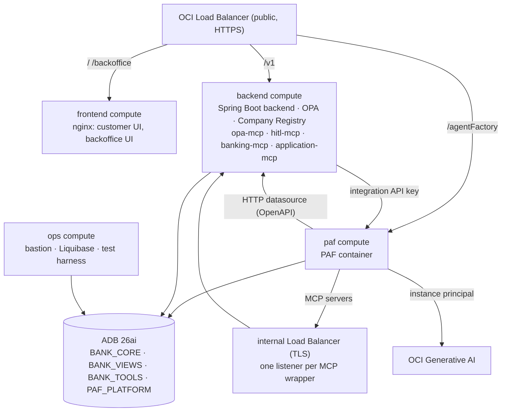

# Deployment Plan

This document is the **deployment plan** for the Decisioning Engine **PoC** (proof of concept) on **OCI** (Oracle Cloud Infrastructure): the topology, the `manage.py` command surface that drives it, and the Liquibase strategy.

It is a _plan_, not a runbook. The step-by-step playbook is [`CLOUD.md`](../CLOUD.md) at the repository root. Component definitions and source layout are in [DESIGN.md](DESIGN.md). The PAF platform reference is [PAF.md](PAF.md).

---

## 1. Shape of the deployment

| Property     | Value                                                                           |
| ------------ | ------------------------------------------------------------------------------- |
| Audience     | Demos to a bank, multi-user evaluation                                          |
| Database     | Autonomous Database 26ai (ADB) on a private endpoint                            |
| PAF          | PAF container on its own compute, installed against ADB                         |
| Models       | OCI Generative AI (managed service), called as an instance principal            |
| Provisioning | `manage.py setup → build → tf → cloud iam → cloud up`                           |
| Day-2        | `manage.py paf …` against the live PAF; `manage.py cloud test` from the bastion |
| Lifetime     | Long-running; destroyed by `manage.py cloud down` + `manage.py clean`           |

Nothing in the deployment stores an API key: the `paf` compute calls Generative AI as an **instance principal**, and the database calls it as a **resource principal**.

## 2. `manage.py` command surface

Single Click-based CLI in `manage.py` at the repository root.

| Command                            | Purpose                                                                                                                                                                                                                                                                                                    | Touches                                     |
| ---------------------------------- | ---------------------------------------------------------------------------------------------------------------------------------------------------------------------------------------------------------------------------------------------------------------------------------------------------------- | ------------------------------------------- |
| `manage.py setup`                  | Checks `terraform` and `oci`; picks the OCI profile, workload and Generative AI regions, compartment, models (chat model steered to the format PAF streams end to end, embedding model held to the changelog's `VECTOR` width), name prefix, compute shape, SSH key, bastion CIDR, ADB name and passwords. | `.env`                                      |
| `manage.py build`                  | Builds both UI bundles and the backend jar, then stages every tier payload (jar, bundles, OPA policies, registry, MCP wrappers, changelog, tests) under `deploy/ansible/*/roles/*/files/`.                                                                                                                 | staged payloads                             |
| `manage.py tf`                     | Renders `terraform.tfvars` for both Terraform roots from `.env`.                                                                                                                                                                                                                                           | `deploy/tf/{app,iam}/terraform.tfvars`      |
| `manage.py cloud iam`              | Applies the tenancy-level root: two dynamic groups and the Generative AI policy. Needs a tenancy-admin profile; runs once per compartment.                                                                                                                                                                 | OCI IAM                                     |
| `manage.py cloud plan` / `up`      | Plans / applies the workload root: network, ADB, four tiers, both load balancers. `up` re-stages the copied payloads first so an edited changelog cannot ship stale.                                                                                                                                       | OCI                                         |
| `manage.py cloud redeploy <tier>`  | Re-runs one tier's play against the payload currently in the bucket, so an edited role reaches the running instance. Pair it with `cloud up`, which uploads that payload.                                                                                                                                  | the named tier                              |
| `manage.py cloud test`             | Copies `tests/` to the bastion and runs the end-to-end harness there — the only host that reaches both PAF and ADB.                                                                                                                                                                                        | bastion                                     |
| `manage.py cloud reset`            | Empties the reviewer queue, both chat histories, the login sessions and the tool traces, so a run starts from the seeded state. Leaves the blockchain `decision` table.                                                                                                     | ADB (`BANK_CORE` schema)                          |
| `manage.py cloud down`             | Destroys the workload stack, retrying the security-group race; leaves the IAM root for the next deployment.                                                                                                                                                                                                | OCI                                         |
| `manage.py paf bootstrap`          | Prints the PAF install as one ordered sheet: installer URL, every value to paste, and the commands that sit between the browser steps.                                                                                                                                                                     | stdout                                      |
| `manage.py paf admin`              | Recovery only: records the admin the install wizard actually created, when it differs from the credentials `setup` wrote for it to be given.                                                                                                                                                                                                       | `.env`                                      |
| `manage.py paf openapi`            | Fetches the Company Registry's OpenAPI document through the bastion and writes `paf/dist/company-registry-openapi.json`, the file PAF's data-source form uploads.                                                                                                          | `paf/dist/`                                 |
| `manage.py paf prepare`            | Post-wizard PAF configuration the MCP registrations depend on: uploads the internal load balancer's certificate to PAF's administrator certificate store, and sets `BLOCK_PRIVATE_OUTBOUND_URLS=false` so private MCP addresses register.                                                                   | PAF, ADB (`PAF_PLATFORM` schema)           |
| `manage.py paf link-flow`          | Rebinds every MCP node in `CHAT_FLOW` to this install's server ids, by server name.                                                                                                                                                                                                                        | PAF                                         |
| `manage.py paf gen-model`          | Points PAF's `gen-model` configuration at `GENAI_MODEL` from `.env`.                                                                                                                                                                                                                                       | PAF                                         |
| `manage.py paf api-key`            | Mints the integration API key for `CHAT_FLOW`.                                                                                                                                                                                                                                                             | `.env` (`PAF_AGENT_ID`, `PAF_API_KEY`)      |
| `manage.py info`                   | Prints the load balancer address, the per-path URLs, the bastion and the models, then reads every tier's bootstrap sentinel over the bastion and reports which are ready.                                                                                                                                  | —                                           |
| `manage.py clean`                  | Refuses while Terraform state holds resources; otherwise removes the rendered tfvars, generated files and every staged payload.                                                                                                                                                                            | `deploy/tf/app/generated/`, staged payloads |

`manage.py` never invokes Liquibase itself; the `ops` tier's Ansible role applies the changelog.

## 3. Topology

Four workload computes plus ADB and two load balancers. Models come from the managed OCI Generative AI service, so no GPU compute is provisioned:



The compute shape is chosen at `manage.py setup` time and applies to every workload instance. Generation and embedding both resolve to the Generative AI endpoint of `OCI_GENAI_REGION`, which may differ from the workload region.

### 3.1 Terraform layout

`deploy/tf/app/` is the workload root module; `deploy/tf/iam/` is a second root holding the tenancy-level dynamic groups and Generative AI policy, applied once by an administrator because identity resources sit outside the workload compartment's permission scope and exist only in the tenancy home region. The four tiers differ only in shape and in the play they run, so they share one `deploy/tf/modules/tier/` module; `tier_name` is validated against the same four words used for the Ansible directories, artifact names and instance display names.

| File / module    | Provisions                                                                                                                                                 |
| ---------------- | ---------------------------------------------------------------------------------------------------------------------------------------------------------- |
| `modules/tier`   | One instance: numbered Oracle Linux 9 image, flex `shape_config`, VNIC, and the self-retrying bootstrap handed over as `user_data`                         |
| `network.tf`     | **VCN**, public + private subnets, internet / NAT / service gateways, route tables, security lists                                                         |
| `adb.tf`         | Autonomous Database 26ai on a private endpoint, its network security group, and the wallet as a local file plus a read-only PAR                            |
| `storage.tf`     | Object Storage bucket and the fixed `time_static` deploy timestamp the PAR expiries are computed from                                                      |
| `artifacts.tf`   | Per-tier `archive_file` → bucket object → **PAR** (Pre-Authenticated Request) pipeline, plus the PAF kit tarball uploaded as-is                            |
| `locals.tf`      | Deploy id, the artifact map, and the VCN private-DNS names the tiers address each other by                                                                 |
| `main.tf`        | The `ops`, `frontend`, `backend` and `paf` tier module calls and the Ansible parameters each receives                                                      |
| `lb.tf`          | Public flexible load balancer, one backend set per tier, the path route set, an HTTPS listener on 443 and a port-80 redirect to it                         |
| `lb_internal.tf` | Private load balancer fronting the MCP wrappers with TLS, one listener per wrapper — an OCI load balancer cannot rewrite a path, so each gets its own port |
| `outputs.tf`     | LB address and per-path URLs, bastion IP, ADB OCID, wallet path, artifacts bucket, GenAI endpoint, MCP server URLs                                         |
| `certificate.tf` | Self-signed certificates for the public listener and the internal one                                                                                      |

Cloud-init on each instance pulls its artifact zip through a PAR and runs Ansible on the instance itself — no SSH between instances. The bootstrap script copies itself to `/usr/local/sbin` and hands the retry loop to a systemd unit with `Restart=on-failure`, so a dependency that settles late (DNS, the NAT path to the yum mirrors, the dnf lock) costs one 60-second cycle instead of leaving the tier half-built. It writes `/var/lib/<project>/bootstrap.ok` only after the playbook returns success, so that sentinel is a trustworthy signal; the playbook log lands at `/home/opc/ansible-playbook.log`. The sentinel makes every later boot a no-op, and Terraform keys a payload object on its name, so `cloud up` uploads a new archive and reports no instance change. `manage.py cloud redeploy <tier>` is what carries a payload change to a running instance: it clears the sentinel and runs the tier's bootstrap script again, re-fetching through the PAR and re-running the play. The playbook parameters are rendered into cloud-init at instance creation, so a changed Terraform variable still needs a rebuild.

Because `backend` and `paf` each need the other's address, tiers address each other by their VCN private-DNS names (`backend.private.<vcn>.oraclevcn.com`) rather than by module outputs, which would be a dependency cycle.

### 3.2 Ansible roles

Each tier directory under `deploy/ansible/` holds one entry playbook, always named `server.yaml`, applying one role to one host group. The bootstrap script hardcodes that filename, so renaming it breaks every tier's cloud-init with no error at plan or apply time.

| Tier / role             | Installs / configures                                                                                                                                                                                                                                                                |
| ----------------------- | ------------------------------------------------------------------------------------------------------------------------------------------------------------------------------------------------------------------------------------------------------------------------------------ |
| `ops` / `opstools`      | JDK 21, Liquibase + the Oracle JDBC driver, python-oracledb, the ADB wallet fetched through its PAR, the test harness; applies the changelog with `--contexts=adb,seed`                                                                                                              |
| `frontend` / `webstack` | nginx serving both UI bundles at `/` and `/backoffice/`                                                                                                                                                                                                                              |
| `backend` / `appstack`  | JDK 21, the Spring Boot service unit (connects as `BANK_CORE`), OPA + the Rego bundle, the Company Registry FastAPI unit (:8600), and the four MCP wrapper units (:8500 `opa-mcp`, :8502 `hitl-mcp`, :8503 `banking-mcp`, :8504 `application-mcp`), all reaching each other on `127.0.0.1` |
| `paf` / `pafstack`      | Podman, the PAF kit tarball fetched through its own PAR, image build, and the PAF service unit                                                                                                                                                                                       |

### 3.3 First-run flow

The ordered runbook is [`CLOUD.md`](../CLOUD.md): `setup`, `build`, `tf`, `cloud iam`, `cloud up`, wait for the tiers' sentinels, `paf bootstrap` (the install sheet), import `CHAT_FLOW`, `paf link-flow`, publish, `paf api-key`, `cloud test`, `info`.

### 3.4 Cleanup

`python manage.py cloud down` then `python manage.py clean`. `clean` refuses if Terraform state still has resources.

## 4. Liquibase strategy

One changelog, applied by the `ops` tier as `ADMIN` with `--contexts=adb,seed`.

```
database/liquibase/
├── liquibase.properties.j2
├── db.changelog-master.yaml
├── 001-users-and-grants.yaml             # schema users — context: adb
├── 002-banking-core.yaml                 # customer, account, product_catalog, loan_application, documents
├── 003-decisioning-audit-hitl.yaml       # decision (Blockchain), decision_audit, research_audit, hitl_task
├── 004-chat-persistence.yaml             # chat_message — replayable customer ↔ CHAT_FLOW conversation
├── 005-system-config.yaml                # system_config, policy_parameter_history, fair_lending_review
├── 006-reporting-views.yaml              # BANK_VIEWS.chat_v_* (customer-safe) + BANK_VIEWS.research_v_*
├── 007-agent-tools.yaml                  # BANK_TOOLS.PKG_AGENT_TOOLS
├── 008-vector-rag.yaml                   # policy_corpus, case_history, vector indexes
├── 009-tx-event-queues.yaml              # TxEventQ queues + grants
├── 010-seed-synthetic.yaml               # synthetic dataset — context: seed
├── 011..017-*.yaml                       # session, intake, room id, audit key, cust_360, demo seed, HITL scope
├── 018-select-ai-grants.yaml             # Select AI enablement — context: adb
└── 019-paf-install-prerequisites.yaml    # what PAF's install wizard checks — context: adb
```

### Contexts

A changeset with **no context runs everywhere**; only tagged changesets are filtered.

| Context | Applies to                                                                                      |
| ------- | ----------------------------------------------------------------------------------------------- |
| `adb`   | User creation in the `DATA` tablespace, the Select AI package grants, the install prerequisites |
| `seed`  | The synthetic dataset                                                                           |

The deployment seeds: the PoC exists to demo Oracle Database, PAF and the models working on real-looking data, and an empty schema would demo none of it. `seed` stays a separate context so an environment that wants a clean schema can drop it.

A context is a runtime filter and is **not** part of a changeset's checksum. Changesets are recorded under their bare filename, because Liquibase runs with the changelog directory as its working directory and `changeLogFile=db.changelog-master.yaml`. An applied changeset is never edited; a change is a new changeset.

### Select AI

`DBMS_CLOUD`, `DBMS_CLOUD_AI`, `DBMS_CLOUD_AI_AGENT` and `DBMS_CLOUD_PIPELINE` ship with ADB, and PAF checks for all four before it treats the database as eligible. The changelog grants those packages but does **not** create the profiles or agent tools: `DBMS_CLOUD_AI.CREATE_PROFILE` and `DBMS_CLOUD_AI_AGENT.CREATE_TOOL` create objects owned by the invoking user, and Liquibase connects as `ADMIN`; anything it created would be invisible to PAF, which connects as `PAF_PLATFORM`. PAF creates both itself through its UI.

Notes:

- Blockchain Table DDL (`CREATE BLOCKCHAIN TABLE ... NO DROP UNTIL 7 YEARS IDLE NO DELETE LOCKED HASHING USING "SHA2_512"`) lives in `003-decisioning-audit-hitl.yaml`. The row is written by the Application Service on HITL close; `BANK_TOOLS` has no `INSERT` on `decision`.
- `hitl_task` carries the agent recommendation packet (`agent_recommendation`, `agent_reasoning`, `agent_explore_hints`, `agent_evidence`, `agent_run_id`) plus the reviewer's close-out fields (`human_outcome`, `human_note`, `human_user`, `closed_at`). `005-system-config.yaml` seeds defaults for the recommendation-tier weights.
- `chat_message` (`004-chat-persistence.yaml`) persists the customer ↔ `CHAT_FLOW` conversation keyed by `roomId` + `customer_id` + `application_id`; the customer chat UI is stateless and replays from this table on every load.
- `research_audit` (`003-decisioning-audit-hitl.yaml`) captures `RESEARCH_WORKFLOW` tool calls keyed by `hitl_task_id` + reviewer, so research conversations are auditable but kept distinct from the decisioning trail.
- TxEventQ DDL (`009-tx-event-queues.yaml`) runs PL/SQL anonymous blocks that call `dbms_aqadm.create_transactional_event_queue` + `dbms_aqadm.start_queue`, each wrapped to catch `ORA-24006` (queue exists) and `ORA-24010` (already started) so re-runs are idempotent. The same changeset grants `ENQUEUE` / `DEQUEUE` separately to the schemas that need each — no `aq_administrator_role` on application users.

## 5. Environment configuration

`.env` is the single source of truth for infrastructure values. `manage.py setup` generates it; `paf admin`, `paf api-key` and `setup` itself are the only writers.

| Key                                                                                                     | Purpose                                                                                                                                           |
| ------------------------------------------------------------------------------------------------------- | ------------------------------------------------------------------------------------------------------------------------------------------------- |
| `OCI_PROFILE`, `OCI_TENANCY_OCID`, `OCI_HOME_REGION`, `OCI_REGION`, `OCI_COMPARTMENT_OCID`, `OCI_LABEL` | Cloud targeting and the resource name prefix; the home region is where the IAM root applies                                                       |
| `OCI_GENAI_REGION`, `GENAI_ENDPOINT`, `MODEL_PROVIDER`                                                  | Region and inference endpoint of the Generative AI service PAF calls. `MODEL_PROVIDER` is `oci_instance_principal`, which carries no key material |
| `GENAI_MODEL`, `GENAI_EMBED_MODEL`, `GENAI_EMBED_DIM`                                                   | Models chosen at setup from what the region serves on demand; the embedding width is held to the changelog's `VECTOR` width                       |
| `OCI_SSH_KEY_PATH`, `OCI_SSH_PUBLIC_KEY`, `OCI_ADMIN_CIDR`                                              | Key installed on the computes and the range allowed to reach the bastion                                                                          |
| `OCI_COMPUTE_SHAPE`                                                                                     | Flex shape used by every workload compute                                                                                                         |
| `DB_MODE`, `DB_NAME`, `DB_SERVICE`, `DB_ADMIN_USER`, `DB_PASSWORD`, `DB_WALLET_PASSWORD`                | ADB name, its `_high` service alias, `ADMIN`, the one password every schema user shares, and the wallet password                                  |
| `PAF_TARBALL`                                                                                           | The x86_64 kit tarball Terraform uploads for the `paf` tier                                                                                       |
| `PAF_ADMIN_USER`, `PAF_ADMIN_PASS`                                                                      | The PAF administrator `manage.py paf …` signs in as. The password is generated by `setup`; the install wizard is given both, not asked for new ones |
| `PAF_AGENT_ID`, `PAF_API_KEY`                                                                           | Written by `paf api-key`; the backend tier reads them at deploy time and `cloud test` passes them to the harness                                  |

Policy values (DTI cap, score floor, fair-lending bucketing, recommendation-tier weights) do **not** live in `.env`. They live in `BANK_CORE.system_config` and are edited from the Backoffice UI; every change is appended to `policy_parameter_history`. Every application produces a HITL task by design — mandatory human review is the compliance posture.

## 6. Operational notes

- **OPA bundle reload on parameter change**: OPA loads its bundle at service start; parameter edits in the Backoffice write `system_config` + `policy_parameter_history` (so the audit is complete) but take effect after an OPA restart. A reload-on-write trigger from the Application Service over the OPA REST API is on the backlog.
- **PAF session cookie handling**: the backend reaches `CHAT_FLOW` through an integration API key (Bearer, 90-day TTL) on `/agentFactory/v1/integrations/agents/{id}/run`; the UIs never see PAF credentials.
- **TLS**: three self-signed certificates, each trusted as its own anchor rather than through a CA. The public listener's is exported to `generated/lb-ca.pem`, which `manage.py` and the end-to-end harness verify against — neither has a DNS name to check, and neither needs one, because the certificate names the load balancer's address. PAF trusts the internal MCP listener through its administrator certificate store (`paf prepare`). The backend verifies the certificate PAF serves against the copy `paf push-key` delivers to `/etc/paf-poc-paf.pem`, and fails the turn rather than proceeding unverified if it is absent. The load balancer's own hop to PAF stays unverified — [`BACKLOG.md §11`](../BACKLOG.md).
- **Backup**: out of scope for the PoC; ADB has built-in backups.
- **TxEventQ admin**: monitor depth + age via `v$aq` and `v$persistent_queues`. Retention is set on each queue (`dbms_aqadm.alter_queue(retention_time => N)`); the exception queue keeps messages until an operator triages them.

## 7. Current state

The live status of the stack — schema changesets, the tool/MCP inventory, the flow, and the forward plan — is tracked in **one** place: [`README.md` § Current state](../README.md#current-state) and its "What's next" list. Future-feature detail is in [`BACKLOG.md`](../BACKLOG.md). This document owns the _deployment strategy_ — the `manage.py` surface, topology, Liquibase and env config — not the running status.
