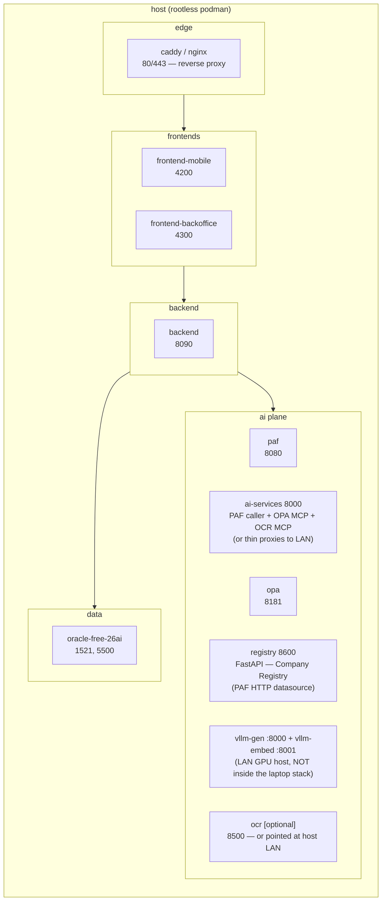
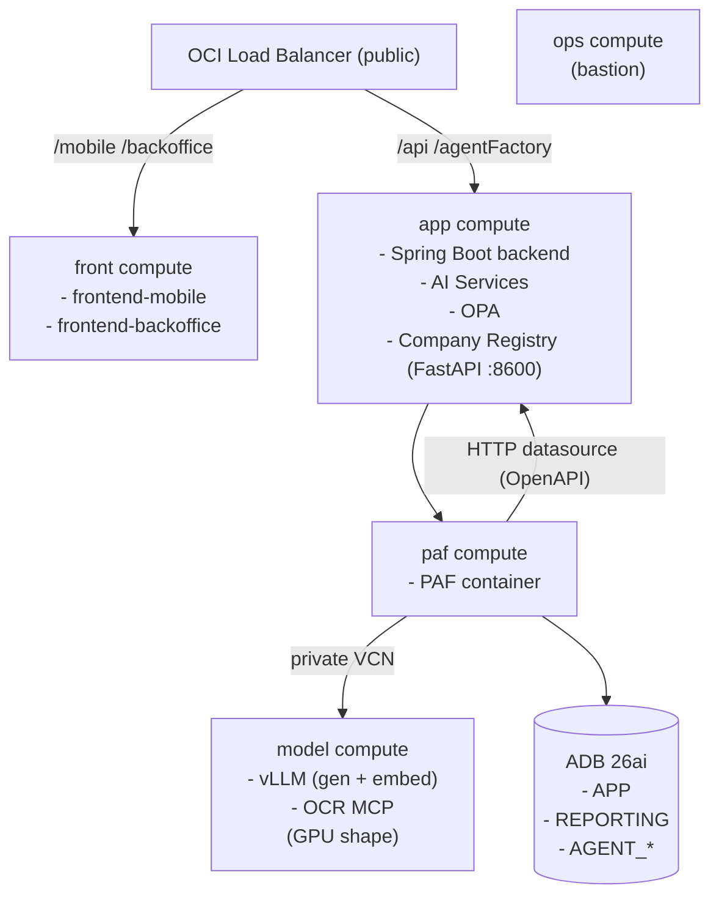

# Deployment Plan

This document is the **deployment plan** for the Decisioning Engine **PoC** (proof of concept). It explains the two supported deployment options (local podman, cloud **OCI** (Oracle Cloud Infrastructure)), the `manage.py` command surface that drives both, and the Liquibase strategy.

It is intentionally a _plan_, not a runbook. The user-facing playbooks live at the repository root:

- [`LOCAL.md`](../LOCAL.md) — step-by-step local deployment with podman.
- [`CLOUD.md`](../CLOUD.md) — step-by-step cloud deployment on OCI.

Component definitions and source layout are in [DESIGN.md](DESIGN.md). The PAF platform reference is [PAF.md](PAF.md).

---

## 1. Deployment options at a glance

| Property     | Local (podman)                                                     | Cloud (OCI)                                                      |
| ------------ | ------------------------------------------------------------------ | ---------------------------------------------------------------- |
| Audience     | Solo developer, laptop demo, on-prem evaluation                    | Demos to a bank, multi-user evaluation                           |
| Database     | Oracle Database Free 26ai container                                | Autonomous Database 26ai (ADB)                                   |
| PAF          | PAF container, locally installed                                   | PAF container on a near-DB compute                               |
| Models       | vLLM containers on a self-hosted GPU host (DGX Spark / NVIDIA box) | vLLM containers on a GPU compute (OCI shape)                     |
| OCR          | OCR MCP container (CPU) or LAN GPU host                            | OCR MCP on the GPU compute alongside vLLM                        |
| Provisioning | `manage.py setup local → local up` (podman)                        | `manage.py setup cloud → build → tf → terraform apply`           |
| Day-2        | `manage.py local <subcmd>`                                         | OCI Bastion + Ansible (`manage.py ansible` helpers)              |
| Lifetime     | Ephemeral; destroy by `manage.py local down`                       | Long-running; destroy by `terraform destroy` + `manage.py clean` |

Both options drive the same source tree, the same Liquibase changelogs (with separate `oracle/` and `adb/` directories), and the same Private Agent Factory artefacts.

## 2. `manage.py` command surface

Single Click-based CLI in `manage.py` at the repository root.

| Command                       | Purpose                                                                                                                                                                                                                                                                                                                                                                                                                                                                                                                                                                                                                                                                                                                                                                                                                                                                                                                                                                                                                                                                                          | Touches                                                 |
| ----------------------------- | ------------------------------------------------------------------------------------------------------------------------------------------------------------------------------------------------------------------------------------------------------------------------------------------------------------------------------------------------------------------------------------------------------------------------------------------------------------------------------------------------------------------------------------------------------------------------------------------------------------------------------------------------------------------------------------------------------------------------------------------------------------------------------------------------------------------------------------------------------------------------------------------------------------------------------------------------------------------------------------------------------------------------------------------------------------------------------------------------ | ------------------------------------------------------- |
| `manage.py setup local`       | Checks host prereqs (`podman`, `ansible-playbook`, `liquibase`, `python>=3.11`), then prompts for vLLM host (no default — point at the GPU host running the two vLLM containers), vLLM generation port (default `8000`), vLLM embedding port (default `8001`), generative model (default `Qwen/Qwen2.5-32B-Instruct-AWQ`), embedding model (default `BAAI/bge-m3`, 1024 dims), OCR host/port, local DB password. Writes `.env` with `DEPLOYMENT_TARGET=local`. Errors with install hints if any prereq is missing.                                                                                                                                                                                                                                                                                                                                                                                                                                                                                                                                                                               | `.env`                                                  |
| `manage.py setup cloud`       | Checks host prereqs (`terraform`, `ansible-playbook`, `oci` CLI, `python>=3.11`), then reads `~/.oci/config`, lists subscribed regions + compartments, prompts for GPU shape, OCI GenAI region (future migration target), generates an Oracle-compliant ADB password, SSH key path. Writes `.env` with `DEPLOYMENT_TARGET=cloud`. Liquibase itself is **not** a host prereq for cloud — it is installed on the `ops` compute via cloud-init.                                                                                                                                                                                                                                                                                                                                                                                                                                                                                                                                                                                                                                                     | `.env`                                                  |
| `manage.py build`             | Builds local artefacts: `./gradlew build -x test` for Spring Boot, `npm install && npm run build` for both Angular apps, `pip wheel` for Python services, `oras`/`podman build` for container images (local) or zips (cloud upload).                                                                                                                                                                                                                                                                                                                                                                                                                                                                                                                                                                                                                                                                                                                                                                                                                                                             | `src/*/dist`, `src/*/build`, `deploy/tf/app/generated/` |
| `manage.py tf`                | Renders `deploy/tf/app/terraform.tfvars` from `.env`.                                                                                                                                                                                                                                                                                                                                                                                                                                                                                                                                                                                                                                                                                                                                                                                                                                                                                                                                                                                                                                            | `deploy/tf/app/terraform.tfvars`                        |
| `manage.py ansible`           | Renders Ansible vars files (`deploy/ansible/*/vars/main.yml`) from `.env` (DB connection, vLLM host + gen/embed ports, OCR host, PAF URL, OPA URL, model handles, embedding dim).                                                                                                                                                                                                                                                                                                                                                                                                                                                                                                                                                                                                                                                                                                                                                                                                                                                                                                                | `deploy/ansible/*/vars/main.yml`                        |
| `manage.py local provision`   | Runs the `database-setup` Ansible playbook against `localhost` with `--connection=local`: renders `database/liquibase/oracle/liquibase.properties`, applies the Liquibase changelog, and performs any post-Liquibase setup (grants, Select AI bootstrap when applicable). Same playbook runs on the cloud `ops` compute against ADB.                                                                                                                                                                                                                                                                                                                                                                                                                                                                                                                                                                                                                                                                                                                                                             | DB schema                                               |
| `manage.py paf prepare <tar>` | One-time per kit version: extracts the vendor PAF tarball into `./paf-kit/` (gitignored), reads `app_version` from the kit's `version.json`, and writes `PAF_APP_VERSION` into `.env`. Required before the first `local up`.                                                                                                                                                                                                                                                                                                                                                                                                                                                                                                                                                                                                                                                                                                                                                                                                                                                                     | `.env`, `paf-kit/`                                      |
| `manage.py paf build`         | Builds `localhost/applied-ai-label:$PAF_APP_VERSION` from the extracted kit (`build-image.sh aai`). Idempotent — exits early if the image already exists. `local up` runs this automatically when needed.                                                                                                                                                                                                                                                                                                                                                                                                                                                                                                                                                                                                                                                                                                                                                                                                                                                                                        | podman image storage                                    |
| `manage.py paf bootstrap`     | Prints the PAF UI installer URL + a step-by-step cheatsheet: admin-user creation, DB connection values (host `oracle-free-26ai`, port `1521`, service `FREEPDB1`, user `AGENT_FACTORY`, password from `.env`), Production mode, the LLM Configuration values (provider `vLLM`, separate Host + Port fields for the generation and embedding endpoints, model IDs as HuggingFace handles), the two Select AI profiles to register (`chat_profile` customer-safe + `research_profile` broader read-only), the OPA + OCR + HITL MCP server registrations (wired to `CHAT_WORKFLOW` only), the **Company Registry HTTP datasource** registration (point PAF at `http://${REGISTRY_HOST}:${REGISTRY_PORT}/openapi.json`; wired to `CHAT_WORKFLOW` only), and the two Agent Builder flows to import in order: `CHAT_WORKFLOW` (two-agent: `EvaluationAgent` → `RecommendationAgent`) → `RESEARCH_WORKFLOW`. Captures each agent's published run URL into `PAF_CHAT_RUN_URL`, `PAF_RESEARCH_RUN_URL`. Auto-resolves a `.local` Bonjour `VLLM_HOST` to its current LAN IP. Read-only — no UI automation. | stdout                                                  |
| `manage.py local up`          | Brings the local podman stack up: Oracle Database Free 26ai, then PAF (when `paf-kit/` is present). Waits for DB health, runs `local provision` (Ansible → Liquibase + sysdba grants), runs the PAF post-start handshake (config marker + version.json seed). If the PAF image is missing it builds it first. Passes `--build` to compose so wrapper images (`hitl-mcp`, `opa-mcp`, `ocr-mcp`, `registry-api`) rebuild when their source changes (layer cache keeps unchanged ones near-instant). Re-resolves `VLLM_HOST` and injects an `extra_hosts` entry so the friendly hostname resolves inside the PAF container.                                                                                                                                                                                                                                                                                                                                                                                                                                                                         | local containers                                        |
| `manage.py local down`        | Stops and removes the local stack. Optional `--purge` clears volumes.                                                                                                                                                                                                                                                                                                                                                                                                                                                                                                                                                                                                                                                                                                                                                                                                                                                                                                                                                                                                                            | local containers, volumes                               |
| `manage.py local logs <svc>`  | Streams logs for a chosen service.                                                                                                                                                                                                                                                                                                                                                                                                                                                                                                                                                                                                                                                                                                                                                                                                                                                                                                                                                                                                                                                               | —                                                       |
| `manage.py info`              | Prints LB IP / mobile-UI URL / backoffice-UI URL / chat agent run URL / research agent run URL / ops SSH command.                                                                                                                                                                                                                                                                                                                                                                                                                                                                                                                                                                                                                                                                                                                                                                                                                                                                                                                                                                                | —                                                       |
| `manage.py clean`             | Cloud teardown safeguard: refuses if Terraform state still has resources; otherwise prunes generated files.                                                                                                                                                                                                                                                                                                                                                                                                                                                                                                                                                                                                                                                                                                                                                                                                                                                                                                                                                                                      | `deploy/tf/app/generated/`, `.env` (optional)           |

`build` and `info` are intentionally familiar verbs from common OCI deployment scripts. `setup` is **split into `setup local` and `setup cloud`** because the two flows ask non-overlapping questions and produce different `.env` shapes. `local provision` (and the cloud equivalent on the `ops` compute) is the single point that runs the schema-setup Ansible playbook against the active target — `manage.py` itself never invokes Liquibase or sqlcl directly; that lives in Ansible.

## 3. Local deployment (podman)

### 3.1 Topology

All services run as podman containers on the developer's machine, with two pointers (`VLLM_HOST`, `OCR_HOST`) that point at the LAN-reachable GPU host running the heavy inference workloads. The PoC stack itself runs on the laptop; the LLM + (future) OCR pipeline run on the GPU box — true to the "private on-prem" posture.



Reasoning for podman + rootless: matches PAF's documented platform stance (see [PAF §5](PAF.md#5-installation-and-deployment-options) — Podman, rootless, `max_string_size=EXTENDED`, supported OSes Oracle Linux 8 and macOS).

### 3.2 First-run flow

1. `python -m venv venv && source venv/bin/activate && pip install -r requirements.txt`
2. `python manage.py setup local` — interactive; prompts for vLLM host (the GPU host's hostname or IPv4), gen + embed ports (defaults `8000` / `8001`), generative model (`Qwen/Qwen2.5-32B-Instruct-AWQ`), embedding model (`BAAI/bge-m3` @ 1024 dims), OCR host, local DB password. Writes `.env` with `DEPLOYMENT_TARGET=local`.
3. `python manage.py paf prepare <path-to-kit-tarball>` — extracts the vendor kit into `paf-kit/` and records `PAF_APP_VERSION` in `.env`.
4. `python manage.py local up` — starts the database, runs `local provision` (Ansible → Liquibase + sysdba grants), builds the PAF image if missing, brings PAF up, and runs the post-start handshake (config marker + version.json seed).
5. `python manage.py paf bootstrap` — prints the PAF UI installer URL and the values to paste into the wizard (DB connection, LLM Configuration).
6. `python manage.py info` — prints the connection URLs.

### 3.3 Day-2

- `python manage.py local logs <service>` to inspect a service.
- `python manage.py local provision` to reapply pending changelogs + sysdba grants after editing the schema.
- `python manage.py paf build` to force-rebuild the PAF image (e.g. after a kit upgrade).
- `python manage.py local down` to stop the stack (data volumes preserved); `--purge` also drops them.

### 3.4 Local quirks

- The vLLM stack runs on a separate GPU host (not inside the laptop's podman) — `Qwen/Qwen2.5-32B-Instruct-AWQ` plus `BAAI/bge-m3` need ~18 GB of GPU memory between them, beyond what most laptops provide. `VLLM_HOST` points at that GPU box; mDNS `.local` hostnames are resolved on the laptop and injected into the PAF container's `/etc/hosts` via compose's `extra_hosts`. Setup of the vLLM containers themselves is documented in [LOCAL.md §Setting up vLLM on a GPU host](../LOCAL.md#setting-up-vllm-on-a-gpu-host-eg-nvidia-dgx-spark).
- `max_string_size=EXTENDED` is set on first boot by `deploy/podman/init-scripts/01-max-string-size.sh`, which the Oracle Free image runs as a startup hook. The script is idempotent and migrates CDB$ROOT, PDB$SEED, and FREEPDB1 in turn.
- The PAF kit's UI installer is invoked once after `local up`; the configuration it writes persists in the `paf-kit/applied-ai/volume/` bind mount, so subsequent restarts skip the wizard.
- Podman `TMPDIR` may need to be re-pointed to a partition with sufficient space; documented in `LOCAL.md`.
- Self-signed TLS: PAF terminates HTTPS on 8080 with its own self-signed cert (plain HTTP returns 400). Browsers must accept the warning; the future AI Services PAF caller will be configured to bypass verification only when targeting `localhost`/`127.0.0.1`.

## 4. Cloud deployment (Terraform + Ansible on OCI)

### 4.1 Topology

Five workload computes plus ADB (Autonomous Database) and LB (load balancer), mirroring the answer to question 4 in brainstorming:



GPU shape for the `model` compute is chosen at `manage.py setup cloud` time (e.g. an A10 shape for demos). vLLM requires a real GPU — CPU-only fallback is not supported (and isn't useful at this model size). For sub-A10 shapes, drop down to a smaller HuggingFace model handle in `VLLM_GEN_MODEL`.

### 4.2 Terraform layout

`deploy/tf/app/` is the root module. Per-role modules in `deploy/tf/modules/`:

| Module              | Provisions                                                                                                                                                         |
| ------------------- | ------------------------------------------------------------------------------------------------------------------------------------------------------------------ |
| `adbs`              | Autonomous Database 26ai, wallet generation, app DB user                                                                                                           |
| `paf`               | **VCN** (Virtual Cloud Network) subnet, compute (PAF), cloud-init that fetches the PAF artefact via a **PAR** (Pre-Authenticated Request) and runs Ansible locally |
| `model`             | GPU shape compute, Object Storage bucket reference for the HuggingFace cache (model weights), cloud-init runs Ansible                                              |
| `app`               | Compute for Spring Boot + AI Services + OPA + Company Registry (FastAPI), cloud-init runs Ansible                                                                  |
| `front`             | Compute for both Angular dists, cloud-init runs Ansible                                                                                                            |
| `ops`               | Small bastion compute with admin tooling                                                                                                                           |
| `network` (in root) | VCN, subnets, security lists, NAT, public LB, listeners, backend sets                                                                                              |
| `storage` (in root) | Object Storage bucket + 7-day PARs for every artefact zip                                                                                                          |

Cloud-init on each instance pulls its artefact via PAR and runs Ansible **locally** — no SSH between instances.

### 4.3 Ansible roles

| Role    | Installs / configures                                                                                                                                                                              |
| ------- | -------------------------------------------------------------------------------------------------------------------------------------------------------------------------------------------------- |
| `paf`   | Podman + rootless prerequisites, `max_string_size=EXTENDED` validation, PAF tarball install, LLM Management bootstrap pointing at the `model` compute                                              |
| `model` | NVIDIA drivers + NVIDIA Container Toolkit, two vLLM containers (`nvcr.io/nvidia/vllm:26.02-py3` — one for gen, one for embed), model pull via the HF cache mount on first start, OCR MCP container |
| `app`   | JDK 21, Spring Boot service unit, Python 3 + AI Services service unit, OPA service unit + Rego bundle, Company Registry FastAPI service unit (port 8600, exposes `/openapi.json` for PAF)          |
| `front` | nginx serving both Angular dists at `/mobile` and `/backoffice`                                                                                                                                    |
| `ops`   | SSH config, kubectl/oci-cli/sqlcl/liquibase, bastion convenience scripts                                                                                                                           |

### 4.4 First-run flow

1. `python -m venv venv && source venv/bin/activate && pip install -r requirements.txt`
2. `python manage.py setup cloud` — picks OCI profile, region, compartment, GenAI region (future migration target), GPU shape, SSH key. Writes `.env` with `DEPLOYMENT_TARGET=cloud`.
3. `python manage.py build` — produces artefact zips into `deploy/tf/app/generated/`.
4. `python manage.py tf` — renders `terraform.tfvars`.
5. `cd deploy/tf/app && terraform init && terraform plan -out=tfplan && terraform apply tfplan`.
6. (Cloud-init on the `ops` compute installs Liquibase + JDBC jars and runs the same `database-setup` Ansible playbook against ADB using the generated wallet. No `manage.py` action needed from the developer's laptop for schema setup.)
7. `python manage.py paf bootstrap` — registers LLM/MCP/data sources/flow on PAF; captures published run URL.
8. `python manage.py info` — prints LB IP and URLs.

### 4.5 Cleanup

`cd deploy/tf/app && terraform destroy` then `python manage.py clean`. `clean` refuses if Terraform state still has resources.

## 5. Liquibase strategy

Two parallel changelogs, identical decisioning schema:

```
database/liquibase/
├── oracle/
│   ├── liquibase.properties.j2
│   ├── db.changelog-master.yaml
│   ├── 001-users-and-grants.yaml         # APP, REPORTING, AGENT_TOOLS, AGENT_FACTORY users + PAF grants
│   ├── 002-banking-core.yaml             # customer, account, product_catalog, loan_application, documents
│   ├── 003-decisioning-audit-hitl.yaml   # decision (Blockchain — human outcome + agent recommendation),
│   │                                     # decision_audit, research_audit, hitl_task (recommendation packet)
│   ├── 004-chat-persistence.yaml         # chat_message — customer ↔ CHAT_WORKFLOW conversation, replayable on refresh
│   ├── 005-system-config.yaml            # system_config (incl. recommendation-tier weights),
│   │                                     # policy_parameter_history, fair_lending_review
│   ├── 006-reporting-views.yaml          # REPORTING.* curated views — two sets:
│   │                                     # customer-safe (for CHAT_WORKFLOW) + broader read-only (for RESEARCH_WORKFLOW)
│   ├── 007-agent-tools.yaml              # AGENT_TOOLS PL/SQL packages: create_hitl_task, lookup_pricing, extract_features
│   ├── 008-vector-rag.yaml               # policy_corpus, case_history, vector indexes
│   ├── 009-tx-event-queues.yaml          # TxEventQ: HITL_REQUEST, OCR_REQUEST, OCR_EXCEPTION_Q + grants
│   └── 010-seed-synthetic.yaml           # synthetic dataset (toggleable)
└── adb/
    ├── liquibase.properties.j2
    ├── db.changelog-master.yaml
    ├── 001-users-and-grants.yaml         # DBMS_CLOUD grants, AGENT_FACTORY user
    ├── 002-banking-core.yaml             # (shared with oracle/ via includeAll if practical)
    ├── 003-decisioning-audit-hitl.yaml
    ├── 004-chat-persistence.yaml
    ├── 005-system-config.yaml
    ├── 006-reporting-views.yaml
    ├── 007-agent-tools.yaml
    ├── 008-vector-rag.yaml               # AI Vector Search indexes
    ├── 009-tx-event-queues.yaml          # TxEventQ: HITL_REQUEST, OCR_REQUEST, OCR_EXCEPTION_Q + grants
    ├── 010-select-ai-bootstrap.yaml      # Two Select AI profiles (chat_profile + research_profile) + NL2SQL object lists
    │                                     # + RAG vector index
    └── 011-seed-synthetic.yaml
```

`liquibase.properties.j2` is rendered by the `database-setup` Ansible role from Ansible vars (which are themselves seeded from `.env` for local, or from Terraform outputs for cloud), with contexts `seed` / `noseed`.

Notes:

- Blockchain Table DDL (`CREATE BLOCKCHAIN TABLE ... NO DROP UNTIL 7 YEARS IDLE NO DELETE LOCKED HASHING USING "SHA2_512"`) lives in `003-decisioning-audit-hitl.yaml` and is supported on both local Oracle Free 26ai and ADB 26ai. The row is written by the Application Service on HITL close; `AGENT_TOOLS` has no `INSERT` on `decision`.
- `hitl_task` carries the agent recommendation packet (`agent_recommendation`, `agent_reasoning`, `agent_explore_hints`, `agent_evidence`, `agent_run_id`) plus the reviewer's close-out fields (`human_outcome`, `human_note`, `human_user`, `closed_at`). `005-system-config.yaml` seeds reasonable defaults for the recommendation-tier weights.
- `chat_message` (in `004-chat-persistence.yaml`) persists the customer ↔ `CHAT_WORKFLOW` conversation keyed by `roomId` + `customer_id` + `application_id`; the customer chat UI is stateless and replays from this table on every load.
- A separate `research_audit` table (`003-decisioning-audit-hitl.yaml`) captures `RESEARCH_WORKFLOW` tool calls keyed by `hitl_task_id` + reviewer, so research conversations are auditable but kept distinct from the decisioning trail.
- Seed data is behind a Liquibase context (`seed`) so the cloud deployment can opt out for an empty schema while local always seeds.
- Vector index settings (chunk size, overlap, similarity metric, refresh rate) are parameterised by `.env`-rendered tokens so the same changelog can serve different embedding choices without code edits.
- TxEventQ DDL (`009-tx-event-queues.yaml`) runs PL/SQL anonymous blocks that call `dbms_aqadm.create_transactional_event_queue` + `dbms_aqadm.start_queue`, each wrapped to catch `ORA-24006` (queue exists) and `ORA-24010` (already started) so re-runs are idempotent. The same changeset also calls `dbms_aqadm.grant_queue_privilege` to grant `ENQUEUE` / `DEQUEUE` separately to the schemas that need each — no `aq_administrator_role` on application users.
- Schema drift between `oracle/` and `adb/` is kept minimal; where practical, the shared YAML files are symlinked or `includeAll`-ed to avoid duplicate maintenance.

## 6. Environment configuration

`.env` is the single source of truth for infrastructure values. It is generated by `manage.py setup local` or `manage.py setup cloud`, never edited by hand without re-running setup. Selected keys:

| Key                                                                                                     | Purpose                                                                                                                                                                                                          |
| ------------------------------------------------------------------------------------------------------- | ---------------------------------------------------------------------------------------------------------------------------------------------------------------------------------------------------------------- |
| `OCI_PROFILE`, `OCI_REGION`, `OCI_COMPARTMENT_OCID`                                                     | Cloud only                                                                                                                                                                                                       |
| `OCI_GENAI_REGION`                                                                                      | Future migration target; unused while vLLM is the model serving stack                                                                                                                                            |
| `SSH_PUBLIC_KEY_PATH`, `SSH_PRIVATE_KEY_PATH`                                                           | Cloud SSH                                                                                                                                                                                                        |
| `GPU_SHAPE`, `MODEL_COMPUTE_OCPUS`, `MODEL_COMPUTE_MEMORY_GB`                                           | Cloud GPU sizing                                                                                                                                                                                                 |
| `DB_MODE`                                                                                               | `local-free-26ai` or `adb`                                                                                                                                                                                       |
| `DB_HOST`, `DB_PORT`, `DB_SERVICE`, `DB_USER`, `DB_PASSWORD`                                            | Local DB                                                                                                                                                                                                         |
| `ADB_WALLET_PATH`, `ADB_CONNECT_STRING`                                                                 | Cloud DB                                                                                                                                                                                                         |
| `VLLM_HOST`, `VLLM_GEN_PORT`, `VLLM_EMBED_PORT`, `VLLM_GEN_MODEL`, `VLLM_EMBED_MODEL`, `VLLM_EMBED_DIM` | LLM + embedding pointers (host + two ports) and HuggingFace model handles                                                                                                                                        |
| `OCR_HOST`, `OCR_PORT`, `OCR_ENGINE`                                                                    | OCR pointer (local or LAN GPU host)                                                                                                                                                                              |
| `PAF_HOST`, `PAF_PORT`, `PAF_ADMIN_USER`, `PAF_ADMIN_PASSWORD`                                          | PAF bootstrap targets                                                                                                                                                                                            |
| `PAF_CHAT_RUN_URL`, `PAF_RESEARCH_RUN_URL`, `PAF_LOGIN_VALIDATION_URL`                                  | Captured after `paf bootstrap` — one run URL per agent flow                                                                                                                                                      |
| `OPA_HOST`, `OPA_PORT`, `OPA_BUNDLE_DIR`                                                                | OPA service                                                                                                                                                                                                      |
| `REGISTRY_HOST`, `REGISTRY_PORT`                                                                        | Company Registry FastAPI service (PAF HTTP datasource). PAF is pointed at `http://${REGISTRY_HOST}:${REGISTRY_PORT}/openapi.json`. Defaults: `localhost`/`8600` locally, `app-compute.internal`/`8600` in cloud. |
| `BACKEND_URL`, `MOBILE_URL`, `BACKOFFICE_URL`                                                           | UI surfacing                                                                                                                                                                                                     |

Policy values (DTI cap, score floor, OCR thresholds, fair-lending bucketing, recommendation-tier weights) do **not** live in `.env`. They live in `APP.system_config` and are edited from the Backoffice UI; every change is appended to `policy_parameter_history`. Every application produces a HITL task by design — mandatory human review is the compliance posture.

## 7. Operational notes

- **OPA bundle reload on parameter change**: **planned for v1**. Currently OPA loads its bundle once at container start; parameter edits in the Backoffice still write `system_config` + `policy_parameter_history` (so the audit is complete) but require an OPA restart to take effect. v1 will add a reload-on-write trigger from the Application Service over the OPA REST API, with the side-by-side audit comparison shown in the demo script.
- **PAF session cookie handling**: per [PAF §15.2](PAF.md#152-cookie-based-call-from-shell) and [§16.4](PAF.md#164-apex-side-pattern), the AI Services PAF caller acquires `ahffi_session` (or the build-specific equivalent) via `loginValidation`, refreshes when it expires, and threads `roomId` for conversation continuity. The mobile and backoffice UIs never see the cookie.
- **TLS**: cloud uses a load-balancer-managed certificate; local uses self-signed via Caddy/nginx and the PAF caller is configured to bypass verification only when targeting `localhost`/`127.0.0.1`.
- **Backup**: out of scope for the PoC. Documented in the cloud playbook as a follow-up (ADB has built-in backups; local has none and is treated as ephemeral).
- **TxEventQ admin**: monitor depth + age via `v$aq` and `v$persistent_queues` (per-queue counters); `manage.py info` surfaces depth/age for `HITL_REQUEST`, `OCR_REQUEST`, `OCR_EXCEPTION_Q`. Retention is set on each queue (`dbms_aqadm.alter_queue(retention_time => N)`); the exception queue keeps messages until an operator triages them from the Backoffice "Failed OCR" view.
- **DBMS_CLOUD / Select AI bootstrap (local)**: Oracle Free 26ai does not ship `DBMS_CLOUD` / `DBMS_CLOUD_AI`. `manage.py` installs them on every `local up` / `local provision` (idempotent — `catclouduser.sql` + `dbms_cloud_install.sql` via `catcon.pl`, takes ~5 min the first time, no-op thereafter). After install, `manage.py` also (a) grants `EXECUTE` on the packages to `AGENT_FACTORY`, (b) appends a network ACL letting `AGENT_FACTORY` make outbound HTTPS to the Caddy TLS proxy that fronts the LLM endpoint, and (c) creates a placeholder `VLLM_CRED` credential plus `chat_profile` / `research_profile` under `AGENT_FACTORY` (cloud path only; on local the bootstrap is skipped — see below). Cloud / ADB ships `DBMS_CLOUD_AI` pre-installed, so steps (a)–(c) move to a dedicated Liquibase changeset (`010-select-ai-bootstrap.yaml`) in the ADB changelog.
- **Caddy HTTPS proxy + Oracle SSL wallet (local)**: standing infrastructure for any future HTTPS-from-DB work (OCI GenAI when sanctioned, RAG embedding endpoints, etc.). The compose `caddy-ollama-tls` service terminates TLS on `:443` and reverse-proxies `/v1/*` to the configured LLM host (`VLLM_HOST:VLLM_GEN_PORT`). `manage.py local up` (a) pre-generates a self-signed CA + leaf cert via `openssl` into `deploy/podman/caddy/tls/` (gitignored, persists across `down --purge`), (b) creates an Oracle SSL wallet at `/opt/oracle/dcs/commonstore/wallets/ssl/` with the Caddy CA trusted, (c) registers the wallet via the `SSL_WALLET` database property so `DBMS_CLOUD` finds it. `UTL_HTTP` over HTTPS from any session reaches the LLM endpoint through Caddy and returns 200.
- **Select AI on local is intentionally NOT wired (only on cloud / ADB)**: `manage.py local up` skips the `DBMS_CLOUD_AI` profile creation, drops any leftover credential / profiles, and prints a yellow warning. Reason: Oracle Database Free 26ai (23.26.x) layers three validation checks that reject every variant of a custom-endpoint Select AI profile we've found:
  1. `provider: "ollama"` / `"openai-compatible"` → `ORA-20046` (invalid provider; the on-prem build's allowed list is narrower than ADB's).
  2. `provider: "openai"` + `provider_endpoint: "http://…"` → `ORA-20047` (HTTP rejected).
  3. `provider: "openai"` + `provider_endpoint: "https://caddy-ollama-tls/v1"` → `ORA-20401` raised pre-flight (request never reaches Caddy — Caddy access logs confirm), with the internal URI rendered `bearer://caddy-ollama-tls/v1/chat/completions`. The on-prem `openai` provider appears to allow-list the OpenAI hostname and reject custom `provider_endpoint` values at credential validation time. Setting the credential `username` to `OPENAI` and using an `sk-…` shaped password doesn't change the outcome.
     Plain `UTL_HTTP` through the same wallet to the same Caddy endpoint works fine, so this is purely a `DBMS_CLOUD_AI` validator. On cloud / ADB the same package accepts the custom endpoint (we believe), so a dedicated Liquibase changeset `010-select-ai-bootstrap.yaml` lives in the `adb/` changelog and runs the same `CREATE_PROFILE` calls. The local `CHAT_WORKFLOW` in PAF uses a generic **SQL Query node** with LLM-generated SQL against the same `REPORTING.chat_v_*` views (PAF's LLM Management config calls the vLLM endpoint directly — no Select AI in the loop). Same demo behaviour to the user, different mechanism under the hood.

## 8. Open design questions

- Exact OCI compute shapes per role (chosen at `setup cloud` time).
- Exact PAF flow JSON for `CHAT_WORKFLOW` and `RESEARCH_WORKFLOW` — locked once the in-DB `AGENT_TOOLS` package and the Select AI tools exist.
- HITL assignment policy beyond "queue-claim".
- Backup, log retention, and monitoring beyond the audit-trail observability defined in [DESIGN.md §9](DESIGN.md#9-observability-model).

## 9. Current state

What works today on the local stack:

- Oracle Database Free 26ai container with `max_string_size=EXTENDED` and four schema users (`APP`, `REPORTING`, `AGENT_TOOLS`, `AGENT_FACTORY`) created by Liquibase. `AGENT_FACTORY` carries the PAF-specific privileges (`CONNECT, RESOURCE, CREATE SYNONYM/DATABASE LINK/ANY INDEX, INSERT ANY TABLE, CREATE USER, DROP USER, CREATE SESSION WITH ADMIN OPTION`, `READ/WRITE ON DIRECTORY DATA_PUMP_DIR`) plus the SYS-only `SELECT ON SYS.V_$PARAMETER` grant applied as sysdba.
- Liquibase changelog `001-010` applied: users + grants, banking core (customer / account / loan*application / employment / account_transaction / credit_bureau_snapshot / existing_facility), decisioning + HITL + chat persistence, `system_config` + parameter history, REPORTING view sets (`chat_v*_`customer-safe,`research*v*_`broader),`AGENT_TOOLS.PKG_AGENT_TOOLS` PL/SQL package (`create_hitl_task`returning`task_id`), vector RAG tables `policy_corpus`+`case_history`with`VECTOR(1024, FLOAT32)`columns, TxEventQ queues`HITL_REQUEST`/`OCR_REQUEST`/`OCR_EXCEPTION_Q`(JSON payload, single-consumer), and a scenario seed (eight customers mapped to the path-defining test-bench scenarios plus eight`case_history` rows).
- In-DB tool `create_hitl_task` verified end-to-end on Free 26ai: a single call inserts the recommendation packet into `APP.hitl_task` and enqueues `HITL_REQUEST` (`{ application_id, task_id, agent_recommendation, agent_run_id }`) in the same transaction. Grants in place: `AGENT_TOOLS` has `INSERT` + `SELECT` on `APP.hitl_task` (the `RETURNING` clause needs `SELECT`), `EXECUTE ON DBMS_AQ`, and `ENQUEUE` on `APP.HITL_REQUEST`.
- `DBMS_CLOUD` + `DBMS_CLOUD_AI` installed via `catcon.pl`. Caddy TLS terminator in front of the LAN LLM endpoint plus an Oracle SSL wallet trusting Caddy's CA (`SSL_WALLET` database property) — HTTPS-from-DB calls work end-to-end via `UTL_HTTP`. Network ACL grants `AGENT_FACTORY → caddy-ollama-tls:443`.
- PAF container built from the vendor kit and installed under `AGENT_FACTORY` (PAF's read-only worker user `AAI_RO_AGENT_FACTORY` is created by the wizard).
- LLM Configuration in PAF registered against the vLLM endpoint on the GPU host (provider `vLLM`; generation on `:8000`, embeddings on `:8001`; friendly hostname resolved via compose `extra_hosts`).
- OPA + OPA MCP wrapper: `opa` container in server mode loading every `.rego` under `opa/packages/` (config / eligibility / aml / kyc / fair_lending / required_documents / pricing); `opa-mcp` FastMCP wrapper exposing the rules as seven typed MCP tools at `http://opa-mcp:8500/mcp/`. Registered in PAF as an MCP Server node; wired to `CHAT_WORKFLOW` only per the two-agent security model.
- Stub `ocr-mcp` at `http://ocr-mcp:8501/mcp/`: one `extract_document(storage_uri, requested_doc_type?)` tool returning canned classification + OCR responses keyed on filename. Aligned with the 010 seed documents so scenarios 8 (MARGINAL) and 9 (UNUSABLE) resolve correctly. The real YOLO + PaddleOCR/Tesseract pipeline (with retries managed application-side and poison routed to `OCR_EXCEPTION_Q` — `DBMS_AQADM.ALTER_QUEUE` rejects TxEventQ on Free 26ai with `ORA-24218`, so DB-enforced `max_retries` isn't an option) is a separate workstream.
- `hitl-mcp` at `http://hitl-mcp:8502/mcp/`: a thin Python wrapper that calls `AGENT_TOOLS.PKG_AGENT_TOOLS.create_hitl_task` via `oracledb.callfunc` as `AGENT_FACTORY`. Locally it's the only side-effect path for the agent (PAF's SQL Query node is read-only by design); in cloud the same PL/SQL function is exposed natively as a Select AI Tool — see DESIGN.md §11.
- `registry-api` at `http://registry-api:8600/`: FastAPI Company Registry with one `verify_employer(name)` route, OpenAPI 3.1 self-describing (`servers` + `securitySchemes` blocks set so PAF's importer accepts it). Eight synthetic records aligned with the 010 seed employers including `Phoenix Holdings Ltd` (dormant) and `Atlantis Innovations Ltd` (not registered).
- `CHAT_WORKFLOW` is built as a **two-agent pipeline** in PAF Agent Builder (`EvaluationAgent` → `RecommendationAgent`) and validated end-to-end against `Qwen/Qwen2.5-32B-Instruct-AWQ` served by vLLM on a self-hosted GPU host. All four tool channels exercised in one run: OPA MCP (`required_documents`, `evaluate_eligibility`), Company Registry HTTP datasource (`verify_employer`), HITL MCP (`create_hitl_task`). Full build blueprint with custom-instruction blocks for both agents: [`paf/flows/CHAT_WORKFLOW.md`](../paf/flows/CHAT_WORKFLOW.md). OCR MCP is registered with PAF but intentionally unwired pending the real pipeline.

Next deliverables, in order:

1. Parameterise `customer_id` in `CHAT_WORKFLOW`'s SQL Query (currently hardcoded — the highest-priority follow-up). Two paths: a PAF flow-input variable bound to the SQL Query's `:customer_id`, or threading it from the future Application Service. Build blueprint + open questions: [`paf/flows/CHAT_WORKFLOW.md`](../paf/flows/CHAT_WORKFLOW.md). Add `OcrAgent` between the existing two when the OCR pipeline becomes real; export the workflow JSON to `paf/flows/chat_workflow.flow.json` for re-import on clean redeploys.
2. `RESEARCH_WORKFLOW` flow — broader read-only Select AI profile + RAG. No side-effect tools.
3. Spring Boot Application Service — threads `customer_id` into PAF invocations, handles document uploads (enqueues `OCR_REQUEST`), writes the Blockchain `decision` row at HITL close. Plus the two Angular UIs (customer chat + backoffice with the Case Research Agent panel on the HITL detail screen).
4. Cloud deployment (Terraform + Ansible) — designed in §4, not implemented.

Schema-side follow-ups deferred until a concrete consumer needs them:

- Vector indexes on `policy_corpus.embedding` / `case_history.case_embedding` — meaningless until the bge-m3 embedding pipeline populates the columns. Add as a `runOnChange` changeset when seed data lands.
- Per-schema `ENQUEUE` / `DEQUEUE` grants on `OCR_REQUEST` and `OCR_EXCEPTION_Q` — land with the OCR worker (no producer/consumer exists in-DB today, so no grants today).
- `policy_corpus` text + embeddings ingestion, and synthetic `sanctions_list` for the AML scenario.

Known constraint, decided and not in the "next" list:

- **Select AI profiles are ADB-only.** Oracle Free 26ai (23.26.x) rejects custom `provider_endpoint` values in `DBMS_CLOUD_AI` pre-flight (`ORA-20401`) — see §7. The `chat_profile` / `research_profile` creation is in a separate `adb/` Liquibase folder; local stacks skip it and the `CHAT_WORKFLOW` flow uses a generic SQL Query node + LLM against the same `REPORTING.chat_v_*` views.
