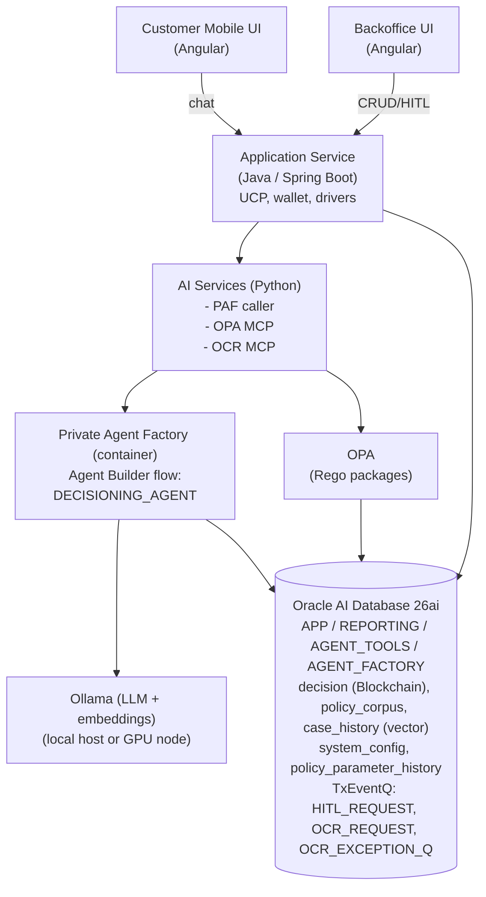

# Decisioning Engine PoC — Design

This document is the **architectural plan** for the PoC. It does not prescribe code. The use case it supports is fully described in [DECISIONING-ENGINE-USE-CASE.md](DECISIONING-ENGINE-USE-CASE.md); the platform it runs on is summarised in [PAF.md](PAF.md). Deployment specifics live in [DEPLOYMENT.md](DEPLOYMENT.md).

The PoC is intentionally a _scaffolding_ — the repository layout, deployment topology, and component boundaries are fixed early so subsequent work can fill each component without re-arguing the seams.

---

## 1. Goals

- Demonstrate that **Oracle AI Database 26ai + Private Agent Factory** can run an end-to-end agentic banking flow (credit application decisioning).
- Prove **end-to-end observability**: every decision is reproducible from an append-only audit trail (Blockchain Table + per-tool audit + parameter history).
- Demonstrate the **PAF Hybrid runtime mode**: an Agent Builder flow in the PAF container that delegates SQL/RAG to in-database Select AI tools and external behaviour to MCP/REST tools.
- Provide **two deployment options** with the same source tree: a fully-local podman stack on a laptop or LAN, and a cloud stack provisioned on OCI with Terraform + Ansible.
- Keep the audience-facing posture **on-premises private by default** (Ollama everywhere), with a documented migration path to OCI Generative AI when sanctioned.
- Stay **bank-agnostic**: every threshold, weight, scale, policy parameter, and protected-attribute set lives in database configuration, not in code.

## 2. Non-goals

- Production-grade credit modelling (the dataset is synthetic and engineered to exercise paths, not to validate a model).
- Performance benchmarking (the test bench is for functionality and observability).
- Region-specific compliance attestation (the PoC is region-agnostic by design; the framework is operational, not legal).
- Counter-offer logic, real bureau integration, core-banking write-back, or production-grade Application Service hardening.

## 3. Audience and personas

| Persona                       | Surface              | What they do                                                             |
| ----------------------------- | -------------------- | ------------------------------------------------------------------------ |
| Loan applicant                | Customer mobile chat | Submits application, uploads documents, follows status, gets explanation |
| Bank operator (HITL reviewer) | Backoffice UI        | Picks up HITL tasks, reviews evidence, decides                           |
| Bank administrator            | Backoffice UI        | Edits `system_config`, flips Mandatory-HITL, manages users, views audit  |
| Fair-lending reviewer         | Backoffice UI        | Reviews disparate-impact samples, records conclusions                    |
| Risk analyst                  | Backoffice UI        | Drives Risk Management Dashboard, stress scenarios, drift alerts         |
| Demo presenter                | All of the above     | Walks the canonical test bench end-to-end                                |

## 4. High-level architecture

The deployment is one logical system with several cooperating components. Their boundaries follow the PAF [MCP security pattern](PAF.md): agents call MCP/REST tools, never application tables directly.



Components communicate as follows:

- **Customer Mobile UI** → Application Service over REST. Auth is out of scope for the PoC; a mock login screen offers a dropdown of demo customers, selecting one fixes the `customer_id` used for every subsequent request. Logout returns to the picker.
- **Backoffice UI** → Application Service over REST. Auth is out of scope for the PoC; a mock login screen offers a dropdown of roles (HITL reviewer, admin, fair-lending reviewer, risk analyst), selecting one drives which sections are visible. Logout returns to the picker.
- Production deployments are expected to sit behind the host core-banking system's auth, so no SSO/OAuth/JWT/API Gateway wiring is built into the PoC.
- **Application Service** persists applications, owns document upload, runs cheap OPA pre-checks, and invokes the agent.
- **Application Service** invokes the **PAF published Agent Builder endpoint** for `DECISIONING_AGENT`, going through the AI Services tier to handle session-cookie acquisition and chunked response parsing (per PAF [APEX integration pattern](PAF.md#16-apex-integration-pattern) — the same bridge concern applies to any non-PAF caller).
- **PAF (DECISIONING_AGENT)** runs in the PAF container and calls:
  - **Select AI in-DB tools** for customer profile, transactions, bureau snapshot, policy/case vector search.
  - **OPA MCP** for eligibility, AML, KYC, escalation, fair-lending, pricing band.
  - **OCR MCP** for document field extraction and quality tiering.
  - **Ollama** as the configured LLM/embedding endpoint (LLM Management).
- **Decision + audit** are written back to Oracle DB by the agent's `record_decision` and `create_hitl_task` tools (in-DB SQL tools backed by `AGENT_TOOLS` package).

## 5. PAF runtime mode: Hybrid

The PoC runs in PAF's **Hybrid** mode (see [PAF.md §4.3](PAF.md#43-hybrid-agentworkflow)):

- The `DECISIONING_AGENT` is an **Agent Builder** flow hosted in the PAF container near the database.
- Heavy data work — SQL over banking views, vector search over `policy_corpus` and `case_history`, decision/audit writes — runs **in-database** via Select AI profiles, tasks, tools, and teams.
- Policy and side-effect work — OPA evaluation, OCR extraction, HITL task creation, optional notifications — runs in **near-DB MCP/REST services**.

Mapping the use case to PAF's component types:

| Decisioning capability                                  | PAF construct                                                  | Where it runs                |
| ------------------------------------------------------- | -------------------------------------------------------------- | ---------------------------- |
| Decision orchestration                                  | Agent Builder flow, Agent node                                 | Near-DB, PAF container       |
| LLM rationale composition                               | LLM node, configured Ollama                                    | Near-DB                      |
| Per-tool audit envelope                                 | Agent run → `decision_audit` writer                            | Tool wrapper inside PAF flow |
| Customer profile / transactions / bureau queries        | Select AI profile + tasks over curated views                   | In-DB                        |
| Policy citations, similar cases                         | Select AI RAG tool over Oracle AI Vector Search                | In-DB                        |
| OPA eligibility/AML/KYC/escalation/fair-lending/pricing | MCP Server node → OPA MCP (Python FastMCP)                     | Near-DB                      |
| Document extraction + quality tiering                   | MCP Server node → OCR MCP (Python)                             | GPU node                     |
| Append-only decision write                              | In-DB SQL tool in `AGENT_TOOLS` package                        | In-DB (Blockchain Table)     |
| HITL task creation                                      | In-DB SQL tool in `AGENT_TOOLS` package                        | In-DB                        |
| Customer chat surface                                   | Published Agent Builder run URL via Application Service bridge | Near-DB + external           |

## 6. Component breakdown

### 6.1 Custom application code (`src/`)

| Component                  | Tech                  | Responsibility                                                                                                                                                                                                                                                            |
| -------------------------- | --------------------- | ------------------------------------------------------------------------------------------------------------------------------------------------------------------------------------------------------------------------------------------------------------------------- |
| `src/backend/`             | Java 21 / Spring Boot | Application Service. Application CRUD, document upload to Object Storage, OPA pre-check fast-path, agent invocation, sanitised decision read-back. Uses UCP for pooling and Oracle Wallet for ADB.                                                                        |
| `src/ai/`                  | Python                | Three sub-services: (a) PAF caller (acquires session cookie, calls Agent Builder run URL, handles `roomId` continuity); (b) OPA MCP server (FastMCP, wraps OPA REST); (c) OCR MCP server (FastMCP, wraps YOLO + PaddleOCR/Tesseract). All exposed under `/mcp` or `/api`. |
| `src/frontend-backoffice/` | Angular               | HITL queue, decision browser, parameter management (`system_config` editor with reason capture), rule view (read-only Rego browser), risk dashboard, fair-lending review, customer search.                                                                                |
| `src/frontend-mobile/`     | Angular               | Simulated mobile chat for the loan applicant: conversation, document upload widget with quality-tier status, decision delivery, "why was I declined" follow-up.                                                                                                           |

### 6.2 Database (`database/`)

Liquibase changelogs in two parallel directories:

- `database/liquibase/oracle/` — local Oracle Free 26ai.
- `database/liquibase/adb/` — cloud Autonomous Database 26ai.

Both load the same banking + decisioning schema; differences confined to ADB-specific bootstrap (DBMS_CLOUD grants, wallet-aware connection, Select AI profile templates) and local-only conveniences (test users, sample data seed toggles).

Schema layers, following PAF's [recommended Oracle Database design pattern](PAF.md#193-recommended-oracle-database-design-pattern):

| Schema / User   | Contents                                                                                                                                                                                                                                                                             | Used by                                                                                                                                               |
| --------------- | ------------------------------------------------------------------------------------------------------------------------------------------------------------------------------------------------------------------------------------------------------------------------------------ | ----------------------------------------------------------------------------------------------------------------------------------------------------- |
| `APP`           | Banking tables: `customer`, `account*`, `loan_application*`, `decision` (Blockchain Table), `decision_audit`, `hitl_task`, `system_config`, `policy_parameter_history`, `fair_lending_review`. Also owns the **TxEventQ** queues (`HITL_REQUEST`, `OCR_REQUEST`, `OCR_EXCEPTION_Q`). | Application Service + agent enqueue/dequeue via scoped `dbms_aqadm.grant_queue_privilege` grants; the agent never writes the banking tables directly. |
| `REPORTING`     | Curated views over `APP` for NL2SQL: applicant profile view, transactions summary view, bureau view, case-history view                                                                                                                                                               | Select AI NL2SQL object lists; read-only                                                                                                              |
| `AGENT_TOOLS`   | PL/SQL packages exposed as Select AI tools / MCP tools: `record_decision`, `create_hitl_task`, `lookup_pricing`, `extract_features`                                                                                                                                                  | Agent only; tightly scoped grants                                                                                                                     |
| `AGENT_FACTORY` | PAF platform metadata only                                                                                                                                                                                                                                                           | PAF; no production data                                                                                                                               |
| Vector          | `policy_corpus`, `case_history` with `VECTOR(<dim>, FLOAT32)`                                                                                                                                                                                                                        | Select AI RAG profiles                                                                                                                                |

Embedding dimension is set once at deploy time and tied to the chosen Ollama embedding model. Changing embedding model later requires re-ingestion — flagged in deployment notes (see [PAF §6.6](PAF.md#66-embedding-models)).

### 6.3 Private Agent Factory artefacts

Stored under `paf/` and bootstrapped by `manage.py` after PAF is up:

- **LLM Management** configurations: `ollama-llm`, `ollama-embed` pointing at the configured Ollama host.
- **Data sources**: a Database data source over the `REPORTING` views (Select AI), a File data source for the seed `policy_corpus` PDFs/text.
- **Select AI profile** with NL2SQL object list scoped to `REPORTING.*`, RAG vector index over `policy_corpus`.
- **MCP Server nodes**: `opa-mcp` and `ocr-mcp`.
- **Agent Builder flow** `DECISIONING_AGENT`: Chat Input → Prompt (system rules + thresholds) → Agent (tools = Select AI Bridge to in-DB agent, OPA MCP, OCR MCP, In-DB Tool for `record_decision`/`create_hitl_task`) → Processing nodes (Parser, Condition for HITL fan-out) → Chat Output.
- **Published agent URL** captured in `.env` and surfaced by `manage.py info`.

The flow follows PAF's [authoring-to-execution pipeline](PAF.md#105-authoring-to-execution-pipeline): explicit inputs, explicit tool boundaries, explicit Condition/Parser gating before any side-effect node.

### 6.4 Configuration boundary

Two stores; nothing belongs in code:

- **`.env`** (rendered by `manage.py setup`): infrastructure pointers — OCI profile, region, compartment, ADB/Local-DB connection, Ollama host:port, OCR host:port, PAF host:port, SSH key, OCI GenAI region (future), wallet path, embedding dimension.
- **`APP.system_config`** (edited from Backoffice UI): policy parameters — `min_age`, `dti_hard_cap`, `pti_hard_cap`, `score_floor`, `score_caution_band_upper`, `auto_approve_amount_cap`, OCR confidence thresholds, fair-lending bucketing, **`mandatory_hitl`** master switch, weight set for the composite confidence score, and **`document_requirements_matrix`** (JSON: required `doc_type` set keyed by `(product_type, employment_type, residency_status, amount_band)`).

Every write to `system_config` produces a row in `policy_parameter_history` (who, when, old value, new value, reason).

## 7. Source layout

```
oracle-database-private-agent-factory-poc/
├── manage.py                 # Click-based CLI
├── requirements.txt
├── .env                      # rendered by `manage.py setup`; not committed
├── LOCAL.md                  # user-facing local-deployment playbook
├── CLOUD.md                  # user-facing cloud-deployment playbook
├── README.md
├── docs/
│   ├── DESIGN.md
│   ├── DEPLOYMENT.md
│   ├── PAF.md
│   └── DECISIONING-ENGINE-USE-CASE.md
├── src/
│   ├── backend/              # Spring Boot Application Service
│   ├── ai/                   # Python services: PAF caller, OPA MCP, OCR MCP
│   ├── frontend-backoffice/  # Angular
│   └── frontend-mobile/      # Angular
├── database/
│   └── liquibase/
│       ├── oracle/           # local Oracle Free 26ai changelog
│       └── adb/              # cloud ADB 26ai changelog
├── paf/
│   ├── llm-management/       # JSON/Yaml templates for Ollama LLM/embed configs
│   ├── data-sources/         # data source manifests (DB + file)
│   ├── select-ai/            # profile + NL2SQL object list + vector index
│   ├── mcp-servers/          # OPA + OCR registration payloads
│   └── flows/                # Agent Builder flow export (DECISIONING_AGENT)
├── opa/
│   └── packages/             # eligibility, aml, kyc, escalation, fair_lending, pricing, product (.rego)
├── ocr/
│   └── models/               # YOLO weights + OCR config; not committed
├── deploy/
│   ├── podman/               # compose / quadlet files, .env templates
│   ├── tf/
│   │   ├── app/              # root module; renders tfvars from .env
│   │   └── modules/
│   │       ├── paf/
│   │       ├── model/        # Ollama + OCR on a GPU shape
│   │       ├── app/          # Spring Boot + Python services + OPA
│   │       ├── front/        # both Angular frontends behind LB paths
│   │       ├── ops/          # bastion + utilities
│   │       └── adbs/         # Autonomous Database 26ai
│   └── ansible/
│       ├── paf/
│       ├── model/
│       ├── app/
│       ├── front/
│       └── ops/
└── venv/                     # local virtualenv; not committed
```

A future `images/` directory will hold architecture diagrams once the implementation is stable.

## 8. Data flow — happy path (APPROVE)

The customer interacts via a chat-driven flow; every turn is a `DECISIONING_AGENT` invocation threaded by `roomId`. The agent drives document collection — it asks for what _this_ applicant needs, not a fixed bundle — and only proceeds to the formal decision once everything is in place.

1. Customer opens mobile chat, says what they want (product, amount, purpose, term). Agent asks structured follow-ups (employment type, residency status, salary band, existing facilities) to build a partial applicant profile.
2. Agent calls **OPA `required_documents(applicant_so_far, product)`** → returns the required doc set keyed by `(product_type, employment_type, residency_status, amount_band)`. The matrix lives in `system_config.document_requirements_matrix`; Select AI RAG can retrieve policy snippets to explain _why_ each document is needed.
3. Agent presents the list in chat and requests uploads. Each upload → Application Service writes a `loan_application_document` row, uploads the file to Object Storage, enqueues `OCR_REQUEST` (TxEventQ).
4. OCR worker dequeues, **classifies** the document (`doc_type` ∈ `ID` / `PAYSLIP` / `STATEMENT` / `TAX_RETURN` / `ADDRESS_PROOF` / `OTHER`) and extracts per-field values; writes back `doc_type`, `ocr_payload`, `ocr_confidence`, `quality_tier`. Failures retry up to `max_retries`; poison messages land in `OCR_EXCEPTION_Q`.
5. Agent verifies completeness via `check_document_completeness`: every required `doc_type` has at least one USABLE document with required fields extracted. Missing / MARGINAL / UNUSABLE / mismatched (e.g., a statement uploaded when an ID was requested — the classifier catches it) → agent re-asks (back to step 3). Only when complete does the conversation move on.
6. Application Service runs **cheap OPA pre-checks** over REST (sanctions, age, doc presence). Clean → continue. Hit → short-circuit REJECT.
7. Agent reads `system_config` (`mandatory_hitl`, thresholds) via In-DB Tool, then runs Select AI tools to pull profile, transactions, bureau snapshot.
8. OPA MCP evaluates eligibility, AML, KYC, fair-lending pre-flight, escalation. All docs USABLE, OPA `allow`, confidence ≥ threshold → calls OPA `lookup_pricing` → Select AI RAG retrieves policy citations.
9. In-DB Tool `record_decision` writes a row to `decision` (Blockchain Table) with rationale + citations + offer.
10. PAF returns NDJSON; AI Services parses and hands a sanitised decision view to the Application Service, which surfaces it to the mobile UI.

For REFER_HUMAN paths (any warn, persistent MARGINAL OCR after re-upload, fair-lending flag, mandatory-HITL on), step 8 ends with `create_hitl_task` instead of `lookup_pricing`. The in-DB tool writes a row to `hitl_task` **and** enqueues `HITL_REQUEST` (TxEventQ) in the same transaction; a backoffice reviewer claims it later by `DEQONE` (atomic with the OPEN → IN_REVIEW state transition). The audit still captures all OPA outputs. For REJECT paths, the agent short-circuits after the deny is observed but still records the audit. See [DECISIONING-ENGINE-USE-CASE.md §Test Bench](DECISIONING-ENGINE-USE-CASE.md) and [§Async messaging](DECISIONING-ENGINE-USE-CASE.md#async-messaging--txeventq-queues) for the queue inventory and full path matrix.

## 9. Observability model

Four layers, all inspectable from the Backoffice UI:

1. **Per-tool audit** (`decision_audit`) — every tool call's input, output, duration, status, ordered by `agent_run_id` + `step_no`.
2. **Append-only decision history** (`decision`) — Oracle Blockchain Table with `NO DROP UNTIL 7 YEARS IDLE`, `NO DELETE LOCKED`, `SHA2_512` hashing. Surface a "tamper attempt rejected by DB" demo path.
3. **Parameter history** (`policy_parameter_history`) — versioned `system_config` edits with reason. Pair with the audit view to interpret a past decision against its then-current parameters.
4. **Replay** — Backoffice can re-run the agent against a stored audit input and diff outputs.

## 10. Security boundary

| Concern                   | Mechanism                                                                                                                                                                                                                                         |
| ------------------------- | ------------------------------------------------------------------------------------------------------------------------------------------------------------------------------------------------------------------------------------------------- |
| Identity at the edge      | Out of scope for the PoC. UIs ship a mock login picker (customer dropdown on mobile, role dropdown on backoffice) and a logout to swap session; production assumes the host core-banking system provides auth in front of the Application Service |
| Identity inside the agent | `AGENT_FACTORY` user owns PAF metadata only; tool execution maps to least-privilege schemas                                                                                                                                                       |
| NL2SQL guardrail          | Select AI profile object list pinned to `REPORTING.*` views, never base tables                                                                                                                                                                    |
| Side-effects              | Always via PL/SQL packages or MCP tools, never raw SQL from the LLM (per PAF [§17.5](PAF.md#175-tool-security))                                                                                                                                   |
| Sensitive attributes      | `customer_protected_attrs` kept separate; access logged; not passed to the LLM unless explicitly needed                                                                                                                                           |
| Audit                     | Blockchain Table for the decision; standard table for tool-call detail with archive-to-blockchain option                                                                                                                                          |
| Wallet / connection       | Oracle Wallet for ADB; UCP pool sizing pinned per service                                                                                                                                                                                         |

## 11. Locked decisions

- **Initial scope — "Hello agent".** `manage.py setup local && manage.py local up` brings up Oracle Database Free 26ai + Ollama + PAF, runs Liquibase, and exposes a trivial Agent Builder flow (`Chat Input → Prompt → LLM → Chat Output`) calling Ollama. No OPA, no OCR, no Select AI tools, no Blockchain Table writes yet. Proves the platform wiring end-to-end before any decisioning logic is added.
- **Generative model**: **`llama3.3:70b-instruct-q4_K_M`** served by Ollama. In Ollama's official library; native tool-call support (the agent's DAG depends on reliable JSON/tool-call adherence); usable from Oracle Select AI profiles via `provider => 'ollama'` without code changes. Inference footprint ~55–60 GB (weights + KV cache + `bge-m3` resident), so it fits on a single A10/A100/H100 in the cloud topology and on a 128 GB DGX Spark for desk-side demos. On DGX Spark expect ~6–8 tok/s (bandwidth-limited at ~273 GB/s LPDDR5x); cloud A100/H100 gets ~30–50 tok/s with no code change.
- **Embedding model**: **`bge-m3`** at **1024 dimensions** served by Ollama. In Ollama's official library; multilingual (fits the bank-agnostic story); strong retrieval scores on MTEB; usable as the embedding model in Select AI RAG profiles and Oracle AI Vector Search. Locked at deploy time; any change requires re-ingestion of `policy_corpus` and `case_history`. (Per [PAF §6.6](PAF.md#66-embedding-models).)
- **Local database image**: full **Oracle Database Free 26ai** container (not the _-lite_ variant), to keep parity with ADB capabilities (Blockchain Tables, Vector, Select AI).
- **`DECISIONING_AGENT` shape**: explicit Agent Builder **DAG** (Prompt → Agent → Parser → Condition → side-effect nodes), not a single Agent-node-with-tools. Chosen because the use case's "observability over determinism" headline benefits from per-step audit, even at the cost of more nodes to maintain. The current hello-world flow is intentionally trivial (no tools); the DAG shape applies to the full decisioning flow in v1+.
- **SQL tooling**: queries against `REPORTING.*` views are exposed as **Select AI In-Database Tools** referenced from the PAF flow via the Select AI Bridge node, not as plain SQL Query nodes. (Per [PAF §14.5](PAF.md#145-agent-builder-select-ai-nodes).)
- **OPA bundle reload on parameter change**: planned for **v1**. Currently OPA loads its bundle once at boot; parameter edits in the Backoffice still write `policy_parameter_history` but require an OPA restart to take effect.
- **PAF bootstrap automation**: `manage.py paf bootstrap` prints an ordered checklist of manual UI steps (LLM Management entries, data sources, Select AI profile, MCP servers, Agent Builder flow import). API automation is added later when the PAF admin endpoints are stable enough to drive headlessly. Playwright-driven UI automation is explicitly out of scope (too fragile across PAF versions).
- **Auth — out of scope; mock login on both UIs.** The audience (host core-banking system) is assumed to provide auth in production, so no SSO/OAuth/JWT/API Gateway is wired into the PoC. The mobile UI shows a dropdown of demo customers (selection sets the active `customer_id`); the backoffice shows a dropdown of roles (HITL reviewer, admin, fair-lending reviewer, risk analyst — which gates visible sections). Both UIs offer logout to swap user or role mid-demo.
- **Async messaging — Oracle Database TxEventQ.** All async/offline work (HITL claim, OCR pipeline, retries, future fan-out) runs through TxEventQ queues owned by `APP`. JSON payloads, single-consumer queues, idempotent DDL (catch `ORA-24006`/`ORA-24010`), per-schema `dbms_aqadm.grant_queue_privilege` rather than `aq_administrator_role`, and a dedicated exception queue for poison messages. Initial inventory: `HITL_REQUEST`, `OCR_REQUEST`, `OCR_EXCEPTION_Q`. Future queues (`NOTIFICATION`, `OPA_BUNDLE_RELOAD`, `FAIR_LENDING_SAMPLING`, `ARCHIVE`) follow the same pattern. See [DECISIONING-ENGINE-USE-CASE.md §Async messaging](DECISIONING-ENGINE-USE-CASE.md#async-messaging--txeventq-queues).

## 12. Decisions not yet locked

- **OCR engine**: PaddleOCR vs Tesseract. Pick during the first OCR smoke test on the synthetic templates; the MCP boundary keeps the choice swappable.
- **HITL assignment policy**: claim-next from `HITL_REQUEST` is the default. Whether to support reviewer-pinned assignment (admin reassigns to a named reviewer) is open; the queue already supports it via `correlation`.
- **Wallet rotation**: out of scope for the PoC; documented as a follow-up.
