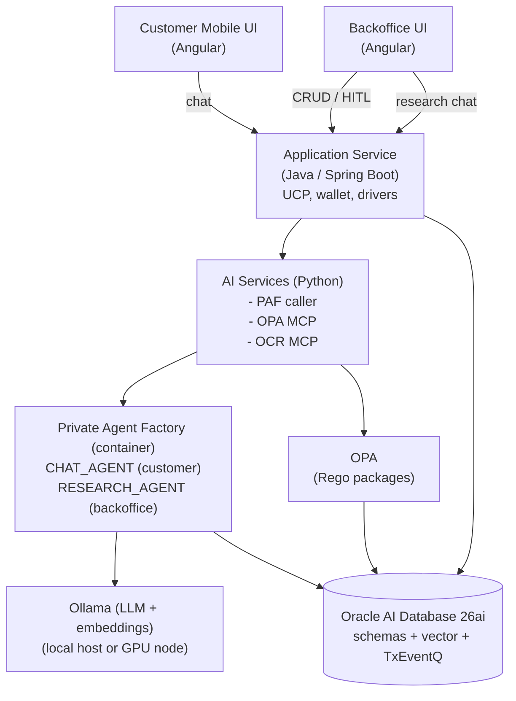

# Decisioning Engine PoC — Design

This document is the **architectural plan** for the PoC. It does not prescribe code. The use case it supports is fully described in [DECISIONING-ENGINE-USE-CASE.md](DECISIONING-ENGINE-USE-CASE.md); the platform it runs on is summarised in [PAF.md](PAF.md). Deployment specifics live in [DEPLOYMENT.md](DEPLOYMENT.md).

The PoC is intentionally a _scaffolding_ — the repository layout, deployment topology, and component boundaries are fixed early so subsequent work can fill each component without re-arguing the seams.

---

## 1. Goals

- Demonstrate that **Oracle AI Database 26ai + Private Agent Factory** can run an end-to-end agentic banking flow (credit application decisioning).
- Prove **end-to-end observability**: every decision is reproducible from an append-only audit trail (Blockchain Table + per-tool audit + parameter history).
- Demonstrate the **PAF Hybrid runtime mode**: an Agent Builder flow in the PAF container that delegates SQL/RAG to in-database Select AI tools and external behaviour to MCP/REST tools.
- Provide **two deployment options** with the same source tree: a fully-local podman stack on a laptop or LAN, and a cloud stack provisioned on OCI with Terraform + Ansible.
- Keep the audience-facing posture **on-premises private by default** (Ollama everywhere), with a documented migration path to OCI Generative AI when sanctioned.
- Stay **bank-agnostic**: every threshold, weight, scale, policy parameter, and protected-attribute set lives in database configuration, not in code.

## 2. Non-goals

- Production-grade credit modelling (the dataset is synthetic and engineered to exercise paths, not to validate a model).
- Performance benchmarking (the test bench is for functionality and observability).
- Region-specific compliance attestation (the PoC is region-agnostic by design; the framework is operational, not legal).
- Counter-offer logic, real bureau integration, core-banking write-back, or production-grade Application Service hardening.

## 3. Audience and personas

| Persona                            | Surface                             | What they do                                                                                                                                              |
| ---------------------------------- | ----------------------------------- | --------------------------------------------------------------------------------------------------------------------------------------------------------- |
| Loan applicant (customer)          | Customer mobile chat                | Drives the chat, uploads documents, gets a status ("under review"); the customer is the primary user of the `CHAT_AGENT`                                  |
| Credit risk analyst (agent author) | **PAF Builder UI**                  | Wires the `CHAT_AGENT` and `RESEARCH_AGENT` flows in PAF: tools, Select AI profile, RAG, system prompts; owns the recommendation tiers and explore-hints  |
| Application developer (platform)   | IDE, repo, deploy tooling           | Builds and operates the MCP tools (OCR, OPA, in-DB writers), the chat UI, the backoffice, the `AGENT_TOOLS` package, the queues, the deployment scripting |
| HITL reviewer / loan officer       | Backoffice UI + Case Research Agent | Picks up tasks from the queue, reads the recommendation + reasoning + evidence, talks to the Case Research Agent for context, decides                     |
| Bank administrator                 | Backoffice UI                       | Edits `system_config`, manages users, views audit                                                                                                         |
| Fair-lending reviewer              | Backoffice UI                       | Reviews disparate-impact samples, records conclusions                                                                                                     |
| Risk analyst                       | Backoffice UI                       | Drives Risk Management Dashboard, stress scenarios, drift alerts                                                                                          |

## 4. High-level architecture

The deployment is one logical system with several cooperating components. Their boundaries follow the PAF [MCP security pattern](PAF.md): agents call MCP/REST tools, never application tables directly.



Components communicate as follows:

- **Customer Mobile UI** → Application Service over REST. Auth is out of scope for the PoC; a mock login screen offers a dropdown of demo customers, selecting one fixes the `customer_id` used for every subsequent request. Logout returns to the picker.
- **Backoffice UI** → Application Service over REST. Auth is out of scope for the PoC; a mock login screen offers a dropdown of roles (HITL reviewer, admin, fair-lending reviewer, risk analyst), selecting one drives which sections are visible. Logout returns to the picker.
- Production deployments are expected to sit behind the host core-banking system's auth, so no SSO/OAuth/JWT/API Gateway wiring is built into the PoC.
- **Application Service** persists applications, owns document upload, runs cheap OPA pre-checks, and invokes the agents. It exposes two distinct PAF surfaces: `/chat/*` for the customer `CHAT_AGENT` and `/research/*` for the backoffice `RESEARCH_AGENT`.
- **Application Service** invokes each **PAF published Agent Builder endpoint** going through the AI Services tier to handle session-cookie acquisition and chunked response parsing (per PAF [APEX integration pattern](PAF.md#16-apex-integration-pattern) — the same bridge concern applies to any non-PAF caller).
- **PAF (`CHAT_AGENT`, customer-facing)** runs in the PAF container and calls:
  - **Select AI in-DB tools** over the customer-safe `REPORTING.*` view set (own profile, transactions, bureau snapshot, existing facilities).
  - **OPA MCP** for eligibility, AML, KYC, escalation, fair-lending, pricing band — inputs to the recommendation, not the decision.
  - **OCR MCP** for document field extraction and quality tiering.
  - **Ollama** as the configured LLM/embedding endpoint (LLM Management).
  - In-DB tool `create_hitl_task` to write a recommendation packet to the HITL queue.
  - **Never** writes to `decision`; the agent does not decide.
- **PAF (`RESEARCH_AGENT`, backoffice-only)** runs in the same PAF container with a **broader, read-only tool scope** — full transaction history, `decision_audit`, `policy_parameter_history`, deeper similarity over `case_history`, RAG over `policy_corpus`. It has **no side-effect tools** (no `create_hitl_task`, no `record_decision`). Invocation is gated by the backoffice (the customer chat path cannot reach it).
- **Final decision** is written to `decision` (Blockchain Table) **by the Application Service when the HITL reviewer closes the task** — never by an agent. The agent's recommendation packet is captured as columns on the same row, so each Blockchain row is exactly one bank decision.

## 5. PAF runtime mode: Hybrid

The PoC runs in PAF's **Hybrid** mode (see [PAF.md §4.3](PAF.md#43-hybrid-agentworkflow)) and configures **two distinct agents** in the same PAF container, with different tool scopes and different security envelopes:

- **`CHAT_AGENT`** — customer-facing. Reads only the customer-safe `REPORTING.*` view set, runs OCR + OPA, writes a recommendation packet to `hitl_task` via the `create_hitl_task` in-DB tool. Cannot write to `decision`.
- **`RESEARCH_AGENT`** — backoffice-only. Reads a **broader, read-only** scope (full transaction history, `decision_audit`, `policy_parameter_history`, deeper `case_history` similarity, RAG over `policy_corpus`). Has **no side-effect tools** — it cannot create HITL tasks, cannot record decisions, cannot mutate state of any kind.

Heavy data work — SQL over banking views, vector search over `policy_corpus` and `case_history` — runs **in-database** via Select AI profiles, tasks, tools, and teams. Policy and side-effect work — OPA evaluation, OCR extraction, HITL task creation — runs in **near-DB MCP/REST services** and is wired to `CHAT_AGENT` only.

Mapping the use case to PAF's component types:

| Capability                                                  | PAF construct                                                  | Wired to            | Where it runs                |
| ----------------------------------------------------------- | -------------------------------------------------------------- | ------------------- | ---------------------------- |
| Chat orchestration (customer)                               | Agent Builder flow, Agent node                                 | `CHAT_AGENT`        | Near-DB, PAF container       |
| Research orchestration (backoffice)                         | Agent Builder flow, Agent node                                 | `RESEARCH_AGENT`    | Near-DB, PAF container       |
| LLM rationale + research composition                        | LLM node, configured Ollama                                    | Both                | Near-DB                      |
| Per-tool audit envelope                                     | Agent run → `decision_audit` writer                            | `CHAT_AGENT`        | Tool wrapper inside PAF flow |
| Customer profile / transactions / bureau queries            | Select AI profile + tasks over curated views                   | `CHAT_AGENT`        | In-DB                        |
| Broader read scope (audit, parameter history, deeper cases) | Select AI profile + tasks over backoffice view set             | `RESEARCH_AGENT`    | In-DB                        |
| Policy citations, similar cases                             | Select AI RAG tool over Oracle AI Vector Search                | Both                | In-DB                        |
| OPA eligibility/AML/KYC/escalation/fair-lending/pricing     | MCP Server node → OPA MCP (Python FastMCP)                     | `CHAT_AGENT`        | Near-DB                      |
| Document extraction + quality tiering                       | MCP Server node → OCR MCP (Python)                             | `CHAT_AGENT`        | GPU node                     |
| HITL task creation (recommendation packet)                  | In-DB SQL tool in `AGENT_TOOLS` package                        | `CHAT_AGENT`        | In-DB                        |
| Final decision write (Blockchain)                           | Application Service on HITL close — **never an agent**         | Application Service | In-DB (Blockchain Table)     |
| Customer chat surface                                       | Published Agent Builder run URL via Application Service bridge | `CHAT_AGENT`        | Near-DB + external           |
| Backoffice research surface                                 | Published Agent Builder run URL via Application Service bridge | `RESEARCH_AGENT`    | Near-DB + external           |

## 6. Component breakdown

### 6.1 Custom application code (`src/`)

| Component                  | Tech                  | Responsibility                                                                                                                                                                                                                                                            |
| -------------------------- | --------------------- | ------------------------------------------------------------------------------------------------------------------------------------------------------------------------------------------------------------------------------------------------------------------------- |
| `src/backend/`             | Java 21 / Spring Boot | Application Service. Application CRUD, document upload to Object Storage, OPA pre-check fast-path, agent invocation, sanitised decision read-back. Uses UCP for pooling and Oracle Wallet for ADB.                                                                        |
| `src/ai/`                  | Python                | Three sub-services: (a) PAF caller (acquires session cookie, calls Agent Builder run URL, handles `roomId` continuity); (b) OPA MCP server (FastMCP, wraps OPA REST); (c) OCR MCP server (FastMCP, wraps YOLO + PaddleOCR/Tesseract). All exposed under `/mcp` or `/api`. |
| `src/frontend-backoffice/` | Angular               | HITL queue, decision browser, parameter management (`system_config` editor with reason capture), rule view (read-only Rego browser), risk dashboard, fair-lending review, customer search.                                                                                |
| `src/frontend-mobile/`     | Angular               | Simulated mobile chat for the loan applicant: conversation, document upload widget with quality-tier status, decision delivery, "why was I declined" follow-up.                                                                                                           |

### 6.2 Database (`database/`)

Liquibase changelogs in two parallel directories:

- `database/liquibase/oracle/` — local Oracle Free 26ai.
- `database/liquibase/adb/` — cloud Autonomous Database 26ai.

Both load the same banking + decisioning schema; differences confined to ADB-specific bootstrap (DBMS_CLOUD grants, wallet-aware connection, Select AI profile templates) and local-only conveniences (test users, sample data seed toggles).

Schema layers, following PAF's [recommended Oracle Database design pattern](PAF.md#193-recommended-oracle-database-design-pattern):

| Schema / User   | Contents                                                                                                                                                                                                                                                                                                                                                                                      | Used by                                                                                                                                           |
| --------------- | --------------------------------------------------------------------------------------------------------------------------------------------------------------------------------------------------------------------------------------------------------------------------------------------------------------------------------------------------------------------------------------------- | ------------------------------------------------------------------------------------------------------------------------------------------------- |
| `APP`           | Banking tables: `customer`, `account*`, `loan_application*`, `decision` (Blockchain Table — written by the Application Service when a HITL task closes), `decision_audit`, `hitl_task` (carries the agent's recommendation packet), `system_config`, `policy_parameter_history`, `fair_lending_review`. Also owns the **TxEventQ** queues (`HITL_REQUEST`, `OCR_REQUEST`, `OCR_EXCEPTION_Q`). | Application Service + agent enqueue/dequeue via scoped `dbms_aqadm.grant_queue_privilege` grants; agents never write the banking tables directly. |
| `REPORTING`     | Two curated view sets over `APP` for NL2SQL: a **customer-safe** set for `CHAT_AGENT` (own profile, transactions summary, bureau snapshot, existing facilities) and a **backoffice-broader** set for `RESEARCH_AGENT` (full transaction history, `decision_audit`, `policy_parameter_history`, deeper `case_history`).                                                                        | Two Select AI NL2SQL object lists — one per agent; read-only on both sides.                                                                       |
| `AGENT_TOOLS`   | PL/SQL packages exposed as Select AI tools / MCP tools: `create_hitl_task` (writes the recommendation packet), `lookup_pricing`, `extract_features`. `record_decision` is **not** an agent tool — the Application Service writes the Blockchain row when the human closes a HITL task.                                                                                                        | `CHAT_AGENT` only; tightly scoped grants. `RESEARCH_AGENT` has no execute grant here.                                                             |
| `AGENT_FACTORY` | PAF platform metadata only                                                                                                                                                                                                                                                                                                                                                                    | PAF; no production data                                                                                                                           |
| Vector          | `policy_corpus`, `case_history` with `VECTOR(<dim>, FLOAT32)`                                                                                                                                                                                                                                                                                                                                 | Select AI RAG profiles — both agents read; neither writes.                                                                                        |

Embedding dimension is set once at deploy time and tied to the chosen Ollama embedding model. Changing embedding model later requires re-ingestion — flagged in deployment notes (see [PAF §6.6](PAF.md#66-embedding-models)).

### 6.3 Private Agent Factory artefacts

Stored under `paf/` and bootstrapped by `manage.py` after PAF is up:

- **LLM Management** configurations: `ollama-llm`, `ollama-embed` pointing at the configured Ollama host.
- **Data sources**: two Database data sources over `REPORTING` (one customer-safe, one backoffice-broader), plus a File data source for the seed `policy_corpus` PDFs/text.
- **Select AI profiles**:
  - `chat_profile` — NL2SQL object list scoped to the customer-safe `REPORTING.*` views, RAG vector index over `policy_corpus`.
  - `research_profile` — NL2SQL object list scoped to the broader backoffice `REPORTING.*` views (full transactions, `decision_audit`, `policy_parameter_history`, `case_history`), RAG over both `policy_corpus` and `case_history`.
- **MCP Server nodes**: `opa-mcp` and `ocr-mcp` — registered, but wired only to `CHAT_AGENT`.
- **Agent Builder flows** (two):
  - `CHAT_AGENT`: Chat Input → Prompt (system rules + tier thresholds) → Agent (tools = Select AI Bridge over `chat_profile`, OPA MCP, OCR MCP, In-DB Tool `create_hitl_task`) → Processing nodes (Parser, Condition for OCR re-ask / completeness loop) → Chat Output. Side-effect tools limited to `create_hitl_task`; **no** `record_decision`.
  - `RESEARCH_AGENT`: Chat Input → Prompt (read-only research system rules) → Agent (tools = Select AI Bridge over `research_profile`, RAG, no MCP tools, no In-DB write tools) → Chat Output. The flow is intentionally simple — its value is the broader read scope and the conversational interface, not orchestration.
- **Published agent URLs** captured in `.env` (`PAF_CHAT_RUN_URL`, `PAF_RESEARCH_RUN_URL`) and surfaced by `manage.py info`.

Both flows follow PAF's [authoring-to-execution pipeline](PAF.md#105-authoring-to-execution-pipeline): explicit inputs, explicit tool boundaries, explicit Condition/Parser gating before any side-effect node.

### 6.4 Configuration boundary

Two stores; nothing belongs in code:

- **`.env`** (rendered by `manage.py setup`): infrastructure pointers — OCI profile, region, compartment, ADB/Local-DB connection, Ollama host:port, OCR host:port, PAF host:port, SSH key, OCI GenAI region (future), wallet path, embedding dimension.
- **`APP.system_config`** (edited from Backoffice UI): policy parameters — `min_age`, `dti_hard_cap`, `pti_hard_cap`, `score_floor`, `score_caution_band_upper`, OCR confidence thresholds, fair-lending bucketing, the **recommendation-tier weight set** (drives `APPROVE` / `REVIEW` / `DECLINE` from the composite signal), and the **`document_requirements_matrix`** (JSON: required `doc_type` set keyed by `(product_type, employment_type, residency_status, amount_band)`). No Mandatory-HITL toggle — every application produces a HITL task by design.

Every write to `system_config` produces a row in `policy_parameter_history` (who, when, old value, new value, reason).

## 7. Source layout

```
oracle-database-private-agent-factory-poc/
├── manage.py                 # Click-based CLI
├── requirements.txt
├── .env                      # rendered by `manage.py setup`; not committed
├── LOCAL.md                  # user-facing local-deployment playbook
├── CLOUD.md                  # user-facing cloud-deployment playbook
├── README.md
├── docs/
│   ├── DESIGN.md
│   ├── DEPLOYMENT.md
│   ├── PAF.md
│   └── DECISIONING-ENGINE-USE-CASE.md
├── src/
│   ├── backend/              # Spring Boot Application Service
│   ├── ai/                   # Python services: PAF caller, OPA MCP, OCR MCP
│   ├── frontend-backoffice/  # Angular
│   └── frontend-mobile/      # Angular
├── database/
│   └── liquibase/
│       ├── oracle/           # local Oracle Free 26ai changelog
│       └── adb/              # cloud ADB 26ai changelog
├── paf/
│   ├── llm-management/       # JSON/Yaml templates for Ollama LLM/embed configs
│   ├── data-sources/         # data source manifests (DB + file)
│   ├── select-ai/            # profile + NL2SQL object list + vector index
│   ├── mcp-servers/          # OPA + OCR registration payloads
│   └── flows/                # Agent Builder flow exports: HELLO_AGENT, CHAT_AGENT, RESEARCH_AGENT
├── opa/
│   └── packages/             # eligibility, aml, kyc, escalation, fair_lending, pricing, product (.rego)
├── ocr/
│   └── models/               # YOLO weights + OCR config; not committed
├── deploy/
│   ├── podman/               # compose / quadlet files, .env templates
│   ├── tf/
│   │   ├── app/              # root module; renders tfvars from .env
│   │   └── modules/
│   │       ├── paf/
│   │       ├── model/        # Ollama + OCR on a GPU shape
│   │       ├── app/          # Spring Boot + Python services + OPA
│   │       ├── front/        # both Angular frontends behind LB paths
│   │       ├── ops/          # bastion + utilities
│   │       └── adbs/         # Autonomous Database 26ai
│   └── ansible/
│       ├── paf/
│       ├── model/
│       ├── app/
│       ├── front/
│       └── ops/
└── venv/                     # local virtualenv; not committed
```

A future `images/` directory will hold architecture diagrams once the implementation is stable.

## 8. Data flow — every application produces a recommendation packet

The customer interacts via a chat-driven flow; every turn is a `CHAT_AGENT` invocation threaded by `roomId`. The agent drives document collection — it asks for what _this_ applicant needs, not a fixed bundle — and only emits its recommendation once everything is in place. **There is no auto-approve and no auto-reject path: every application that completes document collection produces exactly one HITL task carrying the agent's recommendation, and the human reviewer makes the final decision.**

1. Customer opens mobile chat, says what they want (product, amount, purpose, term). Agent asks structured follow-ups (employment type, residency status, salary band, existing facilities) to build a partial applicant profile.
2. Agent calls **OPA `required_documents(applicant_so_far, product)`** → returns the required doc set keyed by `(product_type, employment_type, residency_status, amount_band)`. The matrix lives in `system_config.document_requirements_matrix`; Select AI RAG can retrieve policy snippets to explain _why_ each document is needed.
3. Agent presents the list in chat and requests uploads. Each upload → Application Service writes a `loan_application_document` row, uploads the file to Object Storage, enqueues `OCR_REQUEST` (TxEventQ).
4. OCR worker dequeues, **classifies** the document (`doc_type` ∈ `ID` / `PAYSLIP` / `STATEMENT` / `TAX_RETURN` / `ADDRESS_PROOF` / `OTHER`) and extracts per-field values; writes back `doc_type`, `ocr_payload`, `ocr_confidence`, `quality_tier`. Failures retry up to `max_retries`; poison messages land in `OCR_EXCEPTION_Q`.
5. Agent verifies completeness via `check_document_completeness`: every required `doc_type` has at least one USABLE document with required fields extracted. Missing / MARGINAL / UNUSABLE / mismatched (e.g., a statement uploaded when an ID was requested — the classifier catches it) → agent re-asks (back to step 3). Persistent UNUSABLE after a re-upload feeds into the recommendation as a `DECLINE` signal; persistent MARGINAL feeds in as a `REVIEW` signal; the agent does not silently terminate the application.
6. Agent reads `system_config` thresholds and tier weights via In-DB Tool, then runs Select AI tools over `chat_profile` to pull profile, transactions, bureau snapshot.
7. OPA MCP evaluates eligibility, AML, KYC, fair-lending pre-flight, escalation. Each tool output (allow / deny / warn) is captured as evidence for the recommendation; **deny does not short-circuit to REJECT** — it becomes a strong signal toward the `DECLINE` tier on the recommendation packet.
8. Select AI RAG retrieves policy citations relevant to the signals observed; for `APPROVE` candidates, OPA `lookup_pricing` returns an indicative rate band as part of the evidence packet.
9. Agent composes the **recommendation packet**: `tier ∈ {APPROVE, REVIEW, DECLINE}` (derived from OPA outputs + OCR tiers + signal weights in `system_config`), `reasoning` (LLM-composed, grounded in OPA outputs and cited policy chunks), `explore_hints` (populated for `REVIEW` only — short list of areas a reviewer should examine or follow-up data to request from the customer), and `evidence` (RAG citations, OPA outputs, OCR summary, computed DTI/PTI/score, indicative pricing).
10. In-DB Tool `create_hitl_task` writes one row to `hitl_task` carrying the recommendation packet **and** enqueues `HITL_REQUEST` (TxEventQ) in the same transaction. `decision_audit` captures every tool call. The agent does **not** write to `decision`.
11. PAF returns NDJSON; AI Services parses and surfaces a customer-facing status ("we're reviewing your application") via the Application Service. The customer never sees the recommendation tier.
12. A backoffice reviewer claims the task with `DEQONE` (atomic with `hitl_task` OPEN → IN_REVIEW), reads the recommendation + reasoning + evidence, may invoke `RESEARCH_AGENT` from the task detail screen to dig deeper, then submits a final decision. The Application Service writes the **`decision` Blockchain Table row** at task close — one row per bank decision, carrying both the human's final outcome and the original recommendation packet. The Blockchain row is the canonical, immutable record; `hitl_task` is closed.

See [DECISIONING-ENGINE-USE-CASE.md §Test Bench](DECISIONING-ENGINE-USE-CASE.md) and [§Async messaging](DECISIONING-ENGINE-USE-CASE.md#async-messaging--txeventq-queues) for the queue inventory and the per-tier scenario matrix.

## 9. Observability model

Four layers, all inspectable from the Backoffice UI:

1. **Per-tool audit** (`decision_audit`) — every `CHAT_AGENT` tool call's input, output, duration, status, ordered by `agent_run_id` + `step_no`. `RESEARCH_AGENT` runs are audited separately so research conversations don't pollute the decisioning trail (`research_audit`).
2. **Append-only decision history** (`decision`) — Oracle Blockchain Table with `NO DROP UNTIL 7 YEARS IDLE`, `NO DELETE LOCKED`, `SHA2_512` hashing. One row per bank decision, written by the Application Service when the reviewer closes the HITL task; carries both the human's final outcome and the original agent recommendation packet. Surface a "tamper attempt rejected by DB" demo path.
3. **Parameter history** (`policy_parameter_history`) — versioned `system_config` edits with reason. Pair with the audit view to interpret a past decision against its then-current parameters.
4. **Replay** — Backoffice can re-run `CHAT_AGENT` against a stored audit input and diff outputs (recommendation packets); reviewers can also replay a research conversation against the same point-in-time snapshot.

## 10. Security boundary

| Concern                             | Mechanism                                                                                                                                                                                                                                                                      |
| ----------------------------------- | ------------------------------------------------------------------------------------------------------------------------------------------------------------------------------------------------------------------------------------------------------------------------------ |
| Identity at the edge                | Out of scope for the PoC. UIs ship a mock login picker (customer dropdown on mobile, role dropdown on backoffice) and a logout to swap session; production assumes the host core-banking system provides auth in front of the Application Service.                             |
| Identity inside the agents          | `AGENT_FACTORY` user owns PAF metadata only; tool execution maps to least-privilege schemas, per agent.                                                                                                                                                                        |
| NL2SQL guardrail (`CHAT_AGENT`)     | `chat_profile` object list pinned to the customer-safe `REPORTING.*` view set; no access to `decision_audit`, `policy_parameter_history`, or `customer_protected_attrs`.                                                                                                       |
| NL2SQL guardrail (`RESEARCH_AGENT`) | `research_profile` object list scoped to the broader backoffice `REPORTING.*` view set (full transactions, `decision_audit`, `policy_parameter_history`, deeper `case_history`). Still read-only; no base tables.                                                              |
| Side-effects                        | `CHAT_AGENT` may only call `create_hitl_task` (and OPA/OCR MCPs). `RESEARCH_AGENT` has **zero side-effect tools** — no `create_hitl_task`, no `record_decision`, no enqueue, no row writes. Enforced by `AGENT_TOOLS` grants and by which MCP servers are wired to which flow. |
| Decision write                      | Only the Application Service writes the `decision` Blockchain row, on HITL close. Neither agent has `INSERT` on `decision`.                                                                                                                                                    |
| Agent reachability                  | `CHAT_AGENT` published URL is consumed by the mobile UI only; `RESEARCH_AGENT` published URL is consumed by the backoffice UI only. The Application Service enforces routing — the customer chat path cannot invoke the research agent.                                        |
| Sensitive attributes                | `customer_protected_attrs` kept separate; access logged; not passed to either LLM unless explicitly needed (and never to `CHAT_AGENT`).                                                                                                                                        |
| Audit                               | Blockchain Table for the decision; standard tables for `decision_audit` and `research_audit` with archive-to-blockchain option.                                                                                                                                                |
| Wallet / connection                 | Oracle Wallet for ADB; UCP pool sizing pinned per service.                                                                                                                                                                                                                     |

## 11. Locked decisions

- **Initial scope — "Hello agent".** `manage.py setup local && manage.py local up` brings up Oracle Database Free 26ai + Ollama + PAF, runs Liquibase, and exposes a trivial Agent Builder flow (`Chat Input → Prompt → LLM → Chat Output`) calling Ollama. No OPA, no OCR, no Select AI tools, no Blockchain Table writes yet. Proves the platform wiring end-to-end before any decisioning logic is added.
- **Generative model**: **`llama3.3:70b-instruct-q4_K_M`** served by Ollama. In Ollama's official library; native tool-call support (the agent's DAG depends on reliable JSON/tool-call adherence); usable from Oracle Select AI profiles via `provider => 'ollama'` without code changes. Inference footprint ~55–60 GB (weights + KV cache + `bge-m3` resident), so it fits on a single A10/A100/H100 in the cloud topology and on a 128 GB DGX Spark for desk-side demos. On DGX Spark expect ~6–8 tok/s (bandwidth-limited at ~273 GB/s LPDDR5x); cloud A100/H100 gets ~30–50 tok/s with no code change.
- **Embedding model**: **`bge-m3`** at **1024 dimensions** served by Ollama. In Ollama's official library; multilingual (fits the bank-agnostic story); strong retrieval scores on MTEB; usable as the embedding model in Select AI RAG profiles and Oracle AI Vector Search. Locked at deploy time; any change requires re-ingestion of `policy_corpus` and `case_history`. (Per [PAF §6.6](PAF.md#66-embedding-models).)
- **Local database image**: full **Oracle Database Free 26ai** container (not the _-lite_ variant), to keep parity with ADB capabilities (Blockchain Tables, Vector, Select AI).
- **Two agents in PAF, distinct tool scopes.** The platform configures `CHAT_AGENT` (customer-facing, OPA + OCR + Select AI over the customer-safe view set + `create_hitl_task`) and `RESEARCH_AGENT` (backoffice-only, Select AI over a broader read-only view set + RAG, **no side-effect tools**). Same factory, two security envelopes — this is the headline PAF capability the PoC demonstrates beyond a single-agent setup.
- **HITL on every application — no Mandatory-HITL toggle, no auto-decision.** Every successful `CHAT_AGENT` turn ends with `create_hitl_task` carrying the recommendation packet; the human is always the decision-maker. There is no `system_config.mandatory_hitl` flag, no auto-approve cap that bypasses HITL, and no OPA-deny short-circuit that bypasses HITL — OPA outputs are inputs to the recommendation, not gates on it.
- **Three-tier recommendation.** The agent's output is one of `APPROVE` (high confidence, no inconsistencies), `REVIEW` (minor flags, needs human attention), or `DECLINE` (inconsistencies, missing data, compliance hits), accompanied by mandatory `reasoning` (LLM-composed, grounded in OPA outputs and cited policy chunks) and — for `REVIEW` only — `explore_hints` listing areas the reviewer should examine or follow-up data to request from the customer.
- **Final decision on Blockchain, written by the Application Service at HITL close.** `record_decision` is **not** an agent tool. When the reviewer submits their decision, the Application Service writes one row to `decision` (Blockchain Table) carrying both the human's outcome and the original agent recommendation packet. One row = one bank decision.
- **`CHAT_AGENT` and `RESEARCH_AGENT` shape**: both are explicit Agent Builder **DAGs**. `CHAT_AGENT` is Prompt → Agent → Parser → Condition → `create_hitl_task` (observability over determinism). `RESEARCH_AGENT` is intentionally smaller: Prompt → Agent → Chat Output, no side-effect nodes.
- **SQL tooling**: queries against `REPORTING.*` views are exposed as **Select AI In-Database Tools** referenced from PAF flows via the Select AI Bridge node, not as plain SQL Query nodes. (Per [PAF §14.5](PAF.md#145-agent-builder-select-ai-nodes).)
- **OPA bundle reload on parameter change**: planned for **v1**. Currently OPA loads its bundle once at boot; parameter edits in the Backoffice still write `policy_parameter_history` but require an OPA restart to take effect.
- **PAF bootstrap automation**: `manage.py paf bootstrap` prints an ordered checklist of manual UI steps (LLM Management entries, data sources, Select AI profiles, MCP servers, Agent Builder flow imports — `HELLO_AGENT` → `CHAT_AGENT` → `RESEARCH_AGENT`). API automation is added later when the PAF admin endpoints are stable enough to drive headlessly. Playwright-driven UI automation is explicitly out of scope (too fragile across PAF versions).
- **Auth — out of scope; mock login on both UIs.** The audience (host core-banking system) is assumed to provide auth in production, so no SSO/OAuth/JWT/API Gateway is wired into the PoC. The mobile UI shows a dropdown of demo customers (selection sets the active `customer_id`); the backoffice shows a dropdown of roles (HITL reviewer, admin, fair-lending reviewer, risk analyst — which gates visible sections). Both UIs offer logout to swap user or role mid-demo.
- **Async messaging — Oracle Database TxEventQ.** All async/offline work (HITL claim, OCR pipeline, retries, future fan-out) runs through TxEventQ queues owned by `APP`. JSON payloads, single-consumer queues, idempotent DDL (catch `ORA-24006`/`ORA-24010`), per-schema `dbms_aqadm.grant_queue_privilege` rather than `aq_administrator_role`, and a dedicated exception queue for poison messages. Initial inventory: `HITL_REQUEST`, `OCR_REQUEST`, `OCR_EXCEPTION_Q`. Future queues (`NOTIFICATION`, `OPA_BUNDLE_RELOAD`, `FAIR_LENDING_SAMPLING`, `ARCHIVE`) follow the same pattern. See [DECISIONING-ENGINE-USE-CASE.md §Async messaging](DECISIONING-ENGINE-USE-CASE.md#async-messaging--txeventq-queues).

## 12. Decisions not yet locked

- **OCR engine**: PaddleOCR vs Tesseract. Pick during the first OCR smoke test on the synthetic templates; the MCP boundary keeps the choice swappable.
- **HITL assignment policy**: claim-next from `HITL_REQUEST` is the default. Whether to support reviewer-pinned assignment (admin reassigns to a named reviewer) is open; the queue already supports it via `correlation`.
- **Wallet rotation**: out of scope for the PoC; documented as a follow-up.
