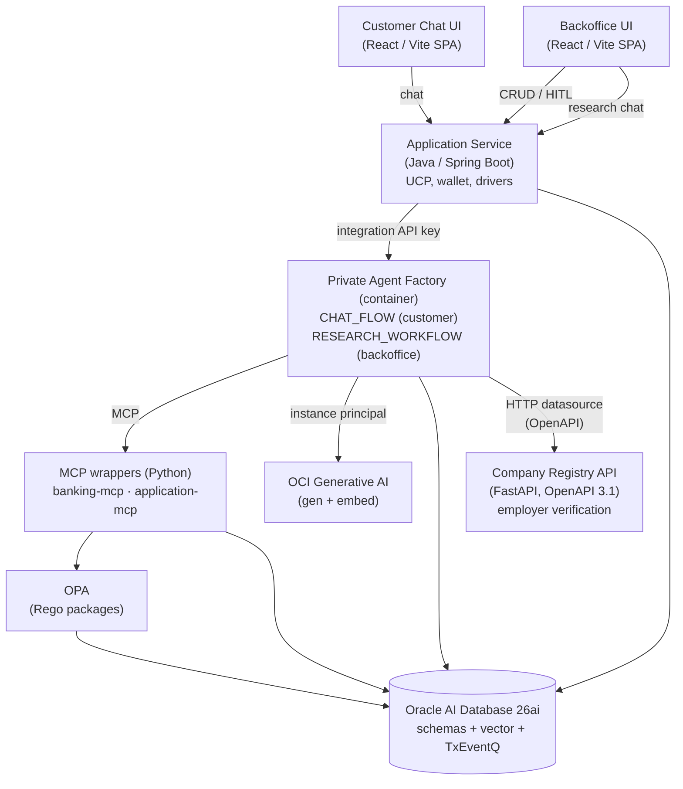

# Decisioning Engine PoC — Design

This document is the **architectural plan** for the PoC. It does not prescribe code. The use case it supports is fully described in [DECISIONING-ENGINE-USE-CASE.md](DECISIONING-ENGINE-USE-CASE.md); the platform it runs on is summarised in [PAF.md](PAF.md). Deployment specifics live in [DEPLOYMENT.md](DEPLOYMENT.md); the customer-facing flow is built per [`paf/flows/CHAT_FLOW.md`](../paf/flows/CHAT_FLOW.md).

The PoC is intentionally a _scaffolding_ — the repository layout, deployment topology, and component boundaries are fixed early so subsequent work can fill each component without re-arguing the seams.

---

## 1. Goals

- Demonstrate that **Oracle AI Database 26ai + Private Agent Factory (PAF)** can run an end-to-end agentic banking flow (credit application decisioning).
- Prove **end-to-end observability**: every decision is reproducible from an append-only audit trail (Blockchain Table + per-tool audit + parameter history).
- Demonstrate the **PAF Hybrid runtime mode**: an Agent Builder flow in the PAF container that delegates SQL and **RAG** (retrieval-augmented generation) to in-database Select AI tools and external behaviour to **MCP** (Model Context Protocol) / REST tools.
- Deploy on Oracle Cloud Infrastructure (OCI) with Terraform + Ansible from one `manage.py`, with models from the OCI Generative AI service and **no key material** anywhere in the stack (instance and resource principals).
- Stay **bank-agnostic**: every threshold, weight, scale, policy parameter, and protected-attribute set lives in database configuration, not in code.

## 2. Non-goals

- Production-grade credit modelling (the dataset is synthetic and engineered to exercise paths, not to validate a model).
- Performance benchmarking (the test bench is for functionality and observability).
- Region-specific compliance attestation (the PoC is region-agnostic by design; the framework is operational, not legal).
- Counter-offer logic, real bureau integration, core-banking write-back, or production-grade Application Service hardening.
- Portfolio-level surfaces. [DECISIONING-ENGINE-USE-CASE.md](DECISIONING-ENGINE-USE-CASE.md) describes the wider business problem, including a Risk Management Dashboard, stress scenarios, drift alerts and reporting. The PoC builds the per-application path and the review queue; those portfolio surfaces are use-case context, not build scope.

## 3. Audience and personas

| Persona                                              | Surface                             | What they do                                                                                                                                                                 |
| ---------------------------------------------------- | ----------------------------------- | ---------------------------------------------------------------------------------------------------------------------------------------------------------------------------- |
| Loan applicant (customer)                            | Customer mobile chat                | Drives the chat, uploads documents, gets a status ("under review"); the customer is the primary user of the `CHAT_FLOW`                                                      |
| Credit risk analyst (agent author)                   | **PAF Builder UI**                  | Wires the `CHAT_FLOW` and `RESEARCH_WORKFLOW` flows in PAF: tools, Select AI profile, RAG, system prompts; owns the recommendation tiers and explore-hints                   |
| Application developer (platform)                     | IDE, repo, deploy tooling           | Builds and operates the MCP tools (**OPA** (Open Policy Agent), in-DB writers), the chat UI, the backoffice, the `BANK_TOOLS` package, the queues, the deployment scripting |
| **HITL** (human-in-the-loop) reviewer / loan officer | Backoffice UI + Case Research Agent | Picks up tasks from the queue, reads the recommendation + reasoning + evidence, talks to the Case Research Agent for context, decides                                        |
| Bank administrator                                   | Backoffice UI                       | Edits `system_config`, manages users, views audit                                                                                                                            |

## 4. High-level architecture

The deployment is one logical system with several cooperating components. Their boundaries follow the PAF [MCP security pattern](PAF.md): agents call MCP/REST tools, never application tables directly.



Components communicate as follows:

- **Customer Mobile UI** → Application Service over REST. Auth is out of scope for the PoC; a mock login screen offers a dropdown of demo customers, selecting one fixes the `customer_id` used for every subsequent request. Logout returns to the picker. Chat turns (both customer messages and agent replies) are persisted server-side keyed by `roomId` + `customer_id`, so the UI is stateless — on refresh, login, or device switch, the UI replays the conversation history from the Application Service. The customer can close the browser, return hours later, and continue from the last agent reply (a status update, a follow-up question, or the final outcome).
- **Backoffice UI** → Application Service over REST. Auth is out of scope for the PoC; a mock login screen offers a dropdown of roles (HITL reviewer, admin), selecting one drives which sections are visible. Logout returns to the picker.
- Production deployments are expected to sit behind the host core-banking system's auth, so no SSO/OAuth/JWT/API Gateway wiring is built into the PoC.
- **Application Service** persists applications, owns document upload, runs cheap OPA pre-checks, and invokes the agents. It exposes two distinct PAF surfaces: `/chat/*` for the customer `CHAT_FLOW` and `/research/*` for the backoffice `RESEARCH_WORKFLOW`.
- **Application Service** invokes the **published `CHAT_FLOW`** through PAF's integration endpoint with a Bearer API key (`PAF_AGENT_ID` / `PAF_API_KEY`), enveloping the session token and stripping the agent's internal markers from the reply.
- **PAF (`CHAT_FLOW`, customer-facing)** runs in the PAF container and calls:
  - **Select AI in-DB tools** over the customer-safe `BANK_VIEWS.*` view set (own profile, transactions, bureau snapshot, existing facilities).
  - **OPA MCP** for eligibility, AML, KYC, escalation, fair-lending, pricing band — inputs to the recommendation, not the decision.
  - **Company Registry HTTP datasource** — typed OpenAPI 3.1 endpoint exposed by a FastAPI service. The agent calls it once per application to verify the customer's declared employer (or their own company, for self-employed). Light usage; this is the demo surface for PAF's HTTP datasource capability.
  - **OCI Generative AI** as the configured **LLM** (large language model) and embedding endpoint (LLM Management): `openai.gpt-oss-120b` for generation and `cohere.embed-multilingual-v3.0` for embeddings, reached through PAF's instance-principal provider — no key material.
  - In-DB tool `create_hitl_task` to write a recommendation packet to the HITL queue.
- **PAF (`RESEARCH_WORKFLOW`, backoffice-only)** runs in the same PAF container with a **broader, read-only tool scope** — full transaction history, `decision_audit`, `policy_parameter_history`, deeper similarity over `case_history`, RAG over `policy_corpus`. The agent is read-only by design: it reads, analyses, and explains; it cannot mutate state. Invocation is gated by the backoffice (the customer chat path cannot reach it).
- **Final decision** is written to `decision` (Blockchain Table) by the Application Service when the HITL reviewer closes the task. The agent's recommendation packet is captured as columns on the same row, so each Blockchain row is exactly one bank decision.

## 5. PAF runtime mode: Hybrid

The PoC runs in PAF's **Hybrid** mode (see [PAF.md §4.3](PAF.md#43-hybrid-agentworkflow)) and configures **two distinct agents** in the same PAF container, with different tool scopes and different security envelopes:

- **`CHAT_FLOW`** — customer-facing. Reads only the customer-safe `BANK_VIEWS.*` view set, runs OPA, writes a recommendation packet to `hitl_task` via the `create_hitl_task` in-DB tool. Cannot write to `decision`.
- **`RESEARCH_WORKFLOW`** — backoffice-only. Reads a **broader, read-only** scope (full transaction history, `decision_audit`, `policy_parameter_history`, deeper `case_history` similarity, RAG over `policy_corpus`). Has **no side-effect tools** — it cannot create HITL tasks, cannot record decisions, cannot mutate state of any kind.

Heavy data work — SQL over banking views, vector search over `policy_corpus` and `case_history` — runs **in-database** via Select AI profiles, tasks, tools, and teams. Policy and side-effect work — OPA evaluation and HITL task creation — runs in **near-DB MCP/REST services** and is wired to `CHAT_FLOW` only.

Mapping the use case to PAF's component types:

| Capability                                                  | PAF construct                                                         | Wired to            | Where it runs                |
| ----------------------------------------------------------- | --------------------------------------------------------------------- | ------------------- | ---------------------------- |
| Chat orchestration (customer)                               | Agent Builder flow, Agent node                                        | `CHAT_FLOW`         | Near-DB, PAF container       |
| Research orchestration (backoffice)                         | Agent Builder flow, Agent node                                        | `RESEARCH_WORKFLOW` | Near-DB, PAF container       |
| LLM rationale + research composition                        | Agent node, `gen-model` on OCI Generative AI                          | Both                | OCI Generative AI            |
| Per-tool audit envelope                                     | Each MCP wrapper posts its call to the Application Service, which writes `decision_audit` | `CHAT_FLOW`         | MCP wrapper → Application Service |
| Customer profile / transactions / bureau queries            | Select AI profile + tasks over curated views                          | `CHAT_FLOW`         | In-DB                        |
| Broader read scope (audit, parameter history, deeper cases) | Select AI profile + tasks over backoffice view set                    | `RESEARCH_WORKFLOW` | In-DB                        |
| Policy citations, similar cases                             | Select AI RAG tool over Oracle AI Vector Search                       | Both                | In-DB                        |
| OPA eligibility/AML/KYC/escalation/fair-lending/pricing     | `banking-mcp` `*_for_session` tools call the OPA REST API server-side | `CHAT_FLOW`         | Near-DB                      |
| Employer / company registry lookup                          | HTTP datasource (OpenAPI 3.1 over FastAPI)                            | `CHAT_FLOW`         | Near-DB (`backend` compute)  |
| HITL task creation (recommendation packet)                  | In-DB SQL tool in `BANK_TOOLS` package                               | `CHAT_FLOW`         | In-DB                        |
| Final decision write (Blockchain)                           | Application Service on HITL close                                     | Application Service | In-DB (Blockchain Table)     |
| Customer chat surface                                       | Published Agent Builder run URL via Application Service bridge        | `CHAT_FLOW`         | Near-DB + external           |
| Backoffice research surface                                 | Published Agent Builder run URL via Application Service bridge        | `RESEARCH_WORKFLOW` | Near-DB + external           |

## 6. Component breakdown

### 6.1 Custom application code (`src/`)

| Component                 | Tech                  | Responsibility                                                                                                                                                                                                                                                    |
| ------------------------- | --------------------- | ----------------------------------------------------------------------------------------------------------------------------------------------------------------------------------------------------------------------------------------------------------------- |
| `src/backend/`            | Java 21 / Spring Boot | Application Service. Application CRUD, document upload to Object Storage, OPA pre-check fast-path, agent invocation, sanitised decision read-back. Uses **UCP** (Universal Connection Pool) for pooling and Oracle Wallet for **ADB** (Autonomous Database).      |
| `src/ai/`                 | Python                | The two FastMCP wrappers PAF calls as MCP servers, one per database identity: `banking-mcp` (the deterministic `*_for_session` reads, the OPA calls and the tier rule in `gate.py`; `CUSTOMER_AGENT_RO`) and `application-mcp` (`upsert_application` and `create_hitl_task`; `CUSTOMER_AGENT_RW`). systemd units on the `backend` compute behind the internal TLS load balancer. |
| `src/api/registry/`       | Python / FastAPI      | Synthetic Company Registry API. One service, one endpoint group; auto-generated OpenAPI 3.1 spec served at `/openapi.json`. Data is a JSON file shipped with the service — no real bureau integration. Registered with PAF as an HTTP datasource for `CHAT_FLOW`. |
| `src/customer-ui/`        | React / Vite (TS)     | Customer chat SPA — mock login picker, conversation, history replay. Served at `/` by nginx on the `frontend` compute.                                                                                                                                            |
| `src/backoffice-ui/`      | React / Vite (TS)     | Backoffice reviewer SPA — HITL review queue and the decision-history / audit view (recommendation packet, human decision, per-tool trace via `EvidencePanel`). Served at `/backoffice` by nginx on the `frontend` compute; the public load balancer routes `/v1` to the Application Service and `/agentFactory` to PAF. |

### 6.2 Database (`database/`)

One Liquibase changelog in `database/liquibase/`, applied by the `ops` tier as `ADMIN` with `--contexts=adb,seed`: `adb` tags the user creation, the Select AI grants and PAF's install prerequisites; `seed` tags the synthetic dataset; everything else runs unconditionally.

Database identities come in two kinds, and the split is what bounds a compromise. **Owners** hold the objects and are created without `CREATE SESSION`, so nothing can log in as them and a leaked owner password opens nothing. **Clients** log in, own nothing, and carry only the grants their consumer needs. Privilege follows the *audience* that can reach a client: the customer-facing agent and the backoffice one never share a login, so a prompt injection against the chat agent is confined by what `CUSTOMER_AGENT_RO` is allowed to select. The whole grant matrix is one file — `database/liquibase/020-client-grants.yaml`.

Owners, following PAF's [recommended Oracle Database design pattern](PAF.md#193-recommended-oracle-database-design-pattern):

| Owner | Contents |
| ----- | -------- |
| `BANK_CORE` | Banking tables: `customer`, `account*`, `loan_application*`, `decision` (Blockchain Table — written by the Application Service when a HITL task closes), `decision_audit`, `hitl_task` (carries the agent's recommendation packet), `chat_message` (persisted customer ↔ `CHAT_FLOW` conversation, keyed by `roomId` + `customer_id` + `application_id`), `auth_session`, `system_config`, `policy_parameter_history`, `fair_lending_review`, and the vector tables `policy_corpus` / `case_history` at `VECTOR(<dim>, FLOAT32)`. Also owns the **TxEventQ** (Transactional Event Queue) queue `HITL_REQUEST`. |
| `BANK_VIEWS` | Two curated view sets over `BANK_CORE` for **NL2SQL** (natural-language-to-SQL): a **customer-safe** `chat_v_*` set (own profile, transactions summary, bureau snapshot, existing facilities) and a **backoffice-broader** `research_v_*` set (full transaction history, `decision_audit`, `policy_parameter_history`, `case_history`), plus the `cust_360` feature view. |
| `BANK_TOOLS` | `PKG_AGENT_TOOLS`, the definer's-rights package the agent write paths call: `create_hitl_task` (writes the recommendation packet and enqueues in one transaction) and `upsert_draft_application`. Callers hold `EXECUTE` on the package and no table privilege, so every write they can reach is one the package chose to expose. |

Clients — each with its own password, so one leak reaches one grant set:

| Client | Reached by | May do |
| ------ | ---------- | ------ |
| `PAF_PLATFORM` | Private Agent Factory itself | Owns PAF's metadata, and holds **no** banking grant of any kind. Its privilege set is the kit's documented requirement (`INSERT ANY TABLE`, `CREATE USER`, `DATA_PUMP_DIR`), which is precisely why nothing else reuses this identity. The read-only worker PAF's installer creates, `AAI_RO_PAF_PLATFORM`, must share its password — a product constraint. |
| `SVC_BACKEND` | The Spring Application Service | `SELECT` on the banking tables it renders; writes chat, sessions, the per-tool audit trail, and closes HITL tasks. No privilege on `BANK_VIEWS` or `BANK_TOOLS`. |
| `CUSTOMER_AGENT_RO` | `CHAT_FLOW` reads, via `banking-mcp` | `SELECT` on the `chat_v_*` set only, plus `auth_session` and `hitl_task` for the session-scoped lookups. Nothing in the backoffice set. This is the identity exposed to whatever a customer can talk the agent into. |
| `CUSTOMER_AGENT_RW` | `CHAT_FLOW` writes, via `application-mcp` | `EXECUTE` on `BANK_TOOLS.PKG_AGENT_TOOLS` and nothing else. |
| `BACKOFFICE_AGENT_RO` | `RESEARCH_WORKFLOW`, from the backoffice only | `SELECT` on the `research_v_*` set, `cust_360` and the RAG corpora. No `EXECUTE` anywhere and no write, which is what keeps a research agent structurally unable to decide anything. |

Embedding dimension is set once at deploy time and tied to the chosen embedding model (`cohere.embed-multilingual-v3.0` → 1024 dims; `manage.py setup` refuses a model of another width). Changing embedding model later requires re-ingestion (see [PAF §6.6](PAF.md#66-embedding-models)).

### 6.3 Private Agent Factory artefacts

Stored under `paf/` and bootstrapped by `manage.py` after PAF is up:

- **LLM Management** configurations: `gen-model`, `emb-model` (generic names, kept stable across model swaps) on the OCI Generative AI instance-principal provider; `manage.py paf gen-model` swaps the generation model id without touching the flow.
- **Data sources**:
  - Two **Database** data sources over `BANK_VIEWS`, connecting as `CUSTOMER_AGENT_RO` and `BACKOFFICE_AGENT_RO` respectively — the connection user is what bounds a compromised flow, so the two audiences never share a login (§6.2).
  - One **File** data source for the seed `policy_corpus` PDFs/text.
  - One **HTTP** data source — the Company Registry API. Registered to PAF by pointing at its OpenAPI 3.1 spec (`/openapi.json`); PAF infers the endpoint shape, request schema, and response schema from the spec. This demonstrates PAF's third data-source type alongside Database and File.
- **Select AI profiles**:
  - `chat_profile` — NL2SQL object list scoped to the customer-safe `BANK_VIEWS.*` views, RAG vector index over `policy_corpus`.
  - `research_profile` — NL2SQL object list scoped to the broader backoffice `BANK_VIEWS.*` views (full transactions, `decision_audit`, `policy_parameter_history`, `case_history`), RAG over both `policy_corpus` and `case_history`.
- **MCP servers**: `banking-mcp`, `application-mcp` — one per database identity, registered by name (`manage.py paf link-flow` rebinds the flow's nodes to the install's ids), wired only to `CHAT_FLOW`. A server is split by the identity it logs in as, never by tool: which tool a worker sees is its MCP Server node's _Allowed MCP tools_ list, which privilege the call carries is the server's client user.
- **Agent Builder flows** (two):
  - `CHAT_FLOW`: one manager agent with two sub-agent workers — `Intake` (`application-mcp.upsert_application`) and `Recommendation` (`application-mcp.create_hitl_task` only — the workflow's single side-effect tool; each worker's MCP Server node allows exactly one tool). The manager holds no tools; it delegates on the facts five deterministic `banking-mcp` nodes compute around it (`get_context`, `evaluate_eligibility_for_session`, `required_documents_for_session`, `verify_employer_for_session` before it, `hitl_status_for_session` after it). State is loaded once from the database ("the database is the memory"). Full build blueprint: [`paf/flows/CHAT_FLOW.md`](../paf/flows/CHAT_FLOW.md).
  - `RESEARCH_WORKFLOW`: Chat Input → Prompt (read-only research system rules) → Agent (tools = Select AI Bridge over `research_profile`, RAG, no MCP tools, no HTTP datasources, no In-DB write tools) → Chat Output. The flow is intentionally simple — its value is the broader read scope and the conversational interface, not orchestration.
- **Integration API key** for the published `CHAT_FLOW`, minted by `manage.py paf api-key` into `.env` (`PAF_AGENT_ID`, `PAF_API_KEY`) and handed to the backend tier.

Both flows follow PAF's [authoring-to-execution pipeline](PAF.md#105-authoring-to-execution-pipeline): explicit inputs, explicit tool boundaries, explicit Condition/Parser gating before any side-effect node.

### 6.4 Configuration boundary

Two stores; nothing belongs in code:

- **`.env`** (rendered by `manage.py setup`): infrastructure pointers — OCI profile, regions, compartment, ADB name, the ADMIN password and one password per database identity, Generative AI endpoint and model ids, embedding dimension, SSH key, PAF admin login and the integration key. The full key list is in [DEPLOYMENT.md §5](DEPLOYMENT.md#5-environment-configuration).
- **`BANK_CORE.system_config`** (edited from Backoffice UI): policy parameters — `min_age`, `dti_hard_cap`, `pti_hard_cap`, `score_floor`, `score_caution_band_upper`, fair-lending bucketing, the **recommendation-tier weight set** (drives `APPROVE` / `REVIEW` / `DECLINE` from the composite signal), and the **`document_requirements_matrix`** (JSON: required `doc_type` set keyed by `(product_type, employment_type, residency_status, amount_band)`).

Every write to `system_config` produces a row in `policy_parameter_history` (who, when, old value, new value, reason).

### 6.5 Multi-agent in PAF

A flow runs one Agent node per execution path — a second Agent node further down the same path never executes; the first agent's message is returned as the flow's result and the turn ends ([`issues/12`](../issues/12-one-agent-per-execution-path.md)). Multi-agent orchestration within a single turn is only reachable through a manager agent with workers wired to its `Sub-agents` port, as `CHAT_FLOW` does (§6.3).

Rules for building any flow that needs more than one agent:

- Put every agent that must run in the same turn under one manager, on the manager's `Sub-agents` port — never in series on the same path.
- Give the manager no tools of its own; give each worker only the tools its job needs. This is what keeps a write tool unreachable from a path that must not write.
- Wiring the `Sub-agents` edge on the canvas is not sufficient by itself — the manager's `subAgents` template value must list the worker node ids. The canvas writes that value when the wire is drawn; a graph produced any other way (hand-edited JSON, a script) can carry the edge without the template value and silently ships a manager with no workers.
- Sub-agent calls happen inside the manager's executor, so no `Condition` node can sit between a manager and its workers. Any gate on which worker runs, or on the manager running at all, goes before the Agent node or after it, never between the manager and a sub-agent.
- A pure function of values already in the database — a lookup, an eligibility check, anything with no judgment call — belongs in a deterministic MCP node, not in an agent. `banking-mcp`'s `*_for_session` tools are the pattern.

## 7. Source layout

```
oracle-database-private-agent-factory-poc/
├── manage.py                 # Click-based CLI: setup, build, tf, cloud, paf, info, clean
├── requirements.txt
├── .env                      # rendered by `manage.py setup`; not committed
├── CLOUD.md                  # user-facing deployment runbook
├── DEMO.md                   # demo script
├── BACKLOG.md
├── README.md
├── docs/                     # DESIGN, DEPLOYMENT, TROUBLESHOOT, PAF, GLOSSARY, use case
├── issues/                   # PAF product issues reported to Product Management
├── src/
│   ├── backend/              # Spring Boot Application Service
│   ├── ai/                   # FastMCP wrappers: banking-mcp, application-mcp
│   ├── api/
│   │   └── registry/         # FastAPI Company Registry — PAF HTTP datasource
│   ├── customer-ui/          # React/Vite SPA — customer chat, served at /
│   └── backoffice-ui/        # React/Vite SPA — reviewer, served at /backoffice
├── database/
│   └── liquibase/            # one changelog; contexts adb, seed
├── paf/
│   ├── dist/                 # the x86_64 PAF kit tarball (ignored)
│   └── flows/                # CHAT_FLOW blueprint (.md) and canvas export (.paf)
├── opa/
│   └── packages/             # eligibility, aml, kyc, fair_lending, pricing, required_documents, config (.rego)
├── tests/                    # end-to-end harness (runs on the bastion) and host unit tests
├── deploy/
│   ├── tf/
│   │   ├── app/              # workload root: network, ADB, four tiers, both load balancers
│   │   ├── iam/              # tenancy root: dynamic groups + Generative AI policy
│   │   └── modules/tier/     # one compute + self-retrying cloud-init bootstrap
│   └── ansible/
│       ├── ops/              # bastion: Liquibase, wallet, test harness
│       ├── frontend/         # nginx + both SPAs
│       ├── backend/          # Spring Boot, OPA, registry, MCP wrappers
│       └── paf/              # podman + PAF container
└── venv/                     # virtualenv; not committed
```

## 8. Data flow — every application produces a recommendation packet

The customer interacts via a chat-driven flow; every turn is a `CHAT_FLOW` invocation threaded by `roomId`. The agent drives document collection — it asks for what _this_ applicant needs, not a fixed bundle — and only emits its recommendation once everything is in place. Every application that completes document collection produces exactly one HITL task carrying the agent's recommendation, and the human reviewer makes the final decision.

Each turn — customer message and agent reply — is persisted as a `chat_message` row by the Application Service, keyed by `roomId` + `customer_id` + `application_id`. The chat UI is stateless: on refresh, login, or device switch it loads the message history from the Application Service and renders the conversation as the customer left it. The same persistence carries status updates ("we're reviewing your application") and the final outcome back into the chat after the reviewer closes the HITL task — so the customer always finds the latest response in the same conversation, hours or days later.

1. Customer opens mobile chat, says what they want (product, amount, purpose, term). Agent asks structured follow-ups (employment type, residency status, salary band, existing facilities) to build a partial applicant profile. Every turn is appended to `chat_message`.
2. Agent calls **OPA `required_documents(applicant_so_far, product)`** → returns the required doc set keyed by `(product_type, employment_type, residency_status, amount_band)`. The matrix lives in `system_config.document_requirements_matrix`; Select AI RAG can retrieve policy snippets to explain _why_ each document is needed.
3. Agent presents the list in chat and requests uploads. Each upload → Application Service writes a `loan_application_document` row and uploads the file to Object Storage.
4. Agent verifies completeness via `check_document_completeness`: every required `doc_type` has at least one uploaded document. Anything missing → agent re-asks (back to step 3), naming the document it still needs; the agent does not silently terminate the application.
5. Agent reads `system_config` thresholds and tier weights via In-DB Tool, then runs Select AI tools over `chat_profile` to pull profile, transactions, bureau snapshot.
6. Agent calls the **Company Registry HTTP datasource** (`verify_employer`) once with the customer's declared employer name (or, for self-employed applicants, their company name). The response — `{registered, trading_status, sector, registered_address, last_filed_year}` — joins the evidence packet. `not_registered` or `dormant` is a `REVIEW` signal with an explicit explore-hint for Sam; a confirmed `active` employer is a small positive contribution to the tiering score.
7. OPA evaluates eligibility, KYC and AML, and `recommend_tier_for_session` captures each output (allow / deny / warn) in the evidence packet. **A compliance `deny` is a bar, not a signal to weigh**: a sanctions match or a failed identity check forces `DECLINE`, because recommending `APPROVE` beside one would misinform the human who decides. Their warnings — a pending check, a politically exposed person — read as `REVIEW`. What the customer may be told about them differs: identity checks can be named, screening cannot, since telling someone that sanctions or PEP screening stopped them is tipping off (`gate.CUSTOMER_FACTORS` maps those codes to the generic phrase). The packet is stamped with the policy modules that produced it, so the decision record says what it was evaluated against. Fair-lending pre-flight is not wired: it needs a monitored-pattern source and protected attributes on a read path that deliberately has none — see [`BACKLOG.md §3`](../BACKLOG.md).
8. Select AI RAG retrieves policy citations relevant to the signals observed ([`BACKLOG.md §7`](../BACKLOG.md)); the OPA rate card returns an indicative band into the evidence packet for every application it can price, so the reviewer sees the figure the offer would rest on.
9. Agent composes the **recommendation packet**: `tier ∈ {APPROVE, REVIEW, DECLINE}` (derived from OPA outputs + employer-verification result + signal weights in `system_config`), `reasoning` (LLM-composed, grounded in OPA outputs and cited policy chunks), `explore_hints` (populated for `REVIEW` only — short list of areas a reviewer should examine or follow-up data to request from the customer), and `evidence` (RAG citations, OPA outputs, employer-verification response, computed DTI/PTI/score, indicative pricing).
10. In-DB Tool `create_hitl_task` writes one row to `hitl_task` carrying the recommendation packet **and** enqueues `HITL_REQUEST` (TxEventQ) in the same transaction. `decision_audit` captures every tool call. The agent does **not** write to `decision`.
11. PAF returns NDJSON; AI Services parses and the Application Service appends a customer-facing status message ("we're reviewing your application") to the same `chat_message` thread. The customer never sees the recommendation tier.
12. A backoffice reviewer claims the task with `DEQONE` (atomic with `hitl_task` OPEN → IN_REVIEW), reads the recommendation + reasoning + evidence, may invoke `RESEARCH_WORKFLOW` from the task detail screen to dig deeper, then submits a final decision. The Application Service writes the **`decision` Blockchain Table row** at task close — one row per bank decision, carrying both the human's final outcome and the original recommendation packet — and appends the customer-facing outcome to the customer's `chat_message` thread as fixed text under the disclosure policy — the outcome, never a figure or a reason code. The next time the customer opens the chat, the outcome is waiting at the end of the conversation.

See [DECISIONING-ENGINE-USE-CASE.md §Test Bench](DECISIONING-ENGINE-USE-CASE.md) and [§Async messaging](DECISIONING-ENGINE-USE-CASE.md#async-messaging--txeventq-queues) for the queue inventory and the per-tier scenario matrix.

## 9. Observability model

Three layers, all inspectable from the Backoffice UI:

1. **Per-tool audit** (`decision_audit`) — every `CHAT_FLOW` tool call's input, output, duration, status, ordered by `agent_run_id` + `step_no`. `RESEARCH_WORKFLOW` runs are audited separately so research conversations don't pollute the decisioning trail (`research_audit`).
2. **Append-only decision history** (`decision`) — Oracle Blockchain Table with `NO DROP UNTIL 7 YEARS IDLE`, `NO DELETE LOCKED`, `SHA2_512` hashing. One row per bank decision, written by the Application Service when the reviewer closes the HITL task; carries both the human's final outcome and the original agent recommendation packet. Surface a "tamper attempt rejected by DB" demo path.
3. **Parameter history** (`policy_parameter_history`) — versioned `system_config` edits with reason. Pair with the audit view to interpret a past decision against its then-current parameters.

## 10. Security boundary

| Concern                                | Mechanism                                                                                                                                                                                                                                                       |
| -------------------------------------- | --------------------------------------------------------------------------------------------------------------------------------------------------------------------------------------------------------------------------------------------------------------- |
| Identity at the edge                   | Out of scope for the PoC. UIs ship a mock login picker (customer dropdown in the customer UI, role dropdown in the backoffice) and a logout to swap session; production assumes the host core-banking system provides auth in front of the Application Service. |
| Identity inside the agents             | Privilege follows the audience: `CUSTOMER_AGENT_RO` / `CUSTOMER_AGENT_RW` for `CHAT_FLOW`, `BACKOFFICE_AGENT_RO` for `RESEARCH_WORKFLOW`, each with its own password and its own grants (§6.2). `PAF_PLATFORM` owns PAF metadata and holds no banking grant at all, so the platform identity cannot read production data. |
| NL2SQL guardrail (`CHAT_FLOW`)         | `chat_profile` object list pinned to the customer-safe `BANK_VIEWS.*` view set; no access to `decision_audit`, `policy_parameter_history`, or `customer_protected_attrs`.                                                                                        |
| NL2SQL guardrail (`RESEARCH_WORKFLOW`) | `research_profile` object list scoped to the broader backoffice `BANK_VIEWS.*` view set (full transactions, `decision_audit`, `policy_parameter_history`, deeper `case_history`). Still read-only; no base tables.                                               |
| Side-effects                           | `CHAT_FLOW`'s only side-effect tool is `create_hitl_task`, plus OPA MCP calls. `RESEARCH_WORKFLOW` is read-only — no write tools, no enqueue. Enforced by `BANK_TOOLS` grants and by which MCP servers are wired to which flow.                                |
| HTTP datasource (Company Registry)     | Read-only by contract — the FastAPI service exposes only `GET` lookups in its OpenAPI spec. Wired to `CHAT_FLOW` only. The service is internal to the VCN; the customer chat UI cannot reach it directly.                                                       |
| Decision write                         | Only the Application Service writes the `decision` Blockchain row, on HITL close. Neither agent has `INSERT` on `decision`.                                                                                                                                     |
| Decision announcement                  | A reply carrying the `[[DECISION ...]]` marker is shown only when a `hitl_task` row exists for the customer: `ChatService.runTurn` reads the table and falls to the apology otherwise. G3 on the `CHAT_FLOW` canvas states the same property, but PAF runs the nodes after an agent only on the turns where the agent answers and calls a tool in one step ([`issues/15`](../issues/15-nodes-after-an-agent-are-skipped-when-it-answers.md)), so the delivery path is what holds it. |
| Agent reachability                     | `CHAT_FLOW` published URL is consumed by the customer UI only; `RESEARCH_WORKFLOW` published URL is consumed by the backoffice UI only. The Application Service enforces routing — the customer chat path cannot invoke the research agent.                     |
| Sensitive attributes                   | `customer_protected_attrs` kept separate; access logged; not passed to either LLM unless explicitly needed (and never to `CHAT_FLOW`).                                                                                                                          |
| Audit                                  | Blockchain Table for the decision; standard tables for `decision_audit` and `research_audit` with archive-to-blockchain option.                                                                                                                                 |
| Wallet / connection                    | Oracle Wallet for ADB; UCP pool sizing pinned per service.                                                                                                                                                                                                      |

## 11. Locked decisions

- **Models from OCI Generative AI, no key material.** PAF calls the service as an **instance principal** through its dynamic group; the database as a **resource principal**. `manage.py setup` discovers which region serves which model on demand rather than assuming.
- **Generative model**: **`openai.gpt-oss-120b`**. PAF streams every agent turn, and its OCI Generative AI stream parsers are complete only for models on the generic format that end their stream with `finishReason`: a `cohere.*` manager never delegates to its workers, and a `meta.*` stream ends in a `[DONE]` sentinel the parser cannot read ([`issues/14`](../issues/14-oci-genai-stream-parsers-incomplete.md)). Swap by editing `GENAI_MODEL` in `.env` and running `manage.py paf gen-model` — no flow change.
- **Embedding model**: **`cohere.embed-multilingual-v3.0`** at **1024 dimensions**. Multilingual (fits the bank-agnostic story); the width is held to the changelog's `VECTOR` columns by `manage.py setup`. Locked at deploy time; any change requires re-ingestion of `policy_corpus` and `case_history`. (Per [PAF §6.6](PAF.md#66-embedding-models).)
- **Two agents in PAF, distinct tool scopes.** The platform configures `CHAT_FLOW` (customer-facing, OPA + Select AI over the customer-safe view set + Company Registry HTTP datasource + `create_hitl_task`) and `RESEARCH_WORKFLOW` (backoffice-only, Select AI over a broader read-only view set + RAG, read-only). Same factory, two security envelopes.
- **Company Registry as PAF HTTP datasource (employer verification).** A small FastAPI service in `src/api/registry/` exposes a synthetic company registry; PAF wires it in as an HTTP data source via its OpenAPI 3.1 spec (`/openapi.json`). One lookup per application during chat (`verify_employer(name)` → `{registered, trading_status, sector, registered_address, last_filed_year}`). Chosen specifically to demonstrate PAF's third data-source type (alongside Database and File); kept deliberately light so it doesn't compete with OPA-via-MCP for "extensively used by the LLM" mindshare. Synthetic JSON-backed data; no real bureau dependency.
- **HITL on every application.** Every successful `CHAT_FLOW` turn ends with `create_hitl_task` carrying the recommendation packet; the human is always the decision-maker. Mandatory human review is the compliance posture by design — it keeps the business in control of every credit decision the bank stands behind. OPA outputs are inputs to the recommendation, not gates on the application.
- **`create_hitl_task` transport — PL/SQL in the database, MCP as the wire.** The function itself (`BANK_TOOLS.PKG_AGENT_TOOLS.create_hitl_task` — insert into `BANK_CORE.hitl_task` + enqueue `BANK_CORE.HITL_REQUEST` atomically) holds the logic; a thin Python MCP wrapper at `src/ai/application-mcp/` calls it via `oracledb.callfunc`. Exposing the same function as a Select AI Tool through the Select AI Bridge node is the alternative tracked in `BACKLOG.md §12`.
- **Three-tier recommendation.** The agent's output is one of `APPROVE` (high confidence, no inconsistencies), `REVIEW` (minor flags, needs human attention), or `DECLINE` (inconsistencies, missing data, compliance hits), accompanied by mandatory `reasoning` (LLM-composed, grounded in OPA outputs and cited policy chunks) and — for `REVIEW` only — `explore_hints` listing areas the reviewer should examine or follow-up data to request from the customer.
- **Final decision on Blockchain, written by the Application Service at HITL close.** When the reviewer submits their decision, the Application Service writes one row to `decision` (Blockchain Table) carrying both the human's outcome and the original agent recommendation packet. One row = one bank decision.
- **`CHAT_FLOW` and `RESEARCH_WORKFLOW` shape**: both are explicit Agent Builder **DAGs** (directed acyclic graphs of nodes — Prompt, Agent, Parser, Condition, Tool, Chat Output — wired together with no cycles, so each run has a well-defined path through the flow). `CHAT_FLOW` is a **manager agent with two sub-agent workers**: Chat Input → RegexExtractor (token) → four deterministic `banking-mcp` nodes → `Condition` (session gate) → the manager, which delegates to `Intake` or to `Recommendation` (one side-effect tool, `create_hitl_task`) → a fifth deterministic node → `Condition` (decision gate) → Chat Output. The manager holds no tools, which isolates the side effect — see [`paf/flows/CHAT_FLOW.md`](../paf/flows/CHAT_FLOW.md). `RESEARCH_WORKFLOW` is intentionally smaller: Prompt → Agent → Chat Output, no side-effect nodes.
- **SQL tooling**: reads reach the database through the `banking-mcp` wrappers, which bind their parameters and fail closed. The plain **SQL Query node is never used** — it ignores `:name` binds and fails open ([`issues/02`](../issues/02-sql-query-no-bind-variables.md)). Select AI In-Database Tools through the Select AI Bridge node ([PAF §14.5](PAF.md#145-agent-builder-select-ai-nodes)) are the intended cloud-native transport and are parked, below.
- **OPA bundle reload on parameter change**: planned for **v1**. Currently OPA loads its bundle once at boot; parameter edits in the Backoffice still write `policy_parameter_history` but require an OPA restart to take effect.
- **PAF bootstrap automation**: `manage.py paf bootstrap` prints the install as one ordered sheet (installer wizard values, LLM Management entries, data sources, MCP servers) with the commands that sit between the browser steps; the steps PAF exposes an admin API for are scripted (`prepare`, `link-flow`, `gen-model`, `api-key`), and `info` reports how far the sequence has got. Playwright-driven UI automation is explicitly out of scope (too fragile across PAF versions).
- **Auth — out of scope; mock login on both UIs.** The audience (host core-banking system) is assumed to provide auth in production, so no SSO/OAuth/JWT/API Gateway is wired into the PoC. The customer UI shows a dropdown of demo customers (selection sets the active `customer_id`); the backoffice shows a dropdown of roles (HITL reviewer, admin — which gates visible sections). Both UIs offer logout to swap user or role mid-demo.
- **Async messaging — Oracle Database TxEventQ.** All async/offline work (HITL claim, retries, future fan-out) runs through TxEventQ queues owned by `BANK_CORE`. JSON payloads, single-consumer queues, idempotent DDL (catch `ORA-24006`/`ORA-24010`), per-schema `dbms_aqadm.grant_queue_privilege` rather than `aq_administrator_role`, and a dedicated exception queue for poison messages. Initial inventory: `HITL_REQUEST`. Future queues (`NOTIFICATION`, `OPA_BUNDLE_RELOAD`, `FAIR_LENDING_SAMPLING`, `ARCHIVE`) follow the same pattern. See [DECISIONING-ENGINE-USE-CASE.md §Async messaging](DECISIONING-ENGINE-USE-CASE.md#async-messaging--txeventq-queues).
- **Select AI is parked.** The database is ready for it — `018` grants `PAF_PLATFORM` the four packages PAF checks for, the resource principal is enabled and the database is registered as a data source — but `CHAT_FLOW` reads the customer's context through `banking-mcp.get_context` (bind variables, fail-secure), **not** a SQL Query node, which ignores `:name` binds and fails open ([`issues/02`](../issues/02-sql-query-no-bind-variables.md)). Adopting Select AI Tools is a flow redesign, tracked in `BACKLOG.md §12`.

## 12. Decisions not yet locked

- **HITL assignment policy**: claim-next from `HITL_REQUEST` is the default. Whether to support reviewer-pinned assignment (admin reassigns to a named reviewer) is open; the queue already supports it via `correlation`.
- **Customer-facing decline explanation depth.** When a HITL task closes with DECLINE, the Application Service appends a customer-facing outcome to the chat thread. The depth of that explanation — single dominant signal vs. ranked list, plain language vs. raw reason-code names, which signals are disclosable at all (sanctions / AML hits typically aren't) — is deferred until the end-to-end pipeline is stable. Default plan: surface the top `deny[]` / strongest `DECLINE` signal translated into one customer-actionable sentence, gated by a `system_config` allow-list of disclosable signal kinds.
- **Wallet rotation**: out of scope for the PoC; documented as a follow-up.
