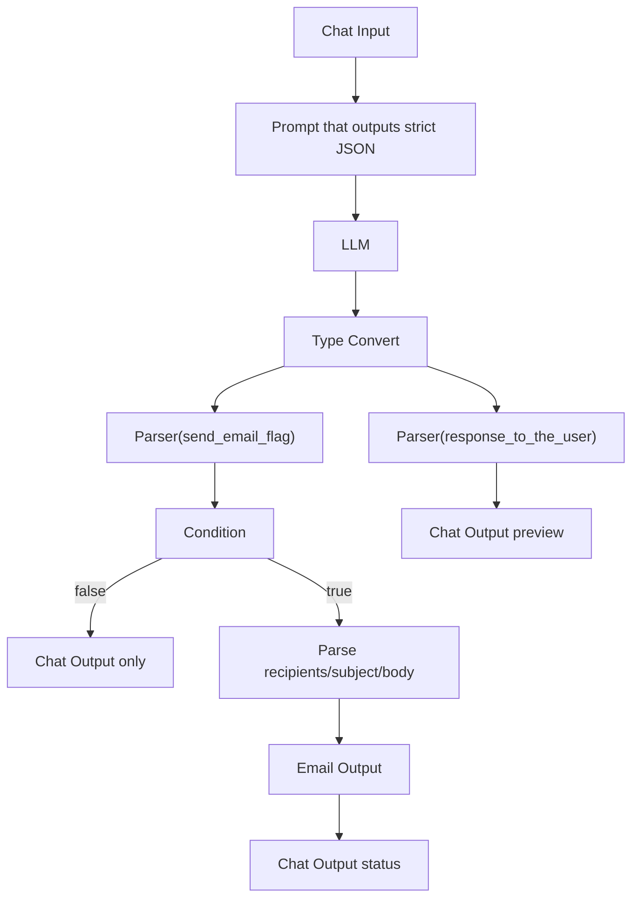
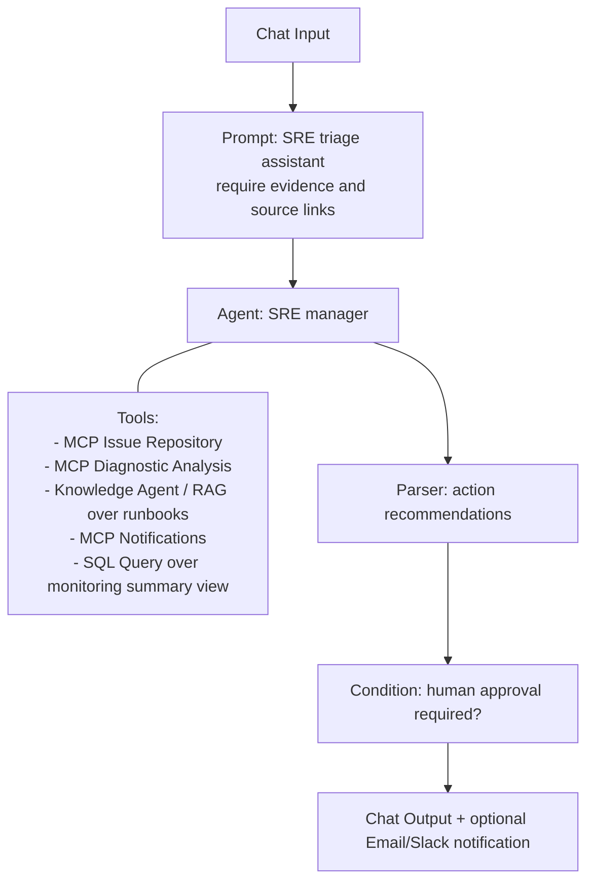
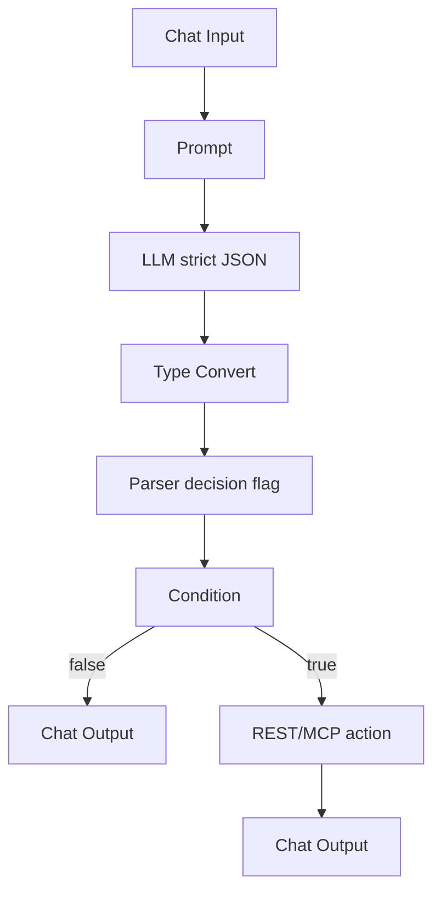

# Oracle AI Database Private Agent Factory — Practical Study Guide

Architecture, technologies, samples, and integration patterns. Generated study notes from Oracle docs, product pages, and linked articles.

> **Scope:** this is a _generic_ PAF study guide (product mechanics, any use case). For how **this** project uses PAF, see [`DESIGN.md §5`](DESIGN.md) (runtime mapping), [`../LOCAL.md`](../LOCAL.md) (install + register tools), and [`../paf/flows/CHAT_FLOW.md`](../paf/flows/CHAT_FLOW.md) (the flow build). For banking/credit/compliance terms, see [`GLOSSARY.md`](GLOSSARY.md).

---

## How to use this guide

This is a pragmatic, implementation-oriented study guide for Oracle AI Database Private Agent Factory, also referred to as Agent Factory or PAF in some community material. It is written for someone who already understands how to build agents manually and wants to understand the platform: what it abstracts, what still needs engineering, and where Oracle Database integration fits.

The guide uses source tags such as `[DOC-AGENT-BUILDER]` or `[DOC-COMPONENTS]` to cite Oracle public docs, product pages, and blogs. The full source list is at the end.

The practical mindset:

- Treat Agent Factory as an enterprise agent authoring and runtime platform, not just as another LLM wrapper.
- Treat Oracle Database as more than a data store: it is the vector store, metadata store, SQL execution environment, Select AI runtime, and policy boundary.
- Treat tools as controlled interfaces: REST APIs, MCP servers, Select AI tools, SQL Query nodes, and database functions.
- Treat deployment and security as first-class: SSO, roles, database users, model routing, private networking, and published REST APIs matter as much as prompts.

---

## 1. What Agent Factory is, in one page

Oracle AI Database Private Agent Factory is a no-code platform for building, testing, deploying, and managing intelligent data-centric agents. Oracle positions it for enterprises that want agents close to private data, with database integration, governance, and support. The public product page describes it as a way to build and deploy no-code AI agents on-premises or in the cloud, orchestrating data-centric workflows without sharing data with third parties or model providers when configured with private/local model endpoints. The public docs define Agent Builder as a way to combine language models, data connectors, APIs, and specialized agents into intelligent workflows without extensive programming. [PROD][DOC-INTRO][DOC-AGENT-BUILDER]

The key idea is not that Agent Factory replaces agent engineering. It packages the common pieces you otherwise build repeatedly:

| Manual-agent concept          | Agent Factory equivalent                                                 |
| ----------------------------- | ------------------------------------------------------------------------ |
| System prompt and task prompt | Prompt node, Prompt Lab, custom agent instructions                       |
| LLM client wrapper            | LLM Management configuration                                             |
| Tool registry                 | MCP Server node, REST API Tools, SQL Query, Select AI tools              |
| RAG ingestion pipeline        | Knowledge Agent data sources plus ingestion service                      |
| Vector store                  | Oracle AI Database vector store / AI Vector Search                       |
| NL-to-SQL workflow            | Data Analysis Agent and Select AI profiles/tools                         |
| LangGraph-style flow          | Agent Builder canvas and nodes                                           |
| Sub-agent orchestration       | Agent node with sub-agents and manager/worker pattern                    |
| Published endpoint            | Agent API endpoint under `/agentFactory/v1/.../run/<agentId>`            |
| App integration               | REST calls, APEX integration, API Gateway, ORDS, services                |
| Governance                    | SSO, roles, source-linked answers, database controls, evaluation roadmap |

Oracle emphasizes several differentiators: enterprise-grade support and security, full database integration, rapid adoption of new database features, prebuilt data-centric agents, container deployment near the database, custom LLM/MCP/data-source choices, and the ability to bring agents built elsewhere through Open Agent Specification.

---

## 2. Product positioning: why it exists

### 2.1 The enterprise problem it is trying to solve

Most companies want AI agents for productivity, customer service, operations, analytics, and automation. The hard part is not only prompting. A production agent stack needs secure data access, model serving, tool integration, CI/CD, monitoring, evaluation, observability, lifecycle management, and governance. Oracle frames the problem as "bring AI to data" using Oracle AI Database 26ai, Private Agent Factory for agent building, and Private AI Service Container or other endpoints for model serving.

In manual frameworks, you can build anything, but every team tends to rebuild the same infrastructure: authentication, ingestion, vector schema, tool discovery, prompt testing, deployment endpoints, and operations. Agent Factory is Oracle's attempt to make those things platform features.

### 2.2 Where it sits among Oracle AI offerings

Oracle distinguishes Agent Factory from its other AI agent builders:

- OCI AI Agent platform: general-purpose agent runtime/orchestrator in OCI.
- Oracle AI Data Platform: data-centric agents in Oracle Analytics Cloud.
- Oracle Fusion AI Agent Studio: agents inside Fusion applications.
- Oracle AI Database Private Agent Factory: no-code runtime/orchestrator designed for Oracle AI Database customers, available for multicloud and on-premises use.

The practical takeaway: use Agent Factory when the center of gravity is Oracle Database, private enterprise data, and a need to deploy close to that data. Use app-specific studios when the work is mainly inside a SaaS application. Use open-source frameworks when you need maximum code-level control or want to build your own platform.

### 2.3 Open-source frameworks versus Agent Factory

Compared with open-source agent builders such as LangGraph, CrewAI, LlamaIndex, and AutoGen, the claimed advantage is not that Agent Factory is more flexible than code. It is license/support posture, enterprise-grade security, and Oracle AI Database integration.

A useful decision rule:

| Situation                                                                 | Better starting point                                    |
| ------------------------------------------------------------------------- | -------------------------------------------------------- |
| You need a custom research prototype with full code control               | LangGraph, CrewAI, LlamaIndex, AutoGen                   |
| You need a governed enterprise platform with Oracle data integration      | Agent Factory                                            |
| You need database-native NL2SQL, vector search, and Select AI integration | Agent Factory plus Oracle AI Database                    |
| You already have manual agents and want portability                       | Agent Spec import/export path, where supported           |
| You need deterministic business actions                                   | Agent Factory with REST/MCP tools, not raw LLM reasoning |

---

## 3. High-level architecture

_Diagram (PDF p9 — "Overall architecture"): Authoring and consumption layer (Agent Factory UI, Chat/Playground, external apps), Agent Factory container (Visual Agent Builder, Published Agent API, Ingestion service, Agent runtime, SSO/roles), Tools and sources (MCP servers, OpenAPI REST APIs, files/web/SharePoint/Google Drive), Model endpoints (Generative LLMs, Embedding models), and Oracle AI Database (PAF schema metadata, Vector store, Select AI profiles/tasks/tools/teams, enterprise data)._

At a high level, Agent Factory has these layers:

1. **User and design layer.** The browser UI provides Getting Started, Template Gallery, Knowledge Agents, Data Analysis Agents, Agent Builder, Prompt Lab, datasets, data sources, LLM management, SSO, users, and SMTP configuration. The design layer is Visual Agent Builder plus the user chat interface and API/SDK surface.
2. **Flow execution and orchestration layer.** This is where the runtime executes Agent Builder graphs. It comprises a data/control-flow engine, component manager, agent runtime, and external service adapters. Agent execution can be near-database, in-database, or hybrid.
3. **External services and infrastructure.** Model endpoints, embedding endpoints, enterprise data sources, SSO providers, MCP servers, external MCPs, REST APIs, and hosting infrastructure live here.
4. **Oracle AI Database.** Agent Factory requires Oracle AI Database 26ai for the application schema, metadata, and vector store. It also connects to enterprise Oracle Databases for structured data and can use Select AI to build database-side AI profiles, tools, tasks, agents, and teams. [DOC-DEPLOY][DOC-SELECT-AI]
5. **Published integration surface.** After publishing, agents can be invoked from outside the UI through HTTP POST endpoints such as Knowledge Agent, Data Analysis Agent, or Agent Builder run URLs. [DOC-AGENT-BUILDER]

A useful mental model: Agent Factory container includes the no-code UI, SSO, Agent Runtime, Visual Agent Builder, Select AI, Open Agent Spec, SQLcl MCP, prebuilt agents, and ingestion service. It connects to LLM/embedding providers, Oracle Private AI Services Container or cloud GenAI services, and Oracle AI Database 26ai for schema and vector store.

---

## 4. Runtime modes: near-DB, in-DB, and hybrid

_Diagram (PDF p11 — "Runtime modes"): three execution shapes converging on Oracle Database — (1) Near-DB workflow runs in Agent Factory container and uses LLM, MCP, REST, SQL nodes; (2) In-DB workflow runs inside Oracle Database via Select AI profiles, tasks, tools, teams; (3) Hybrid workflow runs in the container and invokes in-DB agents/tools._

Oracle describes three execution modes explicitly. This is one of the most important concepts for an Oracle Database practitioner.

### 4.1 Near-database agent/workflow

A near-DB workflow runs in the Agent Factory container. It can call LLM endpoints, MCP servers, OpenAPI/REST tools, SQL Query nodes, file/CSV nodes, and other components. Oracle says Agent Factory creates near-database agents/workflows in the container using the Wayflow runtime.

Use near-DB when:

- You need to call external services or multiple systems.
- You need custom MCP servers.
- You want visual orchestration and many non-database nodes.
- The workflow is more application orchestration than database-native execution.

### 4.2 In-database agent/workflow

An in-DB workflow uses Select AI integrated into Agent Factory. The agent or workflow runs inside Oracle Database using database constructs, with Select AI profiles, tasks, tools, agents, and teams. The docs say Select AI workflows require database profiles and packages/privileges such as `DBMS_CLOUD`, `DBMS_CLOUD_AI`, `DBMS_CLOUD_AI_AGENT`, and `DBMS_CLOUD_PIPELINE`, depending on what you configure. [DOC-SELECT-AI]

Use in-DB when:

- The work is mostly SQL, RAG, database functions, or PL/SQL-adjacent logic.
- You want database-enforced object lists, credentials, and tool scope.
- You want to keep execution close to tables, views, vector indexes, and database security.

### 4.3 Hybrid agent/workflow

A hybrid workflow runs in the Agent Factory container but invokes in-database agents or tools during execution. This lets an Agent Builder flow orchestrate multiple systems while delegating data-heavy, policy-sensitive, or SQL-heavy work to Select AI inside the database.

Use hybrid when:

- You need a customer-facing workflow with API calls and emails, plus database-native NL2SQL or RAG.
- You want the manager agent near the database, but some specialized sub-tasks should execute in the database.
- You need to combine external tools with Select AI teams.

---

## 5. Installation and deployment options

### 5.1 Supported platforms and prerequisites

The docs say Agent Factory runs in a container and uses Podman and Podman Compose. Supported operating systems in the 25.3 deployment overview are Oracle Linux 8 on AMD x86_64, Oracle Linux 8 on ARM64, Mac OS ARM64, and Mac OS Intel. [DOC-DEPLOY]

Required baseline:

- Oracle AI Database 26ai for the Agent Factory application schema. Oracle recommends a dedicated database user for Agent Factory tables, not production application data. [DOC-DEPLOY]
- An LLM endpoint and credentials/access key. [DOC-DEPLOY]
- Production mode requires `max_string_size=EXTENDED`. The Linux and macOS setup docs both call out the 32K extended setting before running the application. [DOC-LINUX][DOC-MAC]
- Podman rootless mode. The Linux and macOS installation guides caution not to run installation or deployment as root. [DOC-LINUX][DOC-MAC]

### 5.2 Quickstart versus Production mode

The deployment overview lists two installation modes. [DOC-DEPLOY]

| Mode       | What it does                                                                          | Practical use                                            |
| ---------- | ------------------------------------------------------------------------------------- | -------------------------------------------------------- |
| Quickstart | Sets up Oracle AI Database 26ai Free locally via containers, avoiding manual DB setup | Learning, demos, laptop/VM experiments                   |
| Production | Uses your manually provided Oracle AI Database 26ai and LLM endpoint details          | Real deployments, controlled networking, enterprise auth |

In the docs, Quickstart uses more local resources because it brings a local database container. Production mode uses your provided database and model endpoints. The FAQ summarizes recommended disk/RAM as 30 GB / 10 GB for Quickstart and 10 GB / 8 GB for Production. [DOC-FAQ]

Important practical notes:

- Default Agent Factory container port is 8080. Quickstart also uses database port 1521 and may involve Ollama port 11434 if using local Ollama. [DOC-DEPLOY][DOC-FAQ]
- In Quickstart, the docs note that Ollama is not started automatically inside a container; Oracle expects Ollama to run directly on the host for better GPU use. [DOC-LINUX]
- For production, create a dedicated database user and confirm `max_string_size=EXTENDED` before setup. [DOC-LINUX][DOC-FAQ]

### 5.3 Download kit

The public download page lists Linux x86-64 and ARM64 tarballs, including versions certified for Linux and Mac architectures. The docs say to choose the ARM64 kit for Apple Silicon/Linux ARM64 and the x86-64 kit for Intel Mac/Linux x86-64. [DOWNLOAD][DOC-DOWNLOAD]

Oracle lists three getting-started paths:

- Oracle.com / OTN download package with full source.
- Oracle Container Registry plus GitHub support files (listed as an upcoming path).
- Oracle Marketplace one-click setup in your tenancy.

### 5.4 Linux and macOS setup flow

The Linux and macOS docs are similar. The practical sequence is:

1. Create a staging directory that is not on NFS.
2. Copy the tarball into staging.
3. Untar the appropriate kit.
4. Configure proxy environment variables if needed.
5. For Production mode, set `max_string_size=EXTENDED` in the database.
6. Run `bash interactive_install.sh`, or `bash interactive_install.sh --reset` first if reinstalling.
7. Choose production or quickstart mode.
8. Configure the initial user.
9. Configure database connection: manual details, connection string, or wallet.
10. Install components.
11. Configure LLM and optionally embedding model.
12. Log into the application. [DOC-LINUX][DOC-MAC]

Conceptually, setup from source compresses into five steps: build image on VM, start the container, register user, configure DB and LLM endpoints, then land on the Agent Factory page.

### 5.5 OCI Marketplace deployment

The OCI Marketplace docs describe a Resource Manager stack launch flow. Prerequisites include tenancy privileges to create Marketplace instances, VCN/subnet networking, and a Flex shape with at least 8 CPU cores, 16 GB RAM, and 120 GB boot volume, with 500 GB recommended. The docs also describe public/private subnet deployment support, custom SSH key upload, and post-launch setup through the Agent Factory sign-up and configuration screens. [DOC-MARKETPLACE]

Marketplace is the quickest enterprise-style path when you want a VM in OCI with networking and Resource Manager handling the initial stack creation. Download/source install is better when you need on-premises, Mac, custom VM images, or controlled non-OCI environments.

### 5.6 Lifecycle commands

The lifecycle docs describe Makefile targets for routine operations. Practical commands to remember: [DOC-LIFECYCLE]

```
# run from the staging directory
make up # start the full app stack through deploy.sh
make start # start stopped containers after reboot
make stop # stop containers but keep state
make restart # stop + start
make down # stop/remove containers and networks, not DB schema
make logs # stream logs from all services
make logsaai # stream AAI container logs
make diagnose # create diagnostic zip for troubleshooting
make uninstall # destructive cleanup; may clear DB schema
```

The FAQ also says helper commands after upgrade must be run from the new staging directory, not the old one. [DOC-FAQ]

---

## 6. Model and embedding management

### 6.1 Generative model providers

LLM Management is where Agent Factory stores generative and embedding model configurations. The docs state that LLMs are used for text generation, summarization, question answering, and supporting MCP server tools. [DOC-LLM]

Supported or documented generative provider paths include:

- OCI Generative AI.
- Ollama for local models.
- OpenAI.
- vLLM for self-hosted endpoints.
- Gemini. [DOC-LLM]

The product page also mentions OCI GenAI, Llama, OpenAI, Cohere, Grok, Ollama, and vLLM in the broader model/interoperability description. [PROD]

Practical model selection:

| Use case                             | Model strategy                                                               |
| ------------------------------------ | ---------------------------------------------------------------------------- |
| Data cannot leave controlled network | Ollama/vLLM/private endpoint or OCI endpoint governed by your tenancy policy |
| Tool-heavy agent                     | Use a model with reliable tool-use behavior                                  |
| Deterministic business flow          | Low temperature and strict structured prompts; offload actions to tools      |
| RAG-heavy Knowledge Agent            | Strong embedding model and retrieval settings matter as much as chat model   |
| Prompt experimentation               | Use Prompt Lab to compare models and prompt versions                         |

Important nuance: "Private" means the platform can run close to data and can use private model endpoints. It does not mean every configuration is automatically private. If you select an external hosted model, your prompt/context path follows that provider configuration. Design prompt content, retrieval snippets, and tool outputs accordingly.

### 6.2 OCI Generative AI

The docs say Agent Factory accepts generative models available through OCI Generative AI Service, and the 25.3 docs recommend certain models for best results. The LLM setup flow uses Model Management, Add Configuration, model type Generative, provider OCI GenAI, API key or instance principals, model ID, endpoint, compartment, and Test Connection. [DOC-LLM]

### 6.3 Ollama

Ollama support is useful for local or lab deployments. The docs show installing Ollama on the host, pulling a model such as `llama3.2`, configuring `OLLAMA_HOST=0.0.0.0:11434`, and adding an Ollama configuration in LLM Management with the host URL and port. [DOC-LLM]

Practical caveat: local CPU-only inference can be slow. Quickstart does not automatically create/start the Ollama container, because host-based Ollama can use available GPU resources more effectively. [DOC-LINUX]

### 6.4 vLLM

The vLLM configuration is simple conceptually: model ID, URL/host, and port. Use this when you have self-hosted model serving and want Agent Factory to call it over an HTTP-compatible endpoint. [DOC-LLM]

### 6.5 OpenAI and Gemini

The docs include setup flows for OpenAI and Gemini. OpenAI setup uses provider OpenAI, model ID, API key, and Test Connection. Gemini setup supports service account and API key modes, but the docs include a compatibility notice: Knowledge Agent supports both Gemini authentication methods, while Agent Builder and other prebuilt agents currently support only Gemini API key authentication. [DOC-LLM]

### 6.6 Embedding models

Embedding models transform text into vectors for semantic search and RAG. The docs list:

- Local `multilingual-e5-base` with 768 dimensions.
- OCI Cohere embeddings such as `cohere.embed-v4.0`, `cohere.embed-multilingual-v3.0`, `cohere.embed-multilingual-light-v3.0`, and `cohere.embed-english-v3.0`.
- vLLM/Ollama self-hosted embedding endpoints.
- Gemini embedding models such as `gemini-embedding-001`, `text-embedding-004`, and others. [DOC-LLM]

Practical advice:

- Pick the embedding model before ingesting a large knowledge base; changing embeddings can require re-ingestion.
- Use a local/private embedding model when content sensitivity prohibits outbound calls.
- Use consistent embedding configuration for Knowledge Assistants that depend on prebuilt imported embeddings; the docs say the Agent Factory Knowledge Assistant works only with specific embedding models. [DOC-KNOWLEDGE]

---

## 7. Data sources and data access

Agent Factory deals with two broad categories of data:

- Unstructured knowledge sources for RAG and Knowledge Agents.
- Structured database sources for Data Analysis Agents, SQL Query nodes, and Select AI.

### 7.1 File data source

File sources create knowledge bases from uploaded files. The docs say `.pdf`, `.txt`, and `.rtf` files up to 1 GB each are supported, with asynchronous chunked uploads, up to 10 concurrent uploads, progress tracking, cancel/retry, and backend upload for large volumes under `/scratch/<project-folder>/volume/dataSources`. [DOC-FILE]

Practical use:

- Runbooks, SOPs, contracts, HR manuals, knowledge base exports.
- Avoid scanned PDFs without OCR for first tests. Text extraction quality strongly influences RAG quality.
- Separate data sources by domain and access policy. Do not create one giant source for everything.

### 7.2 Website data source

Website sources ingest publicly available unauthenticated web pages. Configuration includes source name/description, root URL, exclude file extensions, include/exclude URL filters, crawl depth, crawl frequency, and optional proxy URL. [DOC-WEB]

Practical use:

- Public product docs.
- Internal unauthenticated intranet sites reachable from the Agent Factory network.
- Carefully scoped websites where include/exclude filters avoid irrelevant pages.

### 7.3 SharePoint data source

SharePoint sources ingest trusted SharePoint documents. The docs require source name/description, endpoint URL, client ID, tenant ID, client secret, optional file-extension exclusions and URL filters, crawl frequency/depth, and optional proxy. [DOC-SHAREPOINT]

Practical use:

- Department knowledge bases.
- Policy documents.
- Project repositories.

Security advice: use application permissions or delegated permissions that reflect the source's intended audience. Do not use a global admin-style credential just because it is easy.

### 7.4 Google Drive data source

Google Drive integration uses a service account. For personal Drive access, files/folders must be shared with the service account. For Google Workspace, the docs describe domain-wide delegation and suggested read-only Drive scope. Configuration supports standard service-account access or domain-wide delegation, service account JSON, folder filters, URL filters, crawl frequency/depth, and proxy URL. [DOC-GDRIVE]

Practical use:

- Team Drive or Workspace document collections.
- Prototyping RAG over business docs.

Security advice: use Drive read-only scopes for knowledge retrieval. Treat service account JSON as a secret.

### 7.5 Database data source

Database data sources connect to structured data sources such as Oracle AI Database. The docs state that agents can run queries and analyze data using connection string, details, or wallet, and note that only `SELECT`-like queries are supported for security and governance. They also mention user-specific security through credentials and roles. [DOC-DATABASE]

Practical use:

- Data Analysis Agent over curated table or view.
- SQL Query node for prompt enrichment.
- Select AI profiles over approved object lists.

For enterprise use, avoid connecting agents to broad application schemas. Create dedicated reporting views that:

- Hide PII and secrets.
- Pre-join data that users need.
- Add friendly column aliases and comments.
- Limit rows through security policies if needed.
- Provide stable semantics for NL2SQL.

### 7.6 REST API / OpenAPI data source

Agent Factory can import OpenAPI-compatible REST APIs and expose them as tools. The OpenAPI docs say OpenAPI v2/v3 JSON is supported, current upload compatibility is JSON only, and imported endpoints are limited to GET and POST. For POST, the request body must be `application/json`. Supported auth includes OAuth2, Basic, Bearer, and API key. OAuth2 supports client credentials and authorization code/access code flows depending on OpenAPI version. [DOC-OPENAPI]

Practical use:

- Wrap business actions as REST APIs instead of letting an agent write directly to tables.
- Expose safe endpoints such as `get_order_status`, `create_refund_request`, `open_ticket`, or `send_notification`.
- Make tool descriptions precise because the LLM uses them to select operations.

---

## 8. Knowledge Agent: RAG over approved content

_Diagram (PDF p21 — "Knowledge Agent pipeline"): data sources (PDF/TXT/RTF, websites, SharePoint, Google Drive) → crawl/load → parse and normalize → store parsed content in Oracle DB → chunk text (size + overlap) → embedding model → Oracle vector store → similarity search top-K chunks → LLM answer with source links._

### 8.1 What it does

A Knowledge Agent augments AI Vector Search and LLM capabilities with organization-approved content from repositories such as SharePoint, Google Drive, internal sites, uploaded files, and permitted public web sources. The docs list contextual retrieval from unstructured sources, grounded responses traceable to enterprise-approved sources, unauthenticated web sources, file system sources, context-based suggestions, web crawling for dynamic pages, and PDF metadata detection. [DOC-KNOWLEDGE]

In short, it is a prebuilt agent that combines enterprise data, AI Vector Search, and LLMs to produce context-rich answers from knowledge bases, documents, and web sources.

### 8.2 Ingestion stages

The docs describe automated processing as soon as a data source is configured, not when the Knowledge Agent is created. The stages are: [DOC-KNOWLEDGE]

1. Crawling: retrieve data from configured sources.
2. Parsing: analyze unstructured data and transform it.
3. Storing: write parsed structured data to the database.
4. Chunking: divide text into chunks.
5. Embedding: convert chunks into vectors.
6. Ingestion: store vectors in the vector database.

The same conceptual chain is: data sources → document loaders → document transformation → embedding models → vector database → similarity search → LLM → user.

### 8.3 How to build one

Practical build flow:

1. Add one or more unstructured data sources: file, web, SharePoint, or Google Drive.
2. Wait for ingestion to finish.
3. Create a Knowledge Agent.
4. Select the ingested sources.
5. Name and describe the agent. The docs recommend a detailed description because it is used downstream. [DOC-KNOWLEDGE]
6. Publish the agent.
7. Test in chat.
8. Click referenced sources to validate grounding.

### 8.4 Recommended first lab: Database Runbook Assistant

Data source:

- 5 to 10 runbook PDFs or text files.
- Include one troubleshooting document, one escalation policy, and one common incident checklist.

Questions to test:

```
What should I check first for ORA-01555?
What are the escalation steps for a Sev1 database outage?
Which runbook sections mention AWR reports?
Summarize the steps for restoring a corrupted datafile, and cite sources.
```

Acceptance criteria:

- The answer cites the correct source sections.
- It says when the docs do not contain enough information.
- It does not invent procedural steps.
- It distinguishes "diagnose" from "execute" actions.

### 8.5 RAG quality checklist

Before blaming the model, check these:

| Symptom                      | Likely cause                              | Fix                                                                |
| ---------------------------- | ----------------------------------------- | ------------------------------------------------------------------ |
| Agent gives generic answers  | Retrieval not finding relevant chunks     | Improve document quality, chunking, source scope, or query wording |
| Answer cites wrong docs      | Mixed sources too broad                   | Split sources by domain and create narrower agents                 |
| Answer misses tables in PDFs | PDF extraction is weak                    | Convert to text/HTML or OCR before upload                          |
| Long answer ignores details  | Too many retrieved chunks or noisy chunks | Reduce source scope or improve filtering                           |
| Hallucinated procedures      | Prompt not strict enough, missing sources | Require answer only from retrieved sources and cite gaps           |

### 8.6 Knowledge Assistant shipped by Oracle

The docs say that when running outside an air-gapped environment, installation sets up an out-of-the-box Agent Factory Knowledge Assistant that answers questions about the Agent Factory documentation. If running air-gapped, it is not installed, and not installing it does not compromise Agent Factory functionality. [DOC-KNOWLEDGE]

Practical note: this assistant is useful while learning, but do not confuse it with your own custom Knowledge Agents.

---

## 9. Data Analysis Agent: natural-language analysis over structured data

_Diagram (PDF p24 — "Data Analysis Agent pipeline"): user question → enriched prompt → LLM generates SQL and explanation → SQL query → Oracle DB 19c+ curated table/view → schema and table/view metadata + variation analysis statistics + semantic hints → results (table, chart, SQL tab)._

### 9.1 What it does

A Data Analysis Agent works directly with enterprise databases. It understands schema, analyzes structured data, translates questions into SQL, runs the query safely, and returns insights with charts, tables, explanations, and SQL. The docs state it connects directly to Oracle Database 19c and above. [DOC-DATA-ANALYSIS]

It is a prebuilt structured-data agent that uses schema structure, variation analysis, LLM explanations, and automatic visualization generation.

### 9.2 What variation analysis means pragmatically

An illustrative example is variation analysis on a movie dataset: high-cardinality title, type distribution, release year min/max/common values, rating distribution, genre distribution, duration frequency, and uniqueness of IDs.

Practical interpretation: the agent profiles the data enough to build better questions and prompts. It is not just blindly passing a table name to an LLM. It uses schema and statistics to guide question generation and answer generation.

### 9.3 How to build one

Basic flow from docs:

1. Select structured data source: Oracle Database 19c+ or database views.
2. Select a view/table.
3. Define agent name and description.
4. Publish the agent.
5. Start conversation.
6. Review LLM explanation, generated visualization, structured data, and SQL query tabs. [DOC-DATA-ANALYSIS]

The docs say an initial exploration is made when opening chat for the first time. [DOC-DATA-ANALYSIS]

### 9.4 Use curated views

Even when the platform can inspect tables, your best enterprise pattern is to expose curated views:

```sql
CREATE OR REPLACE VIEW sales_agent_v AS
SELECT
 s.order_id,
 s.order_date,
 c.customer_name,
 c.customer_segment,
 r.region_name,
 p.product_category,
 p.product_name,
 s.quantity,
 s.net_amount,
 s.margin_amount
FROM sales_orders s
JOIN customers c ON c.customer_id = s.customer_id
JOIN regions r ON r.region_id = c.region_id
JOIN products p ON p.product_id = s.product_id
WHERE s.order_date >= ADD_MONTHS(TRUNC(SYSDATE, 'YEAR'), -24);
```

Then point the Data Analysis Agent at `SALES_AGENT_V`, not at 12 base tables.

Why this matters:

- It improves NL2SQL accuracy.
- It avoids accidental exposure of sensitive columns.
- It gives business-friendly semantics.
- It lets DBAs enforce masking, VPD, row filters, or grants.
- It works around current or practical limitations in table/view exploration.

The FAQ says schema-level exploration is not yet supported; current exploration is at table and view levels, with schema-level exploration on the roadmap. [DOC-FAQ]

### 9.5 Recommended first lab: Sales Margin Analyst

Create a view with these columns:

```
order_date, region, customer_segment, product_category, product_name,
net_amount, margin_amount, quantity
```

Questions:

```
Which regions had the lowest margin last quarter?
What product categories contributed most to margin decline?
Show the SQL you used.
Give me a chart of net amount by month.
What changed between this quarter and the previous quarter?
```

Acceptance criteria:

- SQL references the curated view.
- Results match manually validated SQL for at least a few questions.
- Visualizations are sensible.
- The answer explains limitations, not only the chart.

---

## 10. Agent Builder: custom flows and multi-agent systems

_Diagram (PDF p27 — "Agent Builder flow"): Chat/Text/File/CSV Input → Prompt node (role, policy, placeholders) → Agent node (LLM + tools + memory) → Tools (MCP, REST, SQL, Select AI) → Processing nodes (Parser, Type Convert, JSON Combiner, Condition) → Chat Output / Email Output → Publish Agent API endpoint._

### 10.1 What Agent Builder provides

Agent Builder is the no-code canvas for custom agents and workflows. The docs list drag-and-drop workflow construction, AI/automation integration, custom agent creation, multi-agent orchestration, enterprise connectivity, reusable templates, conversational context, and validation/error messaging. [DOC-AGENT-BUILDER]

Put another way: it is custom-built agent authoring for building, testing, and deploying custom agents and workflows. Components include LLMs, Agents, MCP servers, OpenAPI REST APIs, inputs, outputs, file/CSV/SQL data, and extensibility through new nodes.

### 10.2 Core data types

The component docs define common data types: [DOC-COMPONENTS]

| Type      | Meaning                                    |
| --------- | ------------------------------------------ |
| Message   | Human-readable string                      |
| JSON      | Python-style dict/list structured data     |
| DataFrame | `list[dict]` suitable for table-like flows |

This matters because many bugs in visual flows are type mismatch bugs. Use Type Convert before Parser or JSON Combiner when needed.

### 10.3 Core nodes

**LLM node** — The LLM node executes prompts using a configured model. Use it for text generation, summarization, transformation, or reasoning on provided instructions. Configure temperature low for deterministic responses or high for more varied responses. [DOC-COMPONENTS]

**Agent node** — The Agent node uses an LLM to carry out instructions, answer questions, use tools, and orchestrate multi-step tasks. It supports hierarchical manager/worker orchestration and sub-agents. Use it when tool calls, planning, delegation, or search/API/debugging tools are needed. [DOC-COMPONENTS]

**Prompt node** — The Prompt node creates structured instructions and can use placeholders from upstream nodes. Use it to centralize role, policy, output schema, and task instructions. [DOC-COMPONENTS]

**Chat Input and Chat Output** — Chat Input captures one runtime user message. A custom flow can contain a maximum of one Chat Input component. Chat Output renders a Message result back to the user. [DOC-COMPONENTS]

**Email Output** — Email Output sends generated content by email and requires SMTP configuration. It can be used for summaries, alerts, reports, and automation. [DOC-COMPONENTS][DOC-SMTP]

**SQL Query** — SQL Query runs SQL against configured databases. The docs note that only `SELECT`-like queries are supported for security and governance. It returns DataFrame and JSON outputs. [DOC-COMPONENTS]

**REST API Tools** — REST API Tools call OpenAPI-defined APIs. Connect them to an Agent as tools, and the agent can select endpoint and parameters based on the prompt. [DOC-COMPONENTS][DOC-OPENAPI]

**MCP Server** — The MCP Server node exposes external MCP server tools to an Agent. It is used for custom tools, endpoint wrappers, deterministic logic, and organization-specific functions. The default timeout is 45 seconds, configurable on the node. [DOC-COMPONENTS]

**Processing nodes** — Condition, Parser, Type Convert, and Combine JSON Data are the glue nodes. They are critical for turning LLM text into structured JSON, gating actions, merging API results, and formatting outputs. [DOC-COMPONENTS]

### 10.4 Node catalog

The full node catalog includes:

- Inputs: Chat Input, Prompt, Text Input.
- Agents and LLM: Agent, LLM.
- Outputs: Chat Output, Email Output.
- Tools: MCP Server, REST API Tools, Calculator, Bug Tools in newer material.
- Data: Vector node, CSV, File Upload, SQL, URL Fetch/URL to Markdown, Conversational Memory, Message History.
- Processing: Condition/Branching, JSON Combiner, Parser, Type Convert, Regex Extractor.
- Select AI: Select AI, Select AI Agent, Select AI Task, Select AI Tool, Select AI Team, Select AI Workflow/Bridge.
- Utilities: Sticky Note.

Treat this catalog as product-direction-rich. Always verify exact available nodes in your installed version.

### 10.5 Authoring-to-execution pipeline

A useful pipeline view for the near-DB runtime is: user drags/drops nodes; topological sorting creates a directed acyclic graph; JSON payload is sent to the backend APIs; data is transformed into data-flow/control-flow structures; a dynamic agent/workflow is created based on transformed data; the workflow executes; the result is returned to the user.

That means an Agent Builder flow is not just a static prompt. It is compiled into an executable graph. You should design it like a workflow:

- Inputs are explicit.
- Data types between nodes are explicit.
- Tool boundaries are explicit.
- Conditions and parsers gate behavior.
- Output nodes are deliberate.

---

## 11. Agent Builder sample patterns

### 11.1 Prompt-only product pitch

The sample docs include a beginner workflow that generates a product pitch with five nodes: Text Input, Chat Input, Prompt Template, LLM, and Chat Output. [DOC-SAMPLES]

Use this as your first hands-on flow because it teaches:

- Node placement and connectors.
- Prompt placeholders.
- Model selection.
- Temperature.
- Playground testing.

Minimal shape:

```
Text Input + Chat Input -> Prompt -> LLM -> Chat Output
```

### 11.2 On-demand email sender

The sample docs include an email workflow that drafts and optionally sends an email. It uses a prompt to produce structured JSON with fields such as response text, recipients, subject, body, and a boolean send flag. Then Type Convert, Parser, Condition, and Email Output nodes handle action gating and sending. [DOC-SAMPLES]

This is a practical pattern for safe automation:



Key lesson: do not let natural language directly trigger side effects. Create structured decisions, parse them, and gate action nodes.

### 11.3 REST API tool workflow

The sample docs show a workflow using Swagger Petstore REST APIs. The flow is: REST API tools → Agent tools input, Chat Input → Agent prompt input, Agent → Chat Output. The user can ask plain English questions such as "List all available pets," and the Agent chooses the right API operation. [DOC-SAMPLES]

Generalize this to enterprise APIs:

```
REST API Tools (OpenAPI)
Chat Input
 -> Agent with instructions
 tools: REST API Tools
 -> Chat Output
```

Example enterprise APIs:

```
GET /orders/{orderId}
GET /customers/{customerId}/open-cases
POST /refund-requests
POST /tickets
POST /notifications/slack
```

Best practices:

- Keep tool descriptions short and discriminative.
- Prefer read-only endpoints for early prototypes.
- Use POST side-effect endpoints only behind validation and policy checks.
- Return structured JSON with stable fields.
- Log request IDs and tool calls outside the LLM.

### 11.4 MCP wealth manager sample

The docs include an intermediate sample using two MCP servers: CoinGecko for crypto and Alpha Vantage for stocks. The flow has MCP Server nodes, Chat Input, Prompt, Agent, and Chat Output. The prompt instructs the agent to always call tools for assets and not answer from memory. [DOC-SAMPLES]

The key pattern is reusable:

```
MCP Server A -> Agent tools
MCP Server B -> Agent tools
Chat Input -> Prompt -> Agent -> Chat Output
```

Best practice from the sample: be explicit about when a tool must be used. For live market prices, inventory, order status, or incident data, instruct the agent not to answer from memory.

### 11.5 Custom MCP server with FastMCP

The docs show writing custom Python MCP tools with FastMCP and serving them with `streamable-http` on `/mcp`. [DOC-SAMPLES]

A minimal custom tool server looks like this:

```python
from typing import Dict
from mcp.server.fastmcp import FastMCP

mcp = FastMCP(
 "order-tools",
 host="0.0.0.0",
 port=8000,
)

@mcp.tool()
def get_order_status(order_id: str) -> Dict[str, str]:
 """Return order status for a known order id."""
 # Replace with controlled service or DB access.
 return {
 "order_id": order_id,
 "status": "DELAYED",
 "estimated_delivery": "19:45",
 "actual_delivery": "20:35"
 }

if __name__ == "__main__":
 mcp.run(transport="streamable-http", mount_path="/mcp")
```

In Agent Factory, configure the MCP Server URL:

```
http://<server-ip>:8000/mcp
```

Then connect the MCP Server node to the Agent node's Tools connector.

### 11.6 Multi-agent refund orchestrator

_Diagram (PDF p32 — "QuickBite multi-agent flow"): Customer refund request → Refund Manager (main orchestrator) → Order Verification Agent / Refund Policy Agent / Refund Processing Agent / Feedback Agent → final response._

Oracle samples describe a food-delivery refund assistant ("QuickBite Multi Agent Assistant") and breaks it into Order Verification Agent, Refund Policy Agent, Refund Processing Agent, and Feedback Agent.

The docs call a similar pattern Multi-Agent Refund Orchestrator: a central Refund Manager coordinates sub-agents to verify order data, enforce policy, issue mock refunds, and collect feedback. It emphasizes role boundaries, no hallucinated data, policy compliance, safe execution, and post-resolution feedback. [DOC-SAMPLES]

This is the most important sample for manual-agent builders because it maps directly to agent architecture:

| Component             | Responsibility                   | Tool boundary                                |
| --------------------- | -------------------------------- | -------------------------------------------- |
| Refund Manager        | User-facing orchestration        | Calls sub-agents, not raw APIs directly      |
| Order Verifier        | Retrieve order facts             | Order DB or order API                        |
| Policy Checker        | Determine eligibility and amount | Policy docs, policy API, deterministic rules |
| Resolution Specialist | Process refund                   | Payment/refund API; must be gated            |
| Feedback Agent        | Ask survey, detect escalation    | Feedback system, CRM, ticketing              |

An illustrative late-order trace: user reports a delivery delay; the main assistant passes to Order Verification; Policy Agent determines eligibility for partial refund; Refund Processing initiates refund; Feedback Agent asks for feedback.

Enterprise version:

- Replace mock database with SQL Query, REST API, or MCP tool.
- Replace mock refund with a controlled refund-request API that creates a pending refund, not immediate payment, until you add approval controls.
- Log every tool call and final decision.
- Add human escalation for negative sentiment, high value refunds, or policy ambiguity.

---

## 12. MCP integration in depth

_Diagram (PDF p34 — "MCP integration"): Agent node in Agent Builder discovers tools through MCP Server node (server URL + auth) → MCP server (FastMCP / SQLcl / custom) exposes typed tools (input schema + descriptions) → internal systems (Oracle DB, EBS, tickets, files, APIs); structured result flows back._

### 12.1 Why MCP matters

MCP is the cleanest bridge from manual agent engineering into Agent Factory. The sample docs define MCP as a standard that lets agents discover and invoke external tools in a structured and safe way. MCP servers expose tools with clear input/output schemas so agents can use deterministic logic such as calculations, validations, and internal integrations. [DOC-SAMPLES]

The docs also state that custom MCP servers can be written in Python using FastMCP with `sse` or `http` transport, and the sample recommends `streamable-http` for Agent Builder. [DOC-SAMPLES]

### 12.2 MCP server configuration

The MCP Server management docs say you can centralize MCP server definitions, use OAuth authorization-code flow with a consistent callback URL, or Auth Request mode using username/password against a token endpoint. Tokens refresh automatically after OAuth or Auth Request authentication. The server URL must include the endpoint path such as `/mcp` or `/sse`; there is no extra path field. [DOC-MCP]

Configuration fields to care about:

- Server name: used in Agent Builder dropdowns.
- URL: `https://<host>:<port>/mcp` or `/sse`.
- Auth mode: none, OAuth, Basic/Bearer depending on server and version.
- Timeout: default 45 seconds on the node, configurable. [DOC-COMPONENTS][DOC-MCP]

### 12.3 Multiple MCP servers per agent

The FAQ says you can attach multiple MCP servers to a single Agent. The LLM selects the appropriate server/tool based on tool descriptions and relevance to the user query. [DOC-FAQ]

This means tool descriptions are part of your control plane. Bad descriptions lead to wrong tool calls.

Write descriptions like this:

```
Good: "Returns current order status, expected delivery time, actual delivery time, and item list for a QuickBite order id. Use only when the user provides an order id."

Bad: "Order tool."
```

### 12.4 MCP security pattern

Recommended design:

```
Agent Factory Agent -> MCP Server -> controlled service layer -> database or system
```

Do not connect an MCP tool directly to privileged production tables unless the tool enforces:

- Authentication and authorization.
- Input validation.
- Allowed operation list.
- Row/tenant scoping.
- Audit logging.
- Rate limits/timeouts.
- Idempotency for side effects.

### 12.5 SQLcl MCP and Oracle database tools

Oracle material highlights SQLcl MCP as part of the broader architecture, and lists Oracle MCP Server with OAuth as a way to execute database tools and functions as standardized tools for agents.

Practical interpretation: expect Oracle database tools to increasingly be exposed as MCP-compatible capabilities. For now, verify the exact SQLcl MCP support status in your installed release and docs before designing around it.

---

## 13. REST/OpenAPI integration in depth

### 13.1 When REST is better than MCP

Use OpenAPI/REST tools when:

- You already have stable enterprise APIs.
- API governance, OAuth, API Gateway, and observability are already in place.
- You need side effects through controlled services.
- You want non-Python teams to provide tools.

Use MCP when:

- You want typed tool discovery for agents.
- You need custom Python components quickly.
- You want a tool server that exposes many related functions to agent frameworks.
- You want compatibility with agent ecosystems beyond REST.

### 13.2 OpenAPI constraints to design around

The OpenAPI docs say current upload support is OpenAPI v2/v3 JSON only, with GET and POST imported. POST requires an `application/json` request body. Auth support includes OAuth2, Basic, Bearer, and API key. [DOC-OPENAPI]

Therefore, when you design internal APIs for Agent Factory:

- Provide OpenAPI JSON, not only YAML, unless your installed version supports YAML.
- Use GET for safe retrieval.
- Use POST with JSON for actions.
- Document parameters clearly.
- Keep schemas simple.
- Include security definitions correctly.
- Provide tool-friendly operation summaries and descriptions.

### 13.3 Example OpenAPI-friendly tool set

```
GET /orders/{orderId}
 Summary: Get order facts for refund eligibility.

POST /refund-requests
 Summary: Create a refund request for human approval.
 Body: { orderId, amount, reason, policyDecisionId }

POST /case-notes
 Summary: Append a note to the customer support case.
 Body: { caseId, note, sourceAgent }

POST /notifications/slack
 Summary: Send a workflow notification to an approved Slack channel.
 Body: { channel, severity, message }
```

---

## 14. Select AI and in-database agents

### 14.1 What Select AI integration does

Select AI integration lets you create database-side AI resources and use them from Agent Builder. The docs say you must first create a database profile in the Select AI Framework tab before creating and executing Select AI workflows in Agent Builder. Agent Builder operates at the profile level. [DOC-SELECT-AI]

Select AI configuration can include:

- Credentials.
- Profiles.
- NL2SQL object lists.
- RAG vector indexes.
- Select AI actions.
- In-database tools, tasks, agents, and teams. [DOC-SELECT-AI][DOC-COMPONENTS]

### 14.2 Prerequisites and privileges

The Select AI docs list package requirements and example Autonomous Database grants, including execution on `DBMS_CLOUD_ADMIN`, `DBMS_CLOUD`, `DBMS_CLOUD_AI`, `DBMS_CLOUD_AI_AGENT`, and `DBMS_CLOUD_PIPELINE`, plus `CREATE DATABASE LINK`. [DOC-SELECT-AI]

Example pattern from docs:

```sql
GRANT CREATE DATABASE LINK TO <your_user>;
GRANT EXECUTE ON DBMS_CLOUD_ADMIN TO <your_user>;
GRANT EXECUTE ON DBMS_CLOUD TO <your_user>;
GRANT EXECUTE ON DBMS_CLOUD_AI TO <your_user>;
GRANT EXECUTE ON DBMS_CLOUD_AI_AGENT TO <your_user>;
GRANT EXECUTE ON DBMS_CLOUD_PIPELINE TO <your_user>;
```

Confirm exact grants for your database service and security policy.

### 14.3 Profiles

A Select AI profile defines AI behavior, provider routing, model, endpoint, credentials, optional embedding model, temperature, max tokens, seed, NL2SQL, and RAG settings. [DOC-SELECT-AI]

For NL2SQL, the docs recommend enforcing an object list so SQL queries are restricted to specified tables/views. This is a key guardrail. [DOC-SELECT-AI]

For RAG, a profile can point to a vector index and optionally include source offsets for traceability. [DOC-SELECT-AI]

### 14.4 Vector indexes

The docs say vector indexes enable RAG workflows and include settings such as vector DB provider, object storage location, storage credential, chunk size, chunk overlap, match limit, distance metric, similarity threshold, refresh rate, pipeline name, and vector table name. [DOC-SELECT-AI]

### 14.5 Agent Builder Select AI nodes

The component docs include several Select AI and in-database nodes: [DOC-COMPONENTS]

- In-Database Agent: choose existing or create new database agent using a database/profile/task.
- Select AI: perform actions such as Chat, Run SQL, ShowSQL, ExplainSQL, Narrate, Show Prompt.
- In-Database Task: choose or create task using connected tools.
- In-Database Team: orchestrate multiple database agents sequentially or in parallel.
- In-Database Tool: choose existing or create RAG, SQL, or DB Functions tool.
- Select AI Bridge: use Profile Mode or Team Mode as a server tool in Agent Builder.

### 14.6 Practical Select AI pattern: Movie Concierge

The sample docs include a Movie Concierge workflow that uses RAG for general movie facts and NL2SQL for streaming/catalog/watch analytics. The agent routes summary/trivia questions to RAG and counts/top movies/history/availability questions to NL2SQL, then combines results and explains the source. [DOC-SAMPLES]

General pattern:

```
User question
 -> Agent / router
 -> RAG tool for unstructured docs
 -> SQL/NL2SQL tool for database facts
 -> Combine answer with source explanation
```

Use this pattern for any domain with both docs and relational data:

- HR policy docs + employee case tables.
- Product manuals + parts inventory.
- Incident runbooks + monitoring metrics.
- Contracts + purchasing tables.

---

## 15. Publishing and external APIs

### 15.1 Published agent URLs

After building and testing, the docs say click Publish to get an Agent API Endpoint URL. Published URL patterns include: [DOC-AGENT-BUILDER]

```
Knowledge Agent:
https://<hostname>/agentFactory/v1/knowledge/run/<agentId>

Data Analysis Agent:
https://<hostname>/agentFactory/v1/dataAnalysis/run/<agentId>

Agent Builder flow:
https://<hostname>/agentFactory/v1/agentBuilder/run/<agentId>
```

The docs state SDK is not currently supported and will be available in upcoming releases. [DOC-AGENT-BUILDER]

### 15.2 Cookie-based call from shell

Official docs show a POST with a session cookie named `ahffi_session`; community material shows a cookie name such as `agent_factory_session`. Treat cookie names as version/example-specific and inspect `Set-Cookie` from your environment. [DOC-AGENT-BUILDER][MEDIUM-APEX]

Generic flow:

```bash
# 1. Get a session cookie. Official docs describe loginValidation with Basic auth.
curl -k -i -u "user@example.com:password" \
 "https://<host>/agentFactory/v1/loginValidation"

# 2. Call a published agent endpoint with the cookie returned above.
curl -k --location "https://<host>/agentFactory/v1/agentBuilder/run/<agentId>" \
 --header "Content-Type: application/json" \
 --header "Cookie: <cookie_name>=<cookie_value>" \
 --data '{"message":"what tools are available?"}'
```

For conversation continuity, include `roomId` from the first response:

```json
{
  "message": "Continue with the same customer order",
  "roomId": "<room-id-from-prior-response>"
}
```

### 15.3 Authentication options

The docs describe two practical ways to authenticate external calls: [DOC-AGENT-BUILDER]

- Copy the session cookie from browser dev tools for quick testing.
- Use `GET /agentFactory/v1/loginValidation` with Basic auth in Postman or another client, then call the agent endpoint.

For production, do not rely on manual cookie copy. Use a backend service or gateway pattern that obtains and refreshes the session securely.

---

## 16. APEX integration pattern

_Diagram (PDF p42 — "APEX integration"): APEX user → Oracle APEX app (chat UI + AJAX callback) → OCI API Gateway (public TLS, routes) → REST published agent endpoint (message + roomId) → Agent Factory → MCP / REST / DB tools → Oracle Database; agent reply flows back; APEX Web Credentials hold PAF login stored encrypted; GET loginValidation returns session cookies._

### 16.1 Why APEX integration is important

Oracle explicitly lists Oracle APEX as a database capability used with Agent Factory, saying APEX applications can use REST APIs against agents in Agent Factory. The reference APEX architecture is: APEX → API Gateway → OCI Agent Factory → MCP/tools/data → Oracle Database.

The linked Medium article gives a step-by-step community implementation for connecting Oracle Agent Factory to APEX using API Gateway, Web Credentials, and PL/SQL. It is not official documentation, but it is very useful for practical integration. [MEDIUM-APEX]

### 16.2 The core challenge

The community article describes a common problem:

- Published Agent Factory endpoints require a session cookie.
- APEX running on Autonomous Database may not be able to call a private Agent Factory host directly.
- Agent Factory may use a self-signed certificate in lab deployments.
- ADB's wallet may not trust that self-signed certificate.
- Manual cookie copy works for demos but not production. [MEDIUM-APEX]

### 16.3 The bridge pattern

The article's solution is to use OCI API Gateway as a bridge:

```
APEX app
 -> OCI API Gateway with public trusted TLS
 -> private Agent Factory backend in same VCN
 -> published agent endpoint
```

The gateway exposes routes for login and agent calls. The article notes that the gateway can connect to private PAF backends and can disable SSL verification for self-signed backend certificates. [MEDIUM-APEX]

### 16.4 APEX-side pattern

The APEX pattern is:

1. Store Agent Factory login credentials in APEX Web Credentials, not in PL/SQL code.
2. On session start or each message, call `loginValidation` through API Gateway.
3. Read the session cookie from the response header.
4. Call the published agent endpoint with `Content-Type: application/json`, `Accept` as appropriate, and the Cookie header.
5. Store or pass `roomId` for conversation continuity.
6. Parse JSON or NDJSON response and display the agent reply. [MEDIUM-APEX]

Pseudo-code, intentionally shortened:

```sql
-- Login: get fresh Agent Factory session cookie
l_login_resp := apex_web_service.make_rest_request(
 p_url => 'https://<gateway>/login/loginValidation',
 p_http_method => 'GET',
 p_credential_static_id => 'AF_LOGIN');

-- Inspect apex_web_service.g_headers for Set-Cookie.
-- Extract cookie value into l_cookie.

-- Send chat message
apex_web_service.g_request_headers(1).name := 'Content-Type';
apex_web_service.g_request_headers(1).value := 'application/json';
apex_web_service.g_request_headers(2).name := 'Cookie';
apex_web_service.g_request_headers(2).value := '<cookie_name>=' || l_cookie;

l_resp := apex_web_service.make_rest_request(
 p_url => 'https://<gateway>/agent/factory',
 p_http_method => 'POST',
 p_body => json_object('message' value l_msg, 'roomId' value l_room returning clob));
```

### 16.5 Production hardening for APEX

Do this before production:

- Use SSO/service accounts according to your enterprise identity policy.
- Store credentials in APEX Web Credentials or a managed secret store.
- Avoid passing raw cookies to browser JavaScript.
- Put API Gateway or ORDS in front of private Agent Factory if needed.
- Use trusted TLS certificates for Agent Factory backends when possible.
- Log request IDs, room IDs, user IDs, and agent IDs.
- Limit which APEX users can call which agent.
- Add rate limits and timeouts.

---

## 17. Security, governance, and operations

### 17.1 SSO

The docs say administrators can configure SSO by adding OAuth providers. Supported providers include Oracle IDCS, Google, Okta, Auth0, Microsoft Azure AD, and Amazon Cognito. The redirect URL must match the externally accessible application URL, including protocol, hostname, port, and path such as `/agentFactory/callback`. [DOC-SSO]

Practical checklist:

- Configure externally reachable hostname before setting SSO.
- Use HTTPS and stable DNS.
- Validate in incognito/private browser session.
- Keep a recovery admin path for broken SSO configs.
- Match redirect URL exactly.

### 17.2 User roles

The user management docs describe three role categories: Chat-Only Users, Editor Users, and Administrators. The user directory lists users who accessed the system via SSO, with roles, statuses, and last login details. [DOC-USERS]

Practical role model:

| Role          | Use                                                         |
| ------------- | ----------------------------------------------------------- |
| Chat-only     | Consumers who can use published agents                      |
| Editor        | Builders who can create/test flows and agents               |
| Administrator | Platform admins for data sources, users, SSO, model configs |

Separate duties: the person who can add a production database source should not necessarily be the same as every flow builder.

### 17.3 SMTP

SMTP configuration enables password reset emails and Email Output nodes. Settings include host, port, from email, and optionally username/password. The docs note that saving SMTP settings does not immediately send a test email; delivery is exercised by an agent flow or other platform feature. [DOC-SMTP]

### 17.4 Database security

Agent Factory requires a database user for its own metadata. Docs recommend this user be dedicated to Agent Factory and not used for production data. [DOC-DEPLOY]

For enterprise data connections:

- Use read-only accounts for Data Analysis Agents and SQL Query nodes.
- Use curated views rather than base tables.
- Avoid broad grants.
- Use database-native security controls such as views, VPD, masking, Database Vault, or SQL Firewall where applicable.
- Enforce object lists in Select AI NL2SQL profiles. [DOC-SELECT-AI]

### 17.5 Tool security

General rule: tools are where agents become dangerous or useful.

For each tool, define:

- What it is allowed to do.
- Who can invoke it.
- Which inputs are valid.
- Which rows/tenants/accounts it can access.
- Which operations require approval.
- How outputs are logged and audited.

Use direct SQL Query for read-only enrichment. Use REST/MCP for side effects so business rules live in a controlled service.

### 17.6 Evaluation and observability status

The product page describes built-in evaluation and security/governance features such as source links, guardrails, and embedded evaluation. The FAQ says an Agent Evaluation/Monitoring layer is under development and planned for a future release. Oracle product material also lists evaluation, observability, metering, guardrails, and tracing as roadmap items. [PROD][DOC-FAQ]

Practical advice: verify which evaluation/observability features are present in your installed release. Until then, add your own evaluation harness:

- Golden questions and expected source docs.
- SQL validation queries.
- Tool-call audit logs.
- Regression tests after prompt/model/source changes.
- Human review of high-impact flows.

---

## 18. Open Agent Specification and portability

The product page and blogs mention Open Agent Specification as a portability mechanism. Oracle's Open Agent Specification blog describes Agent Spec as a framework-agnostic declarative representation for agents and workflows that aims to improve portability, reuse, and execution across compatible frameworks. It also says Agent Spec has synergies with MCP and includes a reference runtime called WayFlow. [OAS-BLOG]

The motivation: the agent framework ecosystem is fragmented, and Open Agent Specification lets Oracle meet customers where they are. The portability path: export from LangGraph/AutoGen or other agents to Open Agent Spec, then import into Agent Factory as an active agent.

Practical takeaway:

- If you already build agents manually, watch Agent Spec closely.
- Keep your manual agents structured: separate prompts, tools, state, graph topology, and model configs.
- Tool schemas and descriptions matter for portability.
- Do not assume every framework feature maps perfectly into Agent Factory today.

---

## 19. Putting Oracle Database at the center

### 19.1 Database capabilities used by Agent Factory

Oracle Database capabilities leveraged by Agent Factory include:

- Oracle Vector Search for RAG.
- Oracle APEX for applications calling Agent Factory REST APIs.
- Annotations for AI enrichment.
- Private AI Services Container for private model instances.
- Select AI for database-side agents and secure database query execution.
- Oracle MCP Server with OAuth for standardized database tools and functions.

### 19.2 Practical database integration levels

| Level                                 | Pattern                               | Example                                              |
| ------------------------------------- | ------------------------------------- | ---------------------------------------------------- |
| Level 1: Read-only SQL                | SQL Query node                        | Enrich prompt with latest customer order facts       |
| Level 2: Data Analysis Agent          | NL questions over curated view        | Sales margin analyst                                 |
| Level 3: Knowledge Agent vector store | Oracle AI Vector Search               | Runbook assistant                                    |
| Level 4: Select AI profile/tool       | In-database NL2SQL/RAG                | Movie Concierge                                      |
| Level 5: MCP database tools           | Controlled DB functions through tools | `get_customer_risk`, `open_case`, `calculate_refund` |
| Level 6: APEX app integration         | APEX calls published agent            | Agentic Workbench / SRE console                      |

### 19.3 Recommended Oracle Database design pattern

For each agent use case, create an `AGENT_*` schema or controlled package layer:

```
APP schema -> production tables
REPORTING schema -> views, redaction, row filters
AGENT_TOOLS schema -> packages/functions exposed via MCP/Select AI
AGENT_FACTORY user -> Agent Factory metadata only
```

This separation prevents the platform metadata user from becoming a broad production data user.

---

## 20. SRE Agent walkthrough

Oracle product material includes an SRE Agent walkthrough: build an SRE Agent that connects to diagnostic data and knowledge bases to deliver guided triage and root-cause recommendations. It shows custom agent building with MCP servers for issue repository, diagnostic analysis, knowledge base, and notifications.

A practical SRE agent design:



Tool split:

| Tool                    | Source                        | Use                                          |
| ----------------------- | ----------------------------- | -------------------------------------------- |
| Issue Repository MCP    | Jira/ServiceNow/GitHub Issues | Retrieve similar incidents and update ticket |
| Diagnostic Analysis MCP | AWR/ASH/log parser            | Summarize evidence and anomalies             |
| Knowledge Agent         | Runbooks and docs             | Ground recommendations                       |
| SQL Query               | Monitoring views              | Pull recent metrics                          |
| Notification MCP        | Slack/email/pager             | Notify humans, not auto-remediate at first   |

Good first questions:

```
Summarize the likely cause of incident INC-10391.
Compare this AWR symptom with similar past issues.
Which runbook section applies to this ORA error?
Create a draft update for the incident commander.
```

Guardrails:

- Start with read-only diagnostics.
- Never run remediation without explicit human approval.
- Cite evidence from runbooks, logs, and issue history.
- Use deterministic tools for parsing AWR, logs, or metrics.

---

## 21. Practical build plan for your first month

### Week 1: get oriented and install

Goals:

- Choose Quickstart or Production.
- Configure one LLM and one embedding model.
- Log into Agent Factory.
- Understand navigation: Getting Started, Knowledge Agents, Data Analysis Agents, Agent Builder, Data Sources, LLM Management, SSO/Users/SMTP.

Deliverables:

- A working Agent Factory environment.
- A documented model configuration.
- A basic prompt-only Agent Builder flow.

### Week 2: Knowledge Agent

Goals:

- Add file and web data sources.
- Build a Knowledge Agent over a small trusted source set.
- Validate citations and answer quality.

Deliverables:

- Runbook Assistant.
- 20 golden test questions.
- List of ingestion issues and source cleanup tasks.

### Week 3: Data Analysis Agent and SQL

Goals:

- Create one curated Oracle view.
- Build a Data Analysis Agent.
- Compare generated SQL to manual SQL.
- Build one Agent Builder flow with SQL Query node.

Deliverables:

- Sales or operations analyst agent.
- View definition and grants.
- SQL validation checklist.

### Week 4: Tool integration and external app

Goals:

- Add one OpenAPI REST tool or custom MCP server.
- Build a multi-step Agent Builder flow with tool gating.
- Publish the agent endpoint.
- Call it from curl, Postman, or APEX.

Deliverables:

- Published agent endpoint.
- Integration script.
- Tool audit log.
- APEX or backend prototype if applicable.

---

## 22. Reference architectures

### 22.1 Read-only enterprise Q&A over docs

```
Data sources: SharePoint + PDFs + internal website
Embedding: private/local or OCI, depending on policy
Agent: Knowledge Agent
Output: chat + source links
Integration: published Knowledge Agent endpoint
```

Use for policies, runbooks, procedures, product docs, support playbooks.

### 22.2 Analytics assistant over Oracle view

```
Oracle view: REPORTING.SALES_AGENT_V
Agent: Data Analysis Agent
Output: explanation + SQL + chart + table
Integration: chat UI or published endpoint
```

Use for business analysts, finance, operations, supply chain.

### 22.3 Agentic workflow with side effects

```
Chat Input -> Prompt -> Agent
Tools: REST API Tools + MCP tools
Processing: Parser + Condition + Type Convert
Output: Chat Output + Email Output
```

Use for case creation, refund request, ticket updates, notifications.

### 22.4 Hybrid database and document agent

```
Agent Builder manager
 -> Knowledge Agent or RAG tool for docs
 -> Select AI SQL tool for data
 -> MCP/REST for actions
 -> Chat Output
```

Use for contract renewal, incident triage, movie concierge, inventory assistant.

### 22.5 APEX embedded chatbot

```
APEX frontend
 -> APEX backend AJAX callback
 -> Web Credential loginValidation
 -> API Gateway
 -> Published Agent Factory endpoint
 -> Agent Factory tools and Oracle Database
```

Use for embedding agents in enterprise applications without exposing Agent Factory directly to end users.

---

## 23. Common pitfalls and fixes

| Pitfall                               | Why it happens                               | Fix                                                       |
| ------------------------------------- | -------------------------------------------- | --------------------------------------------------------- |
| Agent answers without calling tool    | Prompt is too weak or tool description vague | Add mandatory tool-use rules and better tool descriptions |
| NL2SQL queries wrong table            | Too many objects or unclear names            | Use curated views and enforced object lists               |
| Knowledge Agent cites irrelevant docs | Source too broad                             | Split sources and create domain-specific agents           |
| APEX cannot call Agent Factory        | private IP/self-signed cert/cookie issue     | Use API Gateway or trusted TLS and programmatic login     |
| MCP 404                               | wrong endpoint path                          | Use `/mcp`, `/mcp/jsonrpc`, or documented path [DOC-FAQ]  |
| MCP authentication error              | missing/expired token or wrong auth type     | Configure OAuth/Bearer/Basic correctly [DOC-FAQ]          |
| Installation no space                 | insufficient `/tmp` space                    | Configure Podman TMPDIR with enough space [DOC-FAQ]       |
| Browser SSL warning                   | self-signed certificate                      | Install trusted cert for production [DOC-FAQ]             |
| Output parser fails                   | LLM returned prose around JSON               | Prompt strict JSON only; use Type Convert and Parser      |
| Email not sent                        | SMTP not reachable or not configured         | Validate via Email Output workflow and logs [DOC-SMTP]    |

---

## 24. Roadmap and what to verify in your installed release

Oracle product material includes roadmap/future-looking items. Treat these as directional and verify in your release notes before relying on them.

Roadmap items include:

- Agent Factory SDK and REST APIs.
- Integration with vector services.
- Agent evaluation using Eval AI.
- Guardrails support.
- Data labeling integration.
- Metering/token tracking.
- SQLcl MCP server support.
- Kubernetes scaling.
- Multimodal agents.
- A2A protocol support.
- New prebuilt agents such as NL2SQL, GenDev, and Data Science Agent.
- Import/export of application.
- Headless/API-only implementation.
- Agent Builder enhancements: vector store node, Select AI node, multi-agent support, filesystem node for large files, long-term memory, parsing/preprocessing, routing/loops/branches, custom Python components, Slack/Confluence connectors.
- UI/UX enhancements: streaming chat, tool visibility, tracing/prompt diagnostics, file upload during chat.

Some of these appear partially present in public docs or product pages, while others are clearly future-looking. For production planning, maintain a release matrix:

| Capability               | Needed by project? | Present in installed version?                        | Workaround                 |
| ------------------------ | ------------------ | ---------------------------------------------------- | -------------------------- |
| SDK                      | Maybe              | Docs say not currently supported [DOC-AGENT-BUILDER] | Use REST endpoint          |
| Agent evaluation         | Yes                | Verify                                               | External eval harness      |
| Long-term memory         | Maybe              | Verify                                               | Store memory in DB/tool    |
| Kubernetes scaling       | Maybe              | Verify                                               | Podman/VM deployment first |
| A2A protocol             | No/Maybe           | FAQ says not currently [DOC-FAQ]                     | REST/MCP integration       |
| Schema-level exploration | Maybe              | FAQ says not yet [DOC-FAQ]                           | Views/tables               |

---

## 25. Glossary

> PAF-product terms only. For banking/credit/compliance terms (DTI, KYC, AML, fair lending, …), see [`GLOSSARY.md`](GLOSSARY.md).

**Agent Builder** — Visual canvas for custom agents and workflows.

**Agent node** — LLM-backed node that can follow instructions, call tools, and orchestrate sub-agents.

**Agent Spec / Open Agent Specification** — Oracle-backed open declarative representation for agents/workflows, designed for portability across frameworks and runtimes. [OAS-BLOG]

**Data Analysis Agent** — Prebuilt structured-data agent that translates questions to SQL and returns data, charts, explanations, and SQL. [DOC-DATA-ANALYSIS]

**Knowledge Agent** — Prebuilt RAG agent over enterprise-approved unstructured sources. [DOC-KNOWLEDGE]

**MCP** — Model Context Protocol, used to expose tools to agents through a standardized interface.

**Near-DB runtime** — Workflow running near the database in the Agent Factory container.

**In-DB runtime** — Workflow running inside Oracle Database through Select AI components.

**Hybrid runtime** — Near-DB workflow that invokes in-database agents/tools.

**Select AI** — Oracle Database AI feature set for profiles, NL2SQL, RAG, tools, tasks, agents, and teams used from Agent Factory. [DOC-SELECT-AI]

**SQL Query node** — Agent Builder node that executes SELECT-like SQL against configured databases. [DOC-COMPONENTS]

**Wayflow** — Runtime referenced by Oracle in relation to Open Agent Specification and Agent Factory execution. [OAS-BLOG]

---

## 26. Study questions

Use these to test understanding:

1. What is the difference between a Knowledge Agent and a Data Analysis Agent?
2. When would you use SQL Query versus Select AI versus MCP?
3. Why should a production Data Analysis Agent point to a curated view?
4. What is the difference between near-DB and in-DB execution?
5. What does the Agent node add beyond the LLM node?
6. How does Agent Factory publish an agent for external apps?
7. Why is copying a session cookie from DevTools not production-grade?
8. What are the risks of letting an LLM call a side-effect API directly?
9. How does OpenAPI import become an agent tool?
10. Why does tool description quality matter for MCP?
11. What would you log for an agent that creates refund requests?
12. What does `max_string_size=EXTENDED` have to do with setup?
13. How do SSO redirect URLs fail in real deployments?
14. What should be tested before changing an embedding model?
15. How would you design an SRE Agent that cannot perform remediation without human approval?

---

## 27. Minimal cheat sheets

### 27.1 First prompt-only flow

```
Chat Input -> Prompt -> LLM -> Chat Output
```

### 27.2 First tool flow

```
REST API Tools or MCP Server -> Agent Tools
Chat Input -> Prompt -> Agent -> Chat Output
```

### 27.3 First safe side-effect flow



### 27.4 Published endpoint call

```
GET /agentFactory/v1/loginValidation # basic auth, get cookie
POST /agentFactory/v1/agentBuilder/run/id # message + optional roomId
```

### 27.5 Oracle view pattern

```sql
CREATE OR REPLACE VIEW reporting.agent_sales_v AS
SELECT ... business-friendly columns only ...
FROM ... approved joins ...
WHERE ... approved filters ...;

GRANT SELECT ON reporting.agent_sales_v TO agent_reader;
```

---

## 28. Source list

### Public Oracle pages and docs

- `[PROD]` Oracle AI Database Private Agent Factory product page: <https://www.oracle.com/database/agent-factory/>
- `[DOWNLOAD]` Oracle AI Database Private Agent Factory downloads page: <https://www.oracle.com/database/technologies/private-agent-factory-downloads.html>
- `[MARKETPLACE]` Oracle Marketplace Agent Factory listing: <https://marketplace.oracle.com/app/agentfactory>
- `[BLOG-INTRO]` Oracle Database blog: Introducing Private Agent Factory: <https://blogs.oracle.com/database/introducing-private-agent-factory-unlocking-the-agentic-ai-potential-in-enterprises-with-oracle-ai-database-26ai>
- `[DOC-INTRO]` Oracle Agent Factory docs - Introduction: <https://docs.oracle.com/en/database/oracle/agent-factory/25.3/paias/introduction.html>
- `[DOC-DEPLOY]` Deployment overview/prerequisites: <https://docs.oracle.com/en/database/oracle/agent-factory/25.3/paias/prerequisites.html>
- `[DOC-DOWNLOAD]` Download installation kit: <https://docs.oracle.com/en/database/oracle/agent-factory/25.3/paias/download-kit.html>
- `[DOC-LINUX]` Installation on Linux: <https://docs.oracle.com/en/database/oracle/agent-factory/25.3/paias/setup-linux.html>
- `[DOC-MAC]` Installation on macOS: <https://docs.oracle.com/en/database/oracle/agent-factory/25.3/paias/setup-mac-os.html>
- `[DOC-MARKETPLACE]` Installation from OCI Marketplace: <https://docs.oracle.com/en/database/oracle/agent-factory/25.3/paias/install-oci-marketplace.html>
- `[DOC-AGENT-BUILDER]` Agent Builder: <https://docs.oracle.com/en/database/oracle/agent-factory/25.3/paias/agent-builder.html>
- `[DOC-COMPONENTS]` Components in Agent Builder: <https://docs.oracle.com/en/database/oracle/agent-factory/25.3/paias/agent-builder-components.html>
- `[DOC-SAMPLES]` Sample flows with Agent Builder: <https://docs.oracle.com/en/database/oracle/agent-factory/25.3/paias/create-agent.html>
- `[DOC-KNOWLEDGE]` Knowledge Agents: <https://docs.oracle.com/en/database/oracle/agent-factory/25.3/paias/create-knowledge-agent.html>
- `[DOC-DATA-ANALYSIS]` Data Analysis Agents: <https://docs.oracle.com/en/database/oracle/agent-factory/25.3/paias/create-data-analysis-agent.html>
- `[DOC-SSO]` Configure SSO: <https://docs.oracle.com/en/database/oracle/agent-factory/25.3/paias/configure-sso.html>
- `[DOC-SMTP]` Configure SMTP: <https://docs.oracle.com/en/database/oracle/agent-factory/25.3/paias/configure-smtp.html>
- `[DOC-LLM]` LLM Management: <https://docs.oracle.com/en/database/oracle/agent-factory/25.3/paias/llm-management.html>
- `[DOC-SELECT-AI]` Configure Select AI for your database: <https://docs.oracle.com/en/database/oracle/agent-factory/25.3/paias/select-ai.html>
- `[DOC-LIFECYCLE]` Lifecycle management: <https://docs.oracle.com/en/database/oracle/agent-factory/25.3/paias/lifecycle-management.html>
- `[DOC-USERS]` Manage users: <https://docs.oracle.com/en/database/oracle/agent-factory/25.3/paias/manage-users.html>
- `[DOC-WEB]` Website data source: <https://docs.oracle.com/en/database/oracle/agent-factory/25.3/paias/web-source.html>
- `[DOC-MCP]` Add MCP Server: <https://docs.oracle.com/en/database/oracle/agent-factory/25.3/paias/add-mcp-server.html>
- `[DOC-FAQ]` FAQs and troubleshooting: <https://docs.oracle.com/en/database/oracle/agent-factory/25.3/paias/faq.html>
- `[DOC-DATABASE]` Database data source: <https://docs.oracle.com/en/database/oracle/agent-factory/25.3/paias/database.html>
- `[DOC-FILE]` File data source: <https://docs.oracle.com/en/database/oracle/agent-factory/25.3/paias/file-source.html>
- `[DOC-GDRIVE]` Google Drive data source: <https://docs.oracle.com/en/database/oracle/agent-factory/25.3/paias/google-drive.html>
- `[DOC-SHAREPOINT]` SharePoint data source: <https://docs.oracle.com/en/database/oracle/agent-factory/25.3/paias/sharepoint.html>
- `[DOC-OPENAPI]` OpenAPI compatible REST APIs: <https://docs.oracle.com/en/database/oracle/agent-factory/25.3/paias/openapi.html>
- `[OAS-BLOG]` Oracle Open Agent Specification blog: <https://blogs.oracle.com/ai-and-datascience/introducing-open-agent-specification>

### Community source

- `[MEDIUM-APEX]` Lavkesh Singh, Connecting Oracle Agent Factory to APEX: <https://lavkeshhh.medium.com/connecting-oracle-agent-factory-to-apex-heres-exactly-how-step-by-step-d19f5cef15c5>
