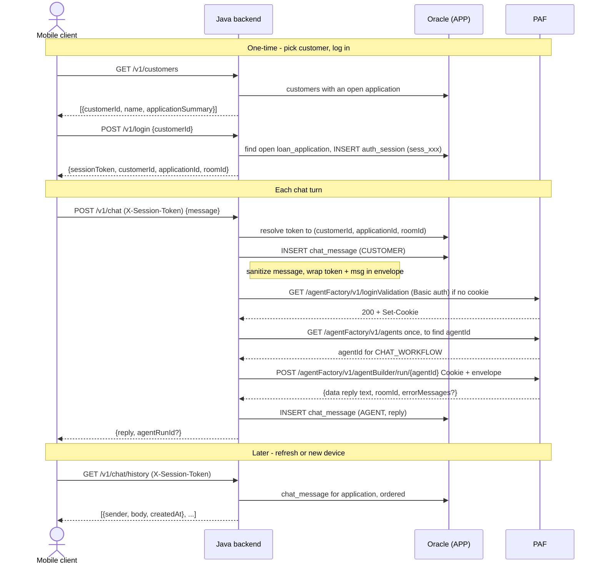

# Spring Boot Application Service — Customer Chat Slice (Design)

Date: 2026-05-28
Status: Draft for review

## 1. Goal

Build the first slice of the `src/backend/` Application Service (DESIGN.md §6.1) so the
already-built, already-tested `CHAT_WORKFLOW` becomes reachable from a real client instead
of only the pytest harness. The slice covers: mock login (issue a session token), one chat
turn (bridge to PAF and persist), and history replay.

This is README "what's next" item 5, reduced to its customer-chat core.

## 2. Scope

In scope:

- `GET /v1/customers` — list demo customers who have an open application (login dropdown).
- `POST /v1/login` — resolve the customer's open application, mint an `APP.auth_session`
  token, return it.
- `POST /v1/chat` — accept a turn, persist it, bridge to PAF `CHAT_WORKFLOW`, persist the
  reply, return it.
- `GET /v1/chat/history` — replay the persisted conversation.
- The PAF bridge: login (session cookie), agent discovery, run.
- Packaging: Spring Boot app, built with Gradle, run as a podman container in
  `deploy/podman/compose.local.yml`.

Out of scope (later slices):

- Application intake / creation. This slice operates only over applications that already
  exist (seeded). A customer with no open application is not given a path to start one here —
  that is the documented forward step (§15).
- Document upload + `OCR_REQUEST` enqueue.
- HITL claim/close + Blockchain `decision` write + outcome message back into chat.
- `/research/*` (`RESEARCH_WORKFLOW`).
- `system_config` editor + parameter history.
- Observability/audit reads, fair-lending, risk dashboard.
- The Angular UIs.
- Oracle Wallet / ADB connectivity (cloud path; UCP stays, wallet starter is deferred).

## 3. Context and constraints

- The `CHAT_WORKFLOW` is a published two-agent PAF flow (`EvaluationAgent` →
  `RecommendationAgent`). It already passes the pytest harness in `tests/`.
- The trust boundary is an **opaque session token**. `customer_id` / `application_id` are
  never taken from the chat message — a token minted at login resolves to them server-side
  (`banking-mcp.lookup_application`, cx_Oracle bind variables, fail-secure). See
  `issues/01-sql-query-no-bind-variables.md` and changelog `011-session-table.yaml`.
- The token crosses to PAF **in-band**, inside a `[[SESSION <token>]]\n<message>` envelope.
  The flow's RegexExtractor splits the token from the customer message at flow start. The
  user message must be sanitized (strip any injected `[[SESSION ...]]`) before enveloping —
  the security boundary depends on it. Mirrors `tests/conftest.py` `_sanitize` / `_envelope`.
- Because `lookup_application` re-derives full application context from the token on every
  turn, each PAF run is self-contained — the POC does not require PAF-side conversational
  memory.
- No schema changes. Changelogs `004-chat-persistence.yaml` (`chat_message`) and
  `011-session-table.yaml` (`auth_session`) already define everything this slice writes.

## 4. Technology stack

- Spring Boot 3.x, Java 21 language level (host JDK is 23; build targets 21).
- `spring-boot-starter-web`, `spring-boot-starter-data-jpa` (Hibernate).
- Oracle Spring Boot starters: `com.oracle.database.spring:oracle-spring-boot-starter-ucp`
  (UCP pool + ojdbc; auto-configures `oracle.ucp.jdbc.PoolDataSource`). The `-wallet`
  starter is the cloud/ADB path, deferred.
- `spring.jpa.hibernate.ddl-auto: none` — Liquibase owns the schema; Hibernate only maps it.
- Gradle 8.13 (already installed), wrapper committed.
- PAF HTTP calls via Spring `RestClient`, configured to skip TLS verification (PAF uses a
  self-signed cert) — POC only.
- Exact Oracle starter version and UCP property keys to be confirmed against Oracle's docs
  (Context7) at build time.

## 5. Architecture

Lean layered structure. Controllers stay thin; the PAF bridge and the security-critical
pure logic (sanitize, envelope, parse) are isolated so they are unit-testable.

```
src/backend/
├── build.gradle
├── settings.gradle
├── gradlew / gradle/wrapper/...
├── Dockerfile
└── src/main/
    ├── java/.../backend/
    │   ├── BackendApplication.java
    │   ├── config/PafClientConfig.java      # RestClient bean, TLS-skip
    │   ├── login/
    │   │   ├── LoginController.java          # GET /v1/customers, POST /v1/login
    │   │   └── SessionService.java           # mint + resolve auth_session
    │   ├── chat/
    │   │   ├── ChatController.java            # POST /v1/chat, GET /v1/chat/history
    │   │   ├── ChatService.java               # orchestrate persist→PAF→persist
    │   │   ├── PafClient.java                 # login cookie, discover agent, run
    │   │   └── Envelope.java                  # sanitize + envelope + parse (pure)
    │   └── domain/                            # JPA entities + Spring Data repositories
    │       ├── AuthSession.java / AuthSessionRepository.java
    │       ├── ChatMessage.java / ChatMessageRepository.java
    │       ├── Customer.java   / CustomerRepository.java        (read-only)
    │       └── LoanApplication.java / LoanApplicationRepository.java (read-only)
    └── resources/application.yml
```

### Full call sequence



## 6. External API (client ↔ backend)

### `GET /v1/customers`

List customers who have an open application (`status IN ('DRAFT','SUBMITTED','IN_REVIEW')`),
joined to `product_catalog` for the product label.

```
200 [ { "customerId": 1, "name": "<full_name>", "applicationId": 1,
        "productType": "PERSONAL", "amountRequested": 10000, "termMonths": 24 }, ... ]
```

### `POST /v1/login`

```
POST /v1/login   { "customerId": 1 }
200  { "sessionToken": "sess_<hex>", "customerId": 1, "applicationId": 1,
       "roomId": "room_<hex>" }
```

- Resolve the customer's open application (most recent if more than one). If the customer
  has no open application → `404`. This slice never creates an application (see §2, §15).
- Mint a row in `APP.auth_session`: `session_token = "sess_" + 32 hex chars`,
  `scenario_label = 'backend-login'`, `expires_at = SYSTIMESTAMP + 8h`.
- `roomId` is minted here (`"room_" + hex`), stored on the first `chat_message` and reused
  for the conversation. It keys persistence; it is not PAF's room id (see §10).

### `POST /v1/chat`

```
POST /v1/chat   Header: X-Session-Token: sess_<hex>
                { "message": "I'd like a $10,000 personal loan" }
200  { "reply": "Thanks — your application is now with our review team…",
       "agentRunId": null }
```

Steps: resolve token → (`customerId`, `applicationId`, `roomId`); persist `CUSTOMER`
message; sanitize + envelope; call PAF (§7); parse reply; persist `AGENT` message; return.

- Missing / invalid / expired token → `401` (fail-secure; no fallback row).
- PAF `errorMessages` non-empty or unreachable → `502`, and no `AGENT` row is persisted.

### `GET /v1/chat/history`

```
GET /v1/chat/history   Header: X-Session-Token: sess_<hex>
200  [ { "sender": "CUSTOMER", "body": "...", "createdAt": "..." },
       { "sender": "AGENT",    "body": "...", "createdAt": "..." } ]
```

Returns `chat_message` rows for the resolved application, ordered by `created_at`.

### `GET /health`

Liveness only (Spring Boot Actuator health or a trivial endpoint).

## 7. PAF bridge (backend → PAF)

Grounded in PAF.md §15. Base URL `https://paf:8080` (compose network).

1. **Session cookie** — `GET /agentFactory/v1/loginValidation` with HTTP Basic auth
   (`PAF_ADMIN_USER` / `PAF_ADMIN_PASS`). Read the cookie from `Set-Cookie` (name is
   version-specific — `ahffi_session` or `agent_factory_session` — do not hardcode). Cache
   it; re-login on `401`.
2. **Agent id** — `GET /agentFactory/v1/agents`, find the item whose `name == "CHAT_WORKFLOW"`,
   take `agentId`. Cache. `CHAT_WORKFLOW_AGENT_ID` env var overrides discovery.
3. **Run** — `POST /agentFactory/v1/agentBuilder/run/{agentId}` with the cookie and
   `{"message": "[[SESSION <token>]]\n<sanitized message>"}`. Response is
   `{"data": <reply text>, "roomId": "...", "errorMessages": [...]}`.

TLS verification is disabled (self-signed cert) — POC only.

## 8. Data model (existing tables, no changes)

JPA entities map the existing DDL; `ddl-auto: none`.

- `AuthSession` → `APP.auth_session`: `sessionToken` (PK), `customerId`, `applicationId`,
  `scenarioLabel`, `createdAt`, `expiresAt`. Read on every chat turn; written at login.
- `ChatMessage` → `APP.chat_message`: `messageId` (identity PK), `roomId`, `customerId`,
  `applicationId`, `sender` (`CUSTOMER`/`AGENT`/`SYSTEM`), `body` (CLOB → `String`),
  `attachments` (JSON — unused this slice, leave null), `agentRunId`, `createdAt`.
- `Customer` → `APP.customer` (read-only): `customerId`, `fullName`. Other columns
  (email/phone/etc.) are not mapped.
- `LoanApplication` → `APP.loan_application` (read-only): `applicationId`, `customerId`,
  `productId`, `amountRequested`, `termMonths`, `purpose`, `status`. Product label resolved
  via a join/lookup to `product_catalog` for the `/v1/customers` response.

## 9. Security

- The `X-Session-Token` is the credential. The backend resolves `(customer_id,
application_id)` from `auth_session` server-side and never trusts IDs from a request body.
- Fail-secure: unknown/expired token → `401`; no "first matching row" fallback anywhere.
- The user message is stripped of any injected `[[SESSION ...]]` sentinel before enveloping
  (regex `\[\[SESSION[^\]]*\]\]`). This preserves the existing IDOR/prompt-injection
  boundary proven by the pytest harness.
- The customer-facing reply contains no internal identifiers — that is enforced inside the
  flow (CHAT_WORKFLOW.md), and the backend passes the reply through verbatim.
- TLS verification to PAF is disabled for the self-signed cert — explicitly POC-only.
- Mock login has no password (DESIGN.md §10 — auth is out of scope; production sits behind
  the host system's auth).

## 10. Two items to resolve during implementation (TDD)

1. **Exact reply field.** The pytest harness only asserts DB side-effects, so the precise
   JSON path to the agent's text inside `data` is unconfirmed. First coding step: capture
   one real `run` response, then write `Envelope.parseReply` against it.
2. **roomId / continuity.** Each PAF run is self-contained (context re-derived from the
   token), so the POC does not thread PAF's `roomId`. Persistence is keyed by the local
   `room_id` minted at login. If a later need arises, PAF's returned `roomId` can be echoed
   on subsequent turns; not done in this slice.

## 11. Configuration

`application.yml` reads from environment (compose injects these):

- DB: `DB_HOST` (`oracle-free-26ai`), `DB_PORT` (`1521`), `DB_SERVICE` (`FREEPDB1`),
  `DB_USER` (`APP`), `DB_PASSWORD`. UCP url:
  `jdbc:oracle:thin:@//${DB_HOST}:${DB_PORT}/${DB_SERVICE}`.
- PAF: `PAF_BASE_URL` (default `https://paf:8080`), `PAF_ADMIN_USER`, `PAF_ADMIN_PASS`,
  optional `CHAT_WORKFLOW_AGENT_ID`.
- Session: `SESSION_TTL_HOURS` (default 8).
- Server port: `8090`.

## 12. Deployment wiring

- New `backend` service in `deploy/podman/compose.local.yml`: built from `src/backend/`,
  `depends_on` `oracle-free-26ai` (healthy) and `paf` (started), env block mirroring the
  MCP services, publish `8090:8090`. Connects as DB user `APP`.
- Add `backend` to the `manage.py local up` service list and to `manage.py info`
  (print the base URL).
- `Dockerfile`: build the Gradle boot jar, run on a JRE base image.

## 13. Testing

TDD — write tests first for the pure, security-critical logic:

- `Envelope.sanitize` strips an injected `[[SESSION ...]]` sentinel (single and repeated).
- `Envelope.build` produces `[[SESSION <token>]]\n<sanitized message>`.
- `Envelope.parseReply` extracts the reply text from a captured PAF response sample
  (added once a real response is captured — see §10).
- `SessionService` fail-secure: unknown/expired token resolves to empty → controller `401`.

Wider verification:

- A manual/curl smoke test of the wired path (login → chat → history) against the running
  local stack.
- Optionally retarget the existing pytest harness at the backend endpoints in a later slice.

## 14. Open questions

- None blocking. The two TDD items in §10 are expected to be answered by inspecting a live
  PAF response during the first implementation step.

## 15. Forward step (next): conversational intake and follow-up agent

This slice operates only over applications that already exist. The intended next step — a
change to `CHAT_WORKFLOW` itself, not just the backend — is to make the chat genuinely
conversational by adding a front agent (working name: **Greeting Agent** / Concierge) ahead
of `EvaluationAgent`. It spans two paths:

- **New customer, no application:** greet, identify the loan-request intent, collect
  `amount_requested`, `term_months`, and `purpose` through conversation, **create the
  `loan_application`**, then hand off to `EvaluationAgent` for evidence gathering.
- **Returning customer, existing application:** greet and follow up with the _result_ of
  evidence gathering as a gentle, qualitative hint — never raw numbers or the tier. E.g. a
  high DTI becomes "this repayment may stretch your monthly budget" rather than "DTI 0.41".

Non-obvious constraints to carry into that work:

- **A write tool is required.** No tool today can create a `loan_application` (banking-mcp is
  read-only; only `create_hitl_task` writes). Intake needs a new server-side tool (MCP or an
  App Service call) that inserts the application.
- **`customer_id` must come from the session token, not the chat.** The create-application
  tool must derive `customer_id` from the token (same trust boundary as `lookup_application`)
  and accept only `amount` / `term` / `purpose` / `product` from the conversation — otherwise
  it reopens the IDOR vector the session token exists to close.
- **The hint must be compliance-safe.** Today the customer-facing reply reveals nothing (§9 /
  CHAT_WORKFLOW.md). A qualitative hint is a deliberate relaxation: stay non-numeric, never
  expose the tier, and never surface protected-attribute-driven reasoning (fair lending).
  Gate the disclosable signal kinds (cf. DESIGN.md §12, "rejection explanation depth").
- **Fits the multi-agent rationale.** Adding a front agent is consistent with the
  `max_iterations=5` cap that already forced the Evaluation/Recommendation split
  (`issues/03-agent-max-iterations-5-cap.md`) — each agent keeps a small tool surface.

The backend side of this (an intake endpoint, or wiring the create-application tool) is a
follow-on slice; this spec stays minimal.
