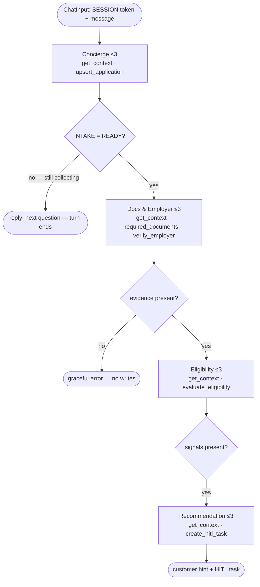

# Conversational Loan Origination — Intake to Recommendation

Design spec for letting a customer **with no open application** start one through chat,
have the conversation collect the loan request, then run evidence gathering and return a
compliance-safe decision hint while queueing a HITL task. Builds on the shipped chat slice
(`2026-05-28-spring-boot-chat-slice-design.md`) and the `CHAT_WORKFLOW` flow.

## Goal

Today the chat works only for a customer who already has a seeded open application. This
adds the front of the funnel: greet a customer with no application, collect the loan
request conversationally, create the application, then continue into the existing
evidence-gathering and recommendation path — all on a multi-small-agent architecture that
stays comfortably under PAF's hard per-agent iteration cap.

## Scope

**In scope**

- A **DB-as-memory**, **≤3-tool-per-agent** agent architecture (the principles below).
- A new **Concierge** agent: detect loan intent, collect `amount` / `term_months` /
  `purpose`, confirm, and create the `DRAFT` application.
- Two new MCP tools: **`get_context`** (universal read) and **`upsert_application`** (write).
- Splitting today's 4-tool `EvaluationAgent` into **Docs & Employer** + **Eligibility**
  agents so every agent obeys the ≤3-tool rule.
- The **Recommendation** agent gains a fixed **reason-code enum** and a compliance-safe,
  three-tone **customer hint**.
- Backend: customer-only login, token-only envelope, marker-block stripping,
  customer-keyed chat room.
- A new additive Liquibase changeset and a seeded no-application demo customer.

**Out of scope (forward phases)**

- **KYC / income refresh** behaviour and its write tool (Phase 2). `get_context` exposes
  staleness flags now, but the Concierge does not yet act on them.
- The **reviewer-side HITL flow** (claim → decide → write `decision` → update status →
  notify). Phase 1 only _creates_ the HITL task.
- More than one open application per customer; products other than `PERSONAL_LOAN`.

## Architecture principles

1. **The database is the memory.** PAF runs the flow statelessly per turn — agents have no
   memory between turns. Every agent's first action is `get_context(token)`, so the
   authoritative facts always come from the DB, never from an upstream agent's text. Any
   value that must survive to the next turn is written to the DB through a tool.
2. **≤3 planned tool calls per agent.** PAF hardcodes `max_iterations = 5`
   (`agent_factory/app/models/agentBuilder/steps/customSteps/AgentStep.py`), effectively
   ~4 tool calls before tools are stripped. Capping planned calls at 3 leaves **2
   iterations of headroom** for a transient retry or a clarification — the margin today's
   4-tool `EvaluationAgent` lacks.
3. **Token trust boundary, unchanged.** The opaque session token is the only identifier
   that crosses the boundary. `customer_id` is always derived from the token server-side
   (bind variables); the conversation supplies only `amount` / `term` / `purpose`. The
   application is resolved as _that customer's open application_ — a token can never address
   another customer's application.
4. **Plain-text agents + regex gates.** PAF's canvas exposes no structured-output, no
   variables, and no mid-flow user-input node, so agents emit a typed marker block parsed
   by a `Condition` gate (and stripped by the backend before the customer sees the reply).

## Flow



**Per-turn behaviour**

- _Collecting turns_ — only the **Concierge** runs: it reads context, captures whatever the
  message supplies (writing it via `upsert_application`), and either asks for the next
  missing field or, once complete and confirmed, emits `READY`. The turn ends after the
  Concierge.
- _Proceed turn_ — **Concierge(READY) → Docs & Employer → Eligibility → Recommendation**
  run in one flow pass. Each re-reads facts from the DB via `get_context`; compact findings
  flow forward as marker blocks; the backend persists the final decision.

The **confirm** step is agent-owned: when the slots are complete the Concierge produces a
readback ("Confirm $20,000 over 36 months for home improvement?"). On the next turn the
Concierge itself interprets the customer's "yes" → `READY`, or treats a correction as
continued collection. The backend never interprets yes/no.

## Agents and interfaces

Every agent: **input** = `token` (+ user message for the Concierge; + prior findings marker
for downstream agents); **first call** = `get_context(token)`; **output** = one typed marker
block + optional customer-facing text.

| Agent               | Tools (≤3)                                             | Emits (interface)                                 | Status                       |
| ------------------- | ------------------------------------------------------ | ------------------------------------------------- | ---------------------------- |
| **Concierge**       | `get_context`, `upsert_application`                    | `[[INTAKE status=COLLECTING\|READY]]` + reply     | new                          |
| **Docs & Employer** | `get_context`, `required_documents`, `verify_employer` | `[[EVIDENCE docs=… employer=…]]`                  | split from `EvaluationAgent` |
| **Eligibility**     | `get_context`, `evaluate_eligibility`                  | `[[ELIGIBILITY allow=… deny=[…] warn=[…]]]`       | split from `EvaluationAgent` |
| **Recommendation**  | `get_context`, `create_hitl_task`                      | `[[DECISION tier=… reasons=[…]]]` + customer hint | existing, extended           |

Marker blocks are emitted as the **first line(s)** of an agent's output and stripped by the
backend before the customer-facing text is shown/persisted — the same pattern as today's
`## Evidence` block.

## MCP tools

**`get_context(session_token)` — universal read.** New tool on `banking-mcp` (REPORTING
user, cx_Oracle bind variables). Token → customer; one call returns the full picture so any
agent is self-sufficient:

```
customer    { id, name, age_years, residency, kyc_status, kyc_age_days, kyc_stale }      # kyc_stale = kyc older than 180 days
application { id|null, status, amount_requested, term_months, purpose, missing[] }       # missing = unfilled loan-request fields (amount/term/purpose), server-side
profile     { employment_type, employer_name, monthly_salary, income_stale }
credit      { score }
facilities  { existing_monthly_debt }
derived     { dti, pti }
```

`missing[]` and the `*_stale` booleans are computed **server-side** so each step has a
DB-derived definition of "done" rather than an LLM guess. Fail-secure: an invalid/expired
token returns `{ "error": "invalid_or_expired_session" }`.

**`upsert_application(session_token, amount?, term_months?, purpose?)` — write.** New tool
on a write-capable server (`application-mcp`, `AGENT_FACTORY` user, mirroring `hitl-mcp`)
calling a new `AGENT_TOOLS.PKG_AGENT_TOOLS` function with bind variables. Derives `customer_id` from the
token; creates the customer's `DRAFT` application on first call and patches supplied fields
thereafter. **Idempotent** per the customer's open draft — a re-run never duplicates.
Returns the updated `application{…}` (same shape as above). `product_type` defaults to
`PERSONAL_LOAN`.

Both tools keep the trust boundary identical to today's `lookup_application`: customer scope
from the token, values from the conversation.

## Backend changes (Spring)

- **`LoginService`** — drop the "must have an open application" rule; mint a token bound to
  the **customer**. No-app customers get a valid session and enter intake.
- **Session resolution** — tolerate a null `auth_session.application_id`; the application is
  resolved as the customer's open application, so `application_id` on the session is a
  non-authoritative cache, not the binding key.
- **Envelope stays token-only** — `[[SESSION <token>]]` + sanitized message. No injected
  state.
- **Reply handling** — extend `Envelope.extractReply` to strip the leading marker block
  (`[[INTAKE]]` / `[[EVIDENCE]]` / `[[ELIGIBILITY]]` / `[[DECISION]]`) and return only the
  customer-facing text. Agents persist real state through their tools, so the backend's only
  persistence job is the chat messages (`CUSTOMER` + cleaned `AGENT` text).
- **Chat room** — keyed by customer (`room-cust-{customer_id}`), stable across the pre-app →
  app transition.
- **`GET /v1/customers`** — also list no-application customers, with a `hasOpenApplication`
  flag so the demo can pick an intake candidate.

## Schema — new Liquibase changeset `012` (additive; never edit applied changesets)

- `ALTER TABLE APP.auth_session MODIFY (application_id NULL)`.
- `ALTER TABLE APP.chat_message MODIFY (application_id NULL)`.
- Add the `AGENT_TOOLS.PKG_AGENT_TOOLS` upsert function for the draft application (bind
  variables; `customer_id` resolved from the session token).
- **Seed a no-application demo customer** with full profile, employment, credit snapshot,
  and fresh KYC on file, but **no** `loan_application` row — the fixture that exercises
  intake end-to-end.

## Decision: reason codes and customer hint

**Reason-code enum** (carried in the HITL task alongside prose, derived from signals we
already compute):

```
DTI_TOO_HIGH · PTI_TOO_HIGH · SCORE_BELOW_FLOOR · SCORE_CAUTION · AGE_BELOW_MIN
EMPLOYER_UNVERIFIED · EMPLOYER_DORMANT · DOCS_REQUIRED · AMOUNT_EXCEEDS_POLICY
```

**Tier mapping** (unchanged from today's logic): `DECLINE` if any deny signal or employer
not registered; `REVIEW` if any warn signal or employer dormant; otherwise `APPROVE`.

**Customer hint** — the human reviewer issues the legally-operative decision, so the agent
never hands the customer a binding outcome. Three distinguishable tones, no number / score /
tier / protected attribute ever surfaced:

| Tier    | Customer sees                                                                                           | Reason                                 |
| ------- | ------------------------------------------------------------------------------------------------------- | -------------------------------------- |
| APPROVE | "Looks strong — it's with our team for final approval; we'll confirm shortly."                          | —                                      |
| REVIEW  | "We'd like a closer look at **{affordability \| your employment details}**; a reviewer will follow up." | dominant reason code → friendly phrase |
| DECLINE | "Before we can proceed, a specialist needs to review this in detail — we'll be in touch."               | no adverse reason stated               |

Reason→phrase mapping (REVIEW only): `DTI/PTI_*` → "affordability"; `EMPLOYER_*` → "your
employment details"; `DOCS_REQUIRED` → "have a recent payslip ready"; `SCORE_*` → not
surfaced.

## Error handling / fail-secure

- Invalid/expired token → `get_context` error → no valid marker → gate fails → "your session
  expired, please log in again"; **zero writes**.
- Tool failure (e.g. registry down) → the 2-iteration headroom absorbs one retry; if still
  failing → degraded marker → graceful "we couldn't complete this right now". **No HITL task
  on incomplete evidence** (the evidence gate guards it, as today).
- Truncated/malformed agent output → regex gate fails → graceful message, no downstream
  writes.
- `upsert_application` is idempotent → a retried create never duplicates; `customer_id`
  always from the token.

## Testing

- **Backend unit** — no-app login mints a customer session; `resolve` tolerates a null
  `application_id`; `extractReply` strips each marker variant; `/v1/customers` returns the
  `hasOpenApplication` flag.
- **MCP tool unit** — `get_context` shape and correct `missing[]` / staleness for {no app,
  partial app, complete app}; fail-secure on bad token; `upsert_application`
  creates-then-patches, idempotent, customer-from-token, cross-customer rejected.
- **End-to-end smoke (scripted)** — no-app customer → intake (amount/term/purpose) → confirm
  → create → proceed → evidence → recommendation → customer hint + HITL row; plus bad-token
  → safe message, no writes.
- **Decision asserts** — HITL task carries tier + reason codes + evidence; customer text
  never contains a tier, number, or raw "declined".
- Existing backend tests stay green.

## Open risks / forward steps

- **Cascading regex-gate fragility** — four agents means more all-text handoffs. The ≤3-tool
  headroom and DB re-grounding mitigate it; structured output would remove it, but PAF's
  canvas does not expose it (verified against `wayflowcore 26.1.1` in the container).
- **Phase 2 — KYC / income refresh** — `get_context` already exposes `kyc_stale` /
  `income_stale`; the Concierge acting on them (prompting a refresh) plus a `refresh_*` write
  tool are the next phase.
- **Phase — reviewer-side HITL flow** — claim, decide, write the `decision` ledger row,
  update `loan_application.status`, and notify the customer.

## Key files

- `paf/flows/CHAT_WORKFLOW.md`, `paf/flows/chat_workflow.flow.json` — the flow + new agents.
- `src/ai/banking-mcp/server.py` — `get_context`.
- `src/ai/application-mcp/server.py` + `database/liquibase/oracle/007-agent-tools.yaml` package function — `upsert_application`.
- `database/liquibase/oracle/012-*.yaml` — nullable FKs, draft-upsert function, no-app seed.
- `src/backend/.../login/LoginService.java`, `.../chat/Envelope.java`, `.../chat/ChatService.java` — login, envelope, marker stripping, room.
