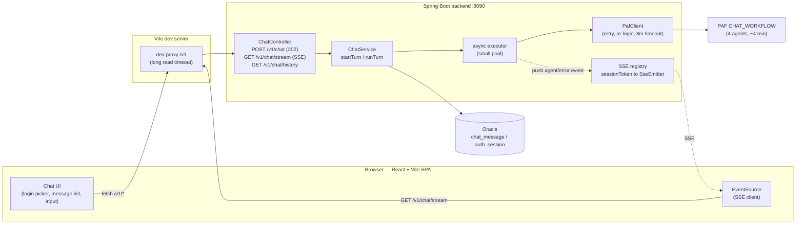
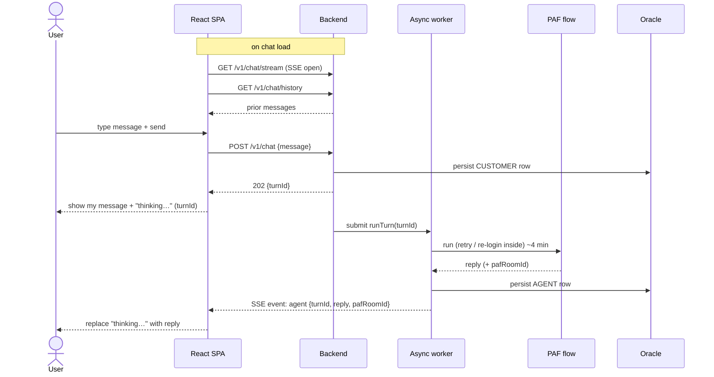
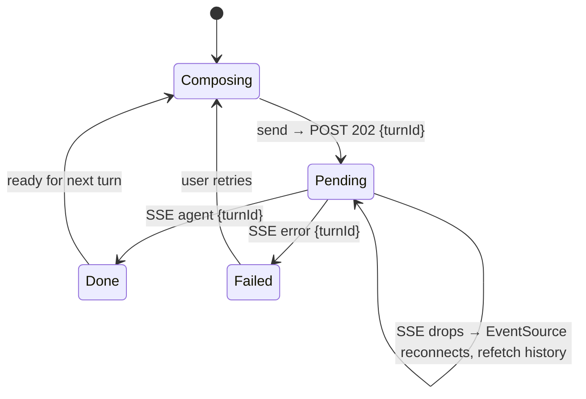

# Chat UI + async backend with SSE — design

## Goal

Build a browser chat UI for the loan-origination assistant, talking to the existing Java backend (`src/backend`, Spring Boot on `:8090`). A chat turn runs the PAF `CHAT_WORKFLOW` flow, which is **synchronous and slow** (~200–255s per turn — four agents on a 72B vLLM, no token streaming back to us). The UI must stay responsive during that multi-minute wait and show the reply when it arrives, without holding a fragile multi-minute HTTP request open.

Decision (already taken): **React + Vite SPA**, backend made **async** with the late reply delivered over **Server-Sent Events (SSE)**, component-library-assisted styling (Tailwind + shadcn/ui). No WebSocket, no Angular.

## What is SSE (and why it fits here)

**Server-Sent Events** is a web standard for **one-way, server → client** streaming over a single, long-lived HTTP `GET`. The browser opens the connection once with the built-in `EventSource` API; the server keeps it open and writes small text "events" (`event: <name>` + `data: <json>`) whenever it has something to send. It is plain HTTP (no protocol upgrade), and `EventSource` **auto-reconnects** if the connection drops.

How it compares for our problem (deliver a reply that's ready _minutes_ after the request):

| Option                     | Direction        | Fit here                                                                                                                                               |
| -------------------------- | ---------------- | ------------------------------------------------------------------------------------------------------------------------------------------------------ |
| **Plain synchronous HTTP** | request/response | Works, but holds one connection open ~4 min and is fragile to proxy/socket timeouts.                                                                   |
| **Polling**                | client pulls     | Simple, but laggy and wasteful over a 4-min wait; no server push path.                                                                                 |
| **WebSocket**              | bidirectional    | Powerful but heavier (handshake, protocol, reconnection logic); overkill — we only need server → client.                                               |
| **SSE** ✅                 | server → client  | Exactly our shape: the server pushes the reply when ready (and, later, HITL outcome messages) on one channel; auto-reconnects; trivial on the browser. |

Important: **SSE does not make the turn faster.** The ~4 minutes is PAF compute; SSE only removes the need to block on a long HTTP request and gives us a clean push channel for results now and HITL `SYSTEM` updates later.

## Architecture

The PAF reliability fixes already shipped (apology retry, cookie re-login, 8-min socket timeout) sit unchanged inside `PafClient`.

## Backend design

The current `POST /v1/chat` is synchronous (blocks ~4 min, returns `{reply, pafRoomId}`). We make it async and add an SSE channel; persistence and `GET /v1/chat/history` are unchanged, so a persisted reply is always the backstop if a live event is missed.

### Endpoints

- **`GET /v1/chat/stream?token=<sessionToken>`** → a long-lived `SseEmitter`. The browser's native `EventSource` **cannot set custom headers**, so this endpoint takes the session token as a **query parameter** (the other calls keep using the `X-Session-Token` header). The token is still the opaque, server-issued credential — the only tradeoff is that it appears in URLs/server logs, acceptable for a local PoC; production should move to a header-capable SSE client or an `httpOnly` cookie. The emitter is registered in an in-memory `ConcurrentHashMap<sessionToken, SseEmitter>`; removed on completion/timeout/error. Opening a new stream for a session replaces and closes the previous emitter. Emitter timeout is set high (the channel lives for the chat session).
- **`POST /v1/chat`** `{message}` (header `X-Session-Token`) → resolves the session, persists the CUSTOMER message, generates a `turnId` (UUID), submits the turn to the executor, and returns **`202 Accepted {turnId}`** immediately.
- **`GET /v1/chat/history`** (header `X-Session-Token`) → unchanged; ordered `[{sender, body, createdAt}]` for replay.
- **`POST /v1/logout`** (header `X-Session-Token`) → invalidates the session: deletes/expires the `auth_session` row (`SessionService.invalidate`) and drops any SSE emitter for that token (`ChatEventPublisher.remove`). Returns `204`. Idempotent — an unknown/expired token is a no-op `204`. Lives in `LoginController` alongside `/login`.

### Async worker

`ChatService.handleTurn` splits into:

- `startTurn(token, message) → turnId`: persist CUSTOMER row, submit `runTurn` to the executor, return `turnId`.
- `runTurn(token, message, turnId)` (background): the existing logic — `paf.run(...)` with apology-retry, persist the AGENT row — then **push** on the session's emitter:
  - success → `event: agent`, `data: {turnId, reply, pafRoomId}`
  - failure (502/exception) → `event: error`, `data: {turnId, message}`

The executor is a small bounded pool (~2–4 threads): PAF/vLLM is the bottleneck and turns are one-at-a-time per session, so a tiny pool is sufficient for a demo. This cap is documented, not configurable.

### HITL path (laid, not built)

The emitter wrapper exposes a `pushSystem(sessionToken, ...)` method that is **not called yet**. When a reviewer later closes a HITL task, that outcome would be pushed as `event: system` on the same channel — no new transport needed.

## Frontend design (React + Vite + Tailwind + shadcn/ui)

- **Login picker** — `GET /v1/customers` → cards (name, product, amount, `hasOpenApplication`); selecting one calls `POST /v1/login`; the returned `sessionToken` is kept in `sessionStorage` so a reload stays logged in. Users **select** a seeded customer — they never type an id (auth is by opaque server-issued token only).
- **Chat screen (on mount)** — open the SSE channel via `new EventSource('/v1/chat/stream?token=' + sessionToken)`, then `GET /v1/chat/history` and render. Sending a message: `POST /v1/chat` → optimistically append the user bubble plus a "thinking" placeholder keyed by `turnId`; the SSE `agent` event with that `turnId` swaps the placeholder for the reply; an `error` event marks that turn failed and re-enables input. Input is disabled while a turn is in flight (one-at-a-time per session).
- **The wait** — the pending turn shows a persistent indicator: _"The agent is reviewing your application — this can take a few minutes."_ This is the most important UX element, given multi-minute turns.
- **Logout** — a control in the chat header calls `POST /v1/logout` (best-effort), then closes the `EventSource`, clears `sessionStorage`, and returns to the picker. Logout always completes for the user even if the call fails (the abandoned token still TTL-expires server-side).
- **State** — a single `useReducer`-backed hook (`useChat`); no Redux. Components: `Login`, `Chat`, `MessageList`, `MessageBubble`, `Composer`.
- **Vite dev proxy** — `/v1` → `http://localhost:8090` with `timeout`/`proxyTimeout` set to ~10 min so neither the long `POST` nor the SSE stream is cut off; SSE passes through unbuffered.

## Data flow — one turn

## Turn lifecycle (UI state)

## Error handling

- `POST /v1/login` fails → error on the picker.
- `POST /v1/chat` returns `401` (missing/expired session) → return to login.
- Async PAF failure → backend pushes `error` → the turn shows "couldn't get a response, try again"; input re-enabled.
- **SSE drop** → `EventSource` auto-reconnects; on (re)open the UI refetches `/v1/chat/history` to reconcile any reply pushed while disconnected (the AGENT row is always persisted).
- **Backend restart mid-turn** → in-memory executor job and emitter are lost; on reconnect the UI refetches history; if the reply isn't there, the user resends. PoC-acceptable.
- The post-retry apology sentence (rare) is rendered as a normal agent reply.
- **Logout is best-effort** — the UI returns to the picker and clears storage even if `POST /v1/logout` errors.

## Testing

- **Backend** — MockMvc: `POST /v1/chat` returns `202` + `turnId`; `GET /v1/chat/stream` returns `text/event-stream`; `POST /v1/logout` returns `204` and a subsequent call with that token is rejected (`401`). Unit tests: SSE registry (register / lookup / replace / remove), session invalidation, and the async worker reusing the existing apology-retry and `pafRoomId` assertions, now verifying the pushed `agent` / `error` event.
- **Frontend** — light for a PoC: a couple of Vitest + React Testing Library tests for the `pending → reply` and `pending → error` transitions driven by mock SSE events. Otherwise manual end-to-end (`/run`-style): log in, send, observe the thinking state, receive the reply after the wait, reload → history intact.

## Scope

**In:** customer-picker login; logout (client + server-side session revocation); single conversation per customer (`room-cust-N`); async send + per-session SSE push of the turn reply; history replay on load; thinking/error states; Tailwind + shadcn/ui.

**Out (path laid, not built):** HITL `SYSTEM`-message push (emit point exists, uncalled); multiple conversations per customer; production CORS / static-serving (dev proxy only for now); horizontal scaling of the in-memory SSE/job registries; reducing PAF turn latency (separate flow/model concern).

## Files (rough)

- **Backend:** extend `ChatController` (`POST` → 202, `GET /stream`, keep `/history`); add `POST /v1/logout` to `LoginController`; `SessionService.invalidate(token)`; new `ChatEventPublisher` (SSE registry + `pushAgent` / `pushError` / `pushSystem` / `remove`); `ChatService` refactor (`startTurn` + async `runTurn`); an async executor `@Configuration`.
- **Frontend:** new `src/frontend/` Vite app — `vite.config.ts` (proxy), `api.ts` (fetch + `EventSource` helpers, `logout`), `useChat.ts`, `Login.tsx`, `Chat.tsx` (header with logout), `MessageList.tsx`, `MessageBubble.tsx`, `Composer.tsx`, Tailwind + shadcn setup.
