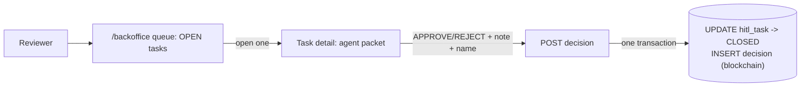

# Backoffice review loop — design

## Goal

Close the loan-decisioning loop: let a reviewer see the HITL queue, inspect an
application's agent recommendation packet, take a final decision (APPROVE /
REJECT) with a note, and record that decision immutably for audit — the human's
call written to the `APP.decision` Blockchain Table.

The Case Research Agent (`RESEARCH_WORKFLOW`) is explicitly **out of scope** for
this iteration.

## Scope

In:

- HITL queue view (OPEN tasks).
- Task detail showing the agent recommendation packet.
- Final decision (APPROVE / REJECT) + free-text note.
- Atomic close: `hitl_task` → CLOSED **and** one `APP.decision` blockchain row.

Out (deferred):

- Research agent / `RESEARCH_WORKFLOW`.
- TxEventQ "Claim next" transactional dequeue / concurrency control.
- Reviewer authentication (see Assumptions).
- Notification bell, failed-OCR queue, role-filtered queues.

## No schema changes

The schema already supports the whole loop (changeset `003`):

- `APP.hitl_task` carries the agent packet (`agent_recommendation`,
  `agent_reasoning`, `agent_explore_hints`, `agent_evidence`, `agent_run_id`)
  and the reviewer close-out columns (`state`, `human_outcome`, `human_note`,
  `human_user`, `closed_at`).
- `APP.decision` is a `BLOCKCHAIN TABLE` (SHA2_512, NO DELETE LOCKED, 7-year
  retention) with slots for the copied agent packet plus `human_outcome`,
  `human_user`, `human_note`, `computed_dti`, `computed_pti`, `pricing_offer`,
  `reason_codes`.

No Liquibase changeset is added.

## Assumptions

- **Backoffice access = authorization (PoC).** The `/backoffice` route is
  unauthenticated. Production is assumed to host a separate authenticated
  reviewer portal; that is not built here.
- **`human_user` is attribution, not authentication.** The decide form carries a
  free-text reviewer name (default `"Backoffice Reviewer"`) written to
  `human_user`. It identifies who is recorded as the signer; it does not gate
  access.

## Architecture & flow

## Backend

New `com.bank.appbackend.hitl` package, mirroring the existing `chat/` and
`login/` packages (`Controller -> Service -> Repository`).

Endpoints (all under `/v1/hitl`):

- `GET /v1/hitl/tasks?state=OPEN` — queue rows. One query joining
  `hitl_task -> loan_application -> customer`, returned via a projection in the
  style of the existing `CustomerOption`. Fields: `taskId`, `applicationId`,
  `customerName`, `agentRecommendation`, `amountRequested`, `termMonths`,
  `createdAt`.
- `GET /v1/hitl/tasks/{taskId}` — full packet: `agentRecommendation`,
  `agentReasoning`, `agentExploreHints`, `agentEvidence`, plus customer /
  application context. 404 if not found.
- `POST /v1/hitl/tasks/{taskId}/decision` — body
  `{ outcome: "APPROVE"|"REJECT", note: string, reviewer?: string }`.

### Close transaction

A single `@Transactional` service method:

1. Load the task. 404 if missing. **409 if already CLOSED** (idempotent — never
   write a second blockchain row).
2. `UPDATE hitl_task SET state='CLOSED', human_outcome=:outcome,
human_note=:note, human_user=:reviewer, closed_at=SYSTIMESTAMP`.
3. `INSERT INTO APP.decision` copying the agent packet from the task
   (`agent_recommendation`, `agent_reasoning`, `agent_explore_hints`,
   `agent_evidence`, `agent_run_id`) and the human fields (`human_outcome`,
   `human_user`, `human_note`). `computed_dti` / `computed_pti` /
   `pricing_offer` / `reason_codes` are best-effort copied from
   `agent_evidence` when present, else NULL.

`INSERT` into a blockchain table is permitted inside a normal transaction (only
`UPDATE` / `DELETE` on the blockchain row are blocked), so the close is atomic:
either both writes land or neither does.

`human_user` is taken from the request `reviewer` field (defaulted server-side
to `"Backoffice Reviewer"` if blank) — consistent with the no-auth PoC
assumption above.

## Frontend

Same Vite + React app and same nginx container — no second image.

- **Path split, no router dependency.** `App.tsx` checks `location.pathname`:
  `/backoffice*` renders the backoffice tree; otherwise the existing customer
  `Login -> Chat`. nginx already falls back to `index.html`, so deep links work.
- New components under `src/frontend/src/components/backoffice/`, reusing the
  existing `api.ts`, `Button`, and Tailwind:
  - `Queue` — fetches OPEN tasks, renders a list, row click opens detail.
  - `TaskDetail` — renders the packet (recommendation tier, reasoning,
    explore-hints, evidence) and a decide form: APPROVE/REJECT toggle, note
    textarea, reviewer-name input (default `"Backoffice Reviewer"`), submit.
- After a successful decision the UI returns to the queue (the closed task drops
  off the OPEN list).

## Error handling

- Backend: 404 (unknown task), 409 (already closed), 400 (bad outcome value).
- Frontend: surface the 409 as "already decided" and refresh the queue; generic
  error toast/line otherwise (match the customer app's existing style).

## Testing

- Backend tests mirroring `ChatServiceTest` / `LoginServiceTest`:
  - happy path writes both the `hitl_task` close and the `decision` row;
  - already-CLOSED task returns 409 and writes no second row;
  - blank `reviewer` defaults to `"Backoffice Reviewer"`.
- Manual end-to-end: run case 3 (David HighDti -> DECLINE) so a `hitl_task` is
  created, then in `/backoffice` open it, REJECT with a note, and confirm a row
  appears in `APP.decision` with the copied agent packet and the note.

## Open risk to verify during deploy

`CREATE BLOCKCHAIN TABLE` must have succeeded on the running Oracle Free 26ai
instance. Confirm `APP.decision` exists and accepts an INSERT before relying on
the close path (smoke-insert + rollback, or check the changeset applied clean).
