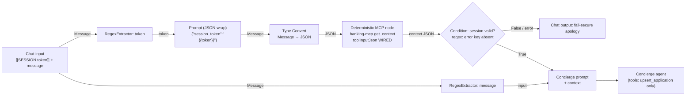

# Deterministic `get_context` via the 26.4 Deterministic MCP node

**Date:** 2026-06-04
**Status:** DONE — built and validated on the running 26.4 stack (2026-06-04).
**Resolves:** the streamed-token corruption on the `get_context` read path (the former `issues/09`, since deleted). The `upsert` write path stays agentic by design — see Decision.

## Problem

`CHAT_WORKFLOW` agents call `get_context(session_token)` **agentically** — the LLM emits the opaque token inside a streamed tool-call argument. PAF's streaming tool-call assembler occasionally drops/duplicates one character (~1 in 150 turns), so the token arrives at `banking-mcp` one char off → `invalid_or_expired_session` → fail-secure apology at gate G1 instead of a decision. It's silent (no error logged) and currently masked by a `ChatService` retry-on-apology hack.

PAF 26.4 ships a **Deterministic MCP Server node** (`MCPToolExecutionStep.py`): it invokes one chosen MCP tool with explicit `Tool input JSON` that can be **wired from an upstream node** — the LLM never produces the argument. This lets the token reach `get_context` byte-exact.

## Decision

Make **`get_context` deterministic**; leave **`upsert_application` agentic**.

Why not also `upsert`: its payload is half-deterministic (token) + half-agentic (amount/term/purpose). The Deterministic MCP node takes one JSON input and PAF has no structured-merge node, so a deterministic upsert means string-building JSON from regex captures of a marker — reopening the fail-open interpolation hazard (`issues/01`), a write-or-skip Condition (`issues/08`), and reliance on structured marker emission (`issues/07`). The write is low-stakes: the token is opaque and fail-closed (a corrupted upsert token just fails and the agent retries; the write is idempotent), and it was never the #09 repro. Not worth the brittleness for a POC. Captured as a possible follow-up only if write-path corruption ever shows up in testing.

## Design



Changes vs. today:

1. **New Deterministic MCP node** → `banking-mcp.get_context`, placed at flow start, with its `toolInputJson` port **wired** (not inline). Because the RegexExtractor emits the _bare_ token and the node's `_parse_tool_input_json` rejects a non-JSON string, a tiny **Prompt (JSON-wrap) node** renders `{"session_token": "{{token}}"}`. The Prompt's output is type **Message**, but `toolInputJson` only accepts type **JSON** — the canvas won't wire Message → JSON — so a **Type Convert node** (Message → JSON) sits between the Prompt and the MCP node. The token is opaque alphanumeric, so the interpolation is JSON-safe; the whole chain (extractor → prompt → type-convert → deterministic node) is LLM-free, so the token is byte-exact.
2. **Its JSON output is the shared context**, wired by data edges into all four agent prompts (Concierge, Docs & Employer, Eligibility, Recommendation). Agents read context as data.
3. **`get_context` removed from every agent's tool list** and from their Custom Instructions' "FIRST, call get_context" step. Agents no longer transcribe the token for reads.
4. **Fail-secure moves up front:** a Condition tests the deterministic node's output for the `error` key; on error it routes straight to the apology Chat output — no longer dependent on the agent emitting (or not emitting) a marker.
5. **`upsert_application` unchanged** — agentic tool on the Concierge only; token still wired into that agent's prompt for the write.
6. **Backend:** `ChatService` retry-on-apology downgraded to belt-and-suspenders (it should essentially stop firing).

## Live validation — PASSED (2026-06-04)

Built the minimal flow below in Agent Builder and ran `[[SESSION paf-test-alice-salaried]] hello` in the Playground:

1. **Wired input accepted — PASS (code + live).** `MCPToolExecutionStep.toolInputJson` is a JSON-typed wireable port (`UnionProperty(Dict | String)`); the wired chain feeds it a real JSON object. Confirmed the Type Convert bridge is required: Prompt outputs Message, `toolInputJson` wants JSON.
2. **Token byte-exact, no transcription — PASS (live).** `banking-mcp` log:
   ```
   [get_context] called session_token='paf-test-alice-salaried'
   [get_context] -> customer_id=1 has_app=True missing=[] kyc_stale=False
   ```
   The token arrived intact (no dropped/duplicated char), and the Playground rendered the full context JSON. The entire chain is LLM-free, so corruption is structurally impossible on this path.
3. **Context-as-data into agents — not yet exercised.** The single-node test proves `get_context` returns the context payload; wiring that Message into the four agent prompts is a plain Message→`{{context}}` edge (low risk) and gets exercised when the full `CHAT_WORKFLOW` is rebuilt.

### Manual validation recipe (minimal flow, no full CHAT_WORKFLOW rebuild)

PAF UI driving is out of scope (per `paf bootstrap`), so run this by hand after completing the install wizard + registering `banking-mcp`:

1. Build: **Chat input → RegexExtractor `(?<=\[\[SESSION )[^\]]+` → Prompt `{"session_token":"{{token}}"}` → Deterministic MCP node (server `banking-mcp`, tool `get_context`, `toolInputJson` wired from the Prompt) → Chat output**.
2. In one terminal: `podman logs -f paf-banking-mcp`.
3. Run the flow in Playground with message: `[[SESSION paf-test-alice-salaried]] hello` (customer 1, application 1 SUBMITTED → rich context).
4. Pass = the log shows `[get_context] called session_token='paf-test-alice-salaried'` (byte-exact) and `-> customer_id=1 has_app=True`, and the Chat output carries the context JSON. Re-run ~20× → zero `invalid_or_expired_session`.

## Out of scope

- Deterministic `upsert` (marker-based). Follow-up only.
- PL/SQL Executor node / removing MCP sidecars (rejected: agentic, doesn't fix #09 — see `PAF-26.4-REVIEW.md` §0.3 analysis).
- Issues 01/02/03/04/06/07/08/10 — unchanged by this work.

## Rollout — DONE (2026-06-04)

- **Flow:** `paf/flows/CHAT_WORKFLOW.md` updated to the deterministic `get_context` entry (architecture + node graph + a build-sequence migration note; the numbered steps are migrated as the flow is rebuilt in PAF).
- **Issue:** `issues/09` **deleted** (per the maintenance convention — done+validated, not a lingering "resolved" banner). The residual `upsert` write-path exposure is captured here and in backlog §0.2.
- **Backend:** `ChatService` retry-on-apology reframed as belt-and-suspenders (kept until the deployed flow uses the deterministic node).
- **Backlog:** §0.2's done portion removed; only the optional marker-based `upsert` follow-up remains.
