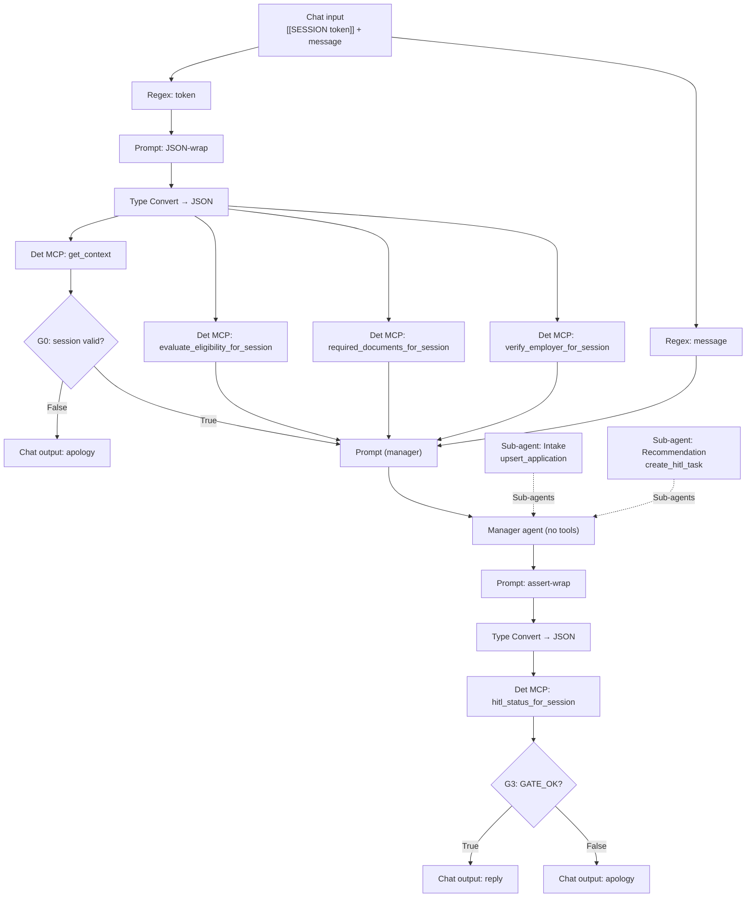

# `CHAT_FLOW` — manager agent with sub-agents

**Date:** 2026-08-25
**Status:** DESIGN — approved, not yet implemented.
**Replaces:** the three-agent gate pipeline described in `paf/flows/CHAT_WORKFLOW.md`.

## Problem

A PAF flow runs **one Agent node per execution path**. A second agent on the same
path never executes: the first agent's message is returned and the turn ends.

Verified against the running 26.7 instance with three minimal flows:

| Topology                                                           | Result                                  |
| ------------------------------------------------------------------ | --------------------------------------- |
| `Agent1 → Condition → Agent2` on one path                          | Agent2 never runs                       |
| `Condition → Agent1` and `Condition → Agent2` on separate branches | both run, one per turn                  |
| Manager agent with workers on its `Sub-agents` port                | worker runs, manager returns its output |

The sub-agent case was confirmed with a secret the manager could not otherwise
know: a `VaultKeeper` worker holding the string `ZX-4471-QQ`, chosen correctly
over a decoy worker.

The mechanism is visible in the kit. A flow's agent is built without
`caller_input_mode` (`AgentStep.py:1321`), taking the default
`CallerInputMode.ALWAYS` (`:791`), so it yields to the user and ends the turn.
Sub-agents are built with `CallerInputMode.NEVER` (`:1066`) precisely so they
return to their manager instead.

Every sample workflow in the product documentation has exactly one Agent node in
the graph, and the one advanced multi-agent sample is a master agent
orchestrating sub-agents. Agent-to-agent **sequencing** is not a PAF pattern;
agent-to-agent **delegation** is.

The current design places `Concierge`, `Docs & Employer` and `Recommendation` on
a single path separated by `Condition` gates. It cannot run on 26.7.

## Decision

**Adopt the manager/sub-agent pattern as the house default**, and take the
opportunity to move every pure function out of the model and into a
deterministic node.

Three consequences follow:

**One manager, two workers.** The graph holds a single Agent node. `Intake` and
`Recommendation` hang off its `Sub-agents` port. The manager holds no tools;
each worker holds exactly one, so `create_hitl_task` remains unreachable from
the intake path.

**Evidence becomes data, not agent work.** `required_documents` and employer
verification are pure functions of values already in `context`. They move into
`banking-mcp` as `*_for_session` tools beside the existing
`evaluate_eligibility_for_session`, and reach the manager as data. This removes
the employer-name transcription step the current blueprint identifies as its
highest-risk instruction, and dissolves the `Docs & Employer` agent entirely.

**The final gate reads the database.** A deterministic node queries the session
and the HITL queue after the manager runs, and the gate compares what the
customer is about to be told against what the database holds, rather than
matching a marker in model output.

### What this trades

Stage ordering moves from a deterministic gate to the manager's judgement. Under
the current design a `Condition` guaranteed that `Recommendation` could not run
before evidence existed; under this design the manager decides when to delegate.

That is the cost of the supported topology, and it is bounded: the facts the
decision rests on are all computed server-side before the manager runs, the
recommendation worker is the only holder of `create_hitl_task`, the final gate
rejects an invalid session and a reply that announces a decision with no
recorded task, and the `hitl_task → loan_application` foreign key remains the
last backstop.

## Design

Four deterministic calls fan off one Type Convert, so every fact the decision
rests on is computed server-side before any model runs. The token is wired
throughout and never transcribed by a model.

### Ordering the assertion

A Deterministic MCP node needs a `toolInputJson`. Taking the token directly
would let the node sort ahead of the manager, since PAF derives control flow
from a topological order over the drawn edges. The assert-wrap Prompt renders
`{"session_token":"{{token}}","reply":"{{reply}}"}` — `token` from the token
extractor, `reply` from the manager's message — so the node depends on the
manager and runs after it. Consuming the manager's message is what forces that
ordering; `reply` also doubles as the gate's input, letting
`hitl_status_for_session` compare what the reply says against what the
database holds.

### New tools in `banking-mcp`

Each resolves state through `_get_context_impl` and fails closed — the shape
`evaluate_eligibility_for_session` already establishes. All but
`hitl_status_for_session` take only `session_token`; it also takes `reply`, the
manager's message, so the gate can compare it against `APP.hitl_task`.

| Tool                             | Behaviour                                                                                                                                       | Returns                           |
| -------------------------------- | ----------------------------------------------------------------------------------------------------------------------------------------------- | --------------------------------- |
| `required_documents_for_session` | builds the OPA document payload from context and evaluates `decisioning.required_documents`, the rule `opa-mcp.required_documents` already uses | the required-document list        |
| `verify_employer_for_session`    | reads `profile.employer_name` and calls the company registry                                                                                    | `{registered, trading_status, …}` |
| `hitl_status_for_session`        | reads context, `APP.hitl_task` and the manager's reply                                                                                          | `{"gate", "stage", "task_id"}`    |

`verify_employer_for_session` needs the registry address; `banking-mcp` gains
`REGISTRY_URL: "http://registry-api:8600"` in the compose environment beside its
existing `OPA_URL`.

### The gate word

`hitl_status_for_session` decides the gate server-side and returns `GATE_FAIL`
when the session itself is invalid, or when the reply announces a decision
with no HITL task recorded for the application. It returns `GATE_OK` on every
other turn on a valid session, whatever stage the application is at.

G3 matches the bare word `GATE_OK`. A Deterministic MCP node delivers its result
as `{"message":"<json>"}` with the inner quotes escaped, so a quote-anchored
pattern such as `"gate"\s*:` matches nothing. Matching an unquoted word is the
same lesson G0 already encodes by testing for `customer` rather than
`"customer"`.

### Agent contracts

**Manager** — no tools. Six prompt ports: `context`, `input`, `eligibility`,
`documents`, `employer`, `token`. A sub-agent is built from its Custom
Instructions and tools only — its own `Prompt` input cannot be wired — so the
manager carries the token in its own message and hands it to the `Intake`
worker, which needs it to call `upsert_application`. Reads
`application.missing` to choose the stage, delegates to one worker, and
returns a single customer-facing sentence carrying no marker, tier, identifier
or number.

**Intake worker** — `upsert_application` only. Collects amount, term and purpose
conversationally, normalises them, writes the draft, and reads the values back
for confirmation.

**Recommendation worker** — `create_hitl_task` only. Decides `APPROVE` /
`REVIEW` / `DECLINE` strictly from the eligibility and employer facts it is
given, never recomputing them, then records the task with structured reason
codes.

### Wiring the sub-agents

An edge from a worker's `Agent` output to the manager's `Sub-agents` input is not
sufficient on its own. The manager's `subAgents` template value must list the
worker node ids. The canvas writes it when the wire is drawn; a graph edited
outside the canvas must set it explicitly or the manager runs with no workers
and truthfully reports that it cannot delegate.

## Testing

`tests/test_chat_workflow.py` drives this design unchanged: the same in-band
envelope, the same endpoint, the same seeded scenarios. Acceptance is the tier
table it already asserts — `alice` APPROVE, `david` and `eva` and `jane`
DECLINE, `frank` and `kyle` REVIEW — with exactly one `APP.hitl_task` row per
completed turn.

Two harness details need attention: the `reasoning_re` patterns may need
loosening, since the recommendation worker phrases its reasoning differently
from the agent it replaces, and the intake walkthrough spans several turns
driven by the backend re-invoking the flow, unchanged from today.

The fail-secure cases are unchanged and must still hold: a message with no
envelope produces the apology and no writes, and an injected `[[SESSION …]]` in
the customer body is ignored.

## Out of scope

No container patches. The Spring backend, the session envelope and the
integration endpoint are untouched. `get_context` and
`evaluate_eligibility_for_session` keep their current behaviour. Agent Memory
stays off, for the reason recorded in the 26.7 upgrade plan: memory is scoped to
a PAF user and workflow, and an integration key runs every request as the key's
creator.
