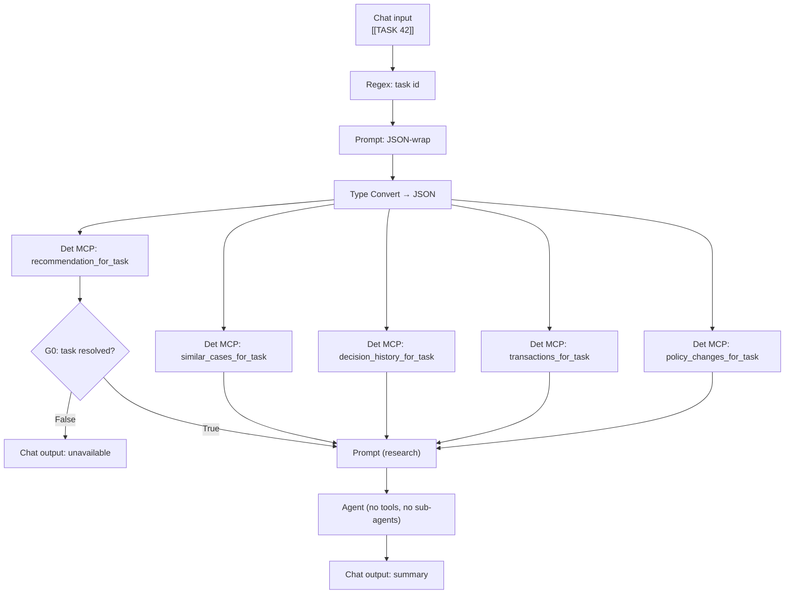

# `RESEARCH_WORKFLOW` — design

**Goal:** a backoffice reviewer holding a `REVIEW` task presses one button and gets a decision-support summary, composed from evidence the task screen does not already show, recorded as an append-only audit artifact.

**Scope:** `BACKLOG.md §3` in full, and `BACKLOG.md §8` (similar-case lookup) with it.

**Status:** design approved; implementation plan follows.

## 1. What it is

A one-shot research run, not a chat panel.

The reviewer is on a task detail screen that already renders the whole recommendation packet — employer verification, documents, KYC/AML findings, reason codes, DTI/PTI, indicative pricing, and the agent's tool trace. The research agent's value is strictly what that screen does **not** show: how comparable cases were decided, what this customer's own history says, what the transactions look like in full, and which policy thresholds moved since the case was assessed.

The agent fetches all four, reads them beside the recommendation under review, and writes one summary for a person about to choose approve or decline.

### The summary names no outcome

It is organised for a decider — what supports approving, what argues against, what is not established — and never states a lean.

A summary that endorsed the tier would be a second recommendation sitting beside the deterministic one, ungrounded in `tier_from()` and composed by a model. Worse, it would turn human review into rubber-stamping, which is the failure mode the human-in-the-loop design exists to prevent. Organising the evidence without concluding is both the safer artifact and the more useful one: the reviewer still has to weigh it, which is their job.

This is enforced, not requested — see [§5](#5-the-no-lean-screen).

## 2. The flow

Fourteen nodes. Chat Input → deterministic fan-out → gate → prompt → agent → Chat Output.

The shape mirrors `CHAT_FLOW`'s deterministic entry chain: one Regex extractor splits the envelope, a Prompt wraps the id as JSON, a Type Convert bridges Message → JSON, and every tool node takes the same payload.

**The agent holds no tools.** It reads five results delivered into named prompt ports and writes prose. Three consequences:

- The task id is never transcribed by a model, so a dropped or duplicated character cannot make the summary describe another customer's case.
- `issues/01` (multi-agent tool binding collapses to the first agent) does not apply — there is one Agent node and no sub-agents.
- The agent cannot reach a write path, because there is no write tool anywhere in the flow.

`policy_changes_for_task` returns parameter changes **since the task was created** — "what moved since this case was assessed" — which keeps every node's input shape identical to `{"task_id": N}` and lets one Type Convert feed the whole fan-out.

### Flow input

The task id travels in-band in a `[[TASK <id>]]` envelope, split out by a `Regex extractor`, because PAF accepts no per-invocation flow input beyond the chat message (`issues/03`). The backend supplies the id from the route it already serves; nothing reads it from user-typed text.

An id is a small integer rather than an opaque token, so a corrupted one resolves to a different valid task rather than failing closed. That is bounded here in a way it is not on the customer path: `BACKOFFICE_AGENT_RO` is reachable only from the bank's own screens, the backoffice surface already takes `taskId` from the client on every route it has, and every tool echoes the case it resolved — task id, customer name, application id — so a miscopy arrives labelled as the wrong case rather than reading as plausible.

## 3. `research-mcp`

A third MCP server at `src/ai/research-mcp/`, shaped like `banking-mcp`, logging in as `BACKOFFICE_AGENT_RO` — `SELECT` on the `research_v_*` set and `cust_360`, no `EXECUTE` anywhere, no write grant of any kind.

| Tool                        | Reads                                 | Returns                                                                                          |
| --------------------------- | ------------------------------------- | ------------------------------------------------------------------------------------------------ |
| `recommendation_for_task`   | `research_v_hitl_task`                | the case under review: tier, reasoning, evidence, explore hints, amount, term, purpose, customer |
| `similar_cases_for_task`    | `research_v_case_history`             | comparable closed cases and how they were decided                                                |
| `decision_history_for_task` | `research_v_decision_history`         | this customer's prior decisions and outcomes                                                     |
| `transactions_for_task`     | `research_v_full_transactions`        | full transaction detail                                                                          |
| `policy_changes_for_task`   | `research_v_policy_parameter_history` | thresholds that moved since the task was created                                                 |

`recommendation_for_task` is the case under review rather than research, and it feeds G0 the way `get_context` does in `CHAT_FLOW` — an unresolvable task fails the gate before the agent runs.

**Matching is banded, not vector.** `similar_cases_for_task` matches `case_history` on amount, DTI, PTI and credit-score bands and reports the outcomes. It cannot match on reason codes: `case_history.outcome_reason` is prose, not codes. `case_embedding` stays unused — structural matching answers "how did we handle cases like this" with plain SQL and no embedding pass.

The band-matching logic lives in `src/ai/research-mcp/match.py`, free of `fastmcp` and `oracledb` so it is unit-testable on the host, exactly as `gate.py` is for `banking-mcp`.

**Auditing follows the house pattern.** `_audit` POSTs to the Application Service fire-and-forget and never raises, as `banking-mcp:57` does. The wrapper has no `INSERT` grant and does not get one.

## 4. Schema

### Two research views widen

A new changeset, `027-research-workflow.yaml`, `runOnChange: true`, redefining two views that are currently too thin for the tools above. `CREATE OR REPLACE VIEW` preserves existing grants, so the grant matrix is untouched by this part:

- **`research_v_hitl_task`** — add `agent_reasoning`, `agent_evidence`, `agent_explore_hints`, and join `loan_application` for `customer_id`, amount, term and purpose. It exposes only the tier today, so the reviewer's own packet is unreadable through the research identity.
- **`research_v_decision_history`** — add `customer_id`. It carries `application_id` only today, so "this customer's past decisions" cannot be asked.

### `BANK_CORE.research_summary`

A new blockchain table in `027-research-workflow.yaml`, with the same clauses as `decision` — `NO DROP UNTIL 2555 DAYS IDLE`, `NO DELETE LOCKED`, `HASHING USING "SHA2_512" VERSION "v1"` — holding one row per research run:

| Column            | Notes                                 |
| ----------------- | ------------------------------------- |
| `research_id`     | `NUMBER GENERATED ALWAYS AS IDENTITY` |
| `application_id`  | plain indexed column, no foreign key  |
| `hitl_task_id`    | which review the run supported        |
| `research_run_id` | joins `research_audit`                |
| `reviewer`        | who ran it                            |
| `summary`         | `CLOB`                                |
| `created_at`      | `TIMESTAMP DEFAULT SYSTIMESTAMP`      |

Linking by id without a foreign key is what `decision` already does, because a blockchain table cannot carry one.

**Nothing is altered.** `hitl_task` and `decision` keep their current shape and `003` is untouched. A case's record is three append-only artifacts sharing `application_id` — the recommendation packet, the research summaries, the human decision — ordered by time.

That ordering is the point. Research happens during review, before a decision row exists. Carrying the summary as a column on `decision` would mean parking it on `hitl_task` and copying it at close, stamping the artifact with the moment of the decision rather than the moment the reviewer read it. A row per run also means a second run is preserved rather than overwriting the first, which is what conversational research needs when it arrives.

### Grants

A new changeset appended to `020-client-grants.yaml` — a new id in the same file. Liquibase forbids editing an applied changeset, not adding one to a file, so this keeps the whole grant matrix readable in one place. `SVC_BACKEND` gets `SELECT, INSERT` on `research_summary`, matching what it holds on `decision`.

**No new `research_v_*` view.** The research agent never reads its own past summaries; the backend reads the table as `SVC_BACKEND` to render the panel. `BACKOFFICE_AGENT_RO`'s scope is unchanged.

## 5. The no-lean screen

`ResearchSummary.screen` in the Spring backend, on the delivery path, in the same position and the same shape as `Disclosure.screen`: a summary that states an outcome verdict — `I recommend`, `should be approved`, `leans toward`, a bare tier name as a conclusion — is rejected, nothing is persisted, and the panel reports that research could not be completed.

The agent's instructions ask it to name no outcome. This is what holds it. Host-unit-testable, and every summary passes through it before it reaches the table or the screen.

## 6. Backend and UI

**Endpoints.**

- `POST /v1/research/tasks/{taskId}/run` with `{reviewer}` — invokes `RESEARCH_WORKFLOW`, screens the summary, writes `research_summary`, returns it.
- `GET /v1/research/tasks/{taskId}` — the latest stored summary, so a reload does not re-run the agent.
- `POST /v1/audit/research` — what `research-mcp` POSTs to; the Application Service writes `research_audit`.

**A second PAF client** bound to `RESEARCH_WORKFLOW`'s own agent id and integration key. The routing separation in `docs/DESIGN.md §11` becomes real: the customer chat path cannot reach the research agent, because it holds a key authorised for a different agent.

**Panel.** `TaskDetail.tsx` gains a Research section beside `EvidencePanel`: a **Run research** button, a pending state, the rendered summary. A stored summary renders on load. Available on any task; it earns its keep on `REVIEW`.

## 7. Deployment

`manage.py` generalises `_discover_chat_flow_id` to resolve a flow by name. `paf link-flow`, `paf api-key`, `paf push-key`, `info` readiness and the `paf bootstrap` sheet each learn about the second flow and the third MCP server. `.env` gains `PAF_RESEARCH_AGENT_ID` and `PAF_RESEARCH_API_KEY`.

`research-mcp` runs on the backend tier beside the other two wrappers on port 8505 (`banking-mcp` 8503, `application-mcp` 8504), reached through the internal load balancer.

`CLOUD.md §10` mirrors §9: import, link, publish, mint the key.

## 8. Testing

| Layer            | Covers                                                                                                                                                                           |
| ---------------- | -------------------------------------------------------------------------------------------------------------------------------------------------------------------------------- |
| `tests/unit`     | band matching in `match.py` — which cases are comparable, and that an incomplete case yields none                                                                                |
| `./gradlew test` | `ResearchSummary.screen` accepts an organised summary and rejects every verdict phrasing; the service writes one `research_summary` row per run and none on a rejected summary   |
| `npm test`       | the panel renders a stored summary without re-running, and its pending state                                                                                                     |
| `cloud test`     | end to end: file a `REVIEW` task, run research, assert one `research_summary` row, five `research_audit` rows under one `research_run_id`, and that the summary names no outcome |
| Playground       | five deterministic nodes run once each; the agent makes zero tool calls                                                                                                          |

## 9. Artifacts

`paf/flows/RESEARCH_WORKFLOW.md` in the format of `paf/flows/CHAT_FLOW.md` — node graph, step-by-step canvas build, wiring checklist, test prompts, operating constraints. The blueprint is the record and what the flow is rebuilt from.

`paf/flows/RESEARCH_WORKFLOW.paf` is a snapshot of it, exported from the canvas with the bundle password `WelcomeAmigo123!`, committed alongside. Re-export whenever the canvas changes, together with the blueprint edit describing the same change.

Portable Agent Spec does not cover this flow either: the `Regex extractor` that splits the envelope is a runtime tool and blocks the export (`issues/13`). The password-protected bundle is the only portable form, as it is for `CHAT_FLOW`.

## 10. What this does not do

- **No conversation.** One question, one summary. Follow-ups are a later phase; the `research_summary` table already accommodates them as additional rows.
- **No `RESEARCH_WORKFLOW` write path.** Nothing in this flow can change an application, a task or a decision.
- **No Select AI Bridge.** `research-mcp` carries the read scope without waiting on `BACKLOG.md §6` (the policy corpus) or `§11` (Select AI adoption), and without reopening the SQL Query node hazard in `issues/02`.
- **No fair-lending signal.** `BACKLOG.md §2` and `§9` are unaffected; protected attributes stay off every read path this flow touches.
