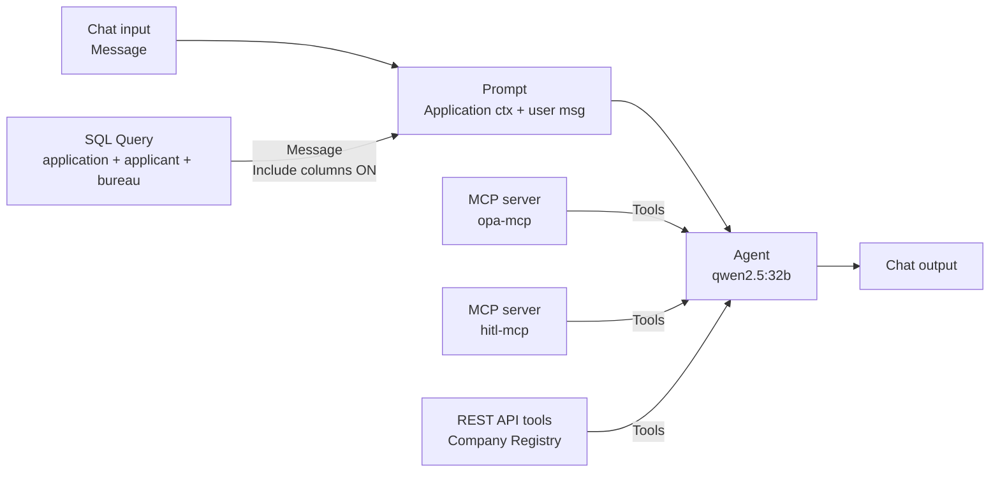

# `CHAT_AGENT` — flow design

This is the build blueprint for the customer-facing agent flow in PAF Agent Builder.

Source-of-truth references:

- Decision contract + tool inventory: [`docs/DECISIONING-ENGINE-USE-CASE.md`](../../docs/DECISIONING-ENGINE-USE-CASE.md)
- Two-agent security model: [`docs/DESIGN.md §8 / §10`](../../docs/DESIGN.md)
- Locked decisions (model, transport split): [`docs/DESIGN.md §11`](../../docs/DESIGN.md)

## Purpose

One Agent Builder flow that, for the customer's current personal-loan application:

1. Loads the application context (`customer_id` → current `application_id`, amount, term, employment, residency, employer, salary, credit score, existing monthly debt).
2. Determines which documents the customer must upload via `opa-mcp.required_documents`.
3. Verifies the employer via `registry-api.verify_employer`.
4. Computes DTI / PTI, then evaluates OPA eligibility via `opa-mcp.evaluate_eligibility`.
5. Composes a recommendation packet (`APPROVE` / `REVIEW` / `DECLINE` + reasoning + `REVIEW`-only `explore_hints`).
6. Calls `hitl-mcp.create_hitl_task` exactly once as the terminal action — that's the side effect the human reviewer picks up.

The agent never approves, rejects, or discloses the recommendation tier to the customer. It only ever writes a HITL task. The closing sentence to the customer is fixed and contains no internal information.

## Flow input

- `customer_id` — integer. **Currently hardcoded in the SQL Query** below. Parameterizing this via a PAF flow-input variable (so Playground / the Application Service can pass it in) is the next priority in this flow — see [Open follow-ups](#open-follow-ups).

## Node graph



> `ocr-mcp` is intentionally **not wired into this flow.** No upload step happens in Playground today, and dropping an unused tool from the Agent's tool list improves tool-selection reliability. Add it back when you exercise OCR scenarios (Henry-MARGINAL / Iris-UNUSABLE).

## Nodes

### Chat input

Default.

### Prompt

Template (saving exposes `message` and `app_ctx` input ports):

```
Application context (from database lookup):
{{app_ctx}}

User question:
{{message}}
```

### SQL Query (application context)

- **Datasource**: `Banking Application DB` (Database data source registered in PAF → Data Sources). See `LOCAL.md §4b` for the registration form.
- **Include columns**: **ON**. The Message output then formats the row as `column: value` text the LLM can read.
- **Output wiring**: `Message` → `Prompt.app_ctx`. **Not** `JSON` — PAF's port-type system rejects `JSON → text-placeholder` wires.
- **Query** (joins applicant + bureau, aggregates facilities, lowercases enums to match OPA's tool schema):

  ```sql
  SELECT la.application_id,
         la.amount_requested,
         la.term_months,
         la.product_type,
         la.purpose,
         la.status,
         LOWER(p.employment_type) AS employment_type,
         LOWER(p.residency)       AS residency,
         p.employer_name,
         p.monthly_salary,
         p.age_years,
         p.kyc_status,
         b.score                  AS credit_score,
         NVL((SELECT SUM(f.monthly_payment)
                FROM REPORTING.chat_v_existing_facilities f
               WHERE f.customer_id = la.customer_id), 0) AS existing_monthly_debt
    FROM REPORTING.chat_v_loan_application la
    JOIN REPORTING.chat_v_applicant_profile p ON p.customer_id = la.customer_id
    LEFT JOIN REPORTING.chat_v_credit_bureau b ON b.customer_id = la.customer_id
   WHERE la.customer_id = 4
     AND la.status IN ('SUBMITTED', 'DRAFT', 'IN_REVIEW')
   ORDER BY la.submitted_at DESC NULLS LAST
   FETCH FIRST 1 ROW ONLY
  ```

  Swap `customer_id = 4` for whichever scenario you're testing. See [Test prompts](#test-prompts).

### MCP server × 2

Two MCP Server nodes. Both wire their `Tools` output into the Agent's `Tools` input.

| Node              | Picks      |
| ----------------- | ---------- |
| MCP server (opa)  | `opa-mcp`  |
| MCP server (hitl) | `hitl-mcp` |

Default timeout (`45 s`) on each.

### REST API tools (Company Registry)

Wires its `Tools` output into the Agent's `Tools` input. Source selection: `Company Registry`.

### Agent (qwen2.5:32b)

- **Select LLM to use**: the LLM Management configuration registered against `qwen2.5:32b-instruct`. The smaller `qwen2.5:7b-instruct` we used earlier completes the pipeline but produces inconsistent recommendations (the customer-facing text and the structured `create_hitl_task` args drift apart) — see [Lessons](#lessons). 32B is the new default in `manage.py setup local` and `docs/DESIGN.md §11`.
- **Temperature**: `0.01` (deterministic).
- **Agent description**: `Customer-facing loan assistant`.
- **Custom instructions**: see below.

### Chat output

Default.

## Custom instructions (paste into the Agent node)

```
You execute a 4-step pipeline. Call each tool EXACTLY ONCE in this order.
Never call any tool more than once. Never call any tool not listed.

The user prompt contains an "Application context" block. Read these fields:
application_id, amount_requested, term_months, product_type,
employment_type, residency, employer_name, monthly_salary, age_years,
credit_score, existing_monthly_debt.

Step 1. required_documents(product_type=product_type,
        employment_type=employment_type, residency=residency,
        amount=amount_requested)

Step 2. verify_employer(name=employer_name)

Step 3. Compute first:
          monthly_payment = amount_requested / term_months
          dti = round((existing_monthly_debt + monthly_payment) / monthly_salary, 2)
          pti = round(monthly_payment / monthly_salary, 2)
        Then call:
          evaluate_eligibility(
            applicant   = {age: age_years, income: monthly_salary,
                           credit_score: credit_score, dti: dti, pti: pti},
            application = {amount_requested: amount_requested,
                           term_months: term_months},
            product     = {product_type: product_type})

Step 4. Decide the recommendation tier from the three prior outputs:
          DECLINE if evaluate_eligibility.deny[] is non-empty,
                  OR verify_employer.registered is false.
          REVIEW  if evaluate_eligibility.warn[] is non-empty,
                  OR verify_employer.trading_status is "dormant".
          APPROVE otherwise.
        Then call:
          create_hitl_task(
            application_id = application_id,
            recommendation = "APPROVE" | "REVIEW" | "DECLINE",
            reasoning      = one sentence that quotes the SPECIFIC deny[]
                             or warn[] messages each tool returned, plus
                             the verify_employer.trading_status. If a
                             list was empty, say so explicitly. Never use
                             generic phrases like "no issues" when you
                             actually saw a deny[] or warn[] message.
            agent_run_id   = a freshly generated UUID-4 string,
            explore_hints  = JSON array of follow-up checks for the
                             reviewer — REVIEW only; null for APPROVE
                             and DECLINE,
            evidence       = JSON string with the three prior tool outputs.)

After step 4, reply with this EXACT sentence and stop:
"Thanks — your application is now with our review team. They will follow up shortly."

Strict rules:
- Never call any tool after step 4.
- Never call any tool twice.
- Never mention DTI, PTI, credit score, eligibility, AML, KYC,
  fair-lending, the recommendation tier, or any policy threshold in the
  customer-facing reply. The closing sentence above is the ONLY thing
  you say to the customer.
- The `reasoning` string in create_hitl_task must agree with the
  `recommendation` tier: if you set DECLINE, the reasoning must quote
  the specific deny[] message; if REVIEW, the specific warn[] or
  trading_status; if APPROVE, state "no deny, no warn, employer active".
```

## Wiring summary

| Source port                              | Target port           |
| ---------------------------------------- | --------------------- |
| Chat input.`Message`                     | Prompt.`message`      |
| SQL Query.`Message` (Include columns ON) | Prompt.`app_ctx`      |
| Prompt.`Prompt message`                  | Agent.`Prompt`        |
| MCP server (opa).`Tools`                 | Agent.`Tools`         |
| MCP server (hitl).`Tools`                | Agent.`Tools`         |
| REST API tools (registry).`Tools`        | Agent.`Tools`         |
| Agent.`Message`                          | Chat output.`Message` |

## Test prompts

Customer IDs on a fresh `local up` deploy are **1–11** (Alice = 1 … Kyle = 11). Verify before each test:

```sql
SELECT c.customer_id, c.full_name,
       la.application_id, la.amount_requested, la.term_months, la.status
  FROM APP.customer c
  LEFT JOIN APP.loan_application la ON la.customer_id = c.customer_id
 ORDER BY c.customer_id;
```

Then change the SQL Query `WHERE customer_id = N` to match the scenario you want, save, and ask in Playground:

```
Please review my loan application and submit it for processing.
```

Expected outcomes (assuming `qwen2.5:32b` and OPA defaults in `005-system-config.yaml`):

| customer_id                 | Scenario                 | Expected `recommendation`                                                                           |
| --------------------------- | ------------------------ | --------------------------------------------------------------------------------------------------- |
| `1` (Alice Salaried, smoke) | Clean profile            | `APPROVE`                                                                                           |
| `4` (David HighDti)         | DTI above hard cap       | `DECLINE`                                                                                           |
| `5` (Eva LowScore)          | Score below floor        | `DECLINE`                                                                                           |
| `6` (Frank MidBand)         | Mid-band score / warn    | `REVIEW`                                                                                            |
| `10` (Jane UnknownEmployer) | Employer not in registry | `REVIEW` (or `DECLINE` if the Custom Instructions interpret `registered=false` as a deny — they do) |

After each run verify with:

```sql
SELECT task_id, application_id, agent_recommendation, agent_run_id,
       SUBSTR(agent_reasoning, 1, 150) AS reasoning_head
  FROM APP.hitl_task ORDER BY task_id DESC FETCH FIRST 1 ROW ONLY;

SELECT COUNT(*) FROM "APP"."HITL_REQUEST";
```

The trace pane in Playground should show exactly **four** tool calls (`required_documents`, `verify_employer`, `evaluate_eligibility`, `create_hitl_task`) per turn. More than four = the agent is looping; see Lessons.

## Export

Once the flow runs all five scenarios cleanly, export the flow JSON from PAF Agent Builder (top-right menu → Export) and save to `paf/flows/chat_agent.flow.json`.

## Open follow-ups

In priority order — these are the gaps remaining in this flow once the qwen2.5:32b test cycle passes:

1. **Parameterize `customer_id` in the SQL Query.** Right now it's hardcoded; every scenario test requires editing the SQL. Two paths to fix:
   - **Flow input variable** — PAF Agent Builder may support flow-level input variables that the Playground prompts for (and the Application Service later threads in). Look for a flow-settings panel near `Save` / `Publish`, or a "Variables" tab. Wire the variable to the SQL Query's `:customer_id` bind.
   - **Application Service threads it** — once roadmap item 3 lands, the customer's `customer_id` comes from the authenticated session and is passed into the flow's invocation API. The SQL Query bind then resolves from that.
2. **`ocr-mcp` re-wire for OCR scenarios** — to test Henry-MARGINAL / Iris-UNUSABLE, drop the `ocr-mcp` MCP server node back onto the canvas, wire its `Tools` → Agent's `Tools`, and add `extract_document(...)` as Step 1.5 in Custom Instructions (after `required_documents` so the agent knows which docs to extract).
3. **Export the flow JSON** to `paf/flows/chat_agent.flow.json` for re-import on clean redeploys.

## Lessons

Hard-won during the build. Skim before iterating on the flow.

### PAF Agent Builder

- **SQL Query node is read-only / `SELECT`-only** (per `docs/PAF.md §10`). Side-effect tools — anything that writes — go through **MCP** (or REST). That's why `create_hitl_task` is wrapped in `hitl-mcp` rather than called as a SELECT-of-function.
- **Agent node has no max-iterations / max-tool-calls setting in this PAF version.** When a smaller LLM loses focus and loops, the runtime does not break it out. Mitigation: tight recipe-style Custom Instructions, fewer tools, stronger model.
- **Orphan nodes are rejected by the graph validator.** To temporarily remove a tool, delete the node from the canvas; you can't just disconnect the wire.
- **SQL Query output port types matter.** `JSON` (pink) can't connect to `Prompt.app_ctx` (blue / text). Use `Message` with **Include columns** ON — the output then looks like `application_id: 3, amount_requested: 20000, ...` and the LLM reads it from the prompt body.
- **Database data sources are separate from MCP / HTTP datasources.** The SQL Query node only sees databases registered in **Admin → Data Sources → Add new data source → Database**. "Applied AI Datasets" in the dropdown is the file-ingestion list, not a DB connection.
- **REST API tools and MCP tools both wire into the same Agent `Tools` input.** No special treatment.

### Agent / LLM behaviour

- **`qwen2.5:7b-instruct` is the floor, not the target.** It can complete the 4-tool pipeline but produces internally inconsistent results — the customer-facing reply and the structured `create_hitl_task` args drift apart (we observed an APPROVE tool call paired with a customer reply that quoted a DTI breach). `qwen2.5:32b-instruct` is the new default for tool-following reliability.
- **Examples in the prompt get copied verbatim by smaller LLMs.** We had `agent_run_id = "550e8400-e29b-41d4-a716-446655440000"` in Custom Instructions as an example; qwen2.5:7b returned that literal string for every task. Removed the example; just say "a freshly generated UUID-4 string".
- **Smaller LLMs leak internal numbers to the customer.** Without an explicit no-disclosure rule, qwen2.5:7b included DTI ratios and policy thresholds in the chat reply. The strict-rules block in Custom Instructions fixes that.

### Schema / data

- **Customer IDs after a fresh `local down --purge && local up` are 1–11** (Alice = 1 … Kyle = 11), not 21–28. Oracle's identity column cache only gaps if a prior session reserved values; on a true cold start they're contiguous. Verify with the `SELECT customer_id, full_name FROM APP.customer` query above.
- **Existing facilities are NOT in `chat_v_loan_application` or `chat_v_applicant_profile`.** They live in `chat_v_existing_facilities`. The SQL Query above aggregates them via subquery so DTI can include them.
- **OPA `evaluate_eligibility` takes pre-computed `dti` / `pti`.** The Rego rule reads `input.applicant.dti` directly — it does not derive DTI from raw income + debts. The Agent has to compute the ratio before calling the tool. The Custom Instructions step 3 walks the agent through this.
- **Enum-typed columns in the DB are uppercase (`SALARIED`, `RESIDENT`); OPA tool enums are lowercase (`salaried`, `resident`).** The SQL Query above `LOWER()`s them before they hit the LLM.
