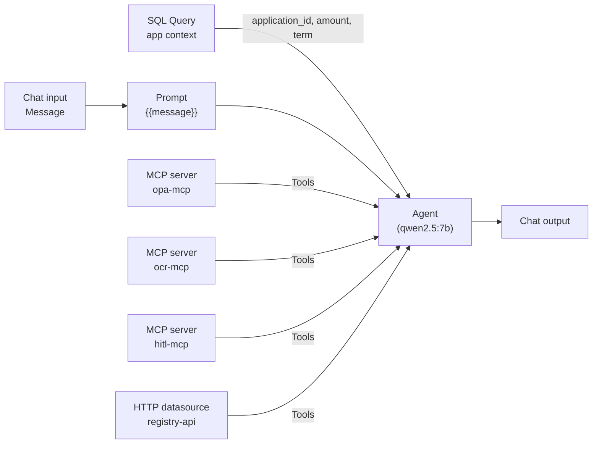

# `CHAT_AGENT` — flow design

This is the build blueprint for the customer-facing agent flow in PAF Agent Builder.

Source-of-truth references:

- Decision contract + tool inventory: [`docs/DECISIONING-ENGINE-USE-CASE.md`](../../docs/DECISIONING-ENGINE-USE-CASE.md)
- Two-agent security model: [`docs/DESIGN.md §8` / §10](../../docs/DESIGN.md)
- Locked decisions (model, transport split): [`docs/DESIGN.md §11`](../../docs/DESIGN.md)

## Purpose

One Agent Builder flow that, for the customer's current personal-loan application:

1. Loads the application context (`customer_id` → current `application_id`, amount, term).
2. Determines which documents the customer must upload via `opa-mcp.required_documents`.
3. Extracts uploaded documents via `ocr-mcp.extract_document`.
4. Verifies the employer via `registry-api.verify_employer`.
5. Evaluates OPA gates (eligibility, AML, KYC, fair-lending) and looks up indicative pricing.
6. Composes a recommendation packet (`APPROVE` / `REVIEW` / `DECLINE` + reasoning + `REVIEW`-only `explore_hints`).
7. Calls `hitl-mcp.create_hitl_task` **exactly once** as the terminal action — that's the side effect the human reviewer picks up.

The agent never approves, rejects, or discloses the recommendation tier to the customer. It only ever writes a HITL task.

## Flow input

- `customer_id` — integer. Threaded by the Application Service in production; for now, a flow input variable set to a known seed customer (e.g. `21` = David, `22` = Eva). Pick from the 010 scenario customers so the deterministic-path scenarios land.

## Node graph



## Nodes

### Chat input

Default. Captures the customer's message.

### Prompt

Template: `{{message}}` — keep the prompt body minimal. Saving exposes the `message` input port. All policy / role guidance lives in the Agent's **Custom instructions** field below.

### SQL Query (new — application context)

Resolves the customer's current open application so the Agent doesn't have to ask the customer for an `application_id`.

- Datasource: the **PAF metadata database** connection (`AGENT_FACTORY` schema, same DB).
- Bind: `customer_id` — wired from the flow input variable.
- Query:

  ```sql
  SELECT application_id,
         amount_requested,
         term_months,
         product_type,
         purpose,
         status
    FROM REPORTING.chat_v_loan_application
   WHERE customer_id = :customer_id
     AND status IN ('SUBMITTED', 'DRAFT', 'IN_REVIEW')
   ORDER BY submitted_at DESC NULLS LAST
   FETCH FIRST 1 ROW ONLY
  ```

  `REPORTING.chat_v_loan_application` is the customer-safe NL2SQL view from `006-reporting-views.yaml`. `AGENT_FACTORY` already has `SELECT` on it (granted in 006).

- Output: bind the row into a flow variable (e.g. `app_ctx`) that the Agent's Custom instructions reference via template substitution.

### MCP server × 3

Three MCP Server nodes, one per registered server. All wire their `Tools` output into the same Agent node's `Tools` input.

| Node              | Picks      |
| ----------------- | ---------- |
| MCP server (opa)  | `opa-mcp`  |
| MCP server (ocr)  | `ocr-mcp`  |
| MCP server (hitl) | `hitl-mcp` |

Default timeout (`45 s`) on each.

### HTTP datasource (Company Registry)

A REST API tool node referencing the `registry-api` datasource registered earlier. Wires its `Tools` output into the Agent's `Tools` input alongside the three MCP nodes.

### Agent (qwen2.5:7b)

- Select the saved LLM configuration (the one bootstrap registered).
- Temperature: leave at `0.01` for determinism.
- Agent description: `Customer-facing loan assistant`.
- **Custom instructions**: see below.

### Chat output

Default. Returns the agent's user-facing reply.

## Custom instructions (paste into the Agent node)

```
You are the bank's customer-facing loan assistant for personal-loan
applications. You help a customer through document collection and
explain what happens next; you NEVER approve, reject, or disclose
any internal recommendation tier to the customer.

Application context for this conversation has been retrieved from the
SQL Query node into `app_ctx`. Use these fields when calling tools:
  app_ctx.application_id     -> create_hitl_task(application_id=...)
  app_ctx.amount_requested   -> required_documents(amount=...)
  app_ctx.term_months        -> evaluate_eligibility(...)
  app_ctx.product_type       -> required_documents(product_type=...)

Always call the matching tool — never answer policy / KYC / AML /
pricing / employer questions from memory.

When extracting tool arguments from natural language:
  - Convert currency strings to plain numbers: "$25,000" -> 25000.
  - Pick the exact enum value, never a synonym:
      product_type    : PERSONAL_LOAN
      employment_type : salaried | self_employed
      residency       : resident | expat
  - For `verify_employer`, pass the employer name exactly as the
    customer wrote it.

Recommendation contract (internal — never speak the tier to the
customer):
  APPROVE  — eligibility allow=true, all documents USABLE, employer
             active in registry, no AML/KYC/fair-lending flags.
  REVIEW   — any OPA `warn`, any document MARGINAL, employer not in
             registry or dormant, mid-band score, large-amount with
             otherwise clean profile, or fair-lending flag.
  DECLINE  — any OPA `deny`, persistently UNUSABLE documents, AML
             sanctions hit, expired ID.

Terminal action — exactly once, just before Chat output:
  create_hitl_task(
    application_id = app_ctx.application_id,
    recommendation = "APPROVE" | "REVIEW" | "DECLINE",
    reasoning      = <short prose citing the tool outputs you used>,
    agent_run_id   = a unique correlation id for this turn,
    explore_hints  = <JSON array — REVIEW only; null otherwise>,
    evidence       = <JSON of structured tool outputs>
  )

After create_hitl_task returns the task_id, reply to the customer
with one neutral sentence: "Thanks — your application is now with our
review team. They will follow up shortly." Do not mention the task_id,
the recommendation tier, or any policy details.
```

## Wiring summary

| Source port                          | Target port                                                                  |
| ------------------------------------ | ---------------------------------------------------------------------------- |
| Chat input.`Message`                 | Prompt.`message`                                                             |
| Prompt.`Prompt message`              | Agent.`Prompt`                                                               |
| SQL Query.row                        | Agent flow variable `app_ctx` (template-referenced from Custom instructions) |
| MCP server (opa).`Tools`             | Agent.`Tools`                                                                |
| MCP server (ocr).`Tools`             | Agent.`Tools`                                                                |
| MCP server (hitl).`Tools`            | Agent.`Tools`                                                                |
| REST API tool (registry-api).`Tools` | Agent.`Tools`                                                                |
| Agent.`Message`                      | Chat output.`Message`                                                        |

## Test prompts (Playground)

Set the `customer_id` flow input to the value in the first column, then ask the second-column prompt. Expected outcome in column three.

| `customer_id`               | Customer / scenario                    | Prompt                                                 | Expected terminal action                                                                                     |
| --------------------------- | -------------------------------------- | ------------------------------------------------------ | ------------------------------------------------------------------------------------------------------------ |
| `21` (David HighDti)        | DTI above cap (scenario 2)             | "I want to know what documents I need to provide."     | `create_hitl_task(recommendation=DECLINE, reasoning="OPA eligibility deny: DTI 0.XX above hard cap …")`      |
| `22` (Eva LowScore)         | Score below floor (scenario 3)         | "What's the next step on my loan?"                     | `create_hitl_task(recommendation=DECLINE, reasoning="OPA eligibility deny: credit_score 540 below floor …")` |
| `23` (Frank MidBand)        | Mid-band (scenario 6)                  | "Can you check my loan application?"                   | `create_hitl_task(recommendation=REVIEW, explore_hints=…)`                                                   |
| `25` (Henry MarginalDoc)    | MARGINAL doc (scenario 8)              | "I uploaded my payslip — can you confirm it's good?"   | OCR returns MARGINAL → `recommendation=REVIEW` with `explore_hints` citing the low-confidence field          |
| `27` (Jane UnknownEmployer) | Employer not in registry (scenario 27) | "Can you verify my employer Atlantis Innovations Ltd?" | Registry returns `registered=false` → `recommendation=REVIEW`                                                |

Each Playground run should leave a row in `APP.hitl_task` and one message on `APP.HITL_REQUEST`. Confirm with:

```sql
SELECT task_id, application_id, agent_recommendation, agent_run_id
  FROM APP.hitl_task
 ORDER BY task_id DESC FETCH FIRST 5 ROWS ONLY;

SELECT COUNT(*) FROM "APP"."HITL_REQUEST";
```

## Export

Once the flow runs all scenarios cleanly, export the flow JSON from PAF Agent Builder (top-right menu → Export) and save to `paf/flows/chat_agent.flow.json`. A clean redeploy can then re-import via PAF's Import action — until `manage.py` learns to drive PAF's admin API headlessly, this is a manual step (in line with `docs/DESIGN.md §11` "PAF bootstrap automation").

## Out of scope here

- **Application Service threading `customer_id`.** Right now `customer_id` is a flow input variable the developer sets in Playground. Production threading lands with roadmap item 3.
- **Document upload mechanics.** PAF's File input node can attach a document to the conversation; the real path is the Application Service writing `loan_application_document`, uploading to object storage, and enqueueing `OCR_REQUEST`. The stub `ocr-mcp` resolves canned responses by filename so we can test the agent loop without that plumbing.
- **`chat_message` persistence.** The DB table exists (`004-chat-persistence.yaml`) but PAF stores conversations in its own metadata schema by default. Wiring the customer-side persistence is the Application Service's job.
