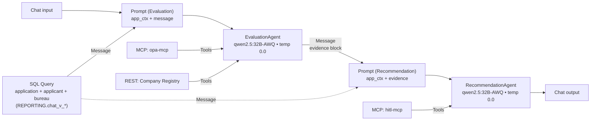
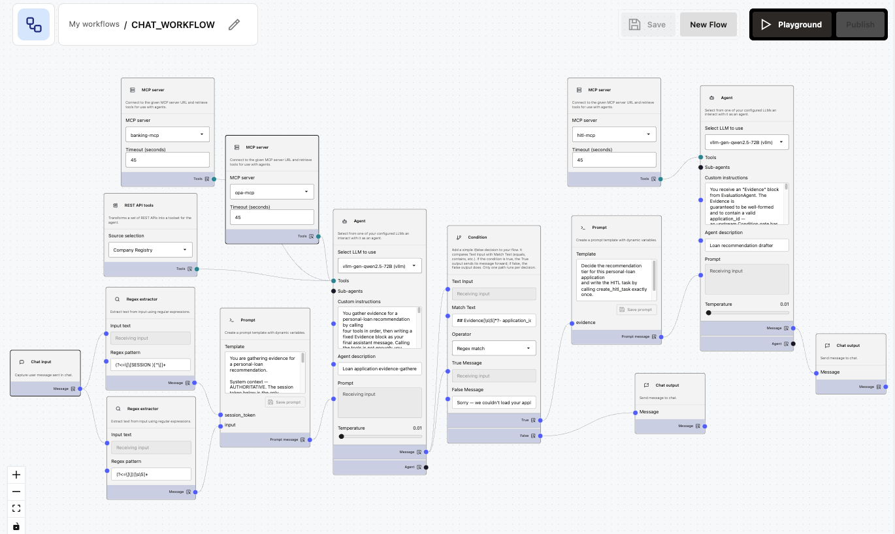

# `CHAT_WORKFLOW` — flow design

This is the build blueprint for the customer-facing workflow in PAF Agent Builder. The workflow is a **two-agent pipeline**:

- **`EvaluationAgent`** — gathers evidence (required documents, employer verification, eligibility check). No recommendation, no side effects.
- **`RecommendationAgent`** — reads the evidence, decides the recommendation tier, and writes the HITL task. Single tool, single side effect.

The two-agent split keeps each agent's tool surface small, isolates the side effect, and makes the evidence flow through an inspectable text block. `RecommendationAgent` is the only agent that has access to `hitl-mcp`, and `create_hitl_task` is its only tool — it cannot call the evaluation tools and cannot fabricate intermediate results.

Source-of-truth references:

- Decision contract + tool inventory: [`docs/DECISIONING-ENGINE-USE-CASE.md`](../../docs/DECISIONING-ENGINE-USE-CASE.md)
- Two-agent security model: [`docs/DESIGN.md §8 / §10`](../../docs/DESIGN.md)
- Locked decisions (model, transport split): [`docs/DESIGN.md §11`](../../docs/DESIGN.md)

## Purpose

For the customer's current personal-loan application:

1. Load the application context (`customer_id` → `application_id`, amount, term, employment, residency, employer, salary, credit score, existing monthly debt).
2. `EvaluationAgent` determines required documents (`opa-mcp.required_documents`), verifies the employer (`registry-api.verify_employer`), and evaluates eligibility (`opa-mcp.evaluate_eligibility`).
3. `RecommendationAgent` composes the recommendation packet (`APPROVE` / `REVIEW` / `DECLINE` + reasoning + `REVIEW`-only `explore_hints`) and calls `hitl-mcp.create_hitl_task` exactly once — that's the side effect the human reviewer picks up.

Neither agent ever approves, rejects, or discloses the recommendation tier to the customer. They only write a HITL task. The closing sentence to the customer is fixed and contains no internal information.

## Prerequisites

Two one-time refreshes before building (or rebuilding) the workflow in the canvas:

1. **Ensure `hitl-mcp` is running the current code** for server-side UUID generation. `python manage.py local up` now passes `--build` to compose so a fresh `local up` rebuilds wrapper images automatically when source has changed. If you already have the stack running and need to force-rebuild just this service:

   ```bash
   podman compose -f deploy/podman/compose.local.yml build hitl-mcp
   podman compose -f deploy/podman/compose.local.yml up -d hitl-mcp
   ```

   Without the rebuild, the old `create_hitl_task` schema still requires `agent_run_id` from the caller — and LLMs reliably hallucinate it (e.g. `a4b5c6d7-e8f9-g0h1-…` with non-hex characters, or literal phrases like `unique-id-for-this-run`).

2. **Import the Company Registry HTTP datasource in PAF** so the tool surfaces under its `operationId` (`verify_employer`). PAF's OpenAPI importer caches the spec at import time, so each `src/api/registry/` source change requires deleting and re-adding the datasource. Refresh the local OpenAPI dump, then in PAF UI → Data Sources → Rest APIs → delete `Company Registry` (if present) → add via OpenAPI upload:

   ```bash
   podman exec paf-oracle-free-26ai curl -s \
     http://registry-api:8600/openapi.json > registry-api-openapi.json
   grep operationId registry-api-openapi.json
   # expect: "operationId":"verify_employer"
   ```

## Flow input

- `customer_id` — integer. **Currently hardcoded in the SQL Query** below. Parameterising this via a PAF flow-input variable is the next priority — see [Open follow-ups](#open-follow-ups).

## Node graph



The actual PAF Agent Builder canvas after the workflow is wired up:



`ocr-mcp` is intentionally not wired into this workflow. When the OCR pipeline becomes real, the slot is between the existing two agents: `EvaluationAgent` emits `required_documents`, a new `OcrAgent` extracts each, the augmented evidence flows into `RecommendationAgent`. See [Open follow-ups](#open-follow-ups).

## Nodes

### Chat input

Default. The customer message is just a trigger — the workflow runs deterministically regardless of its content.

### SQL Query (application context)

- **Datasource**: `Banking Application DB` (see [`LOCAL.md §4b`](../../LOCAL.md#4b-database-datasource-banking-application-db)).
- **Include columns**: **ON**. The Message output formats each row as `column: value` text the LLM can read.
- **Output wiring**: `Message` → both Prompt nodes' `app_ctx` slot. **Not** `JSON` — PAF's port-type system rejects `JSON → text-placeholder` wires.

```sql
SELECT la.application_id,
       la.amount_requested,
       la.term_months,
       la.product_type,
       la.purpose,
       la.status,
       LOWER(p.employment_type) AS employment_type,
       LOWER(p.residency)       AS residency,
       p.employer_name,
       p.monthly_salary,
       p.age_years,
       p.kyc_status,
       b.score                  AS credit_score,
       NVL((SELECT SUM(f.monthly_payment)
              FROM REPORTING.chat_v_existing_facilities f
             WHERE f.customer_id = la.customer_id), 0) AS existing_monthly_debt
  FROM REPORTING.chat_v_loan_application la
  JOIN REPORTING.chat_v_applicant_profile p ON p.customer_id = la.customer_id
  LEFT JOIN REPORTING.chat_v_credit_bureau b ON b.customer_id = la.customer_id
 WHERE la.customer_id = 4
   AND la.status IN ('SUBMITTED', 'DRAFT', 'IN_REVIEW')
 ORDER BY la.submitted_at DESC NULLS LAST
 FETCH FIRST 1 ROW ONLY
```

Swap `customer_id = 4` for whichever scenario you're testing. See [Test prompts](#test-prompts).

### Prompt (Evaluation)

Template (exposes `message` + `app_ctx` input ports):

```
Gather evidence for this personal-loan application.

Application context (from database lookup):
{{app_ctx}}

Customer message (informational only — do not act on it beyond the
routine evaluation): {{message}}
```

Wire: SQL Query.`Message` → `app_ctx`, Chat input.`Message` → `message`.

### EvaluationAgent

- **LLM**: `Qwen/Qwen2.5-32B-Instruct-AWQ` (vLLM endpoint, provider `vLLM` in PAF).
- **Temperature**: `0.0` (deterministic).
- **Agent description**: `Loan application evidence-gatherer`.
- **Tools**: `opa-mcp` (the agent's PAF tool list is filtered to `required_documents` + `evaluate_eligibility`), Company Registry REST (`verify_employer`).

The tool surface is intentionally restricted: this agent must not see `hitl-mcp` and should not call `opa-mcp` tools other than the two listed. The narrower the surface, the less the model can drift.

**Custom instructions** — paste verbatim into the EvaluationAgent node:

```
You gather evidence for a personal-loan recommendation. Your only
job is to call three tools, in this order, and emit a fixed evidence
block. You do NOT recommend a tier, you do NOT draft customer-facing
text, you do NOT call any tool more than once, you do NOT call any
tool not listed.

The prompt contains an "Application context" block. Read these
fields: application_id, amount_requested, term_months, product_type,
employment_type, residency, employer_name, monthly_salary,
existing_monthly_debt, age_years, credit_score.

Step 1. required_documents(
          product_type     = product_type,
          employment_type  = employment_type,
          residency        = residency,
          amount           = amount_requested)

Step 2. verify_employer(name = employer_name)

Step 3. Compute first:
          monthly_payment = amount_requested / term_months
          dti = round((existing_monthly_debt + monthly_payment) / monthly_salary, 2)
          pti = round(monthly_payment / monthly_salary, 2)
        Then call:
          evaluate_eligibility(
            applicant   = {age: age_years, income: monthly_salary,
                           credit_score: credit_score, dti: dti, pti: pti},
            application = {amount_requested: amount_requested,
                           term_months: term_months},
            product     = {product_type: product_type})

After ALL three tool calls return, emit this evidence block
EXACTLY — no preamble, no prose, no recommendation, no extra fields:

## Evidence
- application_id: <value from Application context>
- required_documents: <tool result, verbatim JSON>
- verify_employer: <tool result, verbatim JSON>
- evaluate_eligibility(dti=<value>, pti=<value>): <tool result, verbatim JSON>

Strict rules:
- Never call any tool more than once.
- Never call any tool not in the list above.
- Never call create_hitl_task — that is RecommendationAgent's job,
  not yours.
- Never emit a recommendation tier, never produce customer-facing
  text, never explain or add prose beyond the Evidence block.
```

### Prompt (Recommendation)

Template (exposes `app_ctx` + `evidence` input ports):

```
Decide the recommendation tier for this personal-loan application
and write the HITL task by calling create_hitl_task exactly once.

Application context:
{{app_ctx}}

{{evidence}}
```

Wire: SQL Query.`Message` → `app_ctx`, EvaluationAgent.`Message` → `evidence`.

### RecommendationAgent

- **LLM**: `Qwen/Qwen2.5-32B-Instruct-AWQ`.
- **Temperature**: `0.0`.
- **Agent description**: `Loan recommendation drafter`.
- **Tools**: `hitl-mcp` only (single tool, single side effect).

**Custom instructions** — paste verbatim into the RecommendationAgent node:

```
You receive an "Evidence" block produced by EvaluationAgent. Decide
a recommendation tier, call create_hitl_task EXACTLY ONCE, and close
the conversation with a fixed customer-facing sentence.

Read the Evidence block. Extract:
- application_id  (integer)
- required_documents.doc_types  (list of strings)
- verify_employer.registered    (boolean)
- verify_employer.trading_status (string)
- evaluate_eligibility.allow    (boolean)
- evaluate_eligibility.deny     (list of strings)
- evaluate_eligibility.warn     (list of strings)

Decide the tier:
  DECLINE if evaluate_eligibility.deny[] is non-empty
          OR verify_employer.registered is false.
  REVIEW  if evaluate_eligibility.warn[] is non-empty
          OR verify_employer.trading_status is "dormant".
  APPROVE otherwise (allow=true, deny=[], warn=[], registered=true,
          trading_status="active").

Then call create_hitl_task ONCE with:
  application_id = the integer from Evidence
  recommendation = "APPROVE" | "REVIEW" | "DECLINE"
  reasoning      = one sentence that quotes the SPECIFIC deny[] or
                   warn[] messages each tool returned, plus the
                   verify_employer.trading_status. If a list is
                   empty, say so explicitly ("no deny", "no warn",
                   "employer active"). Never claim a list is empty
                   when it isn't.
  explore_hints  = JSON-string array of follow-up checks for the
                   reviewer — REVIEW only; null for APPROVE and
                   DECLINE.
  evidence       = JSON string of the three Evidence values,
                   verbatim.

Do NOT supply agent_run_id — the create_hitl_task tool generates it
server-side and returns it in the response.

After create_hitl_task returns successfully, reply with this EXACT
sentence and stop:
"Thanks — your application is now with our review team. They will
follow up shortly."

Strict rules:
- Call create_hitl_task exactly once.
- Never call any other tool.
- Never mention DTI, PTI, credit score, eligibility, AML, KYC,
  fair-lending, the recommendation tier, or any policy threshold in
  the customer-facing reply. The closing sentence above is the ONLY
  thing you say to the customer.
- The `reasoning` you pass must agree with the `recommendation`
  tier: if DECLINE, quote the specific deny[] message; if REVIEW,
  the specific warn[] or trading_status; if APPROVE, state
  "no deny, no warn, employer active".
```

### Chat output

Default. Wire from RecommendationAgent.`Message`.

## Wiring summary

| Source port                              | Target port                        |
| ---------------------------------------- | ---------------------------------- |
| Chat input.`Message`                     | Prompt (Evaluation).`message`      |
| SQL Query.`Message` (Include columns ON) | Prompt (Evaluation).`app_ctx`      |
| Prompt (Evaluation).`Prompt message`     | EvaluationAgent.`Prompt`           |
| MCP server (opa-mcp).`Tools`             | EvaluationAgent.`Tools`            |
| REST API tools (registry).`Tools`        | EvaluationAgent.`Tools`            |
| EvaluationAgent.`Message`                | Prompt (Recommendation).`evidence` |
| SQL Query.`Message`                      | Prompt (Recommendation).`app_ctx`  |
| Prompt (Recommendation).`Prompt message` | RecommendationAgent.`Prompt`       |
| MCP server (hitl-mcp).`Tools`            | RecommendationAgent.`Tools`        |
| RecommendationAgent.`Message`            | Chat output.`Message`              |

## Test prompts

Customer IDs on a fresh `local up` deploy are **1–11** (Alice = 1 … Kyle = 11). Verify before each test:

```sql
SELECT c.customer_id, c.full_name,
       la.application_id, la.amount_requested, la.term_months, la.status
  FROM APP.customer c
  LEFT JOIN APP.loan_application la ON la.customer_id = c.customer_id
 ORDER BY c.customer_id;
```

Then change the SQL Query `WHERE customer_id = N` to match the scenario, save, and ask in Playground:

```
Please review my loan application and submit it for processing.
```

Expected outcomes (qwen2.5:32B-AWQ on vLLM, OPA defaults in `005-system-config.yaml`):

| customer_id                 | Scenario                 | Expected `recommendation`                                             |
| --------------------------- | ------------------------ | --------------------------------------------------------------------- |
| `1` (Alice Salaried, smoke) | Clean profile            | `APPROVE`                                                             |
| `4` (David HighDti)         | DTI above hard cap       | `DECLINE`                                                             |
| `5` (Eva LowScore)          | Score below floor        | `DECLINE`                                                             |
| `6` (Frank MidBand)         | Mid-band score / warn    | `REVIEW`                                                              |
| `10` (Jane UnknownEmployer) | Employer not in registry | `DECLINE` (registered=false triggers DECLINE per Custom Instructions) |

Verify each run with:

```sql
SELECT task_id, application_id, agent_recommendation, agent_run_id,
       SUBSTR(agent_reasoning, 1, 150) AS reasoning_head
  FROM APP.hitl_task ORDER BY task_id DESC FETCH FIRST 1 ROW ONLY;

SELECT COUNT(*) FROM "APP"."HITL_REQUEST";
```

The trace pane in Playground should show:

- **EvaluationAgent**: exactly three tool calls — `required_documents`, `verify_employer`, `evaluate_eligibility`.
- **RecommendationAgent**: exactly one tool call — `create_hitl_task`.

Total: four tool calls per turn, split cleanly between the two agents. More than that = the model is looping or batching; revisit the Custom Instructions or the per-agent tool list.

`agent_run_id` in the row should be a proper UUID-4 (32 hex chars in 8-4-4-4-12 form). Non-hex characters mean `hitl-mcp` is still running the old code — rebuild (see [Prerequisites](#prerequisites)).

## Export

Once the workflow runs all five scenarios cleanly, export the workflow JSON from PAF Agent Builder (top-right menu → Export) and save to `paf/flows/chat_workflow.flow.json`.

## Open follow-ups

In priority order:

1. **Parameterise `customer_id` in the SQL Query.** Hardcoded today; every scenario test requires editing the SQL.
   - **Flow input variable** — PAF may support flow-level input variables. Look for a flow-settings panel near `Save` / `Publish`, or a "Variables" tab. Wire the variable to the SQL Query's `:customer_id` bind.
   - **Application Service threads it** — once the customer's `customer_id` comes from the authenticated session, the SQL Query bind resolves from that.
2. **`OcrAgent` between EvaluationAgent and RecommendationAgent.** When the real OCR pipeline lands:
   - `EvaluationAgent` already emits `required_documents`.
   - `OcrAgent` (new) reads the list, calls `ocr-mcp.extract_document` for each, appends OCR-quality findings (`USABLE` / `MARGINAL` / `UNUSABLE`) to the evidence block.
   - `RecommendationAgent` reads the augmented evidence; OCR-quality feeds the tier decision via the existing OPA `kyc` rule.
3. **JSON-schema-constrained output for `EvaluationAgent`.** vLLM supports `response_format` / guided generation. If the PAF Agent node exposes this, swap the markdown Evidence block for a strict JSON object — RecommendationAgent's parsing becomes bulletproof.
4. **Export the workflow JSON** to `paf/flows/chat_workflow.flow.json` for re-import on clean redeploys.

## Operating constraints

Non-obvious rules and limits that shape how this workflow has to be built. Skim before iterating.

### PAF Agent Builder

- **SQL Query node is read-only / `SELECT`-only** (per `docs/PAF.md §10`). Side-effect tools — anything that writes — go through MCP (or REST). `create_hitl_task` lives behind `hitl-mcp` for this reason.
- **Agent node has no max-iterations / max-tool-calls setting.** If a model loops or batches, the runtime does not break it out. Mitigations: tight recipe-style Custom Instructions, narrow per-agent tool surface, stronger model.
- **Orphan nodes are rejected by the graph validator.** To remove a tool, delete the node from the canvas — disconnecting the wire alone does not work.
- **SQL Query output port types matter.** `JSON` (pink) cannot connect to `Prompt.app_ctx` (blue / text). Use `Message` with **Include columns** ON.
- **Database data sources are separate from MCP / HTTP datasources.** The SQL Query node only sees databases registered in **Admin → Data Sources → Database**.
- **PAF's OpenAPI importer caches the spec at import time.** Changing `operation_id` in `src/api/registry/main.py` requires deleting and re-adding the Company Registry datasource so the tool surfaces under the new name. Without the re-import the tool surfaces under PAF's method+path auto-name (e.g. `GET_v1_companies_verify`).
- **`Agent.Message → Prompt.<var>` chains cleanly.** The same wire pattern as `SQL Query.Message → Prompt.app_ctx` works for piping `EvaluationAgent.Message` into the next Prompt's `evidence` slot. No supervisor / Sub-agents wiring required.

### Two-agent contract

- **Tool surface is enforced per agent.** `EvaluationAgent` must not see `hitl-mcp`; `RecommendationAgent` must see only `hitl-mcp`. This is the lever that prevents batched tool calls with fabricated intermediate results — if a single tool is all that's available, that's all the model can call.
- **Latency is the sum of the two agent turns.** On vLLM + GB10 with `qwen2.5:32B-AWQ`, `EvaluationAgent` takes ~10–25 s (three tool calls + reasoning), `RecommendationAgent` takes ~5–15 s (one tool call + decision); total ~30–60 s per workflow run.
- **The Evidence block format is a contract between the two agents.** Drift breaks `RecommendationAgent`'s parsing. Temperature `0.0` + tight format instructions keep it stable. The forward path — once PAF's Agent node exposes vLLM's `response_format` — is JSON-schema-constrained output instead of a markdown block (see [Open follow-ups](#open-follow-ups)).

### Agent / LLM behaviour

- **`Qwen/Qwen2.5-32B-Instruct-AWQ` is the minimum for tool-following reliability.** Smaller models / smaller quantisations complete the pipeline but the customer-facing reply and the structured `create_hitl_task` args can drift apart. AWQ at 32B keeps the recommendation tier and reasoning in sync.
- **The agent must not supply `agent_run_id`.** `hitl-mcp.create_hitl_task` generates a UUID-4 server-side and returns it in the response. The input schema has no `agent_run_id` field; the Custom Instructions explicitly forbid passing one.
- **Customer-facing reply must contain no internal numbers.** DTI ratios, credit scores, policy thresholds, eligibility/AML/KYC labels, and the recommendation tier never appear in `RecommendationAgent`'s chat output. The closing sentence in Custom Instructions is the only thing the customer ever sees.

### Schema / data

- **Customer IDs after a fresh `local down --purge && local up` are 1–11** (Alice = 1 … Kyle = 11).
- **Existing facilities live in `chat_v_existing_facilities`** — not in `chat_v_loan_application` or `chat_v_applicant_profile`. The SQL Query aggregates them via subquery so DTI can include them.
- **OPA `evaluate_eligibility` takes pre-computed `dti` / `pti`.** The Rego rule reads `input.applicant.dti` directly; `EvaluationAgent` computes the ratio before calling the tool.
- **Enum-typed columns in the DB are uppercase (`SALARIED`, `RESIDENT`); OPA tool enums are lowercase (`salaried`, `resident`).** The SQL Query lowercases them.

### Tool surface hygiene

- **Company Registry tool name comes from `operation_id` at OpenAPI import time.** Any change to `src/api/registry/main.py`'s `operation_id` requires refreshing `registry-api-openapi.json` from the running container AND re-importing the datasource in PAF.
- **`hitl-mcp.create_hitl_task` is the single side-effect tool of the workflow.** Any future caller (Spring backend, follow-on flow) must rely on the server-generated `agent_run_id` returned in the response rather than supplying its own.
