# `RESEARCH_WORKFLOW` — flow design

This is the build blueprint for the backoffice research workflow in PAF Agent Builder. The workflow is **one Agent node, holding no tools and no sub-agents**, fed by **five deterministic `research-mcp` nodes** — it turns a HITL task under review into a decision-support case file for the human reviewer:

- **The agent** — the only Agent node in the graph. It holds no tools and delegates to nothing. It reads the five research results delivered into its prompt and writes a four-section case file for a reviewer who has not yet decided.
- **Deterministic nodes (no agent)** — `recommendation_for_task`, `similar_cases_for_task`, `decision_history_for_task`, `transactions_for_task` and `policy_changes_for_task` all run off one wired task id, before the agent.

Two principles carried over from `CHAT_FLOW` shape this design:

1. **The database is the memory, loaded once deterministically.** The task id enters the flow in-band (`[[TASK <id>]]` envelope → `Regex extractor` → `Prompt` JSON-wrap → `Type Convert` → five `Deterministic MCP` nodes), so no model ever transcribes it before a tool call reads the database.
2. **A pure function of values already in the database belongs in a deterministic node, not in a model.** Every fact the case file is built from — the recommendation under review, comparable cases, this customer's history, their transactions, policy drift — is computed and returned server-side; the agent's only job is to organise it in prose and never conclude.

This is the **flow-build SSOT** for `RESEARCH_WORKFLOW`. Design rationale: [`docs/superpowers/specs/2026-09-21-research-workflow-design.md`](../../docs/superpowers/specs/2026-09-21-research-workflow-design.md); deploy + register the server: [`CLOUD.md §10`](../../CLOUD.md#10-load-research_workflow).

Source-of-truth references:

- Design and scope: [`docs/superpowers/specs/2026-09-21-research-workflow-design.md`](../../docs/superpowers/specs/2026-09-21-research-workflow-design.md)
- The tool wrapper: [`src/ai/research-mcp/server.py`](../../src/ai/research-mcp/server.py)
- PAF product gaps that shape this design: [`issues/03-no-flow-start-inputs.md`](../../issues/03-no-flow-start-inputs.md), [`issues/05-condition-edge-couples-control-and-data.md`](../../issues/05-condition-edge-couples-control-and-data.md), [`issues/08-non-descriptive-flow-validator-error.md`](../../issues/08-non-descriptive-flow-validator-error.md), [`issues/11-agent-custom-instructions-placeholders.md`](../../issues/11-agent-custom-instructions-placeholders.md), [`issues/13-agent-spec-export-excludes-runtime-tools.md`](../../issues/13-agent-spec-export-excludes-runtime-tools.md)

## Purpose

For a reviewer holding a HITL task:

1. **Resolve the case.** `recommendation_for_task` reads the recorded recommendation — tier, reasoning, reason codes, evidence, explore hints, amount/term/purpose, state — the same packet the task detail screen already renders. The gate before the agent tests whether the task resolved at all.
2. **Gather what the screen does not already show.** Four more deterministic calls run off the same task id: comparable closed cases and how they were decided, this customer's own prior decisions, their full transaction ledger, and any policy threshold that moved since the case was assessed.
3. **Write the case file.** Once the gate confirms the case resolved, the agent reads all five results and writes exactly four sections — the case, supports approving, argues against, not established — never stating a lean.
4. **Enforcement is server-side.** `ResearchSummary.screen` in the Spring backend, not the flow, is what stops a concluding summary from reaching the reviewer or the ledger — see [Operating constraints](#operating-constraints).

No agent ever tells the reviewer what to decide: the summary organises the evidence, and the reviewer still has to weigh it.

## Flow inputs

The flow's only runtime input is the **chat message** posted to PAF's Chat input. The task id travels in-band, prepended as `[[TASK <id>]]`, and split out at flow start by a deterministic `Regex extractor`.

- **Task id** — a plain integer, not an opaque token. The reviewer never types it: the Spring backend supplies it from the route it already serves (`POST /v1/research/tasks/{taskId}/run`), so the only way a wrong id reaches this flow is a defect upstream of the envelope, never user input. `BACKOFFICE_AGENT_RO` is reachable only from the bank's own backoffice screens, and every `research-mcp` tool echoes the case it resolved — `task_id`, `application_id`, `customer_name` — so a miscopy arrives labelled as the wrong case rather than reading as plausible for the right one.
- There is no second, untrusted component the way `CHAT_FLOW`'s customer message is: the envelope carries nothing but the id, so this graph has one `Regex extractor`, not two.

One PAF product gap shapes this design (verified against the installed kit):

- **No per-invocation flow inputs other than the chat message** ([`issues/03`](../../issues/03-no-flow-start-inputs.md)). The task id rides the one channel PAF gives a flow, exactly as the session token does in `CHAT_FLOW`.

## Node graph

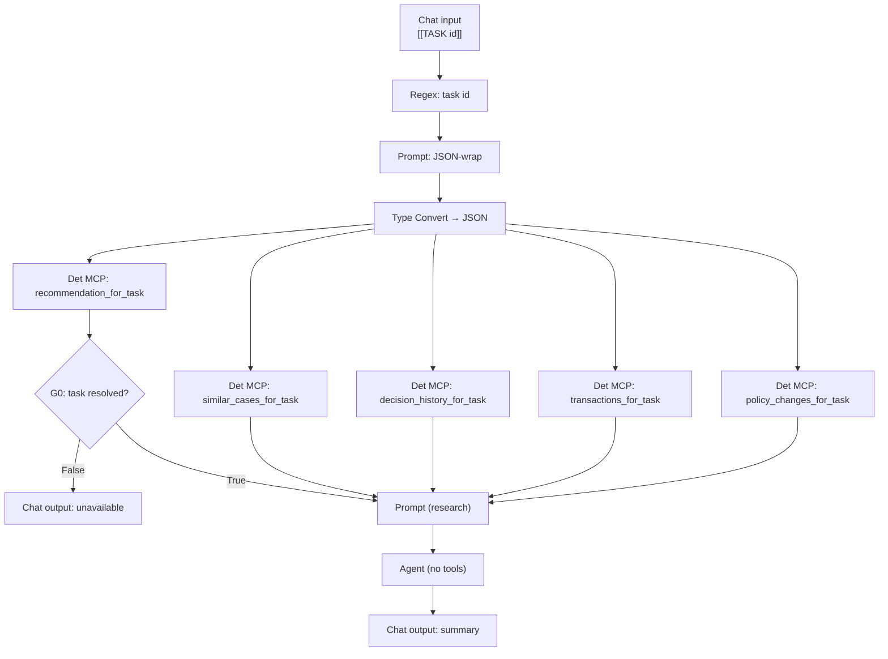

Five deterministic calls fan off one Type Convert — four of them feed the research prompt directly, and `recommendation_for_task` alone also gates through G0 first — so every fact the case file is built from is computed server-side before the agent runs. The agent has no tool to copy the task id into, so its only transcription risk is the one hop from the envelope into the JSON-wrap Prompt, and that hop is deterministic string interpolation, never a model.

### The `research-mcp` tools

Each tool takes only `task_id`, resolves the task through the same server-side read, and returns `{"error": "task_not_found"}` when it does not.

| Tool                        | Behaviour                                                                                                   | Returns                                                                                                                                                                                                 |
| --------------------------- | ----------------------------------------------------------------------------------------------------------- | ------------------------------------------------------------------------------------------------------------------------------------------------------------------------------------------------------- |
| `recommendation_for_task`   | the case under review: the agent's recorded recommendation and the application it was computed for          | `{task_id, application_id, customer_name, tier, reasoning, reason_codes, evidence, explore_hints, amount, term_months, purpose, state}`                                                                 |
| `similar_cases_for_task`    | closed cases in a numeric window of amount, DTI and credit score around this case, and how each was decided | `{task_id, application_id, customer_name, matched_on, bands, comparable, outcome_split}`, or `{..., comparable: [], outcome_split, not_matched_on}` when the case's own amount, DTI or score is missing |
| `decision_history_for_task` | this customer's own prior decisions, newest first, excluding the case under review                          | `{task_id, application_id, customer_name, decisions}`                                                                                                                                                   |
| `transactions_for_task`     | this customer's full transaction ledger, newest first                                                       | `{task_id, application_id, customer_name, transactions}`                                                                                                                                                |
| `policy_changes_for_task`   | policy thresholds that moved since this case was created                                                    | `{task_id, application_id, customer_name, assessed_at, changes}`                                                                                                                                        |

`recommendation_for_task` is the one G0 tests, the way `get_context` gates `CHAT_FLOW`'s G0 — an unresolvable task fails the gate before the agent runs. Matching for `similar_cases_for_task` is banded, not vector: it cannot match on reason codes, since `case_history.outcome_reason` is prose, not codes. The band logic lives in [`src/ai/research-mcp/match.py`](../../src/ai/research-mcp/match.py), free of `fastmcp` and `oracledb` so it is unit-testable on the host, exactly as `gate.py` is for `banking-mcp`.

## Build sequence

The [node graph](#node-graph) above is the map; this section is the node-by-node build. Work the canvas **left → right**, one component at a time, in the order below. Each step is self-contained: drag the node, configure it, (for Prompts) **Save**, then wire **only from nodes that already exist**. Because the order is dependency-respecting, every wire's source is already on the canvas when you need it.

**Before you start — the PAF facts that dictate this order:**

- **The agent holds no tools and has no sub-agents.** `issues/01` (multi-agent tool binding collapsing to the first agent) is a manager/worker problem; this flow has neither topology, so it does not apply — there is exactly one Agent node on the canvas and nothing to delegate to.
- **Custom Instructions take no `{{placeholder}}`.** An Agent node's system prompt is parsed for placeholders and each one becomes a required input the node does not supply, so the run fails with `1 validation error for ExtendedAgent … expected a property titled ...` ([`issues/11`](../../issues/11-agent-custom-instructions-placeholders.md)). Refer to the values by name in prose — the Prompt node feeding the agent carries them. Placeholders in **Prompt** nodes are fine and expected.
- A **Prompt** node exposes its `{{var}}` input ports **only after** you paste the template and click **Save prompt**. Always paste + Save _before_ wiring anything into a Prompt.
- To remove a tool from an agent, **delete the MCP/REST node**, not just the wire — orphan nodes fail the validator. Not exercised in this build, since the agent is wired to none.
- The single **`Condition`** (G0, type `conditionComponent`, category Processing) has a dense form: `Text Input` (the value tested), `True Message` / `False Message` (the value **forwarded** on each branch), `Match Text` (the regex), Operator **`Regex match`**, and two branch outputs. A branch edge does **double duty** — it **sequences** the target (control flow) **and binds the branch's message into the target input port** (data flow) ([`issues/05`](../../issues/05-condition-edge-couples-control-and-data.md)). Fill all of it in the step where you drop the node.
- **A `Condition` branch output takes exactly one target.** G0's `False` output goes to the unavailable Chat output; `True` goes to the research Prompt's `recommendation` port — nothing else, on either branch.
- **A Deterministic MCP node escapes the inner quotes of its result.** It delivers its `Message` as `{"message":"<the tool's JSON>"}` with the inner quotes escaped (`{"message":"{\"tier\":\"REVIEW\",…}"}`), so **any quote-anchored regex matches nothing**. G0 matches the **bare word** `tier`.
- There are **two terminal Chat outputs**, one per G0 branch — never converge them onto one node (Wayflow rejects it, [`issues/08`](../../issues/08-non-descriptive-flow-validator-error.md)). Close `False` with its own Chat output **immediately**, in the step right after the gate.

The agent uses LLM Configuration **`gen-model`** (the generic generative config registered at install — `paf bootstrap` step 4) at temperature **`0.01`**, the same configuration every agent in `CHAT_FLOW` uses.

In each step's wiring diagram, the edge label reads `<source port> → <target port>`; dashed edges are branches you wire in a later step (the step number is on the label).

---

### Step 1 — Chat input

- **Drag** the Chat input component onto the canvas. Nothing else to configure.

It is the flow's entry node (single output port `Message`) and receives `[[TASK <id>]]`.

### Step 2 — Task id extractor (`Regex extractor`, category Processing)

- **Configure** — Pattern:

```
(?<=\[\[TASK )[0-9]+
```

- **Wire:**

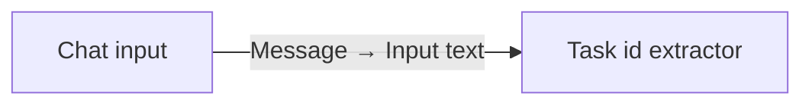

This node's `Message` output carries the bare task id. It feeds the JSON-wrap Prompt in Step 3, with no LLM in between.

### Step 3 — Prompt (JSON-wrap)

Builds the JSON payload every `research-mcp` tool needs. Deterministic string interpolation — no LLM sees the id.

- **Paste**, then **Save prompt** (port `task_id` appears after Save):

```
{"task_id":{{task_id}}}
```

> No quotes around the placeholder — the tools take an integer, not a string. Quoting it here would make every downstream call fail on a type mismatch.

- **Wire:**

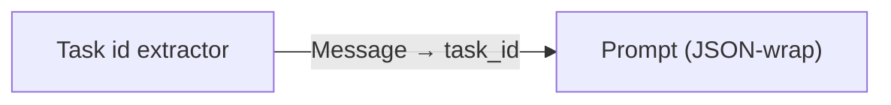

### Step 4 — Type Convert (`Type Convert`, category Processing)

The Deterministic MCP node's `Tool input JSON` accepts only type **JSON**, but the Prompt outputs type **Message** — the canvas won't wire Message → JSON directly, so this node bridges them.

- **Drag** a `Type Convert` node.
- **Wire** — `Prompt message` → its `Input`. It exposes `Message` / `JSON` / `DataFrame` output handles; the **`JSON`** one feeds all five nodes in Steps 5–9.

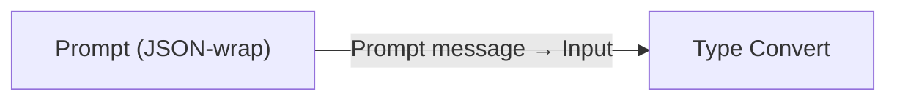

### Step 5 — Deterministic MCP — `recommendation_for_task`

- **Drag** a `Deterministic MCP tool` node.
- **Configure** — MCP server `research-mcp`, MCP tool `recommendation_for_task`.
- **Wire** — Type Convert's **`JSON`** output → `Tool input JSON`. Its `Message` output is the case under review — the packet G0 tests in Step 10 and the packet the research prompt names `recommendation` in Step 12.

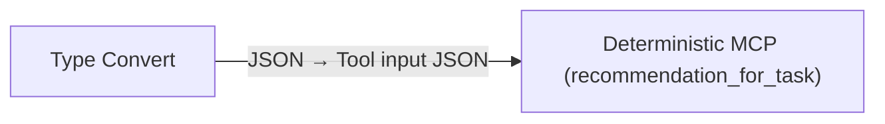

### Step 6 — Deterministic MCP — `similar_cases_for_task`

- **Drag** a second `Deterministic MCP tool` node.
- **Configure** — MCP server `research-mcp`, MCP tool `similar_cases_for_task`.
- **Wire** — Type Convert's **`JSON`** output → `Tool input JSON`. Its `Message` output lands on the research prompt's `similar` port in Step 12.

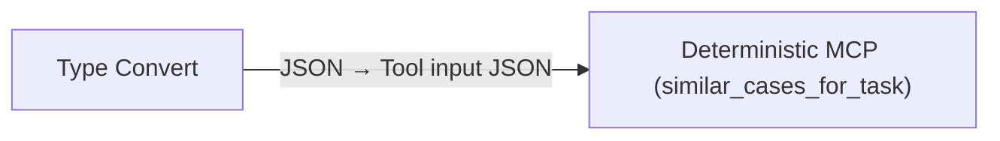

### Step 7 — Deterministic MCP — `decision_history_for_task`

- **Drag** a third `Deterministic MCP tool` node.
- **Configure** — MCP server `research-mcp`, MCP tool `decision_history_for_task`.
- **Wire** — Type Convert's **`JSON`** output → `Tool input JSON`. Its `Message` output lands on the research prompt's `history` port in Step 12.

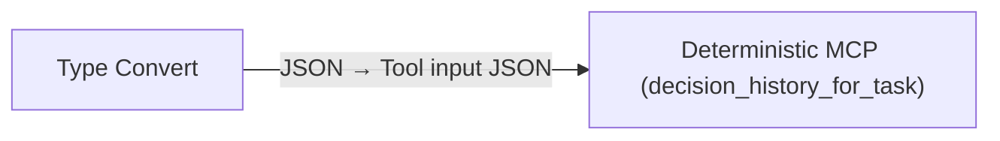

### Step 8 — Deterministic MCP — `transactions_for_task`

- **Drag** a fourth `Deterministic MCP tool` node.
- **Configure** — MCP server `research-mcp`, MCP tool `transactions_for_task`.
- **Wire** — Type Convert's **`JSON`** output → `Tool input JSON`. Its `Message` output lands on the research prompt's `transactions` port in Step 12.

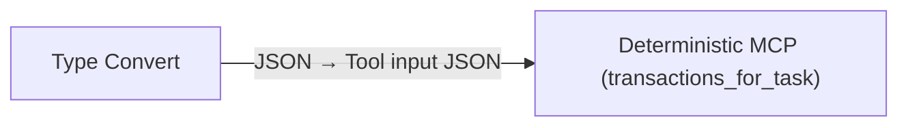

### Step 9 — Deterministic MCP — `policy_changes_for_task`

- **Drag** a fifth `Deterministic MCP tool` node.
- **Configure** — MCP server `research-mcp`, MCP tool `policy_changes_for_task`.
- **Wire** — Type Convert's **`JSON`** output → `Tool input JSON`. Its `Message` output lands on the research prompt's `policy` port in Step 12.

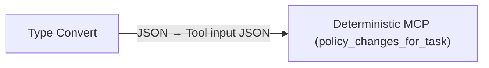

### Step 10 — Condition G0 (task resolved?)

Filters an unresolvable task id **once**, up front, so the agent never has to handle it.

- **Drag** a `Condition`.
- **Configure:**
  - `Text Input` ← Deterministic MCP (`recommendation_for_task`).`Message` — the value tested by the regex.
  - `True Message` ← Deterministic MCP (`recommendation_for_task`).`Message` — forwards the recommendation packet to the research prompt on a resolved task.
  - `False Message` — typed inline; the message that rides `False` to the Chat output in Step 11:

```
Research could not be completed for this case.
```

- Operator = `Regex match`; `Match Text` — a resolved case carries a `tier` key, an unresolvable one returns `{"error":"task_not_found"}`, which has none. **Match the bare key word, _not_ a quoted key** — the node escapes the inner quotes, so `"tier"` rejects every case:

```
tier
```

- **Wire** (branches wired in Steps 11 and 12):

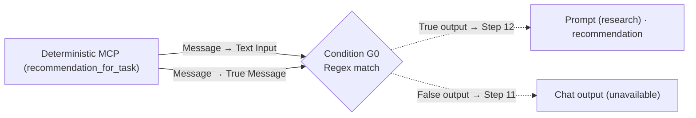

### Step 11 — Chat output (unavailable) — closes G0 `False`

- **Drag** a Chat output. Leave its `Message` empty — the message arrives as G0's `False Message`.

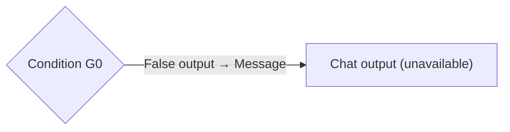

### Step 12 — Prompt (research)

Five ports, five feeders, all distinct.

- **Paste** this template, then click **Save prompt** (the ports appear only after Save):

```
You are preparing a case file for a bank reviewer who is about to decide this
loan application.

The recommendation under review (AUTHORITATIVE — server-computed): {{recommendation}}
Comparable closed cases (AUTHORITATIVE): {{similar}}
This customer's earlier decisions (AUTHORITATIVE): {{history}}
This customer's transactions (AUTHORITATIVE): {{transactions}}
Policy changes since this case was assessed (AUTHORITATIVE): {{policy}}
```

- **Wire** — the gate delivers the recommendation; everything else comes direct:
  - A **single** edge from G0's `True` output → `recommendation` (it both **sequences** this step and **delivers the packet**, since Step 10 set G0's `True Message` to the recommendation). Do **not** also wire `recommendation_for_task` here directly.
  - `similar_cases_for_task`.`Message` → `similar`.
  - `decision_history_for_task`.`Message` → `history`.
  - `transactions_for_task`.`Message` → `transactions`.
  - `policy_changes_for_task`.`Message` → `policy`.

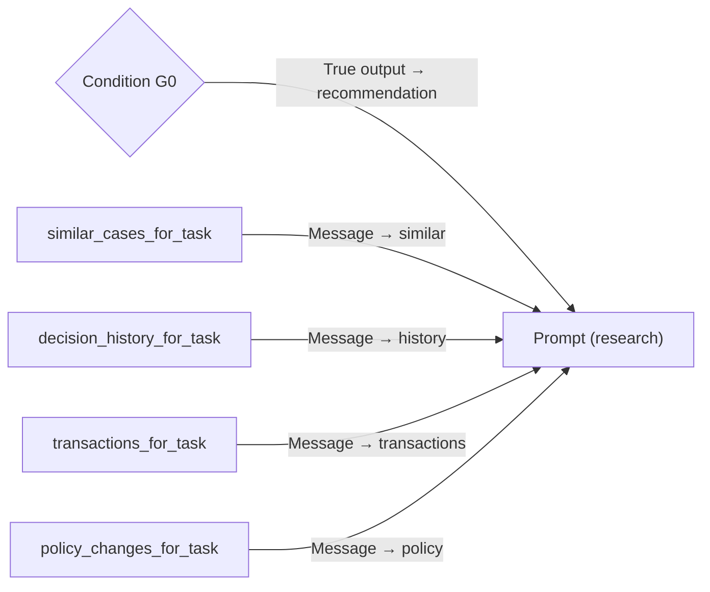

### Step 13 — Agent

- **Drag** an Agent node. **Wire no MCP or REST node to it** — the agent holds no tools — and leave its `Sub-agents` port unwired; there is nothing to delegate to.
- **Configure** — LLM `gen-model`, temperature `0.01`, `Agent description` `Research`, and paste these Custom Instructions:

```
You prepare a case file for a bank reviewer who is about to approve or decline
a loan application. You hold no tools. Everything you need is in your prompt,
all of it server-computed and authoritative: the recommendation under review,
comparable closed cases, this customer's earlier decisions, their transactions,
and any policy changes since this case was assessed.

YOU DO NOT DECIDE, AND YOU DO NOT LEAN. The reviewer decides. Your job is to
put the evidence in front of them organised, so the decision is quicker to make
and harder to make carelessly.

Write exactly these four sections, in this order, with these headings:

THE CASE
  One sentence: the tier the agent recommended and what it turned on. Take both
  from the recommendation in your prompt; never restate the full packet, the
  reviewer is looking at it.

SUPPORTS APPROVING
  Bullets. Only facts from your prompt. Name the source of each one — how many
  comparable cases were approved, what the transaction record shows, what an
  earlier decision established.

ARGUES AGAINST
  Bullets, the same way.

NOT ESTABLISHED
  Bullets: what the evidence does not settle. An empty comparable set, no prior
  decision, a policy threshold that moved after this case was assessed. This
  section is why the reviewer still has to think.

RULES:
- Never say what the outcome should be. No recommendation, no lean, no "on
  balance", no "the evidence supports approving". A summary that concludes is
  rejected before the reviewer sees it and the run is wasted.
- Every bullet is a fact from your prompt. If a section has nothing, write
  "nothing on the record" under it rather than inventing a bullet.
- Figures, ratios, reason codes and tier names are all fine here — the reader
  is bank staff, not the customer.
- Plain text. No JSON, no braces, no markdown tables.
```

The policy those instructions restate is enforced server-side, not by the flow — see [Operating constraints](#operating-constraints).

- **Wire:**

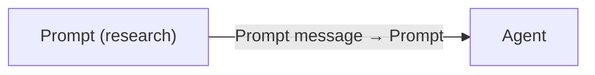

### Step 14 — Chat output (summary) — closes G0 `True` via the agent

- **Drag** a Chat output. Leave its `Message` empty — the case file arrives from the agent directly.
- **Wire:**

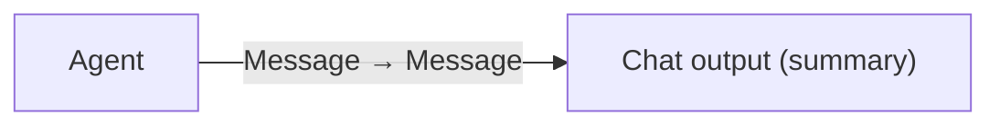

## Wiring checklist (verify after building)

Every wire is created in the steps above; this table is the post-build cross-check. Walk it top-to-bottom and confirm each edge exists.

| Source port                                             | Target port                                                                    |
| ------------------------------------------------------- | ------------------------------------------------------------------------------ |
| Chat input.`Message`                                    | Task id extractor.`Input text`                                                 |
| Task id extractor.`Message`                             | Prompt (JSON-wrap).`task_id`                                                   |
| Prompt (JSON-wrap).`Prompt message`                     | Type Convert.`Input`                                                           |
| Type Convert.`JSON`                                     | Deterministic MCP (recommendation_for_task).`Tool input JSON`                  |
| Type Convert.`JSON`                                     | Deterministic MCP (similar_cases_for_task).`Tool input JSON`                   |
| Type Convert.`JSON`                                     | Deterministic MCP (decision_history_for_task).`Tool input JSON`                |
| Type Convert.`JSON`                                     | Deterministic MCP (transactions_for_task).`Tool input JSON`                    |
| Type Convert.`JSON`                                     | Deterministic MCP (policy_changes_for_task).`Tool input JSON`                  |
| Deterministic MCP (recommendation_for_task).`Message`   | Condition G0.`Text Input`                                                      |
| Deterministic MCP (recommendation_for_task).`Message`   | Condition G0.`True Message`                                                    |
| Condition G0.`False output`                             | Chat output (unavailable).`Message`                                            |
| Condition G0.`True output`                              | Prompt (research).`recommendation` _(carries the packet + sequences the step)_ |
| Deterministic MCP (similar_cases_for_task).`Message`    | Prompt (research).`similar`                                                    |
| Deterministic MCP (decision_history_for_task).`Message` | Prompt (research).`history`                                                    |
| Deterministic MCP (transactions_for_task).`Message`     | Prompt (research).`transactions`                                               |
| Deterministic MCP (policy_changes_for_task).`Message`   | Prompt (research).`policy`                                                     |
| Prompt (research).`Prompt message`                      | Agent.`Prompt`                                                                 |
| Agent.`Message`                                         | Chat output (summary).`Message`                                                |

The task id is wired to one Prompt node — the JSON-wrap — and never reaches the agent at all: the agent's prompt carries the five tool results, not the id itself, so there is nothing for it to copy into a tool call.

## Test prompts

Find a task in `REVIEW` (or any non-`CLOSED` state) to test against:

```sql
SELECT t.task_id, c.full_name, t.agent_recommendation
  FROM BANK_CORE.hitl_task t
  JOIN BANK_CORE.loan_application la ON la.application_id = t.application_id
  JOIN BANK_CORE.customer c ON c.customer_id = la.customer_id
 WHERE t.state <> 'CLOSED'
 ORDER BY t.task_id DESC;
```

Playground input is `[[TASK <id>]]`.

**Trace expectation.** Five deterministic `research-mcp` nodes run once each; the agent makes **zero** tool calls — it has none wired.

**Fail-secure.** A bare message with no `[[TASK ...]]` yields no id, `recommendation_for_task` returns `{"error":"task_not_found"}`, G0 fails, and the unavailable output fires — no `research_summary` row is written.

**No-lean.** The agent's instructions ask it to organise the evidence and never conclude; the flow itself has no gate for this. `ResearchSummary.screen` in the Spring backend is what holds it — see [Operating constraints](#operating-constraints). A run that concludes in the Playground looks like a pass here and is still rejected once it reaches the backend.

Verify a successful run:

```sql
SELECT research_id, hitl_task_id, research_run_id, reviewer,
       SUBSTR(summary, 1, 150) AS summary_head
  FROM BANK_CORE.research_summary
 ORDER BY research_id DESC FETCH FIRST 1 ROW ONLY;
```

## Import and export

Two portable forms of this flow live in the repo, and they must agree.

**This blueprint is the record.** It is what the flow is rebuilt from after a fresh install, and the only form that carries the reasoning behind each node.

**[`RESEARCH_WORKFLOW.paf`](RESEARCH_WORKFLOW.paf) is a snapshot of it**, exported from the canvas and password-protected. Import it through Agent Builder → **My Custom Flows** → **Import**, with the bundle password `WelcomeAmigo123!`. Register the MCP servers, the datasources and the `gen-model` LLM first (`paf bootstrap` steps 4–8) — the flow references `research-mcp` by name — then run `python manage.py paf link-flow` to rebind every MCP node to your install's own server ids, and publish. Full runbook: [CLOUD.md §10](../../CLOUD.md#10-load-research_workflow).

Re-export whenever you change the canvas and commit the bundle together with the blueprint edit that describes the same change. A bundle that disagrees with the blueprint is worse than no bundle: it silently reinstates whatever the blueprint says was fixed.

**Portable Agent Spec does not cover this flow either.** Exporting one fails with `Node 'Regex extractor' cannot be exported as portable Agent Spec because it is implemented as an Agent Builder runtime tool` — the same failure `CHAT_FLOW` hits, for the same reason: PAF accepts no per-invocation flow input beyond the chat message ([`issues/03`](../../issues/03-no-flow-start-inputs.md)), so the task id travels through a `Regex extractor`, and that node has no Agent Spec representation today ([`issues/13`](../../issues/13-agent-spec-export-excludes-runtime-tools.md)).

## Operating constraints

Non-obvious rules and limits that shape the build. Skim before iterating.

### Trust boundary (read first)

- **`issues/01` (multi-agent tool binding collapsing to the first agent) does not apply here.** There is exactly one Agent node in the graph, it holds no tools, and there are no sub-agents to route to — the failure mode that issue describes needs a manager/worker topology this flow does not have.
- **`BACKOFFICE_AGENT_RO` holds no `EXECUTE` grant and no write grant of any kind** (Liquibase `020`, `database/liquibase/020-client-grants.yaml`). No path through this flow — whatever the agent writes, however it is prompted — can create, update or delete a row. The constraint holds because the identity cannot do it, not because the instructions ask it not to.
- **Fail-secure is mandatory.** An unresolvable task id produces the canned "could not be completed" message and no `research_summary` row: G0 rejects it before the agent runs, and every `research-mcp` tool fails closed on the same bad id independently.

### PAF Agent Builder (verified against the installed kit)

- **Custom Instructions take no `{{placeholder}}`** — an Agent node's system prompt is parsed for placeholders, and each one becomes a required input the node does not supply, so the run fails at validation ([`issues/11`](../../issues/11-agent-custom-instructions-placeholders.md)).
- **A Deterministic MCP node escapes the inner quotes of its result**, so a gate regex matches a bare word, never a quoted key. G0 matches `tier`.
- **A `Condition` branch output takes exactly one target**, and **two terminal Chat outputs** close G0's two branches — convergence is rejected by Wayflow ([`issues/08`](../../issues/08-non-descriptive-flow-validator-error.md)).
- **Orphan nodes are rejected by the validator** — to remove a tool from an agent, delete the node, not just the wire. Not exercised in this build, since the agent is wired to none.

### The no-lean rule

- **The flow asks; the backend enforces.** The agent's Custom Instructions tell it to organise the evidence and never state a lean, but nothing on the canvas checks that it complied — there is no post-agent gate here the way `CHAT_FLOW`'s G3 checks the manager's reply. [`ResearchSummary.screen`](../../src/backend/src/main/java/com/bank/appbackend/research/ResearchSummary.java) in the Spring backend is what holds the rule: every summary passes through it before it reaches `BANK_CORE.research_summary` or the reviewer's screen, so a summary that states a verdict — a recommendation, a lean, a labelled `Recommendation:` line — is rejected outright and replaced with `ResearchSummary.BLOCKED`, and nothing is persisted. It is unit-tested (`ResearchSummaryTest.java`) and pure Java, independent of Spring.
- **The screen bars a verdict, not vocabulary.** Unlike `Disclosure.screen` on the customer path, this reader is bank staff: tier names, figures, ratios and reason codes are all fine in a reviewer-facing summary. Only a conclusion is barred.

### Schema / data

- **Task ids are never hardcoded** in a test or a seed reference — resolve one with the SQL in [Test prompts](#test-prompts). A fresh schema's ids shift with changelog order the same way `CHAT_FLOW`'s customer and application ids do.
- **`policy_changes_for_task` is scoped to the task's own creation time**, so its answer is always "what moved since this case was assessed" — the only version of that question a reviewer can act on — and every tool's input shape stays identical to `{"task_id": N}`, which is what lets one `Type Convert` feed the whole fan-out.
