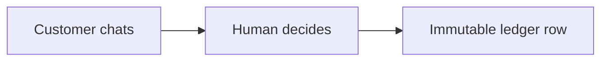
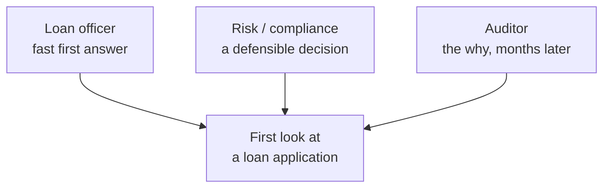
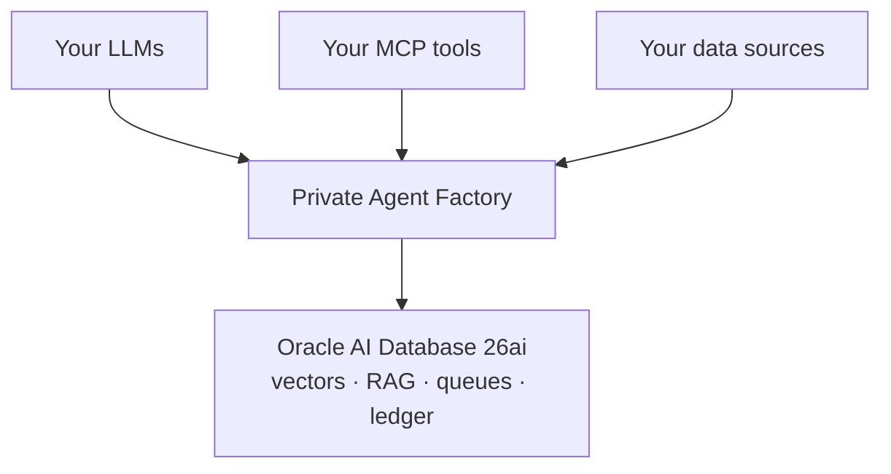
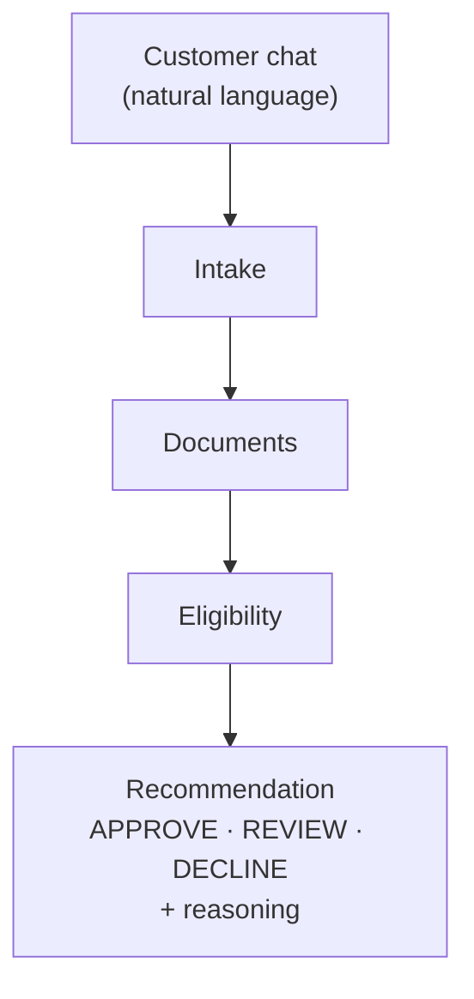
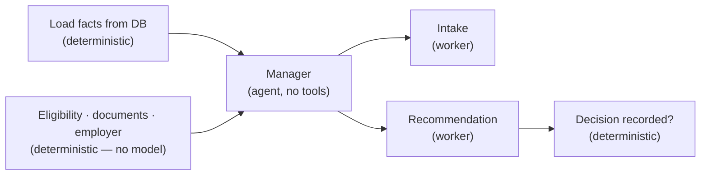
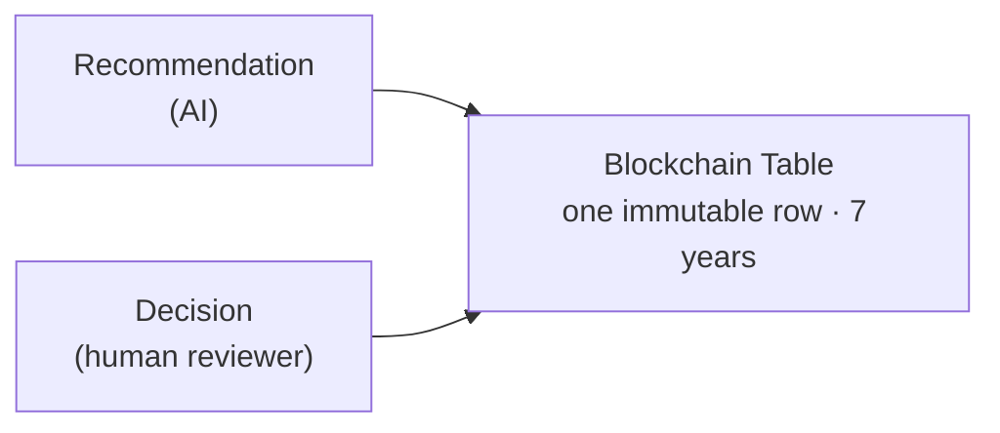
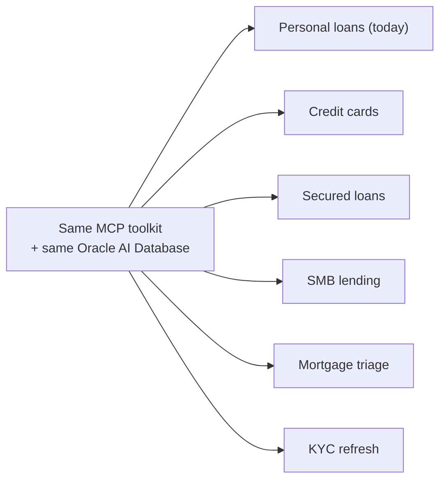
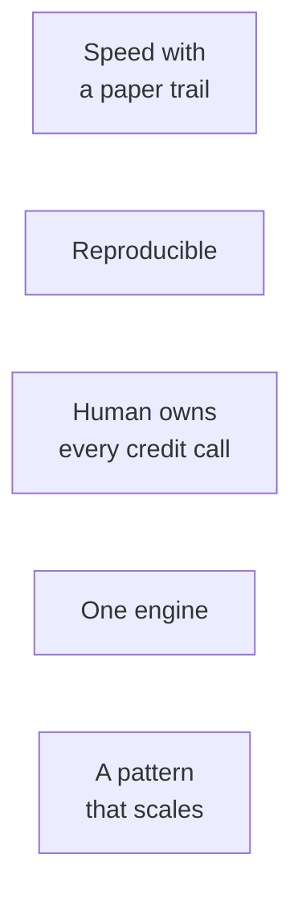
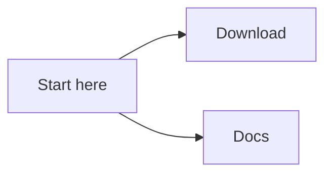
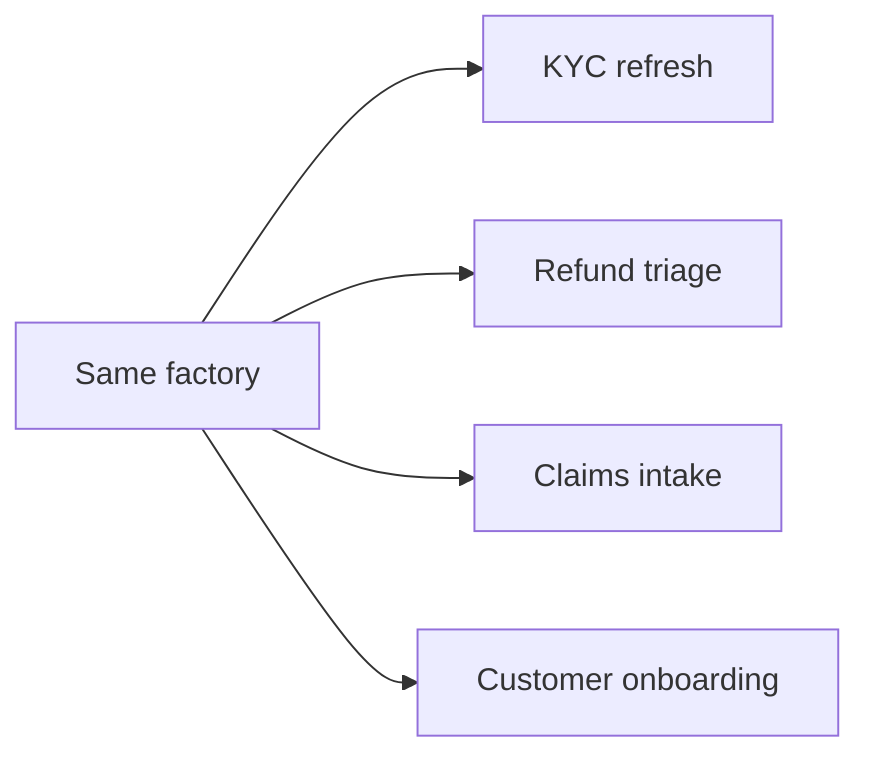

# Loan origination, decided and defensible

**Oracle AI Database 26ai + Private Agent Factory — a banking PoC**

---

## Slide 1 — A loan, decided in minutes, and defensible for seven years

- A customer chats, uploads a payslip, and minutes later a human banker approves it.
- Every reason the machine surfaced is recorded — immutably — for seven years.

**Speaker notes**

A customer chats, uploads a payslip, and a few minutes later a human banker approves the loan. And every reason the machine surfaced is recorded — immutably — for seven years. Hold that picture. By the end I'll show you how it's built, where we cut corners honestly, and how you could build your own this afternoon.

---

## Slide 2 — Fast, or explainable. Today you rarely get both.

- The first look at a loan application is ad-hoc, undocumented, impossible to replay.
- Three roles pull against each other:
  - Loan officer wants a fast first answer.
  - Risk and compliance want a decision the bank can stand behind.
  - The auditor wants the _why_, months later.

**Speaker notes**

The first look at a loan application today is ad-hoc, undocumented, and impossible to replay. Three people need three different things from it. The loan officer wants a fast answer. Risk and compliance want a decision the bank can stand behind. And the auditor, months later, wants to know why. Chase speed with automation and you lose the audit trail. Chase compliance with process and you lose the speed. What if the system were fast _because_ it documents everything — not in spite of it?

---

## Slide 3 — Oracle AI Database 26ai + Private Agent Factory

- Private Agent Factory (PAF): a no-code platform to build, test, and deploy governed, data-centric agents that run next to your database.
- Your LLMs, your MCP tools, your data sources — wired on a visual canvas.
- Generally available today, on a monthly release cadence.
- The database is the engine: vectors and RAG, policy inputs, queues, and a tamper-proof ledger — all in one.

**Speaker notes**

This runs on two things: Oracle AI Database 26ai, and the Private Agent Factory. The Agent Factory is a no-code platform for building governed, data-centric agents that run right next to your database. You bring your own LLMs, your own tools, your own data, and wire them together on a visual canvas. It's generally available today, shipping on a monthly cadence. And the database here isn't just storage — it's one engine that holds your vectors and RAG, your policy inputs, your queues, and a tamper-proof ledger.

_If asked:_ running next to the database matters for data residency, latency, and keeping the audit trail in the same engine as the decision. Tools connect over MCP, an open standard.

---

## Slide 4 — Loan origination for core banking

- A customer-facing chat agent that takes a personal-loan application end to end.
- Intake → documents → eligibility → a recommendation: APPROVE / REVIEW / DECLINE, each with its reasoning.
- Guiding principle: observability over determinism — "we can always explain why," not "we're always right."

**Speaker notes**

What we built is a personal loan. A customer-facing chat agent that takes an application from the first hello all the way to a recommendation. It collects the request, gathers documents, checks eligibility, and produces one of three outcomes — approve, review, or decline — each carrying the reasoning behind it. Our guiding principle is observability over determinism: the promise isn't that we're always right, it's that we can always explain why.

_If asked:_ it's region-agnostic — no country, currency, or regulator is hard-coded; every threshold lives in database config. The recommendation is a recommendation, not a verdict — a human makes the call. The reasoning is grounded in policy and rules, not a model's guess.

---

## Slide 5 — Agents where judgment helps, deterministic nodes where it must be exact

- A manager agent does the judgment that matters: it reads the facts and picks the stage. Two workers do the specialised work — collecting the request, composing the recommendation. The manager holds no tools; each worker makes at most one tool call.
- The rules are deterministic nodes, not a model: loading the facts, the eligibility check, the document set and the employer lookup are wired, exact, and repeatable. A model never does arithmetic that has to be right every time.
- The database is the memory: facts are loaded once per turn and handed to the manager. No agent invents facts; the session token is never retyped by a model on any read path.

**Speaker notes**

Here's the discipline. We put the model where judgment actually helps — holding the conversation and composing a defensible recommendation. A manager agent reads the facts and picks the stage, and hands the work to one of two specialists, each making at most one tool call. But the rules — loading the customer's facts, running the eligibility and policy checks, verifying the employer — those are deterministic nodes, not a model. A model never does arithmetic that has to be right every time. And the database is the memory: every turn, the facts are loaded once, straight from the database, and handed to the manager. No agent can hallucinate its way to a decision, because it never invents the facts.

_If asked:_ eligibility is an OPA policy check fed database-derived values — DTI, PTI, credit score, age — evaluated server-side. The session token is wired through deterministically, never passed to the model as text. Tools are reached over MCP.

---

## Slide 6 — The AI recommends, a human decides, the ledger never forgets

- Every application creates a human-in-the-loop task. The AI never issues the verdict — by design.
- The reviewer sees the recommendation, the reason codes, and explore-hints, and can ask a backoffice Research Agent: "how did we decide similar cases in the last 12 months?"
- The final decision — the human's call, the AI's recommendation, the reason, and the evidence — lands in a Blockchain Table: one immutable, tamper-evident row per decision, retained seven years.
- A per-tool audit trace records which tool produced which signal, so any recommendation can be replayed step by step.

**Speaker notes**

This is the non-negotiable. Every single application creates a task for a human reviewer. The AI never issues the verdict — by design. The reviewer doesn't get a black-box score; they get a case file: the recommendation, the reason codes, hints on what to check, and a research assistant they can ask "how did we decide similar cases over the last year?" Then the human makes the call. And that final decision — the human's call, the AI's recommendation, the reason, and the evidence — lands in a Blockchain Table. One immutable, tamper-evident row per decision, kept for seven years. That's the "defensible" from the opening, delivered.

_If asked:_ the Blockchain Table is native Oracle — append-only, hash-chained, in the same database. The mandatory human review is a feature, not a disclaimer: the bank stays in control of every credit decision it stands behind.

---

## Slide 7 — One flow, open tools, one database underneath

- Private by default: the LLM is self-hosted; nothing about a customer leaves the bank's boundary. Traffic is TLS end to end — encrypted database connections and an HTTPS gateway in front of every tool. Cloud-ready when sanctioned.
- Everything pluggable is reached over MCP or HTTP.

**Speaker notes**

Top to bottom: the customer chat and the backoffice queue talk to the bank's own backend. That backend drives the PAF flow. The flow calls open tools and policy retrieval, and runs against a self-hosted model. And all of it is grounded in one Oracle database — which also holds the vectors, the queues, and the tamper-proof audit. Two things to notice. Nothing about a customer leaves the bank's boundary — the model is private and traffic is encrypted end to end. And the bank's existing backend is the client of this platform, not part of it — this drops into systems you already run.

_If asked:_ one engine means no stitched-together stack of a separate vector database, a queue, and an audit store. Every pluggable piece connects over MCP or HTTP.

---

## Slide 8 — One agent today, a factory tomorrow

- New data source? Add an MCP or HTTP tool. New policy? Add an OPA rule. New product? New flow, same plumbing.
- Modularity is the product.

**Speaker notes**

This is the real punchline. The loan agent isn't a bespoke build — it's the first tenant of a pattern. Need a new data source? Add a tool. New policy? Add a rule. New product — credit cards, mortgages, SMB lending, KYC refresh? New flow, same plumbing. A domain expert clones the pattern, and the toolkit, the database, and the governance all come for free. If you're sitting there thinking "but my use case is refunds, or onboarding, or claims" — that's the same factory, a different flow.

---

## Slide 9 — This is a PoC, and here's exactly where we cut corners

| In this PoC                                                                           | Production path                                                                       |
| ------------------------------------------------------------------------------------- | ------------------------------------------------------------------------------------- |
| OCR is a stub returning canned extraction                                             | Real YOLO + PaddleOCR pipeline — a separate workstream                                |
| Select AI custom endpoints aren't in the Oracle Database Free container we develop on | Fully supported on the production database — on-prem or cloud (ADB)                   |
| Banking data is synthetic                                                             | Engineered to exercise paths, not to validate a credit model                          |
| The flow is assembled on the PAF canvas                                               | The tools and Spring backend are implemented and covered by an automated test harness |

- Every gap is a seam, not a hole — the interface is in place; you swap in the real thing.

**Speaker notes**

Let me be straight about where we cut corners, because that's where credibility comes from. The OCR is a stub — it returns canned extraction; the real computer-vision pipeline is a separate workstream. Select AI's custom LLM endpoints aren't available in the Oracle Database Free container we develop on locally — that's a limit of the free container, not of the product; on a full Oracle Database, on-prem or in the cloud, it's fully supported. The banking data is synthetic, built to exercise every path, not to validate a real credit model. But here's the framing that matters: every one of these is a seam, not a hole. Each one sits behind a clean interface — a tool, a config flag. We're not hiding the stub OCR; we're showing you the socket it plugs into. Production is integration work, not a redesign.

---

## Slide 10 — Fast and defensible, and built to clone

- Speed with a paper trail — a governed first look in minutes.
- Reproducible — every recommendation and decision can be replayed.
- The bank stays in control — a human owns every credit call.
- One engine — data, vectors, queues, and audit in Oracle AI Database 26ai.
- A pattern that scales — across products, with the same plumbing.

**Speaker notes**

So where does that leave us. Speed with a paper trail — a governed first look in minutes. Reproducible — every recommendation and decision can be replayed. The bank stays in control — a human owns every credit call. One engine — data, vectors, queues, and audit, all in the Oracle database. And a pattern that scales across products with the same plumbing. The three forces that were pulling apart at the start — speed, compliance, explainability — no longer fight each other.

---

## Slide 11 — It's GA. You can build your first agent this afternoon.

- Download — [oracle.com → Private Agent Factory](https://www.oracle.com/database/technologies/private-agent-factory-downloads.html); also on [Oracle Marketplace](https://marketplace.oracle.com/app/agentfactory).
- Docs — [the full Agent Factory documentation](https://docs.oracle.com/en/database/oracle/agent-factory/25.3/paias/introduction.html).
- Teams across industries are already building on it.

**Speaker notes**

The best part — you can do this yourself. Download the Agent Factory from oracle.com or the Oracle Marketplace, and the full documentation is online. Your first agent, this afternoon.

---

## Slide 12 — What's your origination?

- KYC refresh? Refund triage? Claims intake? Customer onboarding?
- Same factory, your data and your tools.
- "Let's wire one to your data."

**Speaker notes**

So let me turn it around. What's your origination? Maybe it's a KYC refresh. Refund triage. Claims intake. Customer onboarding. Same factory, your data, your tools. Tell me what yours is — let's wire one to your data.

---

## Slide 13 — Fast. Explainable. Governed. Ready to clone.

- The loan decided in minutes — and defensible for seven years.
- "Come build yours."

**Speaker notes**

A loan decided in minutes — and defensible for seven years. That's the promise we opened with, and now you've seen how it's built. Come build yours.
