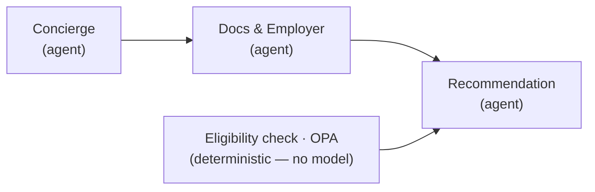
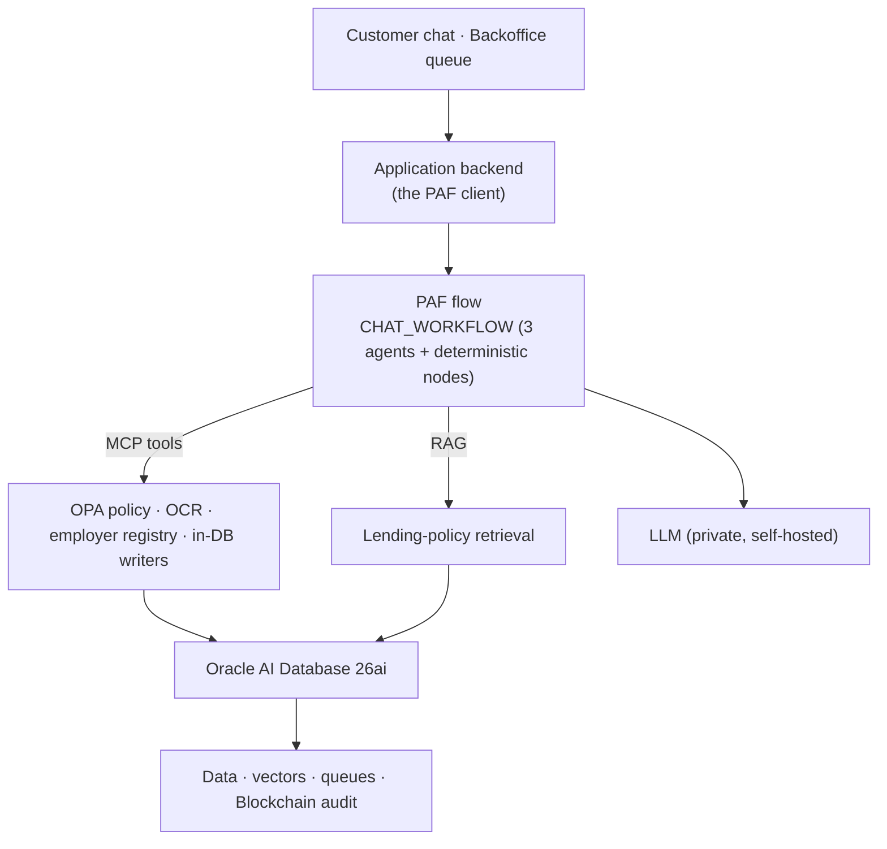
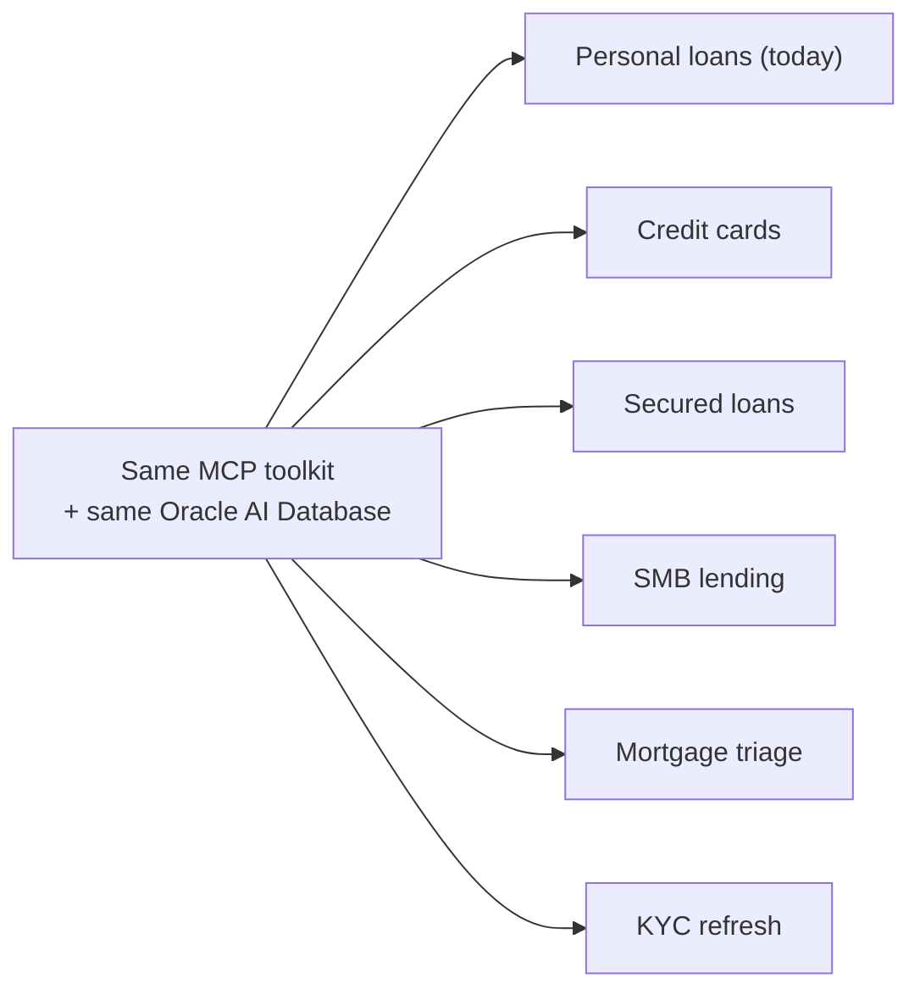

# Loan origination, decided and defensible

**Oracle AI Database 26ai + Private Agent Factory — a banking PoC**

> Format: a tool-agnostic outline. Each slide gives a **headline**, the **on-slide**
> content (what the audience sees), a **visual** cue, and **speaker notes** (what you say).
> Drop it into PowerPoint / Keynote / Google Slides, or render the mermaid blocks as-is.
>
> Audience: mixed conference crowd — any banking, AI, or technical background, sales included.
> Length: ~15 minutes, ~13 slides. Tone: uplifting, honest about the PoC edges, CTA-forward.

---

## Slide 1 — Cold open

**Headline:** A loan, decided in minutes — and defensible for seven years.

**On slide:**

- One sentence, large: _"A customer chats, uploads a payslip, and a few minutes later a human banker approves it — with every reason the machine surfaced recorded, immutably, for seven years."_
- No agenda. No logo wall. Just the promise.

**Visual:** a faint left-to-right motif — chat bubble → gavel → ledger row — that we'll complete on the closing slide.

**Speaker notes:**

- Open on the outcome, not the technology. Everyone in the room — banker, engineer, salesperson — understands "fast" and "I can prove why."
- "Hold that image. By the end I'll show you how it's built, where we cut corners honestly, and how you could build your own this afternoon."
- Don't explain anything yet. This is the hook.

---

## Slide 2 — The origination pain

**Headline:** Fast, or explainable. Today you rarely get both.

**On slide:**

- The first look at a loan application today is **ad-hoc, undocumented, impossible to replay.**
- Three people want three things — and they pull against each other:
  - **Loan officer** wants a fast first answer.
  - **Risk / compliance** wants a decision the bank can stand behind.
  - **The auditor** wants the _why_, months later.

**Visual:** a tension triangle — Speed ↔ Compliance ↔ Explainability — pulling apart.

**Speaker notes:**

- This is the universal nod. Any banker has lived this; anyone else recognizes the shape of it.
- The trap: teams chase speed with automation and lose the audit trail, or chase compliance with process and lose the speed.
- "What if the system were fast _because_ it documents everything — not in spite of it?"

---

## Slide 3 — Meet the platform

**Headline:** Oracle AI Database 26ai + Private Agent Factory.

**On slide:**

- **Private Agent Factory (PAF):** a no-code platform to build, test, and deploy governed, data-centric agents that run **next to your database**.
- Your choice of **LLMs**, your **MCP tools**, your **data sources** — wired on a visual canvas.
- GA today, shipping on a **monthly** cadence.
- The database isn't just storage. **Vectors + RAG, policy inputs, queues, and a tamper-proof ledger — one engine.**

**Visual:** a PAF container "hugging" the Oracle AI Database; three input chips — _bring your own LLM · tools · data._

**Speaker notes:**

- Keep this to ~60 seconds. The point is _what it is_ and _where it runs_ — private, near the data, your components.
- "Near-DB" matters for banking: data residency, latency, and the fact that the audit trail lives in the same engine as the decision.
- Don't go deep on architecture here — slide 7 does that. This is just "here's the answer to slide 2."

---

## Slide 4 — Our use case

**Headline:** Loan origination for core banking.

**On slide:**

- What we built: a **customer-facing chat agent** that takes a personal-loan application end to end.
- Intake → documents → eligibility → a **recommendation packet**: **APPROVE / REVIEW / DECLINE**, each with the reasoning behind it.
- The governing principle: **observability over determinism** — _"we can always explain why,"_ not _"we're always right."_

**Visual:** a funnel — natural-language chat at the top, a structured recommendation packet at the bottom.

**Speaker notes:**

- Name the product concretely: a personal loan. Region-agnostic — no country, currency, or regulator hard-coded; every threshold lives in database config, not code.
- The recommendation is a _recommendation_, not a verdict — set this up now, pay it off on slide 6.
- "Three tiers, and every tier carries its reasoning grounded in policy and rules — not a vibe from a model."

---

## Slide 5 — How it works: agents for judgment, deterministic nodes for the rules

**Headline:** Agents where judgment helps. Deterministic nodes where it must be exact.

**On slide:**

- **Three agents do the judgment work** — greet and collect the request, gather documents and verify the employer, compose the recommendation. Each does one job; each makes only **1–2 tool calls**.
- **The rules are deterministic nodes, not a model** — loading the facts and running the eligibility/policy check are wired, exact, and repeatable. A model never does arithmetic that has to be right every time.
- **The database is the memory** — facts are loaded once per turn from the DB and fanned out to the agents; no agent invents facts, and the opaque session token is never retyped by a model.

**Visual:** three agents in a line, with a separate deterministic eligibility node feeding the recommendation.

**Speaker notes:**

- The discipline: put the model where judgment helps — conversation, document gathering, composing a defensible recommendation — and hard-wire the parts that must be exact.
- The honest story that lands well: we first built eligibility _as an agent_, and the model kept filing the numbers into the wrong fields — so the policy check approved almost everyone. We moved it to a deterministic node that does it correctly every time. Agents for judgment; deterministic nodes for the rules.
- "DB is the memory" is the trust story: the system can't hallucinate its way to a decision, because the facts are loaded fresh from the database every turn — once, deterministically, with the session token wired in, never typed by a model.
- Tools are reached over **MCP** (Model Context Protocol) — the same open standard everywhere, which is what makes slide 8 possible.

---

## Slide 6 — The non-negotiable: a human decides, and the record is immutable

**Headline:** The AI recommends. A human decides. The ledger never forgets.

**On slide:**

- **Every** application creates a human-in-the-loop task. The AI never issues the verdict — by design.
- The reviewer sees the recommendation, the **reason codes**, and **explore-hints**, and can ask a backoffice **Research Agent**: _"how did we decide similar cases in the last 12 months?"_
- The final decision — **the human's call + the AI's original recommendation + the override reason + the evidence** — lands in a **Blockchain Table**: one immutable row per decision, tamper-evident, retained seven years.
- Alongside it, a **per-tool audit trace** records which tool produced which signal — so any recommendation can be replayed, step by step.

**Visual:** a split — _Recommendation (AI)_ on the left, _Decision (human)_ on the right — both flowing into a single ledger row.

**Speaker notes:**

- This is the compliance posture as a _feature_, not a disclaimer. Mandatory human review keeps the bank in control of every credit decision it stands behind.
- Meet Sam, the reviewer: he doesn't get a black-box score, he gets a defensible case file plus a research assistant that cites prior decisions.
- The Blockchain Table is native Oracle — append-only, hash-chained, in the same database. That's the "defensible for seven years" from slide 1, delivered.

---

## Slide 7 — Architecture at a glance

**Headline:** One flow, open tools, one database underneath.

**On slide:**

- **Private by default** — the LLM is self-hosted; nothing about a customer leaves the bank's boundary, and traffic is **TLS end to end** (encrypted DB connections + an HTTPS gateway in front of every tool). Cloud-ready when sanctioned.
- Everything pluggable is reached over **MCP** or HTTP.

**Visual:** the layered mermaid diagram above.

**Speaker notes:**

- Walk it top to bottom in 30 seconds: UIs → the bank's own backend drives the PAF flow → the flow calls open tools and retrieval → all of it grounded in one Oracle database that also holds the vectors, the queues, and the tamper-proof audit.
- The bank's existing backend is the _client_ of PAF, not part of the platform — this drops into systems you already run.
- "One engine" is the efficiency story: no stitched-together stack of a vector DB + a queue + a separate audit store.

---

## Slide 8 — The factory moment

**Headline:** One agent today. A factory tomorrow.

**On slide:**

- New **data source**? Add an MCP / HTTP tool. New **policy**? Add an OPA rule. New **product**? New flow, same plumbing.
- **Modularity is the product.**

**Visual:** the fan-out above — one base, many product agents.

**Speaker notes:**

- This is the real punchline. The loan agent is the _first_ tenant of a pattern, not a bespoke build.
- A domain expert clones the pattern; the toolkit, the database, and the governance come for free. Different prompt, different product config.
- "If you're sitting there thinking 'but my use case is refunds / onboarding / claims' — that's the same factory, different flow."

---

## Slide 9 — Kept real

**Headline:** This is a PoC. Here's exactly where we cut corners.

**On slide:**

| Scaffolding in place                                 | Production path                                           |
| ---------------------------------------------------- | --------------------------------------------------------- |
| OCR is a **stub** (canned extraction)                | Real YOLO + PaddleOCR pipeline — a separate workstream    |
| Select AI runs on **cloud / ADB**, not the local box | Known 26ai-Free limitation; cloud path already designed   |
| **Synthetic** banking data                           | Engineered to exercise paths, not validate a credit model |
| Flow is a **validated build target**                 | The tools + backend are implemented and tested            |

- Every gap is a **seam**, not a hole — the interface is in place, you swap in the real thing.

**Visual:** the two-column table; left muted, right confident; a connecting arrow labeled "swap in."

**Speaker notes:**

- Say this plainly and cheerfully — credibility comes from naming the limits before anyone asks.
- The framing that matters: these are _deliberate cuts on a PoC_, and each one sits behind a clean interface (an MCP tool, a config flag). Production is integration work, not a redesign.
- "We're not hiding the stub OCR — we're showing you the socket it plugs into."

---

## Slide 10 — Value delivered

**Headline:** Fast _and_ defensible — and built to clone.

**On slide:**

- **Speed with a paper trail** — a governed first look in minutes.
- **Reproducible** — every recommendation and decision can be replayed.
- **The bank stays in control** — a human owns every credit call.
- **One engine** — data, vectors, queues, and audit in Oracle AI Database 26ai.
- **A pattern that scales** — across products, with the same plumbing.

**Visual:** five value chips, mapped back to the slide-2 tension triangle (now resolved).

**Speaker notes:**

- Close the loop opened on slide 2: speed _and_ compliance _and_ explainability, no longer pulling apart.
- Pick the two chips that matter most to _your_ room and dwell there; let the rest land as a list.

---

## Slide 11 — Call to action #1: try the factory yourself

**Headline:** It's GA. You can build your first agent this afternoon.

**On slide:**

- **Live Lab** — a guided, hands-on walkthrough: install PAF and build an agent end to end.
- **Download** — oracle.com → Private Agent Factory; also on Oracle Marketplace.
- **Docs** — the full Agent Factory documentation.
- Teams across industries are already building on it.

**Visual:** a big "Start here" with three link tiles (Live Lab · Download · Docs).

**Speaker notes:**

- Make it feel achievable: "first agent this afternoon" is the energy.
- Drop the exact URLs you want live on the slide (oracle.com downloads page, marketplace listing, docs site).
- _(Optional, setting-dependent:)_ if your venue permits, this is where you'd add named-customer traction or adoption numbers. Left out here on purpose — those came from internal/restricted material; add back only if your audience and disclosure allow.

---

## Slide 12 — Call to action #2: bring your use case

**Headline:** What's _your_ origination?

**On slide:**

- KYC refresh? Refund triage? Claims intake? Customer onboarding?
- Same factory, **your** data and tools.
- _"Let's wire one to your data."_

**Visual:** an open invitation panel + a clear next step (talk to us / scan to connect).

**Speaker notes:**

- Turn the factory idea into a personal ask — invite people to name their own flow out loud.
- This is the conversation-starter CTA: the goal is a follow-up, not a signature.

---

## Slide 13 — Closing frame

**Headline:** Fast. Explainable. Governed. Ready to clone.

**On slide:**

- Callback to slide 1: _the loan decided in minutes — and defensible for seven years — now earned._
- One last line: _"Come build yours."_

**Visual:** the slide-1 motif completed — chat bubble → gavel → ledger row, now fully drawn.

**Speaker notes:**

- Land the plane on the exact image you opened with. The promise from slide 1 is now backed by everything in between.
- End on the CTA verb: build, try, talk. Don't add a "thank you / questions" slide before this lands — let the closing line breathe first.

---

> ### Presenter cheat-sheet
>
> - **The one idea:** loan origination that is fast _and_ defensible, because the database records the _why_ — and it's a _factory_, so the next product is a clone, not a rebuild.
> - **Three plain-English terms to define live if the room is non-technical:** RAG (the agent cites real policy text), MCP (the open plug for tools), HITL (a human reviews every application).
> - **If you have only 10 minutes:** cut slides 7 and 9, fold "kept real" into one spoken sentence on slide 4.
> - **If asked "is this production?":** no — it's a PoC with honest seams (slide 9); the value is the proven pattern and the one-engine governance.
